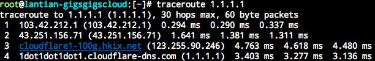
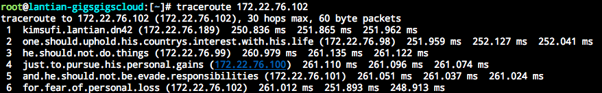

Traceroute 是常用的检查网络状况的工具之一，会显示你操作的电脑到指定服务器的网络路径上经过的每一个路由器的 IP 地址，类似于这样：

可以看到后两跳的 IP 显示出了对应的域名，这个域名就是 IP 的反向解析记录。反向解析记录在 DNS 服务器中以类似 4.3.2.1.in-addr.arpa 域名的 PTR 记录形式存在。更多的信息可以参考《[在 DN42 中设置 IP 反向解析](/article/modify-website/dn42-ip-reverse-record.lantian)》这篇文章。

自然，Traceroute 里能显示字，也就能显示一篇文章。两年前我为了达到这个目的，[开了一堆 Docker 容器，修改它们的路由表让它们连成一长串，来做出显示文章需要的路径](/article/modify-computer/worship-in-traceroute.lantian)。

但是开一堆容器不够优雅，而且也不方便管理，尤其是路径过长的时候。更好的方法是用一个程序创建一张虚拟网卡，直接根据进入的 Traceroute 请求回复相应的数据包。这样不仅节省了一大堆容器的系统资源和管理负担，而且也容易根据需要实现复杂的功能。

于是我就写了这样一个程序，在 [https://github.com/xddxdd/route-chain](https://github.com/xddxdd/route-chain) 可以下载到。

用法
----

首先确定你的系统支持 TUN/TAP 驱动，除了少数 OpenVZ 或者 LXC 的系统外都是支持的。

下载源码后 `make`，然后 `make install`，然后执行 `route-chain 192.168.0.1/24 192.0.0.1/24 fc00::/64 fd00::/64`，参数可以添加任意个地址。

参数的地址是分配给**宿主系统**的，虚拟的路径从宿主系统地址开始 +1，+2 这样计算。例如我运行 `route-chain 172.22.76.97/29` 就可以产生 97-102 这一段路由（其中 97 是宿主机），起到和两年前那些 Docker 容器一模一样的效果：

（这里我就直接用两年前的图了）

原理
----

Traceroute 的实质是发送 TTL 很小的数据包，并接受路径上路由器回复的 TTL 超时信息。

数据包的 TTL 设置了它最多能经过多少个路由器。例如从你电脑上发送的数据包初始 TTL 一般是 64，经过你的无线路由器后就变成了 63，经过直接连接的运营商路由器后就变成了 62，以此类推。当 TTL 在某台路由器上降到 0，这台路由器会把这个数据包丢掉，回复一个“ICMP 超时”数据包，并附上自己的 IP。

Traceroute 工具会利用这个原理，向目标主机发送一个 TTL 为 1 的数据包。这个数据包一般在你的无线路由器上就超时了，因此你的无线路由器会回复一个 ICMP 超时的数据包。Traceroute 再发送一个 TTL 为 2 的数据包，此时运营商路由器会回复 ICMP 超时信息。以此类推，直到到达目标。

因此在虚拟一段路由路径时，只要根据进入的数据包 TTL 决定返回 ICMP 超时信息的来源 IP 就可以了。我的程序就是直接用预先设置的宿主机 IP 加上 TTL 来计算回复消息的来源 IP 的。

另外，当 Traceroute 数据包到达目标 IP 时，目标机器应该回复一个“ICMP 端口不可达”数据包，告知这个端口被关闭，没有程序处理相应的数据。如果此时仍然回复“ICMP 超时”，Traceroute 会选择继续探测路由，而不会在此处停止。

优化
----

虽然对这个程序的用途来说，优化不是必要的，因为一般不会有几百 MB 的 Traceroute 流量进来。但是这并不意味着这个程序没有优化点。

1. 降低内存拷贝的次数

   我不是第一个写此类程序的人，但我看到的类似功能的程序在处理时都要将数据包在内存中来回复制多次。而这其实不是必要的。在使用 TUN/TAP 时，有两次内存复制是必要的（从 TUN/TAP 接收数据包，和发送回复数据包给 TUN/TAP），但除此以外我的程序没有任何地方复制数据包：

   - 数据包存储时预留了前面的空间。在回复 ICMP 超时数据包时，根据 RFC 需要附上出错的数据包的前 28 字节（IPv4）或者 48 字节（IPv6）（不考虑 IP Options）。由于我预留了空间，我就不需要将数据包复制到别处，留出头部空间再来处理了，而是可以直接在数据包之前拼接 ICMP 头部，直接发回。
   - 在回复 ICMP Ping 数据包时，只需要交换来源/目标地址，并修改数据包类型就可以了，完全不需要生成一个新的数据包，把 Payload 复制过去。

2. 增量校验码计算

   为了防止在传输过程中出错，IP 数据包都带有一个校验码，从而检测并丢弃出错的数据包。校验码的算法采用[一补码（One's Complement）](https://zh.wikipedia.org/wiki/%E4%B8%80%E8%A3%9C%E6%95%B8)，将整个数据包以 uint16_t 形式相加，再取反得到。我们可以利用一补码的特点来避免回复时重算整个数据包的校验码，例如当回复 Ping 时，我们交换了来源/目标地址和数据包类型。交换来源/目标地址不会影响整个数据包的相加结果，因此不影响校验码。而修改数据包类型是将一个固定值替换成另一个固定值（IPv4 由 8 改成 0，IPv6 由 128 改成 129），对校验码的影响是固定的。因此我们只要把差值更新进已有的校验码就可以了。

3. 主循环中不进行内存分配

   整个程序除了在初始化读取参数时会进行少量动态内存分配（malloc），在循环处理数据包时都是使用固定的、预先分配好的内存空间，避免了频繁申请、释放内存的性能问题。

当然，这个程序还有一些尚未实现的优化点：

- 支持 TUN/TAP 的多线程处理（Multiqueue），多个核心同时响应、回复数据包。
