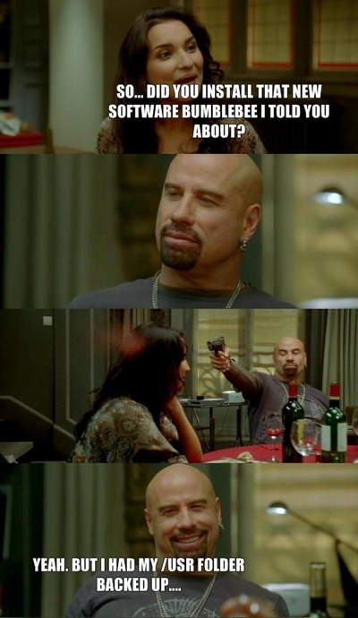
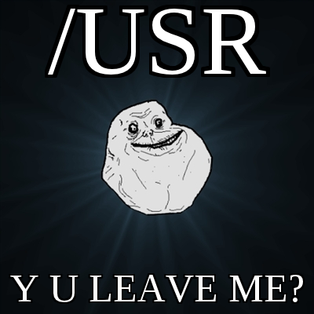
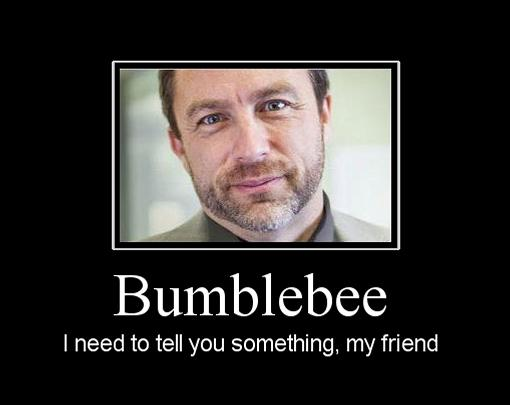
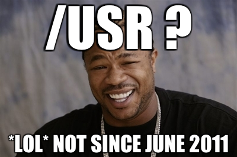
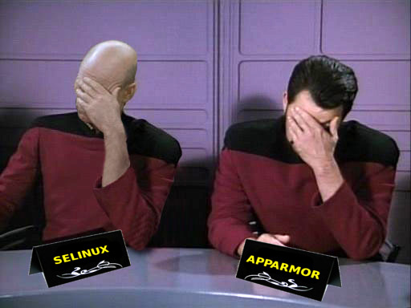
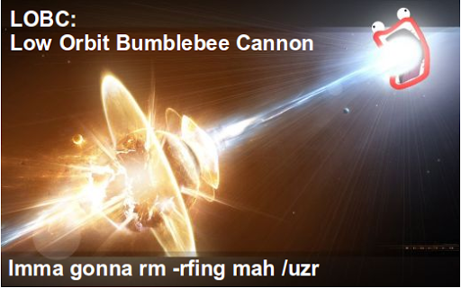
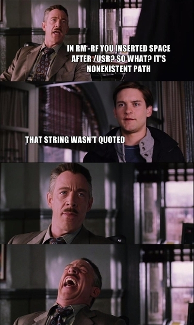
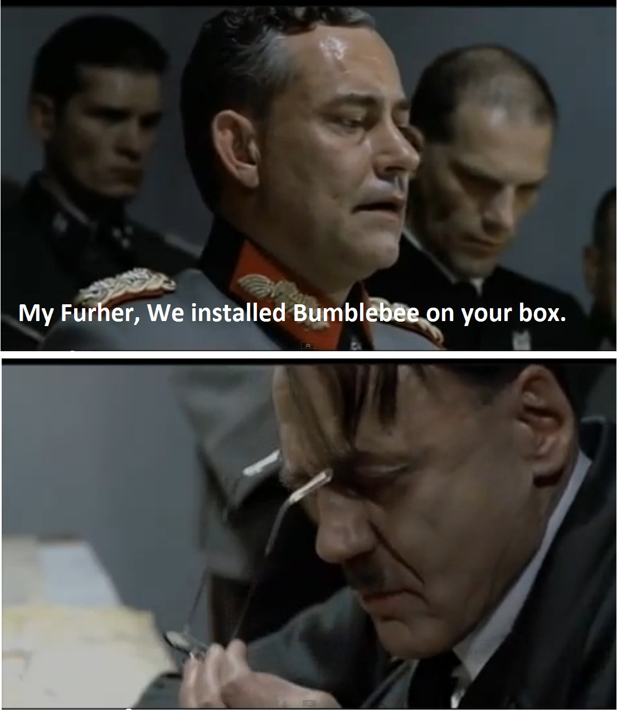

Bumblebee是Linux平台上的一款NVidia显卡的辅助工具，它可以让NVidia显卡启用Optimus技术，就是在笔记本电脑平台上由独立显卡渲染，集成显卡显示。其实就是显卡硬件加速。

这是一款非常有用的工具，但是它曾经出过一次很严重的Bug（虽然是3年前），因为一个空格，大群Ubuntu用户的usr文件夹被删除了。

那是一次Git更新，变动位于install.sh：

```diff
@@ -37,7 +37,7 @@
  #    You should have received a copy of the GNU General Public License
  #    along with bumblebee.  If not, see <http://www.gnu.org/licenses/>.
  #
 -BUMBLEBEEVERSION=1.4.31
 +BUMBLEBEEVERSION=1.4.32
  
  
  ROOT_UID=0
 @@ -348,7 +348,7 @@ case "$DISTRO" in
    ln -s /usr/lib/mesa/ld.so.conf /etc/alternatives/gl_conf
    rm -rf /etc/alternatives/xorg_extra_modules
    rm -rf /etc/alternatives/xorg_extra_modules-bumblebee
 -  rm -rf /usr /lib/nvidia-current/xorg/xorg
 +  rm -rf /usr/lib/nvidia-current/xorg/xorg
    ln -s /usr/lib/nvidia-current/xorg /etc/alternatives/xorg_extra_modules-bumblebee
    ldconfig
   ;;
```

因为一个空格，删除指令从/usr/lib/nvidia-current/xorg/xorg变成了/usr和/lib/nvidia-current/xorg/xorg两个文件夹，而/usr目录就是你平时放你那一大堆程序的地方，包括apt-get。。。

[GitHub](https://github.com/MrMEEE/bumblebee-Old-and-abbandoned/commit/a047be85247755cdbe0acce6#diff-1)上世界各地大批程序员疯狂吐槽这个Bug：

“所以我得先格式化我的硬盘？”“是的，我一般用Bumblebee格式化。”


“你有没有装Bumblebee？”“装了，但是我备份了usr文件夹。。。”



“他们会干掉我们，但他们不会干掉我们的usr”


“usr，为什么离开我？”



“Bumblebee，我找你有些话想说”



“usr？早在2011年6月就不见了，呵呵。”



SElinux和AppArmor都无语了。。。



“我在公司服务器上装了Bumblebee，现在我需要工作。。。”


“我不经常备份，但是我备份时总是太晚了。。。”


乔布斯：“你听说过Bumblebee吗？”比尔盖茨：“我建议所有Linux用户都装一个。”


低轨道黄蜂（Bumblebee）加农炮：



“你在/usr后加了个空格怎么了？那路径不存在。”“我没把路径用双引号括起来。。。”



“元首大人，我们在你的机器上装了Bumblebee。”


