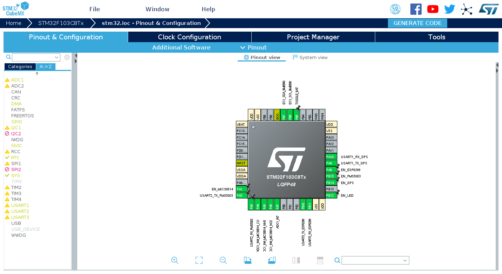
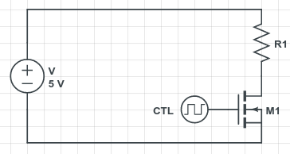
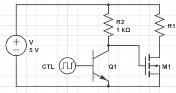
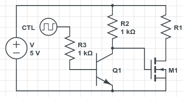

欢迎来到踩坑系列的第三篇。之前两篇中我分别介绍了我 [RoboMaster 机器人竞赛](/article/modify-computer/robomaster-bugs-in-development.lantian)和 [FPGA 课程大作业](/article/modify-computer/cyclone-iv-fpga-development-bugs-resolve.lantian)中踩的坑。

这次踩坑的是我的毕业设计，三人小组合作的空气质量传感器网络。整个项目的设计如下：

- 从安装的传感器模块中读取数据并上传到服务器上的 InfluxDB 数据库
  - 我们使用的传感器如下：
    1. MiCS6814，测量 NO2，CO，NH3
       - 模拟输出
    2. BME680，测量温湿度气压及 TVOC
       - I2C 接口输出
    3. PMS5003，测量可吸入颗粒物（PM）
       - UART 串口输出
  - 额外加上了这些模块：
    1. ATGM336H，GPS+北斗双模定位模块
       - UART 串口输出
    2. ESP8266，使用非常广泛的 Wi-Fi 模块
       - UART 串口输出
    3. MH-CD42，电源管理模块
       - 输出？不存在的，供电就行了
- 需要足够节能，能用电池坚持一周左右
  - 也需要能够监测电池电量以计划电池更换
- 一定程度的防雨能力
- 网页显示，短时间预测
  - 教授已经有一个可以测量风力的气象站了

这篇文章记录了我们在实现这些功能时踩的坑。

选择合适的单片机
=============

为什么不用 Arduino
----------------

最开始我随手翻了一个 Arduino Nano 出来用，但是很快就发现了问题：

1. Arduino Nano 只有一个硬件串口，而上面这些东西至少需要 3 个串口。
   - 自然就想到了 SoftwareSerial（软件模拟串口），但测试下来很不稳定，尤其在和 ESP8266 的 115200 波特率的（相对）高速通信中，频繁出现乱码。
2. Arduino Nano 的频率固定在 16 MHz，并且调整起来非常麻烦。
   - 我们其实不需要这么高的性能，宁愿降频省电。
3. ~~Arduino 的 IDE 真的难用。~~

于是我就上淘宝买了一块 STM32 开发板，具体配置如下：

- STM32F103C8T6 芯片
  - 64 KB ROM，20 KB RAM
    - ROM 其实有点小了
  - 3 个硬件串口，刚好够用
  - 2 个 I2C
    - 但一个 I2C 可以接多个不同 ID 的外设，因此其实一个就够了
  - 最高 72 MHz 频率，且可以自由调整
    - 因为我们的单片机上不运行复杂计算，我们直接降频到了 4 MHz
  - 1 个可以定时休眠和唤醒的 RTC（时钟）
  - 一大堆 ADC（模拟-数字转换器）
    - 也可以测输入电压和芯片温度
  - 1 个 CAN，2 个 SPI 等等我们用不到的东西
- 外置 8 MHz 晶振和 32.768 KHz 晶振
  - 虽然 STM32 有内置晶振，但网络资料显示内置晶振易受到温度影响导致频率不准，所以有外置晶振当然更好
- 只要 10 块钱
  - ~~减钱获取更佳性能~~
  - 实际上 Arduino 本身的性价比不高，但它的生态实在是太香了。

说到 STM32 开发，很多人第一反应就是需要直接操作寄存器来实现功能，需要大量时间查询 Datasheet 等资料。但是 STM 官方早已推出了 STM32CubeMX 软件，可以可视化地配置芯片上的各个组件，并一键生成代码模板，提供大量函数隐藏底层操作，因此现在 STM32 的开发并没有比 Arduino 困难多少。



ROM 不够了怎么办
--------------

但是开发到后面，我们发现 STM32F103C8T6 的 64 KB ROM 不够我们使用了。我们的程序主要包含了这些占空间的部分：

- BME680 的 BSEC 闭源算法库
  - BME680 的 TVOC 读数只能由 BSEC 计算出。传感器本身对此只提供一个电阻阻值，且官方没有提供阻值转换到读数的计算方式。
- `printf` 和 `scanf` 的浮点数处理逻辑
  - 我们使用的 InfluxDB 数据库接受的上传是纯文本格式，因此需要把从传感器获得的 IEEE 754 浮点数格式数值转换成 ASCII 文字。
  - 同理，需要从 GPS 模块的 NMEA0183 语句中提取 ASCII 文本格式的经纬度信息，并转换成 IEEE 754 浮点数。
- STM32 的函数库
  - 就是负责底层操作的函数。

于是我们就尝试对这些地方进行精简：

- 关于 BME680，虽然我们没法修改闭源算法库，但我们大幅精简了调用闭源库的外围逻辑。
- 关于 GPS，我们选择直接把 NMEA0183 语句的经纬度文本复制出来给 InfluxDB，而不是转换成浮点数。
  - NMEA0183 经纬度的语句格式如下：
    - `$GNGGA,hhmmss.ss,llll.ll,a,yyyyy.yy,a,x,xx,x.x,x.x,M,x.x,M,x.x,xxxx*hh`
    - `$GNGGA,074023.000,1234.56789,N,12345.67891,E,1,13,0.9,32.3,M,0.0,M,,*46`
  - 逗号分隔后从左到右分别是：
    - `$GNGGA` 代表这行语句记录了当前的经纬度信息
    - 第二列是当前时间
      - 例如上面一行的时间是 UTC 时间上午 7 时 40 分 23 秒
    - 第三列是纬度，以 `度 * 100 + 分` 格式保存
      - 例如上面的纬度是 12 度 34.56789 分
    - 第四列是北纬/南纬
      - 无论北纬南纬，第三列的值都是正数
    - 第五列是经度，依然以 `度 * 100 + 分` 格式保存
      - 例如上面的经度是 123 度 45.67891 分
    - 第六列是东经/西经
      - 无论东经西经，第五列的值都是正数
    - 后面的我们不关心
  - 我们的逻辑如下：
    - 提取第三列的内容复制至纬度字符数组的**第二个字符开始**
    - 如果第四列是 N（北纬），将纬度数组的第一个字符改成 0
      - 格式如 01234.56789，能被 InfluxDB 正常识别
    - 如果第四列是 S（南纬），将纬度数组的第一个字符改成 -（负号）
      - 格式如 -1234.56789，也能被 InfluxDB 正常识别
    - 对第五列和第六列的经度数据同样操作
    - 度分格式转换成常用的度格式这一步，我们选择在资源更充足的服务器上完成
- 关于 STM32 函数库，对于有些我们不需要直接操作的东西（例如由 STM32CubeMX 自动完成的频率设定），可以换成 LL 函数库
  - STM32 对每个组件都提供了两种函数库：HAL 和 LL。
    - HAL 抽象程度更高，更加简单易用，但是大
    - LL 更接近寄存器操作，难用，但是小
  - 在 `Project Manager - Advanced Settings` 里，把 RCC（频率设定）改成 LL 即可，可以省下好几 KB。
- 关于标准库的函数，如果多种函数实现类似的功能，尽量合并成一种。
  - 例如如果你同时使用 `printf` 和 `sprintf`，可以考虑将 `printf` 替换成 `sprintf` 和 `HAL_UART_Transmit` 的组合，可以节省不少空间。
- 记得开启编译器优化，并关掉调试信息。
  - 在 Makefile 里设置 `DEBUG = 0` 和 `OPT = -Os`
  - 顺便提一句，要让 STM32 的 `printf` 支持浮点数，需要在 Makefile 的 `LDFLAGS` 里加上 `-u _printf_float` 来开启支持。

登录学校网络
==========

传感器要连接学校网络
-----------------

我校提供两个 Wi-Fi 网络：

1. 一个是开放式网络（无密码），连接后会弹出一个 HTTPS 加密的网页登录界面，输入用户名密码登录。
2. 一个是 eduroam，使用 WPA2 企业模式认证

研究一番 ESP8266 Wi-Fi 模块后，我得出了以下结论：

1. ESP8266 默认自带一个 AT 固件，通过串口发送指令连接网络。
   - 此时它只支持开放式网络，不支持 WPA2 企业模式的 eduroam。
   - 但 STM32 里已经没有空间放 HTTPS 加密的库了，也就没法模拟提交请求登录。
2. ESP8266 可以被重新编程，写入自定义的程序。
   - 但 ESP8266 官方的 SDK 资料有点难找。
   - 虽然 ESP8266 有 Arduino 平台支持，但依然不包括 SSL 加密库。
   - 另外，ESP8266 只支持 PAP 加密的 WPA2 企业模式网络，而我校使用的是 MSCHAPv2。

解决方法有点耍赖：我翻了一下我的树莓派，找到了之前模拟登录学校网络的脚本，而当时登录界面还没有用 HTTPS，脚本发送的就是个 HTTP 请求。我测试了一下发现这个 HTTP 接口还能正常使用。

最终方案是：STM32 发 AT 指令让 ESP8266 连接到开放网络，然后同样通过 AT 指令发送 HTTP 请求来模拟登录，这样可以少写一个程序。

> 你不能自己用路由器搭个无线网络吗？
>
> 你总不能在每个传感器边上都放个路由器吧？

气象站也要连接学校网络
------------------

教授的气象站也要连接上学校的 Wi-Fi，向气象站的云服务上传数据。与我们的 ESP8266 不同，我们没法修改它的程序，也没法让它额外发一个 HTTP 请求登录网络。

解决方法：用一台电脑伪装成气象站的 MAC 地址连接校网并登录，然后断开连接。短时间断开连接时，校网不会踢出设备的登录，此时开启气象站的电源，气象站就能免登录连接网络了。

又有一个问题：学校校网限制每个账户同时连接 4 台设备，当超过这个数量时旧设备会被踢掉。我们的传感器网络由 10 台设备组成，虽然它们可以在掉线时重新登录，但是气象站不行。

解决方法也很简单：我们小组有 3 个人，3 个账户，用另一个人的账户给气象站登录就行。

采集传感器数据
============

BME680
------

在我们的程序中，BME680 被它的闭源函数库 BSEC 接管了，但 BSEC 只支持每 30 秒或者每 300 秒的测量，如果调用频率不对，BSEC 就不会执行测量操作，也不会返回数据。

但是由于 BSEC 依赖我们提供的函数来通信和计时，我们做了一个危险的操作，就是将 BSEC 的计时和系统实际时间脱钩。具体而言，每 15 分钟调用 BSEC 时，我们不告诉 BSEC 过了 15 分钟，而是告诉 BSEC 过了 300 秒，或者说到了下一次测量的时间了，来强制 BSEC 进行测量。

PMS5003
-------

PMS5003 是一个用起来非常简单的传感器，只需要拉高开启信号让风扇起转-等 30 秒-从串口读数据即可。

PMS5003 每次发送的数据是 32 字节，有固定的包头，以及整包的校验和。为了防止读到半个数据包，基于 PMS5003 每秒发送数据的特点，我们做了如下处理：

1. 首先尝试限时 100 毫秒读取 32 字节串口数据，如果读到了，说明 PMS5003 刚好在传数据。
2. 如果第一次没读到完整 32 字节，就尝试限时 2 秒再读一遍，相当于等待到 PMS5003 再次发送数据。
3. 然后将数据送去校验和处理。

MiCS6814
--------

MiCS6814 是我们选择的传感器中最麻烦的一个，它基于微纳工艺制造，以电阻方式表示污染气体含量，但每个传感器模块对气体的响应都不一样，包括相同浓度下的阻值和随浓度变化的斜率都不一样。

受到我们的设备限制，我们只能假设空气中气体浓度不会变化太多，并以此忽略斜率的不同。对于基础阻值不同，我们将分压测阻值用的电阻从固定阻值换成了电位器（变阻器）。此时程序计算的就不是绝对的电阻数值，而是相对于基准值（即电位器设置的电阻）的比例。再将所有设备放在同一环境下，与其它专业设备和天气预报对比，调整电位器，使得所有 MiCS6814 的读数相同。

电源状态和电池电压
---------------

18650 锂电池的电压通常在 3.0-4.5V 之间（不绝对），超过了 STM32 的 3.3V 限制，因此需要用两个电阻进行分压再接进 STM32 的 ADC。

STM32 也可以监测芯片输入的电压，原理是 STM32 内置了一路稳定为 1.2V 的电源连接到 ADC。由于 ADC 的读数是相对于芯片输入电压的，因此可以从这一路的读数反推芯片输入电压。

STM32 也内置了一个温度传感器，同样以 ADC 数值来表示，但是 STM32F103C8T6 上的温度传感器都没校准过，读数和实际差别很大，既然有了 BME680 它也没什么用了。

有关 STM32 ADC 的一点事
---------------------

另外有关 STM32F103C8T6 的 ADC，如果要让它同时读取多路电压输入，不能用普通的 `HAL_ADC_Start` 解决，必须用 DMA。

DMA 即直接内存访问，告知外设不通过 CPU，直接将读到的数据写入到内存指定位置。DMA 可以降低 CPU 占用，也可以用来实现连续采样。要使用 DMA，需要在 STM32CubeMX 的 ADC 页面中，在 DMA Settings 中添加好对应的 DMA 通道。

但由于我们不需要连续采样，我们可以在 DMA 的中断处理程序（一般在 `stm32f1xx_it.c`）中，在收到中断后设置一个采样完成的 Flag。这样在程序运行时，先执行 `HAL_ADC_Start_DMA` 开始采样，然后不断检查 Flag 直到任务完成，然后执行 `HAL_ADC_Stop_DMA` 停止传输。艺高人胆大的可以连 Flag 都不用，直接延时多少毫秒完成。

为电池续上一周
============

STM32 低功耗模式
--------------

我们的设备需要在使用电池供电的情况下每 15 分钟采集一次数据，在此情况下运行一周。这就对休眠情况下的功耗提出了很高的要求。

为了达到这个运行时长，我们需要让 STM32 及传感器在休眠状态时切断电源或进入低功耗状态。

- 根据 [Datasheet](https://www.st.com/resource/en/datasheet/stm32f103c8.pdf)，STM32F103C8T6 有 3 种低功耗状态：
  - SLEEP 模式，仅关闭 CPU，外围 ADC、I2C、UART 等模块依然保持运行。
    - 8 MHz 下耗电约 5.5 mA，明显太高了
  - STOP 模式，关闭 CPU 和大部分外围模块，但保留内存和寄存器内容，可以由 RTC 时钟或者外部中断唤醒。
    - 耗电约 13.5 uA，适中且问题不大（相比其它模块耗电已经很小）
    - 程序编写简单，几乎无需特殊处理
  - STANDBY 模式，关闭 CPU、外围模块，并且清空内存和寄存器。
    - 程序每次都会从头开始运行，需要在 ROM 里记录之前的状态。
    - 耗电约 2.4 uA，最低，但程序难写
- 我们最终选择了 STOP 模式，有几个需要注意的点：
  - 开启 RTC 的 Clock Source（即启用其功能）。
  - 将 RTC OUT 设置成 `No RTC Output`，即开启 RTC 输出，但不将它映射到针脚上。
    - 此时 RTC 的输出连接到中断上，也就是到时间后会触发中断重新启动 CPU。
    - 如果不开（设置成 `Disable`），STM32 进入休眠模式后就会一睡不醒。
  - 开启下面 `NVIC Settings` 里的 `RTC alarm interrupt through EXTI line`。
    - 也就是让 CPU 接受 RTC 发来的中断，不开的话也会一睡不醒。
  - 在程序中调用时，先重置 RTC 的时间（保险起见），再设置定时，最后进入休眠模式。
  - RTC 的精度只有 1 秒。

STOP 模式的休眠和定时唤醒代码如下：

```c
void deep_sleep(uint32_t seconds) {
    RTC_TimeTypeDef rtc_time = {0, 0, 0};
    RTC_AlarmTypeDef rtc_alarm = {
        {
            seconds / 3600,
            (seconds % 3600) / 60,
            seconds % 60
        },
        RTC_ALARM_A
    };

    HAL_RTC_SetTime(&hrtc, &rtc_time, RTC_FORMAT_BIN);
    HAL_RTC_SetAlarm_IT(&hrtc, &rtc_alarm, RTC_FORMAT_BIN);

    __HAL_PWR_CLEAR_FLAG(PWR_FLAG_WU);
    HAL_PWR_EnterSTOPMode(PWR_LOWPOWERREGULATOR_ON, PWR_STOPENTRY_WFI);
}
```

关闭外围模块
----------

关闭 PMS5003 和 ESP8266 是很简单的事，它们都有一个针脚控制开关，将针脚的电压拉低后会自动进入耗电几 uA 的休眠模式。

关闭 BME680 也还简单，由 BSEC 代劳。

但是 ATGM336H GPS 模块和 MiCS6814 模块都没有自带电源控制功能，会一直运行产生大量耗电，因此需要外部开关来切断它们的电源。

我们先是打算用 N 沟道 MOS 管来切断电源：



图中的 CTL 代表 STM32 的数字输出，R1 是对应的模块。当 CTL 输出 0，MOS 管 M1 切断电路以关闭 R1，反之亦然。

但是我们一测试，发现当 STM32 输出 1 时，它的输出电压 3.3V 不足以使 MOS 管完全导通，仍然有 30Ω 左右的电阻。这样高的电阻分走了过多的电压，使模块无法获得足够的电压来正常工作。

于是我们添加了一个 BJT 三极管来将数字电压拉高到 5V：



当 STM32 输出 1 时，三极管 Q1 导通拉低 MOS 管控制极电压，断开模块电源；当 STM32 输出 0，Q1 关断，MOS 管控制电压被 R2 拉高至 5V，正常开启模块电源。注意此时 STM32 的输出和模块电源状态是相反的。

某些淘宝店出售的电平转换模块会使用两级电阻+三极管来将电平反相两次，以解决状态相反的问题；但我们不担心这个，我们直接改一下程序就好。

但经过测试，发现这样的电路耗电严重，关断电源时达到了 50 mA 以上。我们检查后发现，BJT 三极管会将 STM32 的输出拉低到约 0.8V，因此 STM32 的这路输出实际上处在类似短路的状态，输出大量电流。

解决方案就是加一个电阻限流，如下图的 R3：



> STM32 居然能在输出 50 mA 的情况下正常工作……

不要停下来啊（指电源模块）
---------------------

我们使用的 MH-CD42 电源模块是一个设计用于充电宝的电池管理模块，其中一项功能就是在用户没有连接充电设备时自动关闭电源。MH-CD42 会检测输出电流，当输出电流持续约 30 秒小于 45 mA，就会自动关闭输出。

对于充电宝用户来说，这是个很实用的功能；但对于待机电流在几 mA 级别的我们来说，这项功能就严重影响了正常工作。更麻烦的是，MH-CD42 是个高度集成的模块，我们没法直接上拉某个电源开关脚来强制开启输出。

我们先是查询 MH-CD42 的 Datasheet，但几乎没找到有用信息。但我们找到了[一篇研究 MH-CD42 的文章](https://techobsessed.net/tag/mh-cd42/)，作者确认了 MH-CD42 模块与另一块基于 IP5306 芯片的电源模块外围电路几乎相同，因此确定 MH-CD42 芯片与 IP5306 芯片功能等同。

[这篇文章](https://www.jianshu.com/p/25fa6ec89953)介绍了一种保持开启 IP5306 芯片输出的方法，就是将单片机的输出脚连接到电源模块的按键处，然后每隔十几秒拉低一次按键电平，模拟每十几秒按一次电源键，就可以保持输出开启。

于是我们从 STM32 上焊了一根线到电源模块预留的焊盘上，写出了这样的代码：

```c
for(size_t i = 0; i < 85; i++) {
    deep_sleep(10);
    HAL_GPIO_WritePin(GPIOB, GPIO_PIN_5, GPIO_PIN_RESET);
    HAL_Delay(500);
    HAL_GPIO_WritePin(GPIOB, GPIO_PIN_5, GPIO_PIN_SET);
}
```

每个循环运行 10.5 秒，共 85 个循环，大约是 15 分钟即 900 秒。循环中有 10 秒 STM32 处在低功耗 STOP 模式，另外 500 毫秒正常运行。

上传到 InfluxDB
==============

生成 HTTP 请求
-------------

InfluxDB 的所有 SQL 查询都通过 HTTP 请求完成，因此我们的 STM32 也只需要发送一个 HTTP 请求就可以了，甚至不用管服务器回复什么。

> 主要原因是我们的 STM32 的 ROM 满了，再添加解析 HTTP 回复的代码真的要爆炸。

请求的示例如下：

```bash
POST /write?u=INFLUXUSER&p=INFLUXPASS&db=INFLUXDB HTTP/1.1\r\n
Host: influxdb.lantian.pub:8086\r\n
User-Agent: lantian/2.3.3\r\n
Content-Type: application/x-www-form-urlencoded\r\n
Connection: close\r\n
Content-Length: 26\r\n
\r\n
stm32_vref,id=1 value=3.5\n
```

上述请求在名为 `INFLUXDB` 的数据库中创建了一个名为 `stm32_vref` 的数据点，额外标签 `id=1` 标记设备编号，值为 3.5。实际上可以在一个请求中包含多个数据点，以 Linux 换行符 `\n` 分隔即可，但注意不能用 Windows 的 `\r\n`，会报错。

因此我们生成 HTTP 请求的代码（简化过）是这样的：

```c

void loop_print() {
    char tcp_content_buf[TCP_BUF_SIZE];
    uint32_t tcp_content_len;
    tcp_content_len = snprintf(
        tcp_content_buf,
        TCP_BUF_SIZE,

        "stm32_tmp,id=%lu value=%f\n"
        "stm32_vref,id=%lu value=%f\n"
        "stm32_vbat,id=%lu value=%f\n"
        "gps_lat,id=%lu value=%s\n"
        "gps_lon,id=%lu value=%s\n"
        // 这里添加更多传感器的数据点

        ,

        id, measure_value.stm32.temp,
        id, measure_value.stm32.vrefint,
        id, measure_value.stm32.vbat,
        id, measure_value.gps.latitude,
        id, measure_value.gps.longitude
        // 这里添加更多传感器的数据点
    );

    extern char tcp_send_buf[TCP_BUF_SIZE];
    extern uint32_t tcp_send_len;
    const char template[] =
        "POST /write?u=" HTTP_INFLUXDB_USER "&p=" HTTP_INFLUXDB_PASS "&db=" HTTP_INFLUXDB_DB " HTTP/1.1\r\n"
        "Host: " HTTP_INFLUXDB_IP ":" HTTP_INFLUXDB_PORT "\r\n"
        "User-Agent: lantian/2.3.3\r\n"
        "Content-Type: application/x-www-form-urlencoded\r\n"
        "Connection: close\r\n"
        "Content-Length: %lu\r\n"
        "\r\n"
        "%s"
    ;
    tcp_send_len = snprintf(
        tcp_send_buf,
        TCP_BUF_SIZE,
        template,
        tcp_content_len,
        tcp_content_buf
    );
}
```

其中 `tcp_send_buf` 和 `tcp_send_len` 会被和 ESP8266 通信的代码使用，发出这段 HTTP 请求。

与 ESP8266 通信
--------------

ESP8266 的 AT 指令手册有点难找，但[总算还是找到了](https://www.itead.cc/wiki/images/5/53/Esp8266_at_instruction_set_en_v1.5.4_0.pdf)。我们需要这几条：

- `ATE0` 关闭命令回显，方便解析，并且减少传输数据量（从而降低延迟）
- `AT+CWMODE=1` 设置成 Wi-Fi 客户端模式
- `AT+CWJAP_CUR="SchoolWiFi",""` 连接 Wi-Fi 网络（空密码）
- `AT+CIPSTART="TCP","influxdb.lantian.pub",8086` 建立 TCP 连接到指定服务器端口
- `AT+CIPSEND=123` 发送 123 字节数据
- `AT+CIPCLOSE` 关闭连接
- `AT+GSLP=2147483647` 进入长时间睡眠（直到下次发送开启信号）

注意以下几点：

- ESP8266 的指令以 Windows 换行符 `\r\n` 分隔，Linux 下有些串口通信软件在按回车时发送的是 `\n`，此时命令不会被正常执行。
- 以上指令大都要等待 ESP8266 回复 OK 才能生效，因此不能连续发送两条命令，否则第二条命令可能会被忽略。
- 有时一次指令不会成功（例如连 Wi-Fi），可以重试几次。
