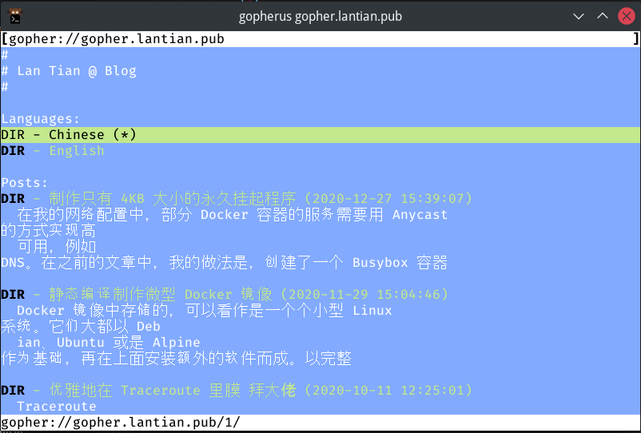
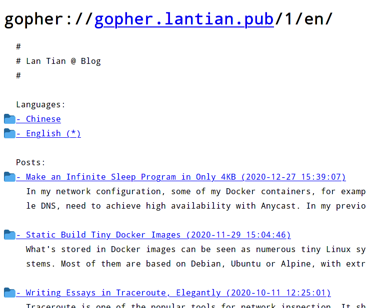

更新日志
-------

- 2021-03-24：改进文章处理逻辑，增加识别链接和图片的代码。
- 2021-03-21：最初版本。

什么是 Gopher
------------

Gopher 是互联网发展早期的一种网络协议，由美国明尼苏达大学于 1991 年发明，用途类似于现在的 HTTP。它的基础协议非常简单：

1. 客户端连接服务端的 TCP 70 端口，并发送一串 URL，用 CRLF 结尾，例如：`some_dir/hello.txt`
2. 服务端把这个文件的内容全部发过来，然后关闭连接。
3. 没了。

服务端返回的文件可能是一个 TXT、一张图片、一个二进制文件，也可能是一个有着特殊格式的 Gopher 列表文件，称为 `Gophermap`。这个文件每一行由以下几部分组成：

1. 一个字符，代表这一行的类型，是文字（`i`）、到一个 TXT 的链接（`0`）、到另一个 Gophermap 的链接（`1`）、图片（`I`），还是二进制文件（`9`）。当然还有一些现在已经不再使用的协议，可以参阅 [RFC1436 Section 3.8](https://tools.ietf.org/html/rfc1436#section-3.8)。
2. 一句话，代表这一行显示的信息，例如 `Hello World`。
3. 一个 TAB。
4. 这个链接指向的路径，例如 `/some_dir/hello.txt`。
5. 一个 TAB。
6. 这个链接指向的服务器域名或 IP，例如 `gopher.lantian.pub`。
7. 一个 TAB。
8. 这个链接指向的服务器端口，一般是 `70`。
9. CR+LF 换行符结尾。

在所有内容结束后，`Gophermap` 的最后一行还会有一个单独的英文句点，表示文件结束。

可以参考以下几个例子：

```bash
# 一行提示信息，提示信息没有要指向的路径，所以没有第四部分，指向 IP 端口也可以乱填
iHello World[TAB][TAB]invalid.host[TAB]70[CR][LF]
# 一个链接
iProject Description[TAB]/project/description.txt[TAB]gopher.lantian.pub[TAB]70[CR][LF]
# 一张图片
iScreenshot[TAB]/project/screenshot.jpg[TAB]gopher.lantian.pub[TAB]70[CR][LF]
# 标记 Gophermap 结束
.[CR][LF]
```

由于 Gopher 协议极其简单，它在上世纪 90 年代计算机运算能力不足的背景下得到了广泛的运用。但由于客户端唯一能做的事情就是发送一串 URL，在 Gopher 协议上实现客户端向服务端上传数据功能比较复杂，例如搜索功能、评论区等等。此外，服务端返回数据时也只能返回文件本身的数据，而不能像 HTTP 协议一样添加上其它的响应头，这就导致客户端必须根据之前收到的 Gophermap 中的信息来判断数据类型，或者干脆自己猜。因此 Gopher 协议最终被功能更加强大的 HTTP 协议替代了。

但是 Gopher 协议没有消亡。时至今日（2021 年），依然有在活跃更新的 Gopher 服务器端软件，例如 [Gophernicus](https://github.com/gophernicus/gophernicus)，也有一些网站仍然在通过 Gopher 协议提供服务。

如果你想试着访问 Gopher 网站，可以尝试 [Firefox 的 Overbite 插件](https://gopher.floodgap.com/overbite/)，或者 [Gopherus](http://gopherus.sourceforge.net/) 等客户端软件。

为什么要用 nginx？
----------------

相比起 Gophernicus 等专用的 Gopher 服务端软件，nginx 对现代的动态网页技术有着更好的支持。例如它可以用 FastCGI 对接 PHP 和 ASP.NET（Mono）来动态生成内容，或者把请求代理到其它基于 HTTP 的服务器，作为一个 Gopher 代理。相比之下，Gophernicus 只支持传统的 CGI，也没有代理功能。此外，nginx 的高性能有目共睹。

不过我选择 nginx 还有另一个原因：我正在[把 nginx 魔改成一个 WHOIS 服务器](/article/modify-website/serve-dn42-whois-with-nginx.lantian/)（给 DN42 用的），而 WHOIS 也是和 Gopher 一样，一问一答的协议。我把修改的功能稍微调整一下就可以直接支持 Gopher 了。

让 nginx 支持 Gopher
-------------------

nginx 本身是一个 HTTP 服务器。我们先不考虑引入了二进制命令的现代 HTTP/2.0，或者基于 UDP 的 QUIC 和 HTTP/3.0，先回头看曾经被广泛使用的 HTTP/1.1 协议，当时的一个请求长这样：

```bash
GET /test.php HTTP/1.1
Host: localhost
User-Agent: curl/7.75.0
Accept: */*

HTTP/1.1 200 OK
Server: nginx/1.18.0
Date: Sun, 21 Mar 2021 12:08:07 GMT
Content-Type: text/html; charset=UTF-8
Transfer-Encoding: chunked
Connection: keep-alive
X-Powered-By: PHP/8.0.3
```

上面一部分是客户端发起的请求，其中必要的是 `GET http://localhost/ HTTP/1.1` 部分和 `Host: localhost`，它们分别告知了服务器访问的路径（`/test.php`）和域名（`localhost`）。

其余部分，例如常见的 User-Agent 等请求头，对于 HTTP 协议来说并不必要。我们可以用 `telnet localhost 80` 指令连接服务器，并只保留前两行手动发起请求：

```bash
GET /test.php HTTP/1.1
Host: localhost

HTTP/1.1 200 OK
Server: nginx/1.18.0
Date: Sun, 21 Mar 2021 12:13:58 GMT
Content-Type: text/html; charset=UTF-8
Transfer-Encoding: chunked
Connection: keep-alive
X-Powered-By: PHP/8.0.3

c
Hello World

0

^CConnection closed by foreign host.
```

服务端依然返回了页面的内容。但是这比起我们需要的多了不少东西：

- Gopher 客户端不认识 HTTP 的 200 状态码；
- 多余的 Date、Content-Type 等响应头；
- nginx 回复的响应内容经过 `Transfer-Encoding: chunked` 编码，Gopher 客户端也不认识。
- 在输完 `Host:` 一行后我们按了两次回车，nginx 才发送响应。Gopher 客户端只会发一次回车。
- 最重要的是，注意到那个 `^C` 没？那是我手动按 `Ctrl+C` 中断了连接。nginx 默认启用了 `Connection: keep-alive`，发送完请求后不会主动关闭连接，而会等待客户端发起第二个请求，如果是 Gopher 客户端就只能一直等下去了。

因此，基于 HTTP/1.1 修改太过复杂。不过，有 1.1 就有 1.0。我们用 HTTP/1.0 试试？


```bash
GET /test.php HTTP/1.0

HTTP/1.1 200 OK
Server: nginx/1.18.0
Date: Sun, 21 Mar 2021 12:20:24 GMT
Content-Type: text/html; charset=UTF-8
Connection: close
X-Powered-By: PHP/8.0.3

Hello World
```

这回服务端主动关闭了连接，并且返回的数据也不是 `chunk` 模式编码了，可喜可贺。但是 HTTP 的响应头还在，难道我们要把 nginx 发送响应头的逻辑全干掉？这个修改量有点大。另外，我们还是得按两次回车。

好消息是，在 HTTP/1.0 之前，还有一版极简的协议 HTTP/0.9，就一行：

```
GET /test.php
Hello World
```

客户端只发送了上面的 GET 一行。在发送换行符后，nginx 就直接把响应数据 `Hello World` 发过来了，不用按两次回车，没有带上 200 状态码或者别的响应头，还不忘关闭连接。这已经很接近我们想要的效果了：这里的 HTTP 客户端发送了 `GET /test.php[回车]`，而 Gopher 客户端会发送 `test.php[回车]`。

此时我们的修改方法已经确定：在 nginx 中添加一版协议来解析 Gopher 请求，把请求类型锁定为 GET，在 URL 前面插入一个 `/` 斜杠，剩余逻辑全部照抄 HTTP/0.9 的就好。

nginx 补丁及用法
--------------

按照以上方法，我做了一个补丁，可以直接打到 nginx 1.19.7 的源码里。这个补丁可以在这里下载到：[https://gist.github.com/xddxdd/293becc41d805d7b8cfb5d11b6e326e1](https://gist.github.com/xddxdd/293becc41d805d7b8cfb5d11b6e326e1)

这个补丁总共做了三件事情：

1. 增加了一个 `listen` 的选项 `plain`，代表用于接收 Gopher 的、不带 GET 的请求。
   - 例如 `listen 70 plain default_server;`
   - 注意开启 `plain` 选项后，这个端口就不能接受普通的 HTTP 请求了！因此不要把 80 端口的 `listen` 加上这个选项，更不要和 `http2` 之类的选项一起开。
   - 理论上也支持 SSL，但我没试过。
2. 增加了一个 `plain` 模式专用的、解析 URL 用的状态机，相比 HTTP 的状态机，删除了解析请求类型（`GET`）、域名（`http://localhost`）和 HTTP 版本（`HTTP/1.1`）相关的功能，请求类型锁定为 `GET`，域名设置为 `null`（与 HTTP/1.0 相同），HTTP 版本锁定为 0.9。
3. 在开始接收客户端的请求前，先往接收缓冲区存一个斜杠 `/`，以达到向 URL 开头插入斜杠的效果。nginx 后续处理流程需要频繁用到存放 URL 的指针，相比修改所有用到 URL 的逻辑，直接插入一个斜杠是最简单粗暴、也是最稳妥的方法。

在编译 nginx 时，需要开启 `--with-http_plain_module` 参数。此外在配置 nginx 时，记得设置 `index gophermap;` 让 nginx 默认读取文件夹中的 Gophermap。

生成 Gophermap 文件
------------------

有了服务端，接下来需要的就是网站的文件了。由于我用的是静态网站生成器 Hexo，文章的文件格式都是 Markdown，我就偷了个懒，把 Markdown 文件用 [Remark](https://github.com/remarkjs/remark) 稍微调整一下格式、再过一下 [Prettier](https://github.com/prettier/prettier) 缩成 70 字符一行。然后我用正则表达式识别文章中的链接和图片，把他们放到单独的一行并设置为链接（`1`）或图片（`I`）格式，因为 Gophermap 不支持文字和链接混在同一行。最后把剩余文字全部设置为 `i`：

```javascript
const crlf = '\r\n';
const gopherBefore = 'i';
const gopherBeforeLink = '1';
const gopherBeforeImage = 'I';
const gopherAfter = '\t\t{{server_addr}}\t{{server_port}}' + crlf;
const gopherEOF = '.' + crlf;

function markdown_formatter(rel_path, md) {
    const markdownRegex = /([^!]?)(!?)\[([^\]]+)\]\(([^)]+)\)(.?)/g;

    var rows = md.split('\n');
    for (var i = 0; i < rows.length; i++) {
        // 识别所有的 [链接](url) 和 
        if (rows[i].match(markdownRegex)) {
            var replace_at_beginning = false,
                replace_at_end = false;

            var replace_fn = (
                match,
                prefix,
                img_marker,
                label,
                href,
                suffix,
            ) => {
                // 不要替换 http://，gopher:// 等外部链接，Gopher 浏览器不支持
                if (href.match("://")) {
                    return match;
                }

                if (prefix !== null) {
                    // 标记链接或图片在这行开头，不要再添加文字 i 前缀了
                    replace_at_beginning = true;
                }
                if (suffix !== null) {
                    // 标记链接或图片在这行开头，不要再添加后缀了
                    replace_at_end = true;
                }

                href = path.join('/', rel_path, href);

                return (
                    (prefix ? prefix + gopherAfter : '') +
                    (img_marker === '!'
                        ? gopherBeforeImage
                        : gopherBeforeLink) +
                    label +
                    '\t' +
                    href +
                    '\t{{server_addr}}\t{{server_port}}' +
                    crlf +
                    (suffix ? gopherBefore + suffix : '')
                );
            };

            rows[i] = rows[i].replaceAll(markdownRegex, replace_fn);
            rows[i] =
                (replace_at_beginning ? '' : gopherBefore) +
                rows[i] +
                (replace_at_end ? '' : gopherAfter);
        } else {
            rows[i] = gopherBefore + rows[i] + gopherAfter;
        }
    }

    return rows.join('') + gopherEOF;
}

// 关键逻辑
unified()
    .use(remark_parse)
    .use(remark_stringify, {
        bullet: '-',
        fences: true,
        listItemIndent: 'one',
        resourceLink: false,
    })
    .process(data.page.raw) // 读取原始 Markdown 数据
    .then((file) => {
        var md = String(file);
        if (!md) return;

        // 缩到 70 字符一行
        md = prettier.format(md, {
            parser: 'markdown',
            printWidth: 70,
            tabWidth: 2,
            proseWrap: 'always',
            endOfLine: 'lf',
        });
        if (!md) return;

        // 全部行改成 Gophermap 文字格式
        md = markdown_formatter(path.dirname(data.path), md);

        // 写文件等，略
    });
```

生成文件的效果类似于：

```bash
iDN42 全称 Decentralized Network 42（42 号去中心网络），是一个大型、去          {{server_addr}} {{server_port}}
i中心化的 VPN 网络。但是与其它传统 VPN 不同的是，DN42 本身不提供 VPN 出         {{server_addr}} {{server_port}}
i口服务，即不提供规避网络审查、流媒体解锁等类似服务。相反，DN42 的目的          {{server_addr}} {{server_port}}
```

（实际文件中都是 Tab，我的编辑器自动把 Tab 都替换成了空格）

注意到后面的 `{{server_addr}}` 和 `{{server_port}}` 了吗？它们是 Gophermap 中指定链接的目标主机和端口的参数。这两个参数不能遗漏，也不存在“相对于当前路径”的值。我选择把它们都交给 nginx 替换处理：

```bash
location / {
    sub_filter "{{server_addr}}\t{{server_port}}" "$gopher_addr\t$server_port";
    sub_filter_once off;
    sub_filter_types '*';
}
```

有了文章，我还需要一个目录作为首页。我直接写了一个 `for` 循环给每篇文章生成一个链接，并附上两行的内容概要，关键逻辑如下：

```javascript
const crlf = '\r\n';
const gopherBefore = 'i';
const gopherBeforeLink = '1';
const gopherAfter = '\t\t{{server_addr}}\t{{server_port}}' + crlf;
const gopherEOF = '.' + crlf;

var data = '';

// 标题
data += gopherBefore + '# ' + hexo.config.title + gopherAfter;
data += gopherBefore + gopherAfter;

// 文章列表
locals.posts
    .sort('date', 'desc')
    .each((post) => {
        data +=
            gopherBeforeLink +
            '- ' +
            post.title.slice(0, 56) +
            ' (' +
            new Date(post.date)
                .toISOString()
                .replace('T', ' ')
                .substr(0, 19) +
            ')' +
            '\t/' +
            post.path.replace(/index\.html$/g, '') +
            '\t{{server_addr}}\t{{server_port}}' +
            crlf;

        data +=
            gopherBefore +
            '  ' +
            post.excerpt.slice(0, 68) +
            gopherAfter;
        data +=
            gopherBefore +
            '  ' +
            post.excerpt.slice(68, 68) +
            gopherAfter;
        data += gopherBefore + gopherAfter;
    });
data += gopherEOF;
return data;
```

我把 Hexo 生成 Gophermap 的逻辑上传到了 [https://gist.github.com/xddxdd/99170395595e339ed5735cdf9b9b2cd1](https://gist.github.com/xddxdd/99170395595e339ed5735cdf9b9b2cd1)，把 `gopher.js` 放到主题的 `scripts` 目录（例如 `themes/lantian/scripts/gopher.js`）即可使用。但要注意的是，我手动删除了一些与我的网站相关的代码（主要是多语言支持相关），并且删除完后没有再测试，代码可能会有点问题。

最终效果
------

首先是用 Linux 终端下的 Gopherus 浏览器访问的效果：



网站内容可以正常显示了，但是和预期还有些差别：Gopherus 将每行在 80 字节处截断了，而 UTF-8 编码的中文字每个占 3 字节，导致了有约 $\frac{1}{3}$ 的内容被挤到了下一行。英文站就没有这个问题：


比起 Gopherus，还有更现代的解决方案，Firefox 浏览器加 Overbite 插件：


中文内容的排版比起 Gopherus 好了不少。当然英文内容也可以正常显示：



我们点进一篇文章看看。虽然只是 Markdown 没做太多额外的处理，但文章本身是可读的：


你也可以用 Gopher 客户端访问 [gopher://gopher.lantian.pub](gopher://gopher.lantian.pub) 自行查看效果。
