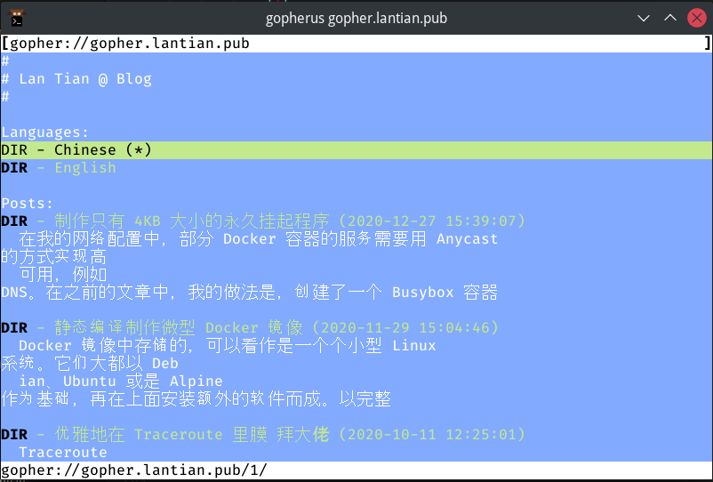
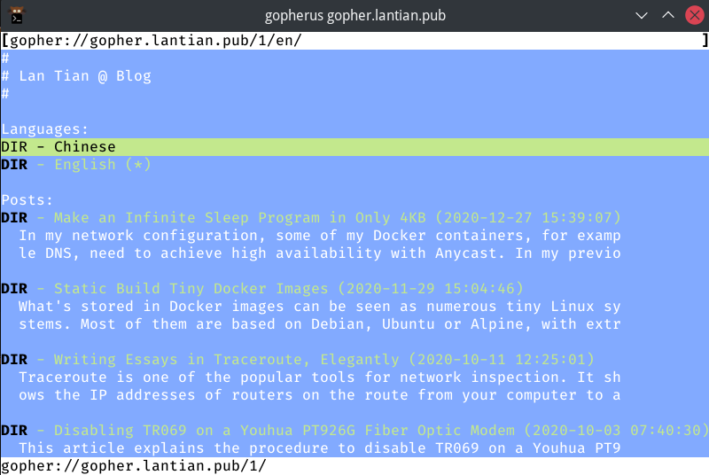
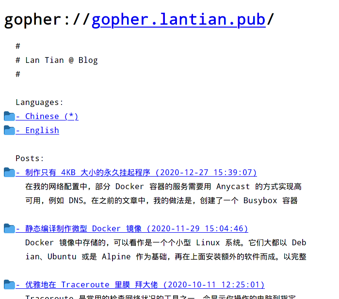
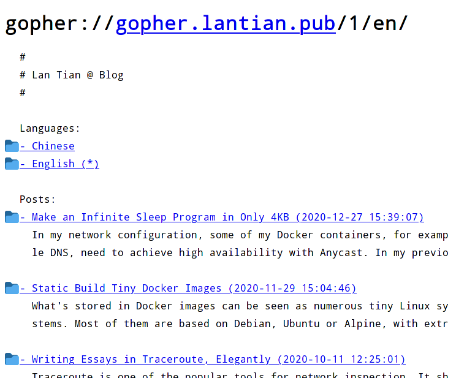
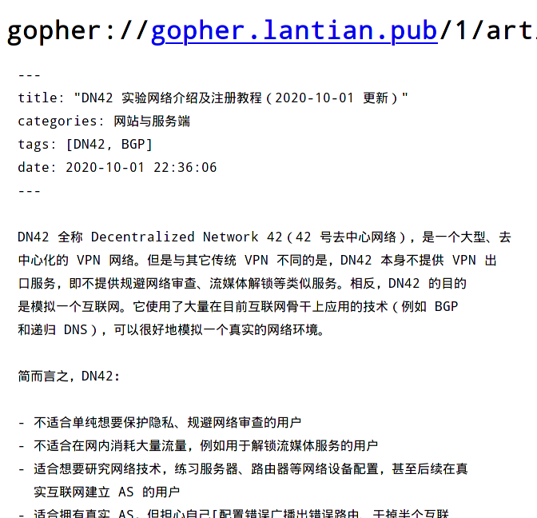
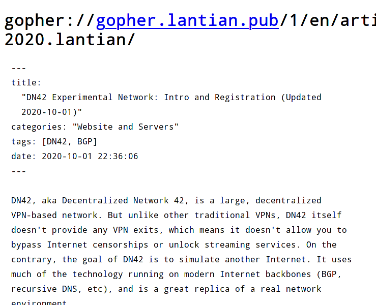

Changelog
---------

- 2021-03-24: Improve post-processing, add scripts for parsing links and images.
- 2021-03-21: Initial version.

What's Gopher
-------------

Gopher is a protocol born in the early ages of the Internet. It was invented at the University of Minnesota in 1991, with a purpose similar to HTTP today. The protocol itself is extremely simple:

1. Client connects to TCP port 70 of the server, and send one line of URL ending with CRLF, e.g. `some_dir/hello.txt`
2. Server sends data of the requested file and closes the connection.
3. And we're done.

The server could be returning a text file, a picture, a binary file, or a Gopher list file called `Gophermap` with special formatting. Each line of the file is composed of the following fields:

1. A character representing the type of this line, may it be text (`i`), a link to a text file (`0`), a link to another Gophermap (`1`), a picture (`I`), or a binary (`9`). Of course, there are other types meant for protocols no longer used today. See [RFC1436 Section 3.8](https://tools.ietf.org/html/rfc1436#section-3.8) for more details.
2. A message line to be shown for this line, e.g., `Hello World`.
3. A TAB character.
4. Target path of the link, e.g., `/some_dir/hello.txt`.
5. A TAB character.
6. Target hostname of the link, e.g., `gopher.lantian.pub`.
7. A TAB character.
8. Target port of the link, usually `70`.
9. CR+LF as line ending.

At the end of the `Gophermap` there is a single period on its own line, marking the end of the map.

Take a look at these examples:

```bash
# A line of information. It has no link target for part 4, and you may fill anything for the target host and port
iHello World[TAB][TAB]invalid.host[TAB]70[CR][LF]
# Example of a link
iProject Description[TAB]/project/description.txt[TAB]gopher.lantian.pub[TAB]70[CR][LF]
# Example of a picture
iScreenshot[TAB]/project/screenshot.jpg[TAB]gopher.lantian.pub[TAB]70[CR][LF]
# End marker of Gophermap
.[CR][LF]
```

Under the background of lacking computing power, the Gopher protocol was widely used in the 1990s due to its extreme simplicity. But since the only thing a client can do is to send a URL, it is much more complicated to allow the client to post data onto the server, like for searching or comment sections. In addition, the server can only return the file itself but nothing else, unlike HTTP where additional response headers are allowed. This means the client needs to find out the type of response based on previous Gophermaps, or even guess on its own. Therefore, Gopher was eventually replaced with functionally superior HTTP.

But Gopher protocol isn't dead. As of now (the year 2021), there are still actively maintained Gopher server software such as [Gophernicus](https://github.com/gophernicus/gophernicus), and there are sites serving over Gopher.

If you want to try visiting Gopher sites, you may try [Overbite extension for Firefox](https://gopher.floodgap.com/overbite/), or client software like [Gopherus](http://gopherus.sourceforge.net/).

Why Nginx?
----------

Compared to some software designed specifically for Gopher, such as Gophernicus, Nginx has better support for modern dynamic web pages. For example, it can dynamically generate responses based on PHP and ASP.NET (Mono) over FastCGI, or proxy requests to other HTTP servers, effectively making it a Gopher gateway. Comparatively, Gophernicus only supports classic CGI and no proxy functionality. In addition, Nginx is well known for its high performance.

But there is one more reason I chose Nginx: I was [modifying Nginx to use it as a WHOIS server](/en/article/modify-website/serve-dn42-whois-with-nginx.lantian/) (for DN42), and WHOIS protocol is almost the same as Gopher: one request and one response. With minor adjustments, I can make my new feature work with Gopher.

Let Nginx support Gopher
------------------------

Nginx, by itself, is an HTTP server. Let us ignore for a moment the modern HTTP/2.0 with binary commands, or UDP-based QUIC or HTTP/3.0, and look back at the HTTP/1.1, which was once widely used. Back then, a request looks like this:

```bash
GET /test.php HTTP/1.1
Host: localhost
User-Agent: curl/7.75.0
Accept: */*

HTTP/1.1 200 OK
Server: nginx/1.18.0
Date: Sun, 21 Mar 2021 12:08:07 GMT
Content-Type: text/html; charset=UTF-8
Transfer-Encoding: chunked
Connection: keep-alive
X-Powered-By: PHP/8.0.3
```

The first part is the client request, of which `GET http://localhost/ HTTP/1.1` and `Host: localhost` are necessary. They tell the server the path (`/test.php`) and domain (`localhost`) the client is trying to access.

The other parts, such as User-Agent headers commonly seen, are not an essential part of the HTTP protocol. We can connect to the server manually with `telnet localhost 80` and only send the first two lines:

```bash
GET /test.php HTTP/1.1
Host: localhost

HTTP/1.1 200 OK
Server: nginx/1.18.0
Date: Sun, 21 Mar 2021 12:13:58 GMT
Content-Type: text/html; charset=UTF-8
Transfer-Encoding: chunked
Connection: keep-alive
X-Powered-By: PHP/8.0.3

c
Hello World

0

^CConnection closed by foreign host.
```

The server still gave back contents for the page, but there are things more than we actually need:

- Gopher clients won't recognize the 200 status code of HTTP;
- There are extra response headers including Date, Content-Type, etc.;
- The responses of Nginx are encoded with `Transfer-Encoding: chunked`, which Gopher clients have no idea about;
- We need to press Enter twice after the `Host:` line before Nginx sends the response. Gopher clients will only do it once;
- Most importantly, have you noticed the `^C`? It's there because I manually pressed `Ctrl+C` to terminate the connection. Nginx has `Connection: keep-alive` enabled by default and won't actively close the connection after the request is completed. Instead, it will wait for the client to send a second request. A Gopher client, in this case, will wait forever.

Therefore, there's too much to change based on HTTP/1.1. But if there's 1.1, there's also 1.0. How about we have a try of HTTP/1.0?

```bash
GET /test.php HTTP/1.0

HTTP/1.1 200 OK
Server: nginx/1.18.0
Date: Sun, 21 Mar 2021 12:20:24 GMT
Content-Type: text/html; charset=UTF-8
Connection: close
X-Powered-By: PHP/8.0.3

Hello World
```

This time, the server actively closed the connection, and returned raw data instead of `chunk` encoded ones, which is good. But there are still extra HTTP response headers. Do we need to disable all logic related to HTTP headers? There's still a lot to do. And we still need to press Enter twice, by the way.

Here's some good news: there was an extremely simple version of HTTP/0.9 before HTTP/1.0, and it is just a single line:

```
GET /test.php
Hello World
```

The client only sent the first `GET` line. Once it sends a line feed, Nginx replies back `Hello World` without needing the second line feed, without status code 200 or other headers, and not forgetting to close the connection. This is very close to what we want: the HTTP client sent `GET /test.php[ENTER]` this time, while a Gopher client will probably send `test.php[ENTER]`.

Now we have a plan: add a protocol to parse Gopher requests, set the request type to GET, add a slash `/` before the URL, and copy/reuse HTTP/0.9 logic for the rest part.

nginx Patch and Usage
---------------------

I made a patch using the method above, which can be directly applied to the source code of Nginx 1.19.7. The patch can be obtained from [https://gist.github.com/xddxdd/293becc41d805d7b8cfb5d11b6e326e1](https://gist.github.com/xddxdd/293becc41d805d7b8cfb5d11b6e326e1)

Overall, this patch did three changes:

1. A new option, `plain`, is added to `listen`, meaning this port will be used to receive Gopher connections without the GET part.
   - Use it like `listen 70 plain default_server;`
   - Attention: a `plain` port cannot receive normal HTTP requests! So do not add it to the `listen` for port 80, and never use it with other protocols like `http2`.
   - SSL is theoretically supported, but I never tried.
2. A state machine for parsing `plain` URLs is added. Compared to HTTP state machines, everything related to parsing request type (`GET`), domain (`http://localhost`), and HTTP version (`HTTP/1.1`) is removed. The request type is hardcoded to `GET`, the domain set to `null` (just like HTTP/1.0), and the HTTP version is set to 0.9.
3. Before starting to receive requests from the client, a slash `/` is stored into the receiving buffer to insert it to the beginning of the URL. Nginx will use the pointers to the URL many times during the entire process, and compared to changing all URL-related logic, inserting a slash is simple, effective, and reliable.

Remember to enable `--with-http_plain_module` while compiling Nginx, and remember to set `index gophermap;` so Nginx looks for the Gophermap by default.

Generating Gophermaps
---------------------

Now that we have a server, the next thing we need is files for the website. Since I use Hexo, a static site generator, and all my posts are written in Markdown, I simply went the lazy way of reformatting Markdown files with [Remark](https://github.com/remarkjs/remark), capping to 70 characters per line with [Prettier](https://github.com/prettier/prettier). Then I search for all links and images with a regex, put them to their own lines as link (`1`) or image (`I`), since Gophermap doesn't support mixing text and link in the same line. All other texts are set as `i`:

```javascript
const crlf = '\r\n';
const gopherBefore = 'i';
const gopherBeforeLink = '1';
const gopherBeforeImage = 'I';
const gopherAfter = '\t\t{{server_addr}}\t{{server_port}}' + crlf;
const gopherEOF = '.' + crlf;

function markdown_formatter(rel_path, md) {
    const markdownRegex = /([^!]?)(!?)\[([^\]]+)\]\(([^)]+)\)(.?)/g;

    var rows = md.split('\n');
    for (var i = 0; i < rows.length; i++) {
        // Recognize all [Link](url) 和 
        if (rows[i].match(markdownRegex)) {
            var replace_at_beginning = false,
                replace_at_end = false;

            var replace_fn = (
                match,
                prefix,
                img_marker,
                label,
                href,
                suffix,
            ) => {
                // Don't replace external links like http://, gopher://
                // Gopher browsers don't support them
                if (href.match("://")) {
                    return match;
                }

                if (prefix !== null) {
                    // Mark there's link or image at line beginning
                    // Don't add prefix anymore
                    replace_at_beginning = true;
                }
                if (suffix !== null) {
                    // Mark there's link or image at line end
                    // Don't add suffix anymore
                    replace_at_end = true;
                }

                href = path.join('/', rel_path, href);

                return (
                    (prefix ? prefix + gopherAfter : '') +
                    (img_marker === '!'
                        ? gopherBeforeImage
                        : gopherBeforeLink) +
                    label +
                    '\t' +
                    href +
                    '\t{{server_addr}}\t{{server_port}}' +
                    crlf +
                    (suffix ? gopherBefore + suffix : '')
                );
            };

            rows[i] = rows[i].replaceAll(markdownRegex, replace_fn);
            rows[i] =
                (replace_at_beginning ? '' : gopherBefore) +
                rows[i] +
                (replace_at_end ? '' : gopherAfter);
        } else {
            rows[i] = gopherBefore + rows[i] + gopherAfter;
        }
    }

    return rows.join('') + gopherEOF;
}

// Key logic
unified()
    .use(remark_parse)
    .use(remark_stringify, {
        bullet: '-',
        fences: true,
        listItemIndent: 'one',
        resourceLink: false,
    })
    .process(data.page.raw) // Get source Markdown data
    .then((file) => {
        var md = String(file);
        if (!md) return;

        // Cap to 70 chars per line
        md = prettier.format(md, {
            parser: 'markdown',
            printWidth: 70,
            tabWidth: 2,
            proseWrap: 'always',
            endOfLine: 'lf',
        });
        if (!md) return;

        // Reformat each line to Gophermap
        md = markdown_formatter(path.dirname(data.path), md);

        // Write files, omitted
    });
```

The generated file will look like:

```bash
iDN42, aka Decentralized Network 42, is a large, decentralized          {{server_addr}} {{server_port}}
iVPN-based network. But unlike other traditional VPNs, DN42 itself              {{server_addr}} {{server_port}}
idoesn't provide any VPN exits, which means it doesn't allow you to             {{server_addr}} {{server_port}}
```

(Actual files have Tabs in them; my editor converted them to spaces)

See the `{{server_addr}}` and `{{server_port}}`? They point to the target host and port. They can neither be omitted or replaced with some "relative" value. I simply hand the task of setting values for them to nginx:

```bash
location / {
    sub_filter "{{server_addr}}\t{{server_port}}" "$gopher_addr\t$server_port";
    sub_filter_once off;
    sub_filter_types '*';
}
```

With posts ready, I need a list of contents as my index page. I simply wrote a `for` loop, generating a link and two lines of summary for each post. The key logic is as below:

```javascript
const crlf = '\r\n';
const gopherBefore = 'i';
const gopherBeforeLink = '1';
const gopherAfter = '\t\t{{server_addr}}\t{{server_port}}' + crlf;
const gopherEOF = '.' + crlf;

var data = '';

// Title
data += gopherBefore + '# ' + hexo.config.title + gopherAfter;
data += gopherBefore + gopherAfter;

// List of posts
locals.posts
    .sort('date', 'desc')
    .each((post) => {
        data +=
            gopherBeforeLink +
            '- ' +
            post.title.slice(0, 56) +
            ' (' +
            new Date(post.date)
                .toISOString()
                .replace('T', ' ')
                .substr(0, 19) +
            ')' +
            '\t/' +
            post.path.replace(/index\.html$/g, '') +
            '\t{{server_addr}}\t{{server_port}}' +
            crlf;

        data +=
            gopherBefore +
            '  ' +
            post.excerpt.slice(0, 68) +
            gopherAfter;
        data +=
            gopherBefore +
            '  ' +
            post.excerpt.slice(68, 68) +
            gopherAfter;
        data += gopherBefore + gopherAfter;
    });
data += gopherEOF;
return data;
```

I posted my logic of generating Gophermaps in Hexo to [https://gist.github.com/xddxdd/99170395595e339ed5735cdf9b9b2cd1](https://gist.github.com/xddxdd/99170395595e339ed5735cdf9b9b2cd1). Place `gopher.js` to the `scripts` directory of your theme (e.g. `themes/lantian/scripts/gopher.js`) to use it. One reminder though, I removed some code specific to my site (mainly multilingual support stuff) and didn't test it again afterwards, so there could be minor issues.

Final Results
-------------

First, let's take a look at how things look like with Gopherus browser under the Linux terminal:



The site is displayed normally, but it's a bit different from expected: Gopherus cut each line at 80 bytes, but Chinese characters are 3 bytes each in UTF-8 encoding. This means approximately $\frac{1}{3}$ of the content each line wraps to the next line. My English site is shown correctly:



There are modern solutions compared to Gopherus, which is the Firefox browser with Overbite plugin:



Chinese contents layout is much better than Gopherus. Of course, English contents can be shown normally as well:



Let's try browsing a post. Although it's just plain Markdown without much extra processing, the post itself is readable:





You can visit [gopher://gopher.lantian.pub](gopher://gopher.lantian.pub) with your own Gopher client to see the results.
