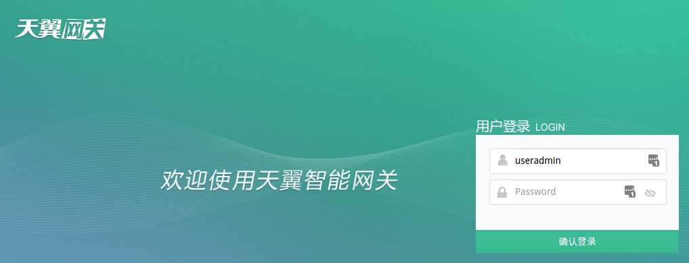
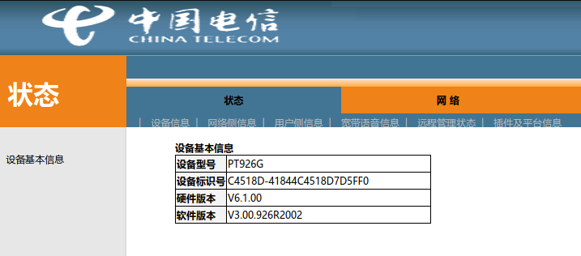
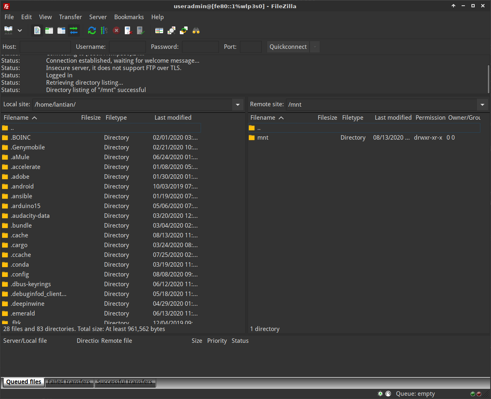

This article explains the prodecure to obtain such privileges from a Youhua PT926G fiber optic modem, without disassembling the device or using serial port converters.

- Super Admin users on Web UI (telecomadmin)
- Telnet's root user access
- FTP access

FYI I obtained the device from China Telecom, Guangdong Shenzhen.

Log on as Super Admin
---------------------

If you directly access the modem's IP (`http://192.168.1,1`), you will see such a login page to the modem:



Here you can login with account name `useradmin` and the password labeled on the back of the modem, but there's not much you can do one logged in. The only useful thing seems to be Wi-Fi setting.

But a nmap scan reveals much more:

```bash
$ nmap -v 192.168.1.1
# Some output redacted for simplicity
PORT      STATE    SERVICE
21/tcp    filtered ftp
22/tcp    filtered ssh
23/tcp    filtered telnet
53/tcp    filtered domain
80/tcp    open     http
445/tcp   open     microsoft-ds
8080/tcp  open     http-proxy
10001/tcp open     scp-config
32768/tcp open     filenet-tms
```

There is a port 8080 that we can try accessing (`http://192.168.1.1:8080`):


Well, looks familiar enough.

> I'm saying this because similar login UI can be found on a lot of older fiber optic modems provided by China Telecom.

Let's try China Telecom's default password (`telecomadmin / nE7jA%5m`):

> This is the default super admin password for modems after a factory reset, but before the modem registers to ISP.
>
> Usually ISP will push a config update to change the password.



And I'm in. China Telecom Shenzhen simply don't change that password.

> If the password is changed by your local China Telecom, you have a few options:
>
> - Record the modem's LOID, pull out the fiber optic cable, reset the modem to factory default, log in with the default password and disable config updates, and finally type in LOID to connect to the Internet.
> - Disassemble the modem and use a serial port converter to log in.
>
> I'm not covering these options in this article, you need to do your own research.

Turn on Telnet
--------------

Based on [this post by tm5880891 on ChinAdsl.net](http://www.chinadsl.net/forum.php?mod=viewthread&tid=165272), follow the steps:

1. First log in as `telecomadmin` at `http://192.168.1.1:8080`
   - This may not be necessary, and you may try skipping this if you don't know the telecomadmin password.
2. Open `http://192.168.1.1:8080/cgi-bin/abcdidfope94e0934jiewru8ew414.cgi`, and the page should show `success`.
3. Then you can `telnet 192.168.1.1`.
   - Username: `admin`
   - Password: `TeleCom_1234`

But once logged on, the telnet provides a modified shell, that only allows running commands in a (small) list:

- ip
- ifconfig
- route
- ping
  - You may use them for diagnostic purposes.
- su
  - Important, but we don't know the password yet.

No other commands are allowed. But I found that Tab completion of this shell still works, and I can list files with it. For example:

```bash
# Type /, Telnet currently shows this
$/
# Press Tab twice
.lstripped  etc/        lib/        overlay/    sys/        usr/
bin/        home/       mnt/        proc/       tmp/        var/
dev/        image/      opt/        sbin/       userfs/
# And here is the list of files on root folder.
# Similarly you can list other directories.
```

After some search, I found that website `http://192.168.1.1:8080` is stored in `/home/httpd/web/`, and I found quite some weird pages in it.

Export Config File
------------------

Currently most tutorials online require connecting to the modem's builtin FTP server and downloading files from it, but my modem has a newer firmware that blocks port 21 (as shown in nmap).

But with one weird page I found, I can export the config file:

1. First login as `telecomadmin` at `http://192.168.1.1:8080`:
   - This is necessary, and you can't proceed if you don't know `telecomadmin`'s password.
2. Then visit `http://192.168.1.1:8080/bd/saveconf.asp` and click `Backup` button.
3. You will get a XML file, which is its configuration.

Obtain Telnet Root Password
---------------------------

Open the config XML and search for `MIB_TELNET_CLI_PASSWD`, its value similar to `TeleCom_1a2b3c` is the telnet root password.

Type `su` followed by this password in telnet, and the shell indication will change from `$` to `#`. You're root now, start doing whatever you want!

Access Builtin FTP
------------------

Since the existence of previous hack via FTP, later firmware blocked port 21 for FTP. But the FTP service itself is still running, and the port block is not complete: it only blocks IPv4 connections, not IPv6.

This means you can connect to the FTP via the modem's IPv6 address. We can do a nmap first:

```bash
# Obtain modem's IPv6 address from http://192.168.1.1:8080
# You don't need telecomadmin here, useradmin also works
$ nmap -v -6 240e:xxxx:xxxx::xxxx
# Replace with modem's Ipv6 address
# Some output redacted for simplicity
PORT     STATE    SERVICE
21/tcp   open     ftp
22/tcp   filtered ssh
23/tcp   open     telnet
53/tcp   filtered domain
80/tcp   open     http
445/tcp  open     microsoft-ds
8080/tcp open     http-proxy
```

And connect with your FTP client, username is `useradmin` and the password is what's on the back of your modem.



> Here I'm using the modem's link-local address `fe80::1%wlp3s0`, where `wlp3s0` is my Linux network interface name. This may not be possible under Windows, and in this case you can simply use the public accessible IPv6 of the modem.

But even with access to the FTP, you cannot reuse the older hacking methods, as the FTP is now restricted to `/mnt`, and is unable to access config files in `/var/config`.

References
----------

Huge thanks to previous people who worked on fiber optic modem hacking.

- [Partial Technical Publication of PT926E PT926G (ChinAdsl.net tm5880891)](http://www.chinadsl.net/forum.php?mod=viewthread&tid=165272)
- [Changing Region and MAC SN of Youhua PT926E PT926G (ChinAdsl.net tm5880891)](http://www.chinadsl.net/forum.php?mod=viewthread&tid=166519)