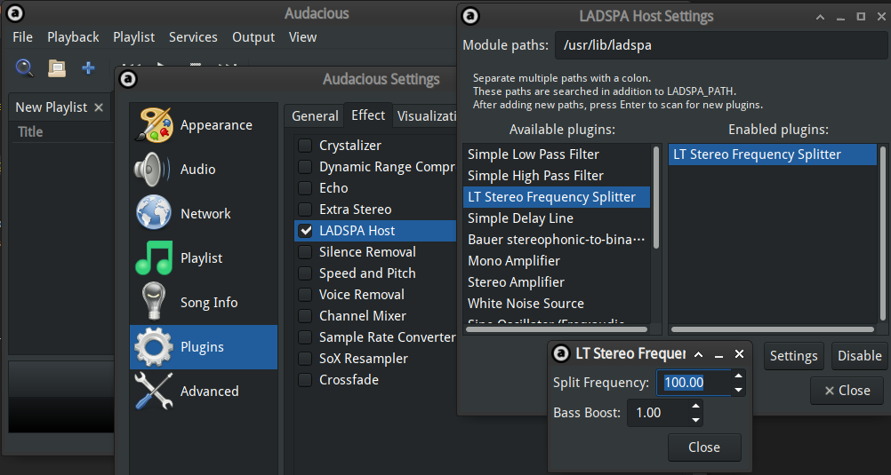

During the Chinese Spring Festival, my dad gave me an Edifier M120 Bluetooth
speaker. This speaker is not one of these high-end models featuring dedicated
bass speakers or professional Bluetooth audio codecs such as aptX and LDAC; it's
just a unit with two ordinary speakers.

> With that said, I doubt I can hear any difference with those advanced codecs
> on a portable speaker anyway.

But when I played some music with my phone connected to it, I realized that it
does have some bass output. Speaking of bass, I'm impressed by a JBL Charge 4
speaker bought by one of my classmates. As a portable speaker that costs $150,
it has a dedicated bass unit with astonishing power. Then I began to think that,
although my speaker costs a mere $20 (converted from CNY), is it possible to
improve its bass performance with software methods to make it somewhat similar
to the Charge 4? I immediately tried ViPER4Audio FX, the all-in-one sound effect
solution on Android, and increased the bass level in Dynamic System. While the
bass was enhanced indeed, the output from the speaker became distorted. Whenever
the speaker played a drum beat, the volume of that speaker was lowered for a
short amount of time. This is caused by the mechanical limits of the speaker
itself.

I had planned to modify the speaker, but after a quick search on Taobao, I only
found those large, expensive units for large, expensive speakers sitting in
rooms. In addition, the coronavirus pandemic impacted the express delivery
service, so even if I ordered one right away, it's up to the universe to decide
when it will arrive.

Then I came up with an idea. A single speaker is limited mechanically from
playing non-distorted high pitch along with a strong bass beat. But since my
speaker unit has two individual speakers for two channels, what would happen if
I played bass through one of them and treble through the other one?

And here comes the sound effect plugin.

## Notes

This sound effect plugin is intended for audio devices with **all conditions met
below**:

- A "speaker" rather than a "headphone" or an "earphone"
  - Since the plugin will send bass through one channel and treble through the
    other, it's meaningless for headphones
- Speakers for both channels placed together
  - If they are too far apart, you will feel that the bass and treble are coming
    from different places, hindering your experience.
- No dedicated bass unit
  - If it has one, the manufacturer likely had done everything this plugin does,
    to split bass to the dedicated unit
- (Usually) inexpensive
  - If your speaker is pricey (like a JBL Charge 4), it usually has superior
    bass effects anyway. Increasing bass further with this plugin may damage
    your hearing.

## Installation & Usage

The sound effect plugin can be downloaded from my GitHub,
[https://github.com/xddxdd/ladspa](https://github.com/xddxdd/ladspa). Right now
(2020-02-18), there is only one plugin in the repo, the frequency splitter and
bass booster we're talking about, but I may add more plugins if I want.

It can be installed just like any CMake project:

```bash
git clone https://github.com/xddxdd/ladspa.git && cd ladspa
mkdir build && cd build
cmake .. && make && sudo make install
```

Since it's a standard LADSPA plugin, it can be used by any music player
supporting LADSPA, for example, Audacious:



Here `Split Frequency` stands for the split frequency for bass and treble. With
the settings in the picture, any sound lower than 100 Hz will go through one
channel and be enhanced, while those higher than 100 Hz will go through the
other channel. `Bass Boost` is the factor by which bass enhances. For example, 1
means no increase, and "5" means that the bass signal is multiplied by 5.

As an alternative, you may also use PulseAudio to apply it to all software. Add
the following instructions to the end of `/etc/pulse/default.pa`:

```bash
load-module module-ladspa-sink sink_name=splitfreq plugin=lt_splitfreq label=splitfreq control=80,5
```

Here 80 and 5 are for `Split Frequency` and `Bass Boost` individually. Then
restart PulseAudio:

```bash
pulseaudio -k # Stop the current PulseAudio process
# Then start a music/video player and play something,
# PulseAudio will automatically restart
```

Then select Splitfreq as the default output device in the sound settings.

## Algorithms

This sound effect plugin will randomly select a channel (corresponding to a
speaker) as bass output and the other as treble output. This happens at plugin
load time (usually when the player starts or PulseAudio starts). It prevents
unbalanced speaker output if you've used the plugin for too long and a speaker
begins to wear.

> Although I don't think this has a high chance of happening, better be safe
> than sorry.

The plugin first takes the mean of input sound signal to mix the signal to mono
channel, since there's not much difference anyway on a portable speaker. Then
the signal passes through a low-pass filter, with the threshold set to the value
of `Split Frequency`, to obtain the bass signal. Treble signal is obtained by
subtracting the bass signal from the input. The low-pass filter implementation
is copied from
[LADSPA's Official Examples](https://www.ladspa.org/ladspa_sdk/download.html).

Then the bass signal is multiplied by `Bass Boost` as enhancement, and output to
the bass channel. The treble signal goes to the treble channel without any
enhancement.

## Effects

With this plugin, the bass output on my speaker significantly improves. In
addition, with the separation of bass and treble, there is no significant
distortion or volume change on the treble side. Therefore, my music experience
is greatly improved.

About parameter selection, on my Edifier M120, the best settings are
`Split Frequency` set to 80 and `Bass Boost` set to 5. Since you (almost)
definitely are using another speaker, you need to tune the best parameters by
yourself.
