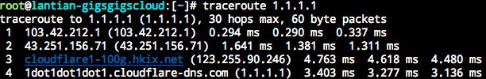
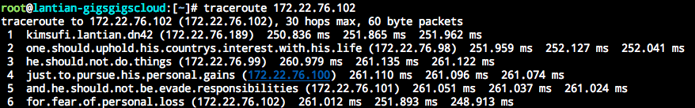

Traceroute is one of the popular tools for network inspection. It shows the IP
addresses of routers on the route from your computer to a destination server,
similar to:

Domains are shown on the last 2 hops, which is the IP's reverse DNS record.
Reverse DNS records exist as PTR records in the format of
`4.3.2.1.in-addr.arpa`. For more information, you may refer to
[Setting IP Reverse Records in DN42 (Chinese Only)](/article/modify-website/dn42-ip-reverse-record.lantian).

Naturally, where there are characters, there will be stories shown in them. Two
years ago,
[I set up a bunch of Docker containers, and modified and chained their routing tables, so they create the path needed for showing the essay](/en/article/modify-computer/worship-in-traceroute.lantian).

Using a lot of containers isn't elegant enough, and is a management burden,
especially if the path is long. A better solution is creating a virtual network
interface with a program, and reply corresponding packets directly based on
incoming Traceroute packets. In addition to resource and management burden
savings, this can be easily adapted in more complex scenarios if necessary.

So I made such a program available at
[https://github.com/xddxdd/route-chain](https://github.com/xddxdd/route-chain).

## Usage

First, make sure your system supports TUN/TAP. Except for a small number of
OpenVZ or LXC containers, you're good to go.

After downloading the source code, `make`, and `make install`, and run
`route-chain 192.168.0.1/24 192.0.0.1/24 fc00::/64 fd00::/64`. You may add an
arbitrary number of addresses as parameters.

The addresses in the parameters are assigned to **the host**, and the virtual
path is calculated as +1, +2 to the host address. For example, if I run
`route-chain 172.22.76.97/29`, this will generate a chain of routes of 97-102,
with 97 being the host. This creates the same result as I did 2 years ago with
Docker containers:

(I'm simply reusing the screenshot from 2 years ago)

## How It Works

Traceroute achieves its goal by sending out packets with small TTLs, and
receiving TTL timeout information replied by routers en route.

A packet's TTL specifies the maximum number of routers it can pass through. For
example, a fresh packet sent from your computer usually has a TTL of 64. After
passing through your Wi-Fi router, it becomes 63. After passing the ISP router
connected to your house, it becomes 62, and it goes so on. When the TTL reaches
0 on a router, it will drop the packet and reply an _ICMP Time Exceeded_ packet
along with its IP.

Therefore, a Traceroute tool will use the replies. It initially sends a packet
with TTL 1 to the destination. The packet will time out on your Wi-Fi router,
which will reply an _ICMP Time Exceeded_ message. Traceroute will then send a
packet with TTL 2, which gets replied at the ISP router. This repeats until the
target is reached.

Therefore, all we have to do when simulating a path is decide the source IP of
_ICMP Time Exceeded_ messages based on incoming TTLs. My program calculates the
source IP by adding the TTL to preconfigured host IP.

In addition, when a Traceroute packet reaches its destination, the destination
should reply an _ICMP Port Unreachable_ packet, telling the sender that this
port is closed, and no program can handle the data. If _ICMP Time Exceeded_ is
still used as a reply, Traceroute would continue to probe the route instead of
stopping here.

## Optimization

Although optimization is unnecessary for this purpose, as you usually don't see
hundreds of MBs of incoming Traceroute traffic every day, this does not mean the
program **can't** be optimized.

1. Reduce the number of memory copies

   I'm not the first to write such a program, but all similar programs I've seen
   copies packets for multiple times in the memory, which is unnecessary. Two
   memory copies are necessary while using TUN/TAP, one for receiving a packet
   and one for sending it back. Apart from that, my program makes zero copies of
   packet data:

   - Memory space before the beginning packet is reserved. When replying to
     _ICMP Time Exceeded_ packets, according to RFC requirements, the first 28
     bytes (for IPv4) or 48 bytes (IPv6) must be included (not considering IP
     Options). Since I reserved space, I don't need to copy the packet elsewhere
     for extra space at the beginning. Instead, I can simply add the ICMP header
     right before the incoming packet and send it back.
   - While replying to _ICMP Echo_ packets, all I have to do is swap the
     source/destination address and update the packet type. There's no need to
     generate a new packet and copy payloads around.

2. Incremental checksumming

   IP packets include checksums for detection and discard of problematic packets
   to avoid transmission errors. The checksum is calculated with
   [One's Complement](https://en.wikipedia.org/wiki/Ones%27_complement), by
   adding the whole packet as a `uint16_t` array and inverting every bit. We can
   use this characteristic to prevent re-checksumming the whole packet. For
   example, when replying to Pings, we swap the source/destination address and
   change the packet type. Swapping source/destination address has no impact on
   the sum of the packet, so it causes no change on checksum. Changing packet
   type, on the other hand, is replacing a fixed value with another fixed value
   (8 to 0 for IPv4 or 128 to 129 for IPv6), and is a constant change to the
   checksum. We can simply update the checksum with the constant change.

3. No `malloc` in the main loop

   Except for a small memory allocation for initializing and parsing parameters,
   when the program is looping through packets, it uses a fixed and preallocated
   memory space to avoid performance issues caused by allocating and freeing
   memory dynamically.

Of course, there is still further optimization possible for this program:

- Support TUN/TAP's multithreaded packet handling (Multiqueue), which allows
  multiple cores to respond to packets simultaneously.
