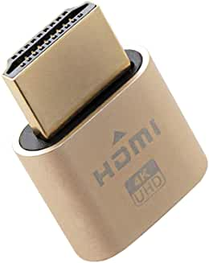

A year ago, to simultaneously browse webpages and write codes on my Arch Linux
installation and use Windows to run tasks infeasible on Linux (such as gaming),
[I tried GPU passthrough on my Lenovo R720 gaming laptop](/en/article/modify-computer/laptop-intel-nvidia-optimus-passthrough.lantian/).
But since that laptop has an Optimus MUXless architecture (as mentioned in that
post), its dedicated GPU doesn't have output ports, and the integrated GPU is in
charge of all the displays. Therefore, severe limitations exist for that setup,
and I eventually gave up on it.

But now, I've purchased a new laptop. The HDMI output port on this laptop is
directly connected to its NVIDIA dedicated graphics card, or in other words, it
has an Optimus MUXed architecture. Since there is a way to make the virtual
machine aware of a "monitor on the dedicated GPU", most functionalities work
normally. I am finally able to create a GPU passthrough setup that works
long-term.

# Changelog

- 2023-05-08: Update some contents for new version of Looking Glass B6.
- 2022-01-26: The PCIe power-saving patch isn't effective.

# Preparation

Before following steps in this post, you need to prepare:

1. A laptop with the Optimus MUXed architecture. My laptop is a HP OMEN
   17t-ck000 (i7-11800H, RTX 3070).

   - (2022-01) My operating system is Arch Linux, with the latest updates.
   - (2023-05) My operating system is now NixOS while writing this update. Most
     of the steps, however, should still apply to other Linux distros.
   - It's recommended to turn off Secure Boot, but you likely did it anyway
     since you installed Linux. Theoretically, Secure Boot may cause limitations
     on the PCIe passthrough functionality.

2. Set up a virtual machine of Windows 10 or Windows 11 with Libvirt
   (Virt-Manager). I'm using Windows 11.

   - My VM boots in UEFI (OVMF) mode, but theoretically, this guide will also
     work with BIOS (SeaBIOS) mode. There are no steps that specifically require
     UEFI boot mode.
   - **You MUST turn off Secure Boot in the VM! Or some drivers won't work!**
     - Windows 11 installer will check whether Secure Boot is enabled. With
       Secure Boot off, the installer might prompt that the computer is
       incompatible, and refuse to install Windows. You can follow the steps in
       this post to fix the problem:
       <https://www.tomshardware.com/how-to/bypass-windows-11-tpm-requirement>
   - Set up the emulated QXL graphics card first, so you get video output from
     the VM.

3. (Optional) Depending on the video output ports on your computer, purchase an
   HDMI, DP, or USB Type-C dummy plug. You can get one for a few bucks on
   Amazon.

   - (2023-05) Or you can choose to install a virtual monitor driver.
   - 

4. (Optional) A USB keyboard and mouse combo.

A reminder before we begin:

- Multiple reboots of the host OS is required, and your host OS may crash! Back
  up your data.
- You don't need to download any NVIDIA driver manually. Windows will do it for
  you automatically.
  - If it doesn't, don't go any further than downloading the driver EXE and
    double-clicking.
  - **Never** specify the exact driver to be used in Device Manager.
  - Debugging will be harder if you do this.

## Purchasing A New Optimus MUXed Laptop

If you are interested in GPU passthrough and are looking for a new laptop, you
can refer to my guidelines.

The prerequisites for laptop GPU passthrough is:

1. The NVIDIA GPU itself must be capable of video output
2. There is at least one video output directly connected to that GPU

However, it's extremely rare for a laptop manufacturer to mention the port
connection schemes on their product pages, so we have to infer from more common
specifications:

1. Prefer a laptop with a MUX switch, aka ones that can switch their internal
   screen onto the dedicated GPU. In this case, the dedicated GPU must be
   capable of video output, and there's a high chance that the manufacturer
   connected the chassis video outputs to the dedicated GPU:

   - Common examples are: 2020 and 2021 Lenovo Legion series, HP OMEN series,
     and Dell G15.
   - **I do not guarantee that this list is accurate!** Do your own research or
     ask a sales agent to make sure.

2. Or choose a laptop with a mid-range to high-end graphics card. For NVIDIA
   GPUs the model number needs to end with 60 or larger.

   - It's common for mid to top-tier NVIDIA GPUs to have video output
     functionality, and the manufacturer is likely to connect chassis video
     ports to them.
   - Do not purchase a laptop with a GPU that ends in 50 or lower, like an RTX
     3050 or GTX 1650 Ti. They very likely don't support video output.

3. Take advantage of unconditional return policies.

   - Since manufacturers won't advertise or won't even care much about their
     video output connections, we have to guess from the specifications and
     advertising pages. Therefore, it's possible that you followed every rule
     above yet got a laptop that doesn't support GPU passthrough. In this case,
     you may consider returning or reselling it.
   - In some countries, laptop manufacturers will only accept an unconditional
     return if the preinstalled Windows and Office are never activated online.
     However, the latest Windows 11 requires you to activate online in its
     first-boot setup wizard. You may consider trying GPU passthrough with a
     Linux installation on your USB drive before activating Windows.

## About Intel GVT-g Virtual GPUs

5th to 9th-Gen Intel integrated graphics support virtualizing the GPU itself, or
in other words, splitting it into several virtual GPUs. The virtual GPUs can be
passed through into VMs so they get GPU acceleration, while the host can still
display stuff on the very same GPU.

However, the GVT-g driver in Linux doesn't support 10th-Gen or newer Intel CPUs,
and
[Intel has no plan to support them](https://github.com/intel/gvt-linux/issues/126).
In addition, the GVT-g virtual GPU cannot form an Optimus configuration with an
NVIDIA GPU, so it isn't useful anyway.

That's why we're ignoring GVT-g and focusing on the NVIDIA GPU in this guide.

## (2023-05) About Intel SR-IOV Virtual GPUs

11th-Gen and later Intel integrated graphics support another form of
virtualization: SR-IOV. Intel has
[officially released the source code to the kernel module with SR-IOV](https://github.com/intel/linux-intel-lts/tree/lts-v5.15.49-adl-linux-220826T092047Z/drivers/gpu/drm/i915),
but it isn't merged into Linux mainline as of now.
[There's a third party project that ports the code into a DKMS module](https://github.com/strongtz/i915-sriov-dkms),
but success rate is not high according to reports in Issues section. I tried it
with my i7-11800H and didn't succeed. Therefore, this time we will not try
SR-IOV on Intel GPUs.

# Steps

## Stop Host OS from Tampering with NVIDIA GPU

> Most of the content is the same as
> [my post in 2021](/en/article/modify-computer/laptop-intel-nvidia-optimus-passthrough.lantian/).

The NVIDIA driver on the Host OS will hold control of the dGPU, and stop VM from
using it. Therefore you need to replace the driver with `vfio-pci`, built solely
for PCIe passthrough.

Here are the steps for disabling the NVIDIA driver and passing control to the
PCIe passthrough module:

1. Run `lspci -nn | grep NVIDIA` and obtain an output similar to:

   ```bash
   0000:01:00.0 VGA compatible controller [0300]: NVIDIA Corporation GA104M [GeForce RTX 3070 Mobile / Max-Q] [10de:249d] (rev a1)
   0000:01:00.1 Audio device [0403]: NVIDIA Corporation GA104 High Definition Audio Controller [10de:228b] (rev a1)
   ```

   Here `[10de:249d]` is the vendor ID and device ID of the dGPU, where `10de`
   means this device is manufactured by NVIDIA, and `249d` means this is a
   RTX 3070. `228b` is the audio output on the HDMI port, which should also be
   taken over by `vfio-pci`.

2. Create `/etc/modprobe.d/lantian.conf` with the following content:

   ```bash
   options vfio-pci ids=10de:249d,10de:228b
   ```

   This configures `vfio-pci`, the kernel module responsible for PCIe
   passthrough, to manage the dGPU. `ids` is the vendor ID and device ID of the
   device to be passed through.

3. Modify `/etc/mkinitcpio.conf`, add the following contents to `MODULES`:

   ```bash
   MODULES=(vfio_pci vfio vfio_iommu_type1 vfio_virqfd)
   ```

   And remove anything related to NVIDIA drivers (such as `nvidia`), or make
   sure they're listed after VFIO drivers. Now PCIe passthrough module will take
   control of the dGPU in the early booting process, preventing NVIDIA drivers
   from taking control.

4. Run `mkinitcpio -P` to update the initramfs.
5. Reboot.

(2023-05) If you're using NixOS, you can use the following config:

```nix
{
  boot.kernelModules = ["vfio-pci"];
  boot.extraModprobeConfig = ''
    # Change to your GPU's vendor ID and device ID
    options vfio-pci ids=10de:249d
  '';

  boot.blacklistedKernelModules = ["nouveau" "nvidiafb" "nvidia" "nvidia-uvm" "nvidia-drm" "nvidia-modeset"];
}
```

## Setting up NVIDIA dGPU Passthrough

In
[my post in 2021](/en/article/modify-computer/laptop-intel-nvidia-optimus-passthrough.lantian/),
I mentioned a lot of configurations to circumvent restrictions of the NVIDIA
driver. But
[since version 465, NVIDIA lifted most of the restrictions](https://nvidia.custhelp.com/app/answers/detail/a_id/5173),
so theoretically, you pass a GPU into the VM, and everything should just work.

But that's just the theory.

I still recommend everyone to follow all the steps and hide the VM
characteristics, because:

1. (2022-01) Not all restructions are lifted for laptops.

   - ~~At least in my tests, an incorrect PCIe bus address for the GPU and the
     absence of a battery still causes passthrough to fail, and the driver will
     error out with the infamous code 43.~~
   - (2023-05) In the attempt today, the PCIe bus address and absence of battery
     no longer affects outcome of GPU passthrough.

2. Even if NVIDIA driver isn't detecting VMs, the programs you run might. Hiding
   VM characteristics increases the chance to run them successfully.

   - Examples include online games with anti-cheat systems, or commercial
     software that require online activation.

And here we start:

1. Unlike the Optimus MUXless architecture, I didn't manually extract the
   graphic card's BIOS nor modify the UEFI firmware, and everything just works.

   - If you cannot install the GPU driver after passing it into the VM,
     including the cases that Windows won't automatically install them, or
     NVIDIA's official installer errors out saying lack of compatible devices,
     you likely will still need to extract your GPU's video BIOS.
   - To double-check, open Device Manager in the VM, and look at the Hardware
     ID, which looks like `PCI\VEN_10DE&DEV_1C8D&SUBSYS_39D117AA&REV_A1`. If
     `SUBSYS` is followed by a sequence of zeros, then the GPU video BIOS is
     missing, and you need the manual steps.
   - Refer to
     [my post last year](/en/article/modify-computer/laptop-intel-nvidia-optimus-passthrough.lantian/),
     specifically the NVIDIA GPU passthrough section, for detailed steps.

2. Modify your VM configuration, `virsh edit Windows`, and make the following
   changes:

   ```xml
   <!-- Modify the features section, so QEMU will hide the fact that this is a VM -->
   <features>
     <acpi/>
     <apic/>
     <hyperv mode="custom">
       <relaxed state="on"/>
       <vapic state="on"/>
       <spinlocks state="on" retries="8191"/>
       <vpindex state="on"/>
       <runtime state="on"/>
       <synic state="on"/>
       <stimer state="on"/>
       <reset state="on"/>
       <vendor_id state="on" value="GenuineIntel"/>
       <frequencies state="on"/>
       <tlbflush state="on"/>
     </hyperv>
     <kvm>
       <hidden state="on"/>
     </kvm>
     <vmport state="off"/>
   </features>
   <!-- Add the PCIe passthrough device, must be below the hostdev for iGPU -->
   <hostdev mode='subsystem' type='pci' managed='yes'>
     <source>
       <address domain='0x0000' bus='0x01' slot='0x00' function='0x0'/>
     </source>
     <rom bar='off'/>
     <!-- The PCIe bus address here MUST BE EXACTLY 01:00.0 -->
     <!-- If there is a PCIe bus address conflict when saving config changes, -->
     <!-- Remove <address> of all other devices -->
     <!-- And Libvirt will reallocate PCIe bus addresses -->
     <address type='pci' domain='0x0000' bus='0x01' slot='0x00' function='0x0' multifunction='on'/>
   </hostdev>
   <!-- Add a shared memory between VM and host -->
   <!-- So VM can transfer its display content to host -->
   <shmem name='looking-glass'>
     <model type='ivshmem-plain'/>
     <!-- Size is calculated as: display resolution width x height / 131072 -->
     <!--                        then round up to power of 2 -->
     <!-- Most HDMI dummy plugs have a resolution of 3840 x 2160 -->
     <!-- The result is 63.28MB which rounds up to 64MB -->
     <size unit='M'>64</size>
   </shmem>
   <!-- Disable memory ballooning, this hurts performance significantly -->
   <memballoon model="none"/>
   <!-- Add these parameters before </qemu:commandline> -->
   <qemu:arg value='-acpitable'/>
   <qemu:arg value='file=/ssdt1.dat'/>
   ```

   The ssdt1.dat is an ACPI table, and it emulates a fully-charged battery. It
   corresponds to the Base64 below. It can be converted to a binary file with
   [Base64 decoding website](https://base64.guru/converter/decode/file) or
   [downloaded from this site](../../../../usr/uploads/202007/ssdt1.dat). Place
   it in the root folder.

   ```bash
   U1NEVKEAAAAB9EJPQ0hTAEJYUENTU0RUAQAAAElOVEwYEBkgoA8AFVwuX1NCX1BDSTAGABBMBi5f
   U0JfUENJMFuCTwVCQVQwCF9ISUQMQdAMCghfVUlEABQJX1NUQQCkCh8UK19CSUYApBIjDQELcBcL
   cBcBC9A5C1gCCywBCjwKPA0ADQANTElPTgANABQSX0JTVACkEgoEAAALcBcL0Dk=
   ```

3. Modify permissions for the shared memory.

   1. Modify `/etc/apparmor.d/local/abstractions/libvirt-qemu` and add this
      line:

      ```bash
      /dev/shm/looking-glass rw,
      ```

      Then execute `sudo systemctl restart apparmor` to restart AppArmor.

   2. Create `/etc/tmpfiles.d/looking-glass.conf` with the following contents,
      replacing `lantian` to your username:

      ```bash
      f /dev/shm/looking-glass 0660 lantian kvm -
      ```

      Then execute
      `sudo systemd-tmpfiles /etc/tmpfiles.d/looking-glass.conf --create` to
      make it effective.

4. Start the VM and wait a while. Windows will automatically install NVIDIA
   drivers.

   - If Device Manager shows the GPU with an exclamation sign and error code 43,
     you need to check if you've missed any steps and if you've configured
     everything correctly.
     - (2022-01) ~~Switch Device Manager to `Device by Connection` and verify
       that the NVIDIA GPU is at Bus 1, Slot 0, Function 0. The parent PCIe port
       to the dGPU should be at Bus 0, Slot 1, Function 0.~~
     - ~~If they don't match, you need to reallocate PCIe addresses with the
       method above.~~
     - (2023-05) This step is no longer needed in my attempt today.
   - If the OS didn't automatically install the NVIDIA driver, and your manually
     downloaded driver installer also shows that the system is incompatible, you
     need to check the properties of the GPU device. Check if there is a
     sequence of zeros after `SUBSYS` in its Hardware ID.
     - If there is, refer to step 1.

5. Turn off the virtual machine and restart it. **This is not just a reboot.**
   Confirm in the device manager that the GPU is working.

   - If you get code 43 this time, check if you have the emulated battery in
     step 2.
   - I tried first on Windows 10 LTSC 2019 and got this error. Since I didn't
     have the emulated battery set up, I cannot confirm if it's an
     incompatibility between the NVIDIA driver and the OS or the lack of
     battery. I recommend using the latest versions of Windows 10 or Windows 11.

6. Do either one of the following steps:

   1. (2022-01) Plug your HDMI dummy plug into your laptop, and the VM should
      detect a new monitor.
   2. (2023-05) Install a virtual monitor driver:
      1. Download the virtual monitor driver from
         [ge9/IddSampleDriver](https://github.com/ge9/IddSampleDriver), and
         decompress it to `C:\IddSampleDriver`. Note that you must not move the
         folder anywhere else!
      2. Open `C:\IddSampleDriver\option.txt`. You'll see the number 1 on the
         first line (don't change it), followed by a list of resolutions and
         refresh rates. Only keep the one resolution and refresh rate entry you
         want, and remove all other items.
      3. Open Device Manager, select "Action - Add Legacy Hardware", click "Let
         me pick from a list... - All Devices - Have disk", choose the file
         `C:\IddSampleDriver\IddSampleDriver.inf`, and complete the
         installation.
      4. Windows should now detect a new monitor.
      5. In my testing, while using the virtual monitor driver, I saw some
         corrupted pixels on the Looking Glass display. As long as you can
         obtain an HDMI dummy plug, I would recommend it over the virtual
         monitor driver.

7. (2023-05) Now the newer version of Looking Glass will install IVSHMEM driver
   automatically (the driver for shared memory between VM and host). You no
   longer need to install it manually. These manual installation steps are kept
   for reference only:

   1. (2022-01) Download this Virtio driver, copy it into the VM, and extract
      it. **You MUST use this copy, as no other copies have the IVSHMEM
      driver!**

      <https://fedorapeople.org/groups/virt/virtio-win/direct-downloads/upstream-virtio/virtio-win10-prewhql-0.1-161.zip>

   2. Open Device Manager in the VM, and find
      `System devices - PCI standard RAM controller`:
      1. Right-click and select "Update driver"
      2. Click "Browse my computer for drivers"
      3. Click "Let me pick from a list of device drivers on my computer"
      4. Click "Have disk" button
      5. Navigate to `Virtio Drivers/Win10/amd64/ivshmem.inf` file
      6. Click next to install the driver. The device's name should change to
         `IVSHMEM`

8. Install [Looking Glass](https://looking-glass.io/downloads), a tool to
   transfer the display output from the VM to the host.

   - Our dummy plug is going to be the only monitor the VM can see. If we don't
     install looking glass, we won't be able to see the VM desktop.
   - Click "Windows Host Binary" on the link above, double click in the VM to
     install it.

9. (2023-05) If you followed the steps from 2022-01, you won't be able to see
   the startup screen while the VM is booting, and before Looking Glass starts.
   Therefore, I recommend disabling the QXL virtual adapter in Device Manager.
   The following older steps are kept for reference purpose only.

   - (2022-01) Turn off the VM and run `virsh edit Windows` to edit the VM
     config.

     Find `<video><model type="qxl" ...></video>`, change `type` to `none` to
     disable the QXL emulated GPU:

     ```xml
     <video>
       <model type="none"/>
     </video>
     ```

10. Install Looking Glass client on the host. Arch Linux users can simply
    install `looking-glass` from AUR. Run `looking-glass-client` to start the
    client.
11. Back to Virt-Manager, close the window of the VM (the window that shows the
    VM desktop and changes VM configurations), right-click on the VM on
    Virt-Manager's main window, and select Run.
12. In a moment, you should see the VM's display on Looking Glass client. Now
    the GPU passthrough setup is complete.

# Performance and Experience Optimizations

Although GPU passthrough is done, there is still room for user experience
optimization. Particularly:

1. (2022-01) ~~Looking Glass can relay keyboard and mouse events, but not audio,
   so we can't hear the VM;~~
   - (2023-05) The latest Looking Glass can relay audio now.
2. (2022-01) ~~Looking Glass may miss a few keystrokes from time to time;~~
   - (2023-05) The latest Looking Glass can relay keyboard and mouse events
     reliably now.
3. There is a host kernel module for IVSHMEM, which improves Looking Glass
   performance with its DMA mode;
4. After VM shutdown, the GPU is set to PCIe D3hot mode. It still consumes
   around 10 watts of power, which is undesirable for battery life.

We will fix the problems one by one.

## Get Audio Output from VM

(2023-05) The latest Looking Glass can relay audio now. These steps are kept for
reference only.

 sound_hide|Hide sound_show|Show older steps from
2022-01 



While Virt-Manager can connect to the VM with SPICE protocol to get the VM's
sound output, Looking Glass also relays keyboard and mouse events through SPICE.
Since the VM only accepts one simultaneous SPICE connection, we cannot get the
audio output with Virt-Manager.

We can install [Scream](https://github.com/duncanthrax/scream), a virtual sound
card software in Windows, to transfer audio output over the network. A Scream
client can be run on the host to receive the audio signal.

Download the Scream installer from
[its download page](https://github.com/duncanthrax/scream/releases) on the VM,
extract it, run `Install-x64.bat` as administrator to install the driver, and
reboot.

Install the Scream client on the host. Arch Linux users can install the `scream`
package from AUR.

Open a terminal on the host and run `scream -v`. Test by playing some sound in
the VM. If you can't hear anything, try specifying the network interface to the
VM, like `scream -i virbr0 -v`, where `virbr0` is the default NAT network for
Virt-Manager, and the network interface between the VM and the host.

Finally, you can create a SystemD service to run the Scream client conveniently
later. Create `~/.config/systemd/user/scream.service` with the following
content:

```bash
[Unit]
Description=Scream

[Service]
Type=simple
Restart=always
RestartSec=1
ExecStart=/usr/bin/scream -i virbr0 -v

[Install]
WantedBy=graphical-session.target
```

You will only need to run `systemctl --user start scream` in the future.



## Passthrough Keyboard & Mouse Operations

The latest Looking Glass can relay keyboard and mouse events reliably now. These
steps are kept for reference only.

 keyboardmouse_hide|Hide keyboardmouse_show|Show older
steps from 2022-01 



The relay of the keyboard and mouse in Looking Glass isn't very stable, as
misses of operation can happen from time to time. Therefore, if you want to play
some games in the VM, you need a more reliable way to pass your keyboard and
mouse into the VM.

We have two options: letting Libvirt capture the keyboard and mouse events or
simply pass your keyboard and mouse into the VM.

1. Capturing Keyboard and Mouse Events.

   On Linux, all keyboard and mouse operations are passed to the desktop
   environment via the `evdev` (or `Event Device`) framework. Libvirt can
   capture your operations and pass them to the VM. In addition, Libvirt can
   switch the control between the host and the VM whenever you press Left Ctrl
   and the Right Ctrl, so you can operate on both the host and the VM with one
   keyboard-mouse combo.

   First run `ls -l /dev/input/by-path` on the host to see your present `evdev`
   devices. I have these ones for example:

   ```bash
   pci-0000:00:14.0-usb-0:1:1.1-event-mouse               # USB mouse
   pci-0000:00:14.0-usb-0:1:1.1-mouse
   pci-0000:00:14.0-usb-0:6:1.0-event
   pci-0000:00:15.0-platform-i2c_designware.0-event-mouse # Builtin Touchpad
   pci-0000:00:15.0-platform-i2c_designware.0-mouse
   pci-0000:00:1f.3-platform-skl_hda_dsp_generic-event
   platform-i8042-serio-0-event-kbd                       # Builtin Keyboard
   platform-pcspkr-event-spkr
   ```

   Those with `event-mouse` are mouses, and the `event-kbd` ones are keyboards.

   Then, run `virsh edit Windows` to edit the VM config. Add these into the
   `<devices>` section:

   ```xml
   <input type="evdev">
     <!-- Change the mouse or keyboard path based on your ls result -->
     <source dev="/dev/input/by-path/platform-i8042-serio-0-event-kbd" grab="all" repeat="on"/>
   </input>
   <!-- Repeat if you have many mouses or keyboards -->
   <input type="evdev">
     <source dev="/dev/input/by-path/pci-0000:00:15.0-platform-i2c_designware.0-event-mouse" grab="all" repeat="on"/>
   </input>
   ```

   Start the VM, and you should notice that your keyboard and mouse aren't
   working on the host. They're captured by the VM. Press Left Ctrl + Right Ctrl
   to return control to the host. Press again to control the VM.

   Now we can disable the keyboard and mouse relay of Looking Glass. Create
   `/etc/looking-glass-client.ini` with the following content:

   ```ini
   [spice]
   enable=no
   ```

2. USB Keyboard and Mouse Passthrough

   Capturing keyboard and mouse operations doesn't always work. For example, my
   touchpad cannot be captured properly, as I can't move the cursor in the VM.

   If you also encountered the issue and you have a USB keyboard and mouse
   combo, you can pass them into the VM and use them specifically for it. USB
   passthrough to VM is a mature technology, so the chance of running into
   problems is very low.

   Simply click `Add Hardware - USB Host Device` in Virt-Manager and select your
   keyboard and mouse.



## Accelerating Looking Glass with Kernel Modules

> Most of the content in this section is from
> <https://looking-glass.io/docs/B6/module/>

Looking Glass provides a kernel module for the IVSHMEM shared memory device. It
allows Looking Glass to read the display output efficiently with DMA to improve
the framerate.

1. Install Linux kernel header files and DKMS, or the packages of
   `linux-headers` and `dkms` on Arch Linux.

2. Install `looking-glass-module-dkms` from AUR.

3. Set up an Udev rule: create `/etc/udev/rules.d/99-kvmfr.rules` with the
   following content:

   ```bash
   SUBSYSTEM=="kvmfr", OWNER="lantian", GROUP="kvm", MODE="0660"
   ```

   Replace `lantian` with your own username.

4. Configure the memory size: create `/etc/modprobe.d/looking-glass.conf` with
   the following content:

   ```bash
   # The memory size is calculates in the same way as VM's shmem.
   options kvmfr static_size_mb=64
   ```

5. Load the module automatically on boot: create
   `/etc/modules-load.d/looking-glass.conf` with a single line of `kvmfr`.

6. Run `sudo modprobe kvmfr` to load the module. Now a `kvmfr0` device should
   appear under `/dev`, and this is the memory device for Looking Glass.

7. Edit `/etc/apparmor.d/local/abstractions/libvirt-qemu` and add this line:

   ```bash
   /dev/kvmfr0 rw,
   ```

   It allows the VM to access the device. Run `sudo systemctl restart apparmor`
   to restart AppArmor.

8. Run `virsh edit Windows` to change the VM's configuration：

   1. Delete `<shmem>` section from `<devices>`:

      ```xml
      <shmem name='looking-glass'>
        <model type='ivshmem-plain'/>
        <size unit='M'>64</size>
      </shmem>
      ```

   2. Add these lines under `<qemu:commandline>`:

      ```xml
      <qemu:arg value="-device"/>
      <qemu:arg value="{&quot;driver&quot;:&quot;ivshmem-plain&quot;,&quot;id&quot;:&quot;shmem-looking-glass&quot;,&quot;memdev&quot;:&quot;looking-glass&quot;}"/>
      <qemu:arg value="-object"/>
      <!-- There is a number 67108864 in the next line, which is 64MB * 1048576 -->
      <!-- Change accordingly if you've set a different memory size -->
      <qemu:arg value="{&quot;qom-type&quot;:&quot;memory-backend-file&quot;,&quot;id&quot;:&quot;looking-glass&quot;,&quot;mem-path&quot;:&quot;/dev/kvmfr0&quot;,&quot;size&quot;:67108864,&quot;share&quot;:true}"/>
      ```

   3. Start the VM.

9. Change `/etc/looking-glass-client.ini` and add the following content:

   ```ini
   [app]
   shmFile=/dev/kvmfr0
   ```

10. Start Looking Glass. You should see the VM display now.

11. (2023-05) If you use NixOS, you can directly use the config below:

```nix
{
  boot.extraModulePackages = with config.boot.kernelPackages; [
    kvmfr
  ];
  boot.extraModprobeConfig = ''
    # The memory size is calculates in the same way as VM's shmem.
    options kvmfr static_size_mb=64
  '';
  boot.kernelModules = ["kvmfr"];
  services.udev.extraRules = ''
    SUBSYSTEM=="kvmfr", OWNER="root", GROUP="libvirtd", MODE="0660"
  '';

  environment.etc."looking-glass-client.ini".text = ''
    [app]
    shmFile=/dev/kvmfr0
  '';
}
```

## Cutting Power to GPU When Unused

**2022-01-26 Update: testing shows that the NVIDIA GPU still isn't completely
shut down after applying the patch. The power draw is the same as before. This
section is now invalid.**

 power_hide|Invalid contents are hidden power_show|Show




> This section only applies to 20-series of NVIDIA GPUs or newer. They can shut
> themselves down with the NVIDIA official drivers. The 10-series or older GPUs
> don't support this feature.
>
> This section involves compiling a kernel yourself, and **using an patch
> without extensive inspection or testing**. Not intended for novice users.
> Evaluate the risks yourself.

When you aren't using the VM, the `vfio-pci` driver in charge of PCIe
passthrough sets the device to the `D3` mode, aka the power saving mode of PCIe
devices. But there are two types of `D3` modes: `D3hot`, where the device is
still powered, and `D3cold`, where the device is shut off completely. Currently,
the `vfio-pci` driver in the kernel only supports `D3hot`, and the NVIDIA GPU
will still consume around 10 watts of power since its chip power isn't cut. This
impacts the battery life of laptops.

An NVIDIA engineer posted a patchset for `vfio-pci`'s `D3cold` support on the
Linux kernel mailing list. With this patchset, the NVIDIA GPU will be shut down
completely when the VM is off. It saves power for your battery.

The patchset can be found at
<https://lore.kernel.org/lkml/20211115133640.2231-1-abhsahu@nvidia.com/T/>,
which consists of three patches. I combined the three patches and uploaded the
result to
<https://github.com/xddxdd/pkgbuild/blob/master/linux-xanmod-lantian/0007-vfio-pci-d3cold.patch>.

Patching kernel is relatively simple for Arch Linux. Most kernel PKGBUILDs in
AUR can apply patches automatically. All you have to do is to download the
PKGBUILD for a kernel and add the patch to its `source` section. See my commit
for an example:
<https://github.com/xddxdd/pkgbuild/commit/406adb7bf5657cfe07bb17ff561d11ed97ebab39>.

**DO NOTE that this patch doesn't guarantee stability.**

Based on mailing list discussions:

1. It's an RFC patch, aka a testing patch. There is a big `[RFC]` on the title
   of the e-mails.
2. If the GPU driver in the VM ever attempts to switch the GPU to `D3cold` mode,
   with this patch, there are risks of resetting the GPU, losing all states, and
   crashing the VM. Although I have never encountered such problems in my
   experience, you should be aware of the possible outcomes.
3. The developer only tested some GPUs from NVIDIA. It does not guarantee
   support for other PCIe devices.

**Use this at your own risk.** 

## References

Huge thanks to previous explorers on the topic of GPU passthrough. Without their
efforts, this post won't have existed in the first place.

Here are the sources I referenced when I did my configuration:

- NVIDIA dGPU passthrough
  - GitHub Misairu-G's NVIDIA Optimus MUXed passthrough guide
    [https://gist.github.com/Misairu-G/616f7b2756c488148b7309addc940b28](https://gist.github.com/Misairu-G/616f7b2756c488148b7309addc940b28)
  - Reddit r/VFIO's emulated battery patch
    [https://www.reddit.com/r/VFIO/comments/ebo2uk/nvidia_geforce_rtx_2060_mobile_success_qemu_ovmf/](https://www.reddit.com/r/VFIO/comments/ebo2uk/nvidia_geforce_rtx_2060_mobile_success_qemu_ovmf/)
  - Arch Linux Wiki <https://wiki.archlinux.org/title/PCI_passthrough_via_OVMF>
- Looking Glass Documentation
  - Installation Docs <https://looking-glass.io/docs/B6/install/>
  - Kernel Module Docs <https://looking-glass.io/docs/B6/module/>
- Virtual Monitor Driver
  - The one used in this post, with ability to customize resolution and refresh
    rate <https://github.com/ge9/IddSampleDriver>
  - The original version with fixed list of resolution and refresh rate
    <https://github.com/roshkins/IddSampleDriver>
- VFIO D3cold Patch
  - News report from Phoronix
    <https://www.phoronix.com/scan.php?page=news_item&px=NVIDIA-Runtime-PM-VFIO-PCI>
  - Link to Linux kernel mailing list
    <https://lore.kernel.org/lkml/20211115133640.2231-1-abhsahu@nvidia.com/T/>

## Appendix: Final Libvirt XML File

 xml_hide|Hide xml_show|Show the entire XML file




```xml
<domain xmlns:qemu="http://libvirt.org/schemas/domain/qemu/1.0" type="kvm">
  <name>Windows11</name>
  <uuid>5d5b00d8-475a-4b6c-8053-9dda30cd2f95</uuid>
  <metadata>
    <libosinfo:libosinfo xmlns:libosinfo="http://libosinfo.org/xmlns/libvirt/domain/1.0">
      <libosinfo:os id="http://microsoft.com/win/11"/>
    </libosinfo:libosinfo>
  </metadata>
  <memory unit="KiB">16777216</memory>
  <currentMemory unit="KiB">16777216</currentMemory>
  <vcpu placement="static">16</vcpu>
  <os>
    <type arch="x86_64" machine="pc-q35-8.0">hvm</type>
    <loader readonly="yes" type="pflash">/run/libvirt/nix-ovmf/OVMF_CODE.fd</loader>
    <nvram template="/run/libvirt/nix-ovmf/OVMF_VARS.fd">/var/lib/libvirt/qemu/nvram/Windows11_VARS.fd</nvram>
  </os>
  <features>
    <acpi/>
    <apic/>
    <hyperv mode="custom">
      <relaxed state="on"/>
      <vapic state="on"/>
      <spinlocks state="on" retries="8191"/>
      <vpindex state="on"/>
      <runtime state="on"/>
      <synic state="on"/>
      <stimer state="on"/>
      <reset state="on"/>
      <vendor_id state="on" value="GenuineIntel"/>
      <frequencies state="on"/>
      <tlbflush state="on"/>
    </hyperv>
    <kvm>
      <hidden state="on"/>
    </kvm>
    <vmport state="off"/>
  </features>
  <cpu mode="host-passthrough" check="none" migratable="on">
    <topology sockets="1" dies="1" cores="8" threads="2"/>
  </cpu>
  <clock offset="localtime">
    <timer name="rtc" tickpolicy="catchup"/>
    <timer name="pit" tickpolicy="delay"/>
    <timer name="hpet" present="no"/>
    <timer name="hypervclock" present="yes"/>
  </clock>
  <on_poweroff>destroy</on_poweroff>
  <on_reboot>restart</on_reboot>
  <on_crash>destroy</on_crash>
  <pm>
    <suspend-to-mem enabled="no"/>
    <suspend-to-disk enabled="no"/>
  </pm>
  <devices>
    <emulator>/run/libvirt/nix-emulators/qemu-system-x86_64</emulator>
    <disk type="file" device="disk">
      <driver name="qemu" type="qcow2" discard="unmap"/>
      <source file="/var/lib/libvirt/images/Windows11.qcow2"/>
      <target dev="vda" bus="virtio"/>
      <boot order="1"/>
      <address type="pci" domain="0x0000" bus="0x04" slot="0x00" function="0x0"/>
    </disk>
    <disk type="file" device="cdrom">
      <driver name="qemu" type="raw"/>
      <source file="/mnt/root/persistent/media/LegacyOS/Common/virtio-win-0.1.215.iso"/>
      <target dev="sdb" bus="sata"/>
      <readonly/>
      <address type="drive" controller="0" bus="0" target="0" unit="1"/>
    </disk>
    <controller type="usb" index="0" model="qemu-xhci" ports="15">
      <address type="pci" domain="0x0000" bus="0x02" slot="0x00" function="0x0"/>
    </controller>
    <controller type="pci" index="0" model="pcie-root"/>
    <controller type="pci" index="1" model="pcie-root-port">
      <model name="pcie-root-port"/>
      <target chassis="1" port="0x10"/>
      <address type="pci" domain="0x0000" bus="0x00" slot="0x02" function="0x0" multifunction="on"/>
    </controller>
    <controller type="pci" index="2" model="pcie-root-port">
      <model name="pcie-root-port"/>
      <target chassis="2" port="0x11"/>
      <address type="pci" domain="0x0000" bus="0x00" slot="0x02" function="0x1"/>
    </controller>
    <controller type="pci" index="3" model="pcie-root-port">
      <model name="pcie-root-port"/>
      <target chassis="3" port="0x12"/>
      <address type="pci" domain="0x0000" bus="0x00" slot="0x02" function="0x2"/>
    </controller>
    <controller type="pci" index="4" model="pcie-root-port">
      <model name="pcie-root-port"/>
      <target chassis="4" port="0x13"/>
      <address type="pci" domain="0x0000" bus="0x00" slot="0x02" function="0x3"/>
    </controller>
    <controller type="pci" index="5" model="pcie-root-port">
      <model name="pcie-root-port"/>
      <target chassis="5" port="0x14"/>
      <address type="pci" domain="0x0000" bus="0x00" slot="0x02" function="0x4"/>
    </controller>
    <controller type="pci" index="6" model="pcie-root-port">
      <model name="pcie-root-port"/>
      <target chassis="6" port="0x15"/>
      <address type="pci" domain="0x0000" bus="0x00" slot="0x02" function="0x5"/>
    </controller>
    <controller type="pci" index="7" model="pcie-root-port">
      <model name="pcie-root-port"/>
      <target chassis="7" port="0x16"/>
      <address type="pci" domain="0x0000" bus="0x00" slot="0x02" function="0x6"/>
    </controller>
    <controller type="pci" index="8" model="pcie-root-port">
      <model name="pcie-root-port"/>
      <target chassis="8" port="0x17"/>
      <address type="pci" domain="0x0000" bus="0x00" slot="0x02" function="0x7"/>
    </controller>
    <controller type="pci" index="9" model="pcie-root-port">
      <model name="pcie-root-port"/>
      <target chassis="9" port="0x18"/>
      <address type="pci" domain="0x0000" bus="0x00" slot="0x03" function="0x0" multifunction="on"/>
    </controller>
    <controller type="pci" index="10" model="pcie-root-port">
      <model name="pcie-root-port"/>
      <target chassis="10" port="0x19"/>
      <address type="pci" domain="0x0000" bus="0x00" slot="0x03" function="0x1"/>
    </controller>
    <controller type="pci" index="11" model="pcie-root-port">
      <model name="pcie-root-port"/>
      <target chassis="11" port="0x1a"/>
      <address type="pci" domain="0x0000" bus="0x00" slot="0x03" function="0x2"/>
    </controller>
    <controller type="pci" index="12" model="pcie-root-port">
      <model name="pcie-root-port"/>
      <target chassis="12" port="0x1b"/>
      <address type="pci" domain="0x0000" bus="0x00" slot="0x03" function="0x3"/>
    </controller>
    <controller type="pci" index="13" model="pcie-root-port">
      <model name="pcie-root-port"/>
      <target chassis="13" port="0x1c"/>
      <address type="pci" domain="0x0000" bus="0x00" slot="0x03" function="0x4"/>
    </controller>
    <controller type="pci" index="14" model="pcie-root-port">
      <model name="pcie-root-port"/>
      <target chassis="14" port="0x1d"/>
      <address type="pci" domain="0x0000" bus="0x00" slot="0x03" function="0x5"/>
    </controller>
    <controller type="sata" index="0">
      <address type="pci" domain="0x0000" bus="0x00" slot="0x1f" function="0x2"/>
    </controller>
    <controller type="virtio-serial" index="0">
      <address type="pci" domain="0x0000" bus="0x03" slot="0x00" function="0x0"/>
    </controller>
    <interface type="network">
      <mac address="52:54:00:f4:bf:15"/>
      <source network="default"/>
      <model type="virtio"/>
      <address type="pci" domain="0x0000" bus="0x01" slot="0x00" function="0x0"/>
    </interface>
    <serial type="pty">
      <target type="isa-serial" port="0">
        <model name="isa-serial"/>
      </target>
    </serial>
    <console type="pty">
      <target type="serial" port="0"/>
    </console>
    <channel type="spicevmc">
      <target type="virtio" name="com.redhat.spice.0"/>
      <address type="virtio-serial" controller="0" bus="0" port="1"/>
    </channel>
    <input type="mouse" bus="ps2"/>
    <input type="mouse" bus="virtio">
      <address type="pci" domain="0x0000" bus="0x06" slot="0x00" function="0x0"/>
    </input>
    <input type="keyboard" bus="ps2"/>
    <input type="keyboard" bus="virtio">
      <address type="pci" domain="0x0000" bus="0x07" slot="0x00" function="0x0"/>
    </input>
    <tpm model="tpm-crb">
      <backend type="passthrough">
        <device path="/dev/tpm0"/>
      </backend>
    </tpm>
    <graphics type="spice" autoport="yes">
      <listen type="address"/>
      <image compression="off"/>
    </graphics>
    <sound model="ich9">
      <audio id="1"/>
      <address type="pci" domain="0x0000" bus="0x00" slot="0x1b" function="0x0"/>
    </sound>
    <audio id="1" type="spice"/>
    <video>
      <model type="qxl" ram="65536" vram="65536" vgamem="16384" heads="1" primary="yes"/>
      <address type="pci" domain="0x0000" bus="0x00" slot="0x01" function="0x0"/>
    </video>
    <hostdev mode="subsystem" type="pci" managed="yes">
      <source>
        <address domain="0x0000" bus="0x01" slot="0x00" function="0x0"/>
      </source>
      <address type="pci" domain="0x0000" bus="0x05" slot="0x00" function="0x0"/>
    </hostdev>
    <redirdev bus="usb" type="spicevmc">
      <address type="usb" bus="0" port="2"/>
    </redirdev>
    <redirdev bus="usb" type="spicevmc">
      <address type="usb" bus="0" port="3"/>
    </redirdev>
    <watchdog model="itco" action="reset"/>
    <memballoon model="none"/>
  </devices>
  <qemu:commandline>
    <qemu:arg value="-device"/>
    <qemu:arg value="{&quot;driver&quot;:&quot;ivshmem-plain&quot;,&quot;id&quot;:&quot;shmem0&quot;,&quot;memdev&quot;:&quot;looking-glass&quot;}"/>
    <qemu:arg value="-object"/>
    <qemu:arg value="{&quot;qom-type&quot;:&quot;memory-backend-file&quot;,&quot;id&quot;:&quot;looking-glass&quot;,&quot;mem-path&quot;:&quot;/dev/kvmfr0&quot;,&quot;size&quot;:67108864,&quot;share&quot;:true}"/>
    <qemu:arg value="-acpitable"/>
    <qemu:arg value="file=/etc/ssdt1.dat"/>
  </qemu:commandline>
</domain>
```


