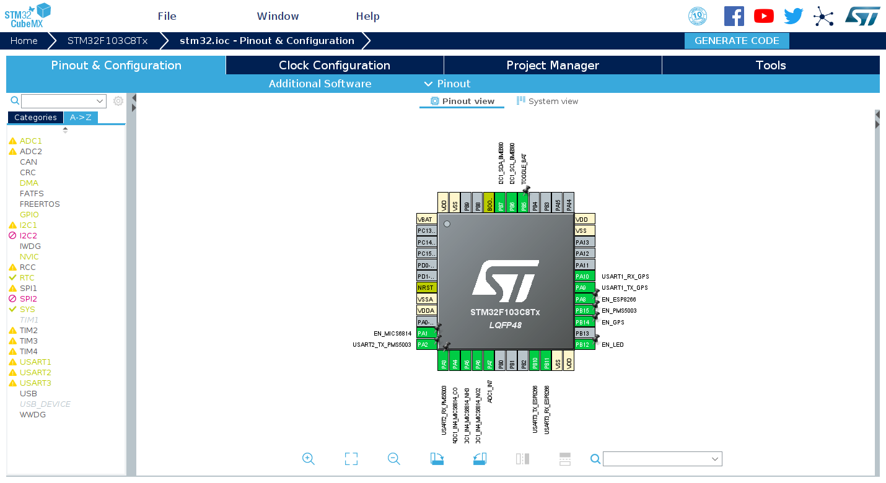
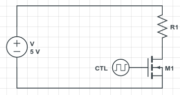
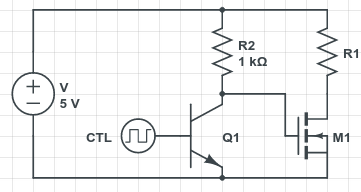
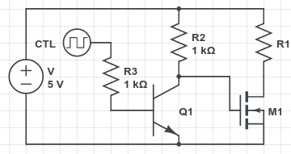

Welcome to my third development log. In the two previous logs, I discussed the
pitfalls I met in the
[RoboMaster competition](/en/article/modify-computer/robomaster-bugs-in-development.lantian)
and
[FPGA course final project](/en/article/modify-computer/cyclone-iv-fpga-development-bugs-resolve.lantian).

This time I will be talking about my graduate design project, an air quality
sensor network built by a 3-person group. The whole project is structured as
follow:

- Obtain data from installed sensor modules and upload them to InfluxDB running
  on a server
  - Sensors we used:
    1. MiCS6814, measures NO2, CO, and NH3
       - Analog output
    2. BME680, measures temperature, humidity, atmospheric pressure, and TVOC
       - I2C interface
    3. PMS5003, measures particle matters
       - UART serial output
  - Extra modules:
    1. ATGM336H, global positioning module with GPS+BeiDou support
       - UART serial output
    2. ESP8266, a widely used Wi-Fi module
       - UART serial output
    3. MH-CD42, power & battery management module
       - Purely power output, no control signal
- Need to consume little energy, enough to run for around a week with the
  battery power
  - And battery life and voltage needs to be monitored
- Waterproof in rain conditions (to some extent)
- Display data and short predictions on a web page
  - Professor already has a weather station device that measures wind conditions

This post is a record of pitfalls we've met during the development.

# Choosing Appropriate MCU

## Why Not Arduino

In the beginning, I simply got myself a random Arduino Nano from my pile of
electronic modules, but soon I found problems:

1. Arduino Nano has only one hardware serial port, but 3 serial ports are needed
   to talk to all of the above modules.
   - Yes, I know SoftwareSerial (a software emulated serial port), but it is
     quite unstable in testing, especially in the (relatively) high-speed
     communication with ESP8266 at 115200 baud rate, where signals are
     frequently garbled.
2. Arduino Nano's clock frequency is fixed at 16 MHz. We know we can adjust it,
   but it's too much of a hassle.
   - We don't need that much performance and would rather reduce the frequency
     to save some battery juice.
3. ~~The Arduino IDE is horrible.~~

So I bought an STM32 development board from Taobao with the following specs:

- STM32F103C8T6 chip
  - 64 KB ROM, 20 KB RAM
    - ROM is a bit too small
  - 3 hardware UART serial ports, just enough
  - 2 I2Cs
    - But since one I2C can talk to multiple peripherals with different IDs, one
      is enough
  - Up to 72 MHz clock frequency, freely adjustable
    - Since we don't run astronomic calculations on the MCU, we clocked it as
      low as 4 MHz
  - 1 RTC that allows timed sleep and wakeup
  - A lot of ADC (Analog-Digital Converter)
    - Can also measure input voltage and MCU chip temperature
  - 1 CAN, 2 SPI, etc. Stuff we don't need
- External 8 MHz crystal oscillator and 32.768KHz crystal oscillator
  - STM32 does have integrated oscillators, but guides online show that they may
    be affected by chip temperature and provide imprecise output, so external
    oscillators are definitely helpful
- For just CNY 10
  - ~~Pay less to get better performance~~
  - In fact, the performance to cost ratio of Arduino is not high, but its
    ecosystem is awesome

Speaking of STM32 development, a lot of people may have the first impression
that it involves direct register manipulations, and you need to spend a lot of
time reading documentation, such as datasheets. But STMicroelectronics has
released some STM32CubeMX software years ago, which allows visualized
configuration of on-chip components, one-key code template generation, and a
fully-featured set of library functions that hide register operations. Thanks to
this, STM32 development is not much more difficult than Arduino.



## When We Don't Have Enough ROM

But in the later stage of the project, we found that the 64 KB ROM of
STM32F103C8T6 is no longer enough for us. The ROM space is mainly occupied by
the following parts:

- BME680's closed source BSEC library
  - BSEC is the only source of BME680's TVOC reading. The sensor only provides a
    resistor value, and there is no simple formula to convert resistor value to
    actual TVOC readings.
- Floating-point logic of `printf` and `scanf`
  - InfluxDB, what we use, accepts only ASCII-formatted upload data, so the IEEE
    754 floating-point readings from sensors must be converted to ASCII text.
  - For the same reason, the latitude and longitude information must be
    extracted from the GPS module's NMEA0183 statements and converted to IEEE
    754 floating-point numbers.
- STM32's library functions
  - Those responsible for register operations.

Therefore we tried to shrink the code size in these places:

- For BME680, while we cannot modify the closed source library itself, we
  greatly reduced the size of the logic that calls the library.
- For GPS, instead of conversion to/from floating-point numbers, we chose to
  simply copy the latitude/longitude text from NMEA0183 statements.
  - A NMEA0183 statement that involves latitude and longitude is formatted as
    follow:
    - `$GNGGA,hhmmss.ss,llll.ll,a,yyyyy.yy,a,x,xx,x.x,x.x,M,x.x,M,x.x,xxxx*hh`
    - `$GNGGA,074023.000,1234.56789,N,12345.67891,E,1,13,0.9,32.3,M,0.0,M,,*46`
  - Separated by comma, each field represents (from left to right):
    - `$GNGGA` means that this statement contains latitude and longitude
      information
    - 2nd column is the current time
      - The time above is AM 07:40:23, in UTC timezone
    - 3rd column is latitude, in format `degree * 100 + minute`
      - The latitude above is 12 degrees, 34.56789 minutes
    - 4th column represents north/south of the equator
      - The number in the third column is always positive, no matter north/south
        of the equator
    - 5th column is longitude, still in format `degree * 100 + minute`
      - The longitude above is 123 degrees, 45.67891 minutes
    - 6th column is east/west of the prime meridian
      - The number in the fifth column is also always positive, no matter
        east/west of the prime meridian
    - We don't care about the rest information
  - Here is our logic:
    - Copy the third column to the latitude character array, **starting from the
      second character of the array**
    - If the 4th column is N (north of the equator), set the first character of
      the array to `0`
      - Result has format 01234.56789, can be recognized by InfluxDB
    - If the 4th column is S (south of the equator), set the first character of
      the array to `-` (minus sign)
      - Result has format -1234.56789, can also be recognized by InfluxDB
    - Do the same to longitude data in columns 5 and 6
    - For conversion from `degree * 100 + minute` to more commonly used
      `degree`, we choose to do it on the more powerful server
- For STM32 library functions, we can switch to LL library for the parts we
  don't need to directly operate on (ex. frequency setup done automatically by
  STM32CubeMX)
  - STM32 provide 2 different sets of library functions for each component, HAL
    and LL
    - HAL is more abstracted and easier to use but takes more space
    - LL is closer to register manipulations, small yet difficult to use
  - In `Project Manager - Advanced Settings`, switching RCC (frequency setup) to
    LL saves a few kilobytes
- For standard library functions, if multiple functions are doing similar
  things, try to use only one of them
  - Ex. if you use `printf` and `sprintf` together, you may replace `printf`
    with a combination of `sprintf` and `HAL_UART_Transmit`; saves quite some
    space
- Remember to turn on compiler optimizations and disable debugging
  - Set `DEBUG = 0` and `OPT = -Os` in Makefile
  - By the way, for STM32's `printf` to support floating-point numbers, you need
    to add `-u _printf_float` in `LDFLAGS` in Makefile to enable that support

# Logging on to School Wi-Fi

## Sensors Need to Connect to School Wi-Fi

My school provides 2 Wi-Fi networks:

1. One is an open network (no password), and a login page with HTTPS encryption
   will pop up after connecting to it, where you enter your username and
   password to log in.
2. The other is eduroam that authenticates with WPA2 enterprise mode.

After research on the capabilities of ESP8266 Wi-Fi module, I concluded that:

1. ESP8266 comes with an AT firmware by default, where we connect to Wi-Fi
   networks via serial port commands.
   - In this case, it only supports open networks and WPA2 personal networks,
     but not eduroam, which uses WPA2 enterprise.
   - But there is no room left in STM32 for HTTPS encryption libraries, which
     means we cannot submit credentials to log in.
2. ESP8266 can be reprogrammed with custom code.
   - But finding the official SDK of ESP8266 along with documentation is a bit
     hard.
   - Although ESP8266 supports the Arduino platform, it still doesn't include an
     SSL encryption library.
   - In addition, ESP8266 only supports PAP-encrypted WPA2 enterprise networks,
     while my school uses MSCHAPv2.

The solution is kind of a cheat: I went through the code on my Raspberry Pi and
found a login script to the school network. Back when I wrote that script, the
login page wasn't using HTTPS, and what I was sending was a plain HTTP request.
I tested it and found out surprisingly that it still works!

The final solution is: STM32 instructs ESP8266 to connect to that open network
via AT commands, and also sends HTTP request via AT commands to simulate a login
attempt. In this case, one less program needs to be coded.

> Can't you set up a Wi-Fi access point with a router?
>
> Well, you can't put a router around every sensor, can you?

## Weather Station Needs to Connect to School Wi-Fi

Professor's weather station device also needs to connect to school Wi-Fi, so it
can upload data to its cloud service. Unlike our ESP8266, we cannot modify its
program, which means we cannot ask it to send another HTTP request to log on to
the network.

The solution is to use a computer to spoof the MAC address of the weather
station, log on to the school network, and then disconnect. The device will not
be kicked out from logged-on status during short disconnections, and when the
weather station is powered on at this time, it will be able to connect to the
Internet without logging on itself.

Another problem is that the school Wi-Fi restricts to 4 devices per user
account, and previously connected devices will be kicked out when that number is
exceeded. Our sensor network consists of 10 devices; although they can log on
again when they are kicked out, the weather station cannot do so.

The solution is again simple: since we're a 3-person group, we connected the
weather station with another student's account.

# Obtaining Sensor Data

## BME680

In our program, BME680 is solely controlled by its closed source BSEC library.
However, BSEC only supports measurements every 30 seconds or 300 seconds; if
that interval is incorrect, BSEC will neither perform measurements nor return
valid data.

But since BSEC relies on us to provide timing and communication functions, we
made a dangerous move: decoupling the BSEC timing from the actual system time.
Specifically, when we run BSEC every 15 minutes, instead of telling it 15
minutes has passed, we tell it that only 300 seconds has passed, or it's exactly
the time for the next measurement, to force BSEC to do its job.

## PMS5003

PMS5003 is quite simple to use. Simply pull the enable signal high to turn on
its fan - wait 30 seconds - and read data from the serial port.

PMS5003 sends 32 bytes of data each time, with a fixed packet header and a
checksum of the whole packet. To avoid reading only half of a packet, thanks to
the characteristic of PMS5003 sending data every second, we did the following:

1. First, try to read 32 bytes from the serial port within 100 ms. If it
   succeeds, it means the PMS5003 happens to be sending data right now.
2. If the data read the first time is not full 32 bytes, try to read again, but
   with a time limit of 2 seconds. We are effectively waiting for PMS5003 to
   send its next packet of data.
3. Then verify the data with checksumming and parse it.

## MiCS6814

MiCS6814 is the most difficult sensor to be used in our project. Since it is
manufactured with micro-nano fabrication and represents pollutant gas
concentration with resistance, every individual sensor module behaves
differently to gases, has different resistance under the same concentration of
gas, and has different slopes of resistance when concentration changes.

Due to the limitation of available devices, we had to assume that there wouldn't
be major changes in gas concentrations and ignore the difference of slope of
resistance. For resistance differences under the same condition, we swapped the
fixed value voltage divider resistor to a potentiometer (variable resistor). Now
instead of calculating absolute resistance values, the program computes the
resistance ratio to the reference value (resistance of the potentiometer). Then,
put all devices in the same environment, and adjust the potentiometers (and
their readings in turn) with reference to weather reports and professional
devices, so that they have the same reading.

## Battery Status and Voltage

18650 lithium batteries usually have a voltage range of around 3.0-4.5V (not
exact), which is above the 3.3V input voltage limit of STM32. Therefore two
resistors are needed to divide the voltage, and the result is connected to
STM32's ADC.

STM32 can also monitor the input voltage to the chip since it has an internal
stable 1.2V power source connected to ADC. Since ADC readings are relative to
the chip input voltage, the input voltage can be calculated back from the
reading on this power source.

STM32 also has a built-in temperature sensor, which represents values with ADC
readings. However, the temperature sensor on STM32F103C8T6 is not calibrated and
is vastly different from the actual temperature, and as we already have BME680,
this sensor is kind of useless for us.

## One More Thing on STM32 ADC

Another thing about STM32F103C8T6's ADC is that if it needs to read in multiple
inputs at the same time, a plain `HAL_ADC_Start` won't work, and DMA is a must.

DMA, or direct memory access, tells peripherals to write data directly to a
specified position in memory, with no help from the CPU. DMA can be used to
reduce CPU usage or implement continuous sampling. Corresponding DMA channels
need to be added in the DMA Settings tab on the ADC page of STM32CubeMX to be
used.

But since we don't need continuous sampling, we can set a "sample complete" flag
after receiving the interrupt in the DMA's interrupt handler (usually in
`stm32f1xx_it.c`). Now when the program is running, it first calls
`HAL_ADC_Start_DMA` to start sampling, and then repeatedly checks the flag until
the task is complete, and call `HAL_ADC_Stop_DMA` to stop. If you're brave
enough, you may live without that flag and simply do a delay.

# One Week Battery Life

## STM32 Low Power Consumption Mode

Our device needs to sample data every 15 minutes with the battery as the power
source and continuously run for a week. This poses a high requirement for its
power consumption in sleep mode.

To reach that goal, we need to switch STM32 and sensors to either low power
consumption mode or off position.

- According to
  [Datasheet](https://www.st.com/resource/en/datasheet/stm32f103c8.pdf),
  STM32F103C8T6 has 3 different low power modes:
  - SLEEP mode, where only CPU is switched off, peripherals such as ADC, I2C,
    and UART are still running.
    - 5.5 mA at 8 MHz, obviously too high
  - STOP mode, where CPU and most of the peripherals are off, but RAM and
    registers are retained and can be woken up via RTC or external interrupt.
    - 13.5 uA, acceptable moderate power consumption (little enough compared to
      other modules)
    - Easy programming with almost no special handling
  - STANDBY mode, where CPU and peripherals are off, RAM and registers are
    cleared.
    - Program runs from the beginning every time, so status has to be recorded
      in ROM
    - 2.4 uA, lowest, but difficult to code for
- We chose STOP mode at last, with a few notes:
  - Enable RTC's `Clock Source` (turn on its functionality).
  - Set `RTC OUT` to `No RTC Output`, or turn on its output without pin mapping.
    - In this case, the RTC output is connected to an interrupt controller, so
      when a specific time is reached, an interrupt will be triggered, and the
      CPU will be turned back on.
    - If you don't do this (set to `Disable`), STM32's CPU will never wake up
      again.
  - Enable `RTC alarm interrupt through EXTI line` in `NVIC Settings` below.
    - Let the CPU accept RTC interrupts, or the CPU will also sleep forever.
  - When calling such functionality, first reset the time of RTC (out of
    safety), then set the alarm, and finally enter low power mode.
  - RTC only has a precision of 1 second.

Here is an example code snippet of sleep and timed wake up:

```c
void deep_sleep(uint32_t seconds) {
    RTC_TimeTypeDef rtc_time = {0, 0, 0};
    RTC_AlarmTypeDef rtc_alarm = {
        {
            seconds / 3600,
            (seconds % 3600) / 60,
            seconds % 60
        },
        RTC_ALARM_A
    };

    HAL_RTC_SetTime(&hrtc, &rtc_time, RTC_FORMAT_BIN);
    HAL_RTC_SetAlarm_IT(&hrtc, &rtc_alarm, RTC_FORMAT_BIN);

    __HAL_PWR_CLEAR_FLAG(PWR_FLAG_WU);
    HAL_PWR_EnterSTOPMode(PWR_LOWPOWERREGULATOR_ON, PWR_STOPENTRY_WFI);
}
```

## Turning Off External Modules

Turning off PMS5003 and ESP8266 is easy since they both have a pin to control
power status. When that pin is pulled low, they will both automatically enter
the hibernate mode, with a few microamps of power consumption.

Turning of BME680 is also easy, which is done by BSEC.

But neither ATGM336H nor MiCS6814 has built-in power control, and they will
continuously run and consume a lot of power. Therefore an external switch is
needed to cut their power.

Initially, we planned to use an N-channel MOSFET to cut the power:



CTL in the schematic represents the digital output of STM32, and R1 is the
corresponding module. When CTL outputs 0, MOSFET M1 will cut the circuit to turn
off R1 and vice versa.

But in our testing, when the STM32 outputs 1, its output voltage 3.3V is not
enough for the MOSFET to turn on completely. The MOSFET still has a resistance
of around 30Ω, which divides too much voltage away, and the module cannot obtain
enough power to work normally.

So we added a BJT triode to pull the digital output to 5V:



When STM32 outputs 1, triode Q1 lets current through and pulls low the control
voltage of MOSFET, turning off the modules; when STM32 outputs 0, Q1 cuts power,
the control voltage of MOSFET is pulled high to 5V by R2, and the module is
turned on normally. Note that the STM32 output is inverted from the module's
power state.

Some stores on Taobao sell power level shifters that uses 2 levels of resistors
and triodes to correct the inversion; but we don't care about this, as it's a
simple modification of the program.

But in our testing, the circuit consumed a lot of power, up to 50 mA when power
is cut off. Closer inspection reveals that the BJT triode pulls the STM32 output
to as low as 0.8V, and the output is almost in a "shorted" state, outputting a
large current.

The solution is an additional resistor for limiting current, R3, in the
following schematic:



> So STM32 can work normally while outputting 50 mA...

## Keeping Power Supply On

The MH-CD42 power module is originally designed as a battery management module
for power banks. One of its functionality is to turn off the power output when
no devices are connected. MH-CD42 measures the output current, and when the
current is below 45 mA for around 30 seconds, it turns off automatically.

For power bank users, this is a useful feature, but for us with a sleep mode
current of a few mA, this functionality greatly interferes with normal
operation. What's more complicated is that, since MH-CD42 is a highly integrated
module, there is no power pin we can forcefully pull up to keep the power on.

We first searched for the datasheet of MH-CD42 but almost found no useful
information. But we did find
[a post on MH-CD42](https://techobsessed.net/tag/mh-cd42/), in which the author
found that the MH-CD42 module has the same external circuit as another IP5306
chip and confirmed that they have equivalent functionality.

[This post (Chinese)](https://www.jianshu.com/p/25fa6ec89953) introduces a way
to keep the output of IP5306 on, specifically to connect an output of the MCU to
the button of the power module, and send a low signal every ten seconds. It
simulates pressing the power button every few seconds and keeps the power on.

So we soldered a wire from STM32 to the soldering pad on the power module, and
wrote some code:

```c
for(size_t i = 0; i < 85; i++) {
    deep_sleep(10);
    HAL_GPIO_WritePin(GPIOB, GPIO_PIN_5, GPIO_PIN_RESET);
    HAL_Delay(500);
    HAL_GPIO_WritePin(GPIOB, GPIO_PIN_5, GPIO_PIN_SET);
}
```

Each loop takes 10.5 seconds, and at 85 loops the total time is around 15
minutes or 900 seconds. In each loop, STM32 stays in low power STOP mode for 10
seconds, and wakes up in the other 500 ms.

# Uploading to InfluxDB

## Generating HTTP Requests

All SQL queries on InfluxDB are done over HTTP requests, so our STM32 only needs
to send a simple HTTP request. We can even disregard whatever data from the
server.

> The main reason is that we are out of space on STM32's ROM, and cannot afford
> to add code to parse HTTP replies.

Here is an example request:

```bash
POST /write?u=INFLUXUSER&p=INFLUXPASS&db=INFLUXDB HTTP/1.1\r\n
Host: influxdb.lantian.pub:8086\r\n
User-Agent: lantian/2.3.3\r\n
Content-Type: application/x-www-form-urlencoded\r\n
Connection: close\r\n
Content-Length: 26\r\n
\r\n
stm32_vref,id=1 value=3.5\n
```

This request creates a datapoint called `stm32_vref` in database `INFLUXDB` with
an extra tag `id=1` for device identification and a value of 3.5. Actually, one
request may contain multiple data points separated by Linux line feed `\n`. Note
that you cannot use `\r\n` instead; this will cause an error.

Here we have our code (simplified) to generate the HTTP request:

```c

void loop_print() {
    char tcp_content_buf[TCP_BUF_SIZE];
    uint32_t tcp_content_len;
    tcp_content_len = snprintf(
        tcp_content_buf,
        TCP_BUF_SIZE,

        "stm32_tmp,id=%lu value=%f\n"
        "stm32_vref,id=%lu value=%f\n"
        "stm32_vbat,id=%lu value=%f\n"
        "gps_lat,id=%lu value=%s\n"
        "gps_lon,id=%lu value=%s\n"
        // Add more data points from sensors here

        ,

        id, measure_value.stm32.temp,
        id, measure_value.stm32.vrefint,
        id, measure_value.stm32.vbat,
        id, measure_value.gps.latitude,
        id, measure_value.gps.longitude
        // Add more data points from sensors here
    );

    extern char tcp_send_buf[TCP_BUF_SIZE];
    extern uint32_t tcp_send_len;
    const char template[] =
        "POST /write?u=" HTTP_INFLUXDB_USER "&p=" HTTP_INFLUXDB_PASS "&db=" HTTP_INFLUXDB_DB " HTTP/1.1\r\n"
        "Host: " HTTP_INFLUXDB_IP ":" HTTP_INFLUXDB_PORT "\r\n"
        "User-Agent: lantian/2.3.3\r\n"
        "Content-Type: application/x-www-form-urlencoded\r\n"
        "Connection: close\r\n"
        "Content-Length: %lu\r\n"
        "\r\n"
        "%s"
    ;
    tcp_send_len = snprintf(
        tcp_send_buf,
        TCP_BUF_SIZE,
        template,
        tcp_content_len,
        tcp_content_buf
    );
}
```

Variables `tcp_send_buf` and `tcp_send_len` will be used by the code that
interacts with ESP8266, where the HTTP request is actually sent.

## Communicating with ESP8266

The AT instruction manual of ESP8266 is a bit difficult to find, but
[we did it finally](https://www.itead.cc/wiki/images/5/53/Esp8266_at_instruction_set_en_v1.5.4_0.pdf).
We need a few instructions:

- `ATE0` turns off echoing of commands. This simplifies parsing of results and
  reduces the amount of data transferred (thus reducing latency)
- `AT+CWMODE=1` sets ESP8266 to Wi-Fi client mode
- `AT+CWJAP_CUR="SchoolWiFi",""` connects ESP8266 to open Wi-Fi network without
  password
- `AT+CIPSTART="TCP","influxdb.lantian.pub",8086` creates a TCP connection to
  specified host and port
- `AT+CIPSEND=123` sends 123 bytes of data
- `AT+CIPCLOSE` closes connection
- `AT+GSLP=2147483647` enter a long sleep (until the next "enable" signal)

A few points to remember:

- ESP8266 commands end with Windows CRLF `\r\n`, but some serial communication
  software in Linux sends `\n` when pressing enter. In this case, the command
  will not be executed correctly.
- All the commands above need ESP8266 to respond with OK to work, so you cannot
  simply send two commands together. In this case, the second command may be
  ignored.
- Sometimes, one attempt of command may fail (such as connecting to Wi-Fi), you
  may retry for a few times.
