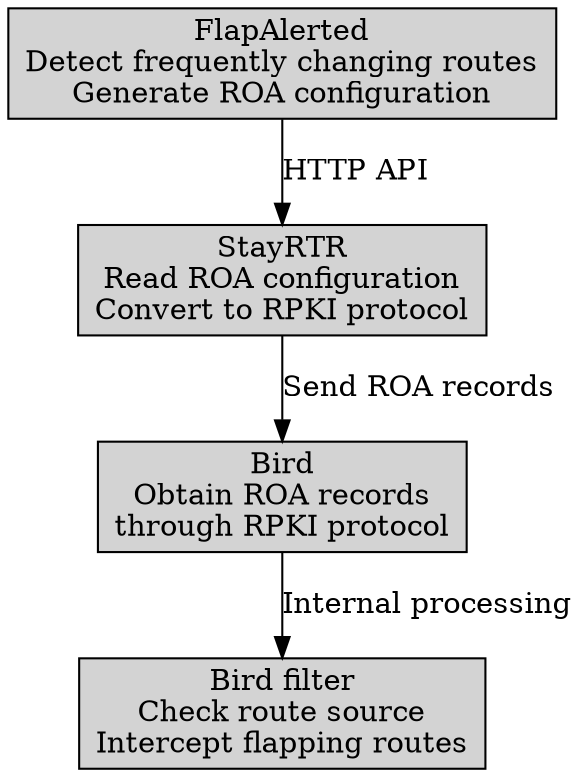

DN42, aka Decentralized Network 42, is a large, decentralized VPN-based network. But unlike other traditional VPNs, DN42 itself doesn't provide any VPN exits, which means it doesn't allow you to bypass Internet censorships or unlock streaming services. On the contrary, the goal of DN42 is to simulate another Internet. It uses much of the technology running on modern Internet backbones (BGP, recursive DNS, etc), and is a great replica of a real network environment.

In the real internet, various operators use hardware routers from different manufacturers to exchange routing information with each other, such as Cisco, Juniper, Nokia, Arista, Huawei, etc. Similarly, in DN42, different participants will also choose different BGP software and hardware, with the most commonly used being [Bird](https://bird.network.cz/) and [FRRouting](https://frrouting.org/), but some also use Mikrotik, Ubiquiti EdgeRouter, or even real commercial routing hardware.

Because everyone chooses different BGP software and hardware, and even when using the same software, they configure their internal networks in different ways, when everyone's networks are connected together, sometimes strange problems may occur, such as BGP Flapping.

# BGP Flapping in the Real Internet and DN42

BGP Flapping refers to a large number of path changes of the same route occurring in a short period of time, generally originating from a network repeatedly advertising and withdrawing the same route. Each time a route is advertised and/or withdrawn, this network will pass this route to all peers connected to it. These peers will calculate new best paths based on this route, and then pass the new paths to their peers, and so on.

In the real internet, the problem of BGP Flapping is not too significant, firstly because hardware routers purchased by various operators at great expense have sufficient computing resources to handle these route changes, or have built-in functions to suppress frequent route changes (BGP Dampening), and secondly because real operators use physical network connections, and the high cost of physical links means that except for the largest ISPs, operators that peer with each other are not too numerous, thus reducing the exponential amplification effect.

However, in DN42, the most commonly used Bird BGP daemon does not support BGP Dampening, which allows flapping routes to continue propagating. Even though FRRouting supports BGP Dampening, it doesn't mean everyone will enable it. At the same time, because DN42 participants use VPN connections, the cost of establishing peers is zero, so it's common for a network to connect to dozens or even hundreds of peers, and to spread flapping routes to dozens or hundreds of peers.

Moreover, because DN42 is an experimental network, different participants often change their network configurations from time to time. Since flapping generally switches between several valid paths and doesn't outright cause disconnection, the participant making changes may not immediately notice the problem.

This leads to frequent large-scale, multi-day flapping within DN42, for example:


The above chart shows the number of route updates received per second by several of my DN42 nodes. You can see that around November 7th, the number of route changes received increased, stepped up again around November 12th, and didn't decrease until November 13th.

## Traditional Solutions

For DN42 participants, the biggest problem caused by flapping is the consumption of CPU resources and traffic. Many participants use VPS with limited computing resources and traffic, and flapping may lead to VPS being restricted in CPU usage, limited in network speed, or even suspended by provider.

However, within DN42, even if flapping is known to exist, it's not always possible to find the source of the flapping problem, let alone solve the root problem:

1. You can choose to manually disconnect problematic peers, which can immediately solve your CPU and traffic consumption problems, but this is only treating the symptoms, not the root cause. A peer that seems problematic to you might just be forwarding route updates from other peers. By doing this, you might need to disconnect your self from innocent peers, especially large networks connected to dozens or hundreds of peers. Moreover, as connections between different participants change, this flapping might be passed to you through other peers, which you need to disconnect again (and hopefully reconnect the former peers).

2. You can try to contact the problematic peer, but because DN42 participants are distributed worldwide, even if the other party is willing to troubleshoot immediately, it might take up to 24 hours to receive a response after they wake up/get off work. Moreover, the other party might not be the root cause of the problem, and they might need to repeat the same process to contact problematic peers, making the entire process very time-consuming.
   - In the real internet, large operators have a 24-hour on-duty NOC (Network Operation Center) that can immediately troubleshoot problems. But obviously, hobbyist networks like DN42 don't have such things.

3. Some people have proposed solutions to rate-limit port 179 of BGP. This can reduce the CPU usage of BGP daemon, but cannot reduce the total traffic consumed (and might even increase it), and will slow down the speed of exchanging a large number of routes when disconnected peers reconnect. The reason is that the BGP protocol is based on TCP. When BGP daemon receives a route update, it will immediately send the updated route to other peers through the TCP-based BGP connection. This route update message will immediately enter the OS-allocated buffer for this TCP connection. As long as the TCP connection remains connected, this message will eventually be sent. Even if the TCP connection is very slow, causing this updated route to change again, the BGP daemon cannot withdraw this instruction from the buffer. No common operating systems such as Linux/BSD/Windows provide this mechanism. Therefore, the actual number of route updates sent is still the same, just at a slower speed.
   - Depending on the rate-limiting method, it might just delay packets before handing them to the BGP daemon (generally called Traffic Shaping), or some might directly drop packets (called Traffic Policing). If packets are directly dropped, the peer needs to retransmit the packets, which causes greater traffic consumption.
   - In my opinion, it's easier and more effective to directly limiting the CPU usage of BGP daemon.

# Implementing BGP Dampening Yourself on Bird

To suppress frequent route changes, BGP Dampening needs to do two things: detect routes that change frequently, and then prevent these changes from propagating to more peers by adjusting route/peer weights, thereby reducing the total amount of route changes in the entire network.

Although Bird completely does not support BGP Dampening and cannot implement either of the above functions alone, the step of "detecting routes that change frequently" can already be done by existing software. Another DN42 participant Kioubit developed [FlapAlerted](https://github.com/Kioubit/FlapAlerted), which can peer with your own BGP daemon and then count the number of changes in each route, thereby finding routes whose changes exceeds a threshold. However, this software can only detect and cannot send these flapping network segments back to the BGP daemon, so it cannot achieve the interception effect.

> Actually, FlapAlerted has a `mod_roaFilter` plugin, which can use the RPKI mechanism (to be introduced later) to filter an existing ROA record, and remove records for the flapping routes. However, this plugin is disabled by default, and you need to compile FlapAlerted yourself to use it. In addition, you need to have already [set up RPKI based on DN42 Wiki](https://wiki.dn42.dev/services/RPKI), and filter all routes without corresponding RPKI records, which is a high standard to meet.

However, Bird has supported RPKI/ROA functionality since version 2.0. The ROA function in RPKI can be used to verify whether BGP-advertised routes come from the correct ASN. For example, the route 172.22.76.184/29 that I own in DN42 should come from my ASN 4242422547. Combined with Bird's filter functionality, you can intercept incorrect routes with methods similar to the following:

```bash
if (roa_check(roa_v4, net, bgp_path.last) = ROA_INVALID) then {
  # Route comes from incorrect ASN
  reject;
} else if (roa_check(roa_v4, net, bgp_path.last) = ROA_UNKNOWN) then {
  # RPKI does not provide information about this route, so it's unknown whether the route comes from the correct ASN
  accept;
} else if (roa_check(roa_v4, net, bgp_path.last) = ROA_VALID) then {
  # Route comes from correct ASN
  accept;
}
```

So, to intercept routes that change frequently, we can generate fake ROA records based on the information collected by FlapAlerted, hijacking these frequently changing routes to invalid ASNs (such as AS0). This way, when routing software like Bird receives these routes, it will consider them to come from incorrect ASNs and intercept them.

[I submitted a PR to the FlapAlerted project](https://github.com/Kioubit/FlapAlerted/pull/10) to enable it to generate such fake ROA records. This functionality has been included in [FlapAlerted v4.1.5](https://github.com/Kioubit/FlapAlerted/releases/tag/v4.1.5).

However, FlapAlerted only provides an API to generate ROA record files and does not support the RPKI to Router protocol used by BGP daemon, so it cannot directly connect to Bird. For this, we need to use [StayRTR](https://github.com/bgp/stayrtr), which can read and periodically update ROA record files of the same format from the real internet or generated by FlapAlerted, and then send them to Bird through the RPKI to Router protocol.



## Installing FlapAlerted

We first need to install FlapAlerted and connect it to our own BGP daemon, so that FlapAlerted can obtain frequently changing routes.

Of course, you can also choose to directly use someone else's FlapAlerted instance, such as the one I set up at <https://flapalerted.lantian.pub>, or the one set up by Burble at <https://flaps.collector.dn42> (needs to be accessed from within DN42).

If you use Docker, you can refer to the following Docker compose configuration:

```yaml
services:
  flapalerted:
    image: ghcr.io/kioubit/flapalerted
    network_mode: host
    command:
      - "--asn"
      - "4242422547"  # Change to your own ASN
      - "--bgpListenAddress"
      - "127.0.0.1:1790"  # BGP session listening port, your BGP daemon needs to connect to this port later
      - "--httpAPIListenAddress"
      - "127.0.0.1:8080"  # HTTP API listening port, StayRTR needs to connect to this port later
      - "-routeChangeCounter"
      - "120"  # Number of times a route path needs to change within one minute to be included in the prefix list. Default is 600, but I think it's too high, I use 120
      - "-overThresholdTarget"
      - "5"  # How many consecutive minutes the rate reaches or exceeds routeChangeCounter to trigger an event. Default is 10, I changed it to a stricter 5
      - "-underThresholdTarget"
      - "30"  # How many consecutive minutes the rate is below routeChangeCounter to remove an event. Default is 15, I changed it to a stricter 30
    restart: unless-stopped
```

If you use NixOS, you can directly refer to my configuration: <https://github.com/xddxdd/nixos-config/blob/42801296ce4f7dc6216e3b87d2b695895b8f2fa2/nixos/optional-apps/flapalerted.nix>

Once FlapAlerted starts successfully, you can modify the BGP daemon configuration to forward routing information to FlapAlerted. If you use Bird, you can refer to the following configuration:

```bash
protocol bgp flapalerted {
  local as 4242422547;  # Change to your own ASN

  # Change to the ASN and BGP IP/port set by FlapAlerted.
  # Here we use the same ASN as our own network, since BGP protocol does not forward routes from
  # iBGP (i.e., routes from your other nodes) to iBGP peers. Unless you enable the add paths option,
  # routes from your other nodes will only contain the optimal routes. If flapping occurs on
  # suboptimal routes, it will be hidden. Therefore, it is recommended that users with multiple
  # nodes establish separate connections with FlapAlerted on each node.
  neighbor 127.0.0.1 as 4242422547 port 1790;

  ipv4 {
    # Enable add paths option to send non-optimal routes to FlapAlerted as well, making suboptimal
    # route flapping visible.
    add paths on;
    export all;
    import none; # No need to receive any routes from FlapAlerted
  };

  ipv6 {
    add paths on;
    export all;
    import none;
  };
}
```

Confirm that Bird is properly connected to FlapAlerted, and confirm that FlapAlerted's ROA API is accessible, for example: `curl http://127.0.0.1:8080/flaps/active/roa`

Continue to the next step after confirming everything is correct.

## Installing StayRTR

The next step is to install StayRTR to send the ROA information generated by FlapAlerted to Bird.

If you use Docker, you can refer to the following Docker compose configuration:

```yaml
services:
  stayrtr:
    image: rpki/stayrtr
    network_mode: host
    command:
      - "--bind"
      - "127.0.0.1:8083"  # Listening address for RPKI-to-Router protocol
      - "--metrics.addr"
      - "127.0.0.1:8084"  # Listening address for Prometheus format statistics API
      - "--cache"
      - "http://127.0.0.1:8080/flaps/active/roa"  # Change to your FlapAlerted server address
      - "--rtr.expire"
      - "3600"  # How long to retain existing information if FlapAlerted server is offline
      - "--rtr.refresh"
      - "300"  # How often to refresh information from FlapAlerted server
      - "--rtr.retry"
      - "300"  # How long to retry if FlapAlerted server is offline
    restart: unless-stopped
    depends_on:
      - flapalerted
```

If you use NixOS, you can directly refer to my configuration: <https://github.com/xddxdd/nixos-config/blob/c709166104dc0bf2d8c2798ff338fa84a6c4a85a/nixos/minimal-apps/bird/stayrtr-rpki.nix>

After StayRTR starts successfully, you can modify the BGP daemon configuration to connect it to StayRTR. It should be noted here that if you [already enabled RPKI referring to DN42 Wiki](https://wiki.dn42.dev/services/RPKI), you must store the ROA information sent by FlapAlerted in a separate ROA table and check routes based on this ROA table separately. The reason is that if a route has multiple corresponding ASNs according to ROA information, any of these ASNs can advertise this route. Since FlapAlerted only generates information to hijack routes to invalid ASN (AS0), if mixed with normal ROA information, effectively both the original ASN and AS0 can advertise this route, which fails to achieve the filtering effect.

If you use Bird, you can refer to the following configuration:

```bash
# Create new ROA tables dedicated to FlapAlerted
roa4 table roa_flap_v4;
roa6 table roa_flap_v6;

protocol rpki rpki_flapalerted {
  roa4 { table roa_flap_v4; };
  roa6 { table roa_flap_v6; };
  remote 127.0.0.1 port 8083; # Change to the port monitored by StayRTR
  max version 1;
  retry keep 10; # If connection is interrupted, reconnect every 10 seconds
};
```

Continue to the next step after confirming that Bird is properly connected to StayRTR. If your FlapAlerted has not yet detected flapping routes, the ROA information is empty, and Bird will display a `Cache-Error-No-Data-Available` error, which is normal and can be ignored.

When FlapAlerted detects flapping routes, you can use the `birdc show route table roa_flap_v4` command to check whether ROA information has actually been received.

## Intercepting Routes in Bird Filters

With ROA information, we can add instructions to check ROA information in the filters of the corresponding protocols in Bird.

If you want to minimize CPU consumption, you can choose to filter out these routes at the Import Filter stage when receiving routes, but you won't be able to access these routes either.

If you just want to reduce the impact on the DN42 network, you can choose to filter them out at the Export Filter stage when sending routes, with the side effect that your peers won't be able to access these routes through you.

Add to your Filter filter:

```bash
# Change roa_flap_v4 to the corresponding ROA table name above, use roa_flap_v6 for IPv6
if (roa_check(roa_flap_v4, net, bgp_path.last) = ROA_INVALID) then {
  # Route changes frequently, hijacked by FlapAlerted to AS0, Bird considers the route to
  # come from incorrect ASN
  reject;
}
# In other cases, roa_check will return ROA_UNKNOWN, because FlapAlerted does not provide
# information about other routes, and Bird does not know whether the route source is correct
```

After reloading Bird, you will no longer spread these frequently changing routes to your peers, reducing the traffic consumption of you and your peers.

# Summary


This chart shows the effect after I configured BGP Dampening in my network. Around 18:00, although flapping occurred within the DN42 network and my nodes received these route changes through multiple peers, FlapAlerted subsequently detected these flapping and blocked these routes through the above process. Therefore, although flapping continued until around 23:00, the routes sent by my network quickly declined after a brief spike, successfully suppressing flapping for my peers.

As you can see, BGP Dampening cannot prevent you from receiving flapping routes, but it can help you save CPU resources, or save some network traffic for you and your peers. Therefore, in addition to configuring BGP Dampening in your network, if other networks send you flapping routes, you can also suggest these networks take similar measures, thereby suppressing flapping on a larger scale and saving traffic for all DN42 participants.


