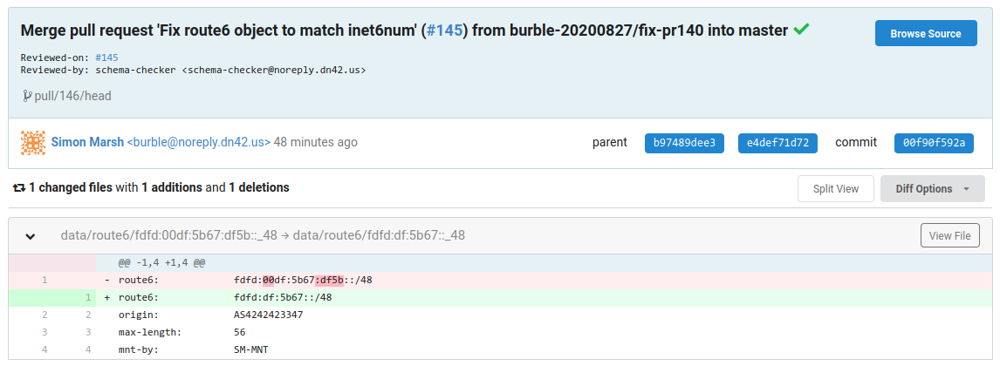
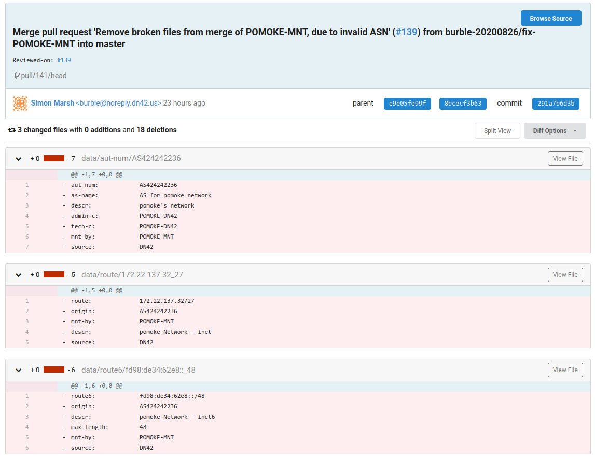

> DN42 is an **experimental network**, where everyone helps everyone. Nobody is going to blame you if you screwed up. You may seek help at DN42's [IRC channel](https://wiki.dn42.us/services/IRC), [mailing list](https://wiki.dn42.us/contact#contact_mailing-list) or the [unofficial Telegram group](https://t.me/Dn42Chat).

Since DN42 is a network for experimentation, a lot of relatively inexperienced users also participate in it. Therefore, occasionally an inexperienced user may misconfigure his/her system and impact the whole DN42 network or even shut it down.

As a more experienced user, here I will teach new users about some operations that can kill the network and about defense against such misconfigurations that everyone can set up against peers.

> WARNING: You should not actually perform these operations in DN42. You should focus more on protecting yourself against them.
>
> Malicious actions will make you kicked from DN42.

The stories are based on **real disasters** in the Telegram group and IRC channel.

Changelog
=========

- 2023-05-12: Add contents for a routing loop caused by modifying BGP local preference.
- 2020-08-27: Format changes, add full IRC logs, add another netmask error content, and add content on missing digit in ASN.
- 2020-07-13: Add an IPv6 netmask error in the registry and Bird's conflicts between different protocols.
- 2020-05-30：Initial version, including OSPF, Babel, and route flaps.

OSPF is Fun
===========

You just joined DN42 and plan to connect all of your servers. You've already peered with a few others on several of your nodes, but you haven't finished on your internal routing yet.

So you plan to configure OSPF. You opened Bird's configuration file and added a protocol:

```bash
protocol ospf {
  ipv4 {
    import all;
    export all;
  };
  area 0.0.0.0 {
    interface zt0 {
      type broadcast;
      # Unimportant stuff redacted
    };
  };
};
```

Satisfied, you copied the config file to every server and ran `bird configure`. You checked and confirmed that every server obtained routes from each other via OSPF.

Suddenly a message box pops up on your IRC client / Telegram. You clicked on it:

```html
<mc**> shit.... as424242**** is hijacking my prefixes, for example 172.23.*.*/27
<he**> yup, I see some roa fails for them as well
```

Congratulations! You've successfully hijacked (part of) DN42.

What's Going On
---------------

When your server peers with others via BGP protocol, each route contains path information, including the origin as well as the list of nodes it went through. For example, the route `172.22.76.184/29` may have the path information of `4242422547 -> 4242422601 -> 424242****`, where `4242422547` is the origin (me by the way), and `4242422601` is your neighbor (Burble here, as an example).

But since your internal networking uses OSPF, which has no idea what BGP paths are, it doesn't preserve them while passing routes around. Now another node of yours obtained `172.22.76.184/29` via OSPF, yet without any path information. It will then proceed to announce the route with your own ASN to your peers, causing a hijack.

Here is a graph of what's going on:

```bash
[2547] -> [2601] -> [Your Node A] -> [Your Node B] -> [Peer of Node B]
 2547      2547      2547             Gone!            Your ASN (BOOM)
           2601      2601
                     Your ASN
```

Babel is Fun, Too
=================

Those in the Telegram group are really nice guys. As they help you in fixing the problem, they also recommended Babel to you:

- Babel automatically selects the shortest path by latency.
- Babel is extremely simple to configure.

But they don't recommend Bird's built-in Babel support since it doesn't support selecting paths by latency.

You are persuaded, removed the OSPF configuration, and installed Babeld. Soon each of your nodes is getting Babel routes. You waited for a few minutes. No sign of catastrophe yet.

But you do notice that Bird isn't announcing the routes via BGP. The Telegram guys instigated you to enable the `learn` option of Bird's kernel protocol:

```bash
protocol kernel sys_kernel_v4 {
  scan time 20;
  # You're gonna add this line!
  learn;
  # Unimportant stuff redacted
};
```

You do this. A few minutes later, you are called out again by people in IRC and Telegram. Yes, you hijacked other's networks. Again.

What's Going On
---------------

It is actually the same problem as the OSPF one since Babel also dropped all BGP path information while passing routes around. However, Bird ignores routing information installed to the system by other routing software by default, until you enabled `learn`.

Correct Way to Do This
----------------------

- Always remember: Interior Gateway Protocols, including OSPF, Babel, etc, should never process BGP routing information. BGP routing should be handled solely by BGP.
  - There are multiple schemes to configure BGP in a network. You may refer to: [Bird BGP Confederation: Configuration and Emulation](/en/article/modify-website/bird-confederation.lantian).
- Similarly, interior routes should not be passed to BGP, unless you own each and every IP that you're using internally on DN42.
- So you should set BGP's `export filter` to this in Bird:

```bash
export filter {
  # Only allow announcing STATIC (manually configured) and BGP routes
  if source ~ [RTS_STATIC, RTS_BGP] then accept;
  # Reject routes from other protocols
  reject;
}
```

Defensive Measures
------------------

- The best countermeasure is ROA, or Route Origin Authorization. It restricts the source ASN of each route.
  - For DN42, ROA configuration is generated automatically based on registry data. They can be downloaded from [DN42 Wiki's Bird Config Page](https://wiki.dn42.us/howto/Bird#route-origin-authorization), and can be automatically updated with a cron job.
- If you don't want to configure ROA, you may try to peer with more people.
  - Since BGP chooses the path with the least number of ASes, if you're directly connected to a lot of people, your network will prefer these direct routes even if someone is hijacking.
  - But this **doesn't guarantee** full defense against the problem, for example:
    - The path from the hijacker to you is shorter than the real AS.
    - The path from the hijacker and from real AS is of equal length, and your routing software chooses one randomly.
    - You have DN42 Community Filter, and for some reason, prefers the hijacker's route over the real ones.

Route Flapping
==============

Route flapping is a whole range of errors that cause one problem: they cause the BGP routing software to frequently switch (or flap) the best route they chose. Since the best route gets announced to other nodes via peering, the flapping sets off a chained reaction, where multiple connected nodes will flap together for one node's mistake. Eventually, the problem will be distributed to the whole network.

This process consumes a significant amount of bandwidth or traffic. Since many people in DN42 use cheap VPSes for nodes, there are only two possible outcomes eventually:

1. Your peer found out about the abnormal traffic and cut the peering to you.
2. Your hosting provider (or even your peer's provider) found out of your high bandwidth consumption (or using up your traffic limit) and shut down the VPS.

In addition, route flapping may cause severe impacts:

- If the problematic AS peered with many other ASes, even if you disconnected from it, the route flap may still be passed from another AS to your AS again.
  - To fix the problem of one problematic AS, you may have to cut off multiple ASes.

For example, one user in the Telegram group had a misconfiguration while transitioning from Full-mesh + Direct connections to Multihop.


He didn't disconnect BGP in the process, and the Babel configuration error caused large amounts of routes to be announced and withdrawn.

Because of the chain reaction and the number of peerings the guy has set up, multiple large ASes had to disconnect from each other to control the problem (before he woke up).

> By the way, this guy had a number of similar accidents before at a smaller scale, which this margin is too narrow to contain.

Case Review
-----------

```html
<bur*> is someone awake who is on telegram ?
<bur*> Kio*, sun*, ie**, lantian perhaps ?
<Kio*> Kio* is here
<fox*> I am in that dn42 telegram chat too but I do not understand moon runes
<fox*> also its midnight for china?
<bur*> yes, I'm going to be nuking a lot of peerings if they are all asleep
<bur*> I think its originating from NIA*, but a lovely multi mb/s flap going on for the past hour
<bur*> and its like whack-a-mole, if I disable one peering the traffic just pops up on a different one
<fox*> petition for bur* network to stop accepting new peers to help save dn42 network health
<Kio*> NIA* is awake now
<bur*> NIA* certainly has ipv4 next hop problems, they are advertising routes with next hops in other networks
<Kio*> He says he is adjusting his "network from full-mesh to rr and multihops"
<bur*> well its not working ;)
<stv*> bur*: I also took down our peering
<bur*> stv*, too much traffic from the grc?
<stv*> I added a new peer around 1hr ago. Just to check that this hasnt be the cause..
<stv*> bur*: no the grc is still up and running
<bur*> ah, if you are getting a lot of route updates its cos of NIA*
<bur*> grc is currently pumping about 4mb/s to downstram peers
<sun*> bur*: what happen?
<bur*> NIA* is having issues
<bur*> sun* anyway, you are up late!
<sun*> I just came back from the bar:)
<do**> don't drink and root
<bur*> nice :)
<sun*> l like drink ;)
<bur*> ok, I'm bored of this now, if you are currently sending me more than 1mb/s of bgp traffic your peering is about to get disabled.
<bur*> Kio*, sun*, Tch*, jrb*, lantian, ie**, so far
<Kio*> barely notice any flapping here, is it v4 or v6 ?
<bur*> 4 mostly, I think. you got killed on us-nyc1
<bur*> Nap*
<Nap*> Shut mine down if you need, I can't look into with much detail until tonight
<bau*> half of dn42 is about to loose connectivity due to bur* disableing peerings lol
<do**> oh yeah, this looks nice
<Kio*> thats why everybody should be at least multi homed with two peers
<jrb*> bur*: and on which peering?
<Kio*> you shouldnt loose connectivity if only one peer drops
<bur*> jrb* us-nyc1 and us-lax1 for you so far
<jrb*> mapping table says us-3 and us-5, let me check.
<Nap*> Do we know what routes are flapping causing the updates?
<Kio*> filtering problematic ASN on my us node now
<bur*> Nap* its NIA*
<bur*> AS42424213**
<jrb*> sun*, rou*: disabling my peerings with you for now, there seems to be serious flapping
<do**> him again?
<sun*> what?
<sun*> is me problem?
<bur*> sun*, I've killed all of our peerings
<sun*> why?
<bur*> sun*, you are distributing the problems from NIA*
<Nap*> bur*: K, gonna try to filter on ATL/CHI at least.
<bur*> thanks Nap*
<Kio*> recommend everybody to temporarily enable "bgp_path ~" filter for the problematic ASN
<sun*> i disabled NIA*, would fix problem?
<do**> bur*: I also peer with NIA* and I don't get any bgp updates from him
<do**> ah wait
<bur*> sun*, depends if you are also getting the updates from other peers too
<do**> now I see it
<do**> disabling peering
<sun*> if bgp_path ~ [= 42424213** =] then reject;
<bur*> ~ [= * 42424213** * =] to reject all paths
<sun*> ohh
<jrb*> bur*: seems to be mostly rou* from my perspective
<Kio*> Should be filtered on my side, if anyone continues to receive those updates please notify
<bur*> sun*, I tried re-enabling you on lax1 but you jumped striaght to 1mb/s+ again
<bur*> jrb*, re-enabled
<sun*> i have disabled NIA*
<bur*> Kio*, re-enabled
<do**> oh btw, I have notified NIA* about this issue
<jrb*> do**: also tell him to notify everybody to get out of the blacklists.
<do**> jrb*: will do
<Nap*> bur*: I should have it filtered on my ATL (your CHI)
<Kio*> wrote NIA* also directly on telegram
<sun*> bur*: is it better now?
<bur*> for the record, this is the first time that I've mass disabled peerings, but this was causing issues across the board
<bur*> sun*, no not really
<An**> I've stop importing route from NIA*
<stv*> I am also dropping NIA* now
<bur*> sun*, thats like 1k updates every few seconds
<Nap*> bur*: all host should have it filtered now.
<bur*> Nap*, looks to me, thanks
<sun*> bur*: seems to have reduced traffic
<bur*> sun*, yes that looks better
<bur*> sun*, is that now ok across all your nodes ?
<sun*> yep
<bur*> sun*, ok re-enabled
<do**> alright, also filtered 42424213**
<tm**> hi, also filtered 42424213**
<bur*> I guess they got the message, seems we're back to normal again and everyone I disabled is back again
<do**> bur*: I think NIA* is asleep, probably everyone filtered it
<do**> or disabled peering
<bur*> do**, there is that, but I also renabled NIA* and am not getting the same errors now
<do**> oh, interesting
<bur*> I might regret doing that by morning, but hey. I do try and keep everything open as best as possible.
<do**> bur*: last time when NIA* did that I waited for their response
<Kio*> Nope nia* just messaged in Telegram about it
<do**> ah
<bur*> my peering hasn't re-established, so I guess they hit the big red shutdown button
<Kio*> He tried to migrate his network to a full mesh
<Kio*> and is now "pulling all the wires"
<do**> Kio*: did you message him directly or was that on any of the groups?
<Kio*> on the telegram group
<do**> bur*: you didn't get that many bgp updates from me?
<sun*> NIA* woke up :)
<bur*> do**, you went from an average of ~3kbs to ~10kbs+, peaking at 50kbs. In the grand scheme of things that was lost in the noise
<do**> interesting
<do**> I also peer directly with NIA*
<bur*> do**, yes, interesting. Is the link restricted in bandwidth ?
<do**> not at all
```

Defensive Measures
------------------

- The best solution is Route Dampening, which restricts the number of routing updates to be accepted in a time range.
  - But Bird doesn't support this. You'd have to put up with it.
- Alternatively, you can monitor your nodes with Prometheus, Grafana, etc., so you get an alarm that something's off and handle it manually.
  - But obviously, if you aren't online at that time, you may have already used a few gigs of traffic before you're aware.
- Next solution is to rate-limit the peering connection.
  - Since there is almost no application that requires lots of bandwidth in DN42, this is a viable solution that ensures safety.
  - But the downside is also obvious: degradation of performance.
- If you're rich enough, get a server with uncapped traffic.

How Long is That IP Block?
==========================

Since it's the year 2020, you plan to add an IPv6 block to your network. With [my DN42 registration guide](/en/article/modify-website/dn42-experimental-network-2020.lantian), you registered yourself a IPv6 block, which quickly got merged to registry.

From your perspective, everything is normal. Yet on the other side of the planet, a message pops up on one person's phone/computer that his DN42 ROA generator is malfunctioning. He opens the registry page, facepalms, and commits this change:


[https://git.dn42.dev/dn42/registry/commit/9f45ee31cdea4a997d59a262c4a8ac8eb3cbd1f1](https://git.dn42.dev/dn42/registry/commit/9f45ee31cdea4a997d59a262c4a8ac8eb3cbd1f1)

What's Going On
---------------

This user added a IPv6 block, `fd37:03b3:cae6:5158::/48`. Since an IPv6 address consists of 32 hex numbers (128 bits total), and this block defined the first 16 digits (or 64 bits), the corresponding netmask should be `/64` or higher.

But for some reason, this error wasn't detected by DN42 Registry's schema checker, nor by the admin who inspected and merged the change, so it successfully ended up in the registry.

Later, the ROA generator found the erroneous IP block while parsing the registry and crashed.

And It Happened Again
=====================



[https://git.dn42.dev/dn42/registry/commit/00f90f592a35e325152ce28157f64d3fca7c8d7d](https://git.dn42.dev/dn42/registry/commit/00f90f592a35e325152ce28157f64d3fca7c8d7d)

Correct Way to Do This
----------------------

- While registering for an IP block, the user should check the validity of netmasks and address blocks.
- The DN42 Registry schema checker, or the admin performing the merge operation, should have found out the problem.
- ROA generator should skip the problematic record and properly handle the rest of the data instead of crashing.

Fortunately, except that the ROA update was delayed by a few hours, this error didn't impact the network itself much.

Defensive Measures
------------------

Since the decentralized nature of DN42 as it's born, you can write your own ROA generator as a backup.

> Although my ROA generator also failed this time...

The reason is that different implementations may have minor differences even though they do the same thing. When such a bug on input content arises, some implementations may survive.

Bird Protocol Fights
====================

The story starts with my friend Joe... Fine. The story starts with me.

Since my network is connected to both DN42 and NeoNetwork, as well as my internal network with a private IP range, to prevent announcing my internal network to DN42 and NeoNetwork, I did this:

- All routes from the Kernel protocol (from OS routing table) and the Direct protocol (from network interface addresses) are labeled with a BGP community.
- Routes with the community are filtered in exterior peerings with DN42 and NeoNetwork.
- This way, my internal IPs won't be announced to other networks, but since my DN42 and NeoNetwork IP blocks are configured in Static protocol, they won't be impacted.

Initially, everything looked normal, until a few days later when some users on Telegram found that my looking glass bot times out on any IP in DN42.

What's Going On
---------------

Initially, everything is indeed normal, and my IP block `172.22.76.184/29` is announced correctly. Until Direct protocol performed a refresh and obtained `172.22.76.184/29` from one of the network interfaces, and sent the route to Bird routing table again.

The new route overwrote the previous route, and since it comes from Direct protocol, it's labeled with the community and wasn't broadcasted. Static protocol, on the other hand, is indeed "static", and won't overwrite the route again.

At this time, I effectively stopped announcing my IP range. No wonder I cannot receive any packets coming back to my nodes now.

Correct Way to Do This
----------------------

In Bird, you should avoid getting the same route entry from multiple routing protocols, as they overwrite each other and may cause unexpected behavior.

I finally chose to limit Direct protocol to my internal IP range with a filter, so it won't overwrite my DN42 ranges again.

Need Better Glasses?
====================

A new user registered an ASN:


This is what happened to DN42:

- Telegram Group: (Translation available below the image)

  

  Translation:

  ```html
  <lantian> Why someone with an ASN of 424242236 came to peer with me
  <lantian> Yep, 9 digits
  <lantian> /whois@lantian_lg_bot 424242236
       <lg> (outputs WHOIS information of the AS)
  <lantian> And it has proper WHOIS information
   <KaiKai> https://net-info.nia.ac.cn/#424242236
   <KaiKai> Really, it exists
   <Pastel> Burble didn't spot the error?
   <Pastel> Like the /64, which crashed the ROA generator
  ```

- IRC：

  ```html
  <lantian> Someone successfully registered in DN42 with ASN 424242236 (9 digits)
  <lantian> Is this expected?
     <xu**> doh
     <xu**> shouldt have happened
     <xu**> probably forgot the extra 2
     <xu**> 424242 2236
     <Kai*> too late tho. it already has one peer with tech9
     <dne*> filtering fail!
     <xu**> pomoke?
  <lantian> yep, doesn't seem to be on irc though
  <lantian> nor on telegram
     <0x7*> so how a 9-digit ASN passed the schema checker...?
  <lantian> I don't think schema checker checks ASN, or it will block out clearnet ASNs
  <lantian> But maybe we need a warning?
     <xu**> probably a bug in the policy checker
     <xu**> i wish we had gone with a prefix that had a visual space
     <xu**> like AS424200xxxx
  <lantian> Well pomoke tried to peer with me via email (but ended in spam folder)
  <lantian> I'm going to tell him/her to correct the ASN
     <Kai*> 9 is a good number tho
     <Kai*> once in a blue moon that bur* made mistake
     <sun*> westerners love digital 9
     <bur*> crap
     <bur*> lantian, are you in contact with pomoke? if they can submit a fix quickly
            then I'll merge it. Otherwise I'll need to pull the commit
  <lantian> bur*: I sent him/her an email, not sure about response time
     <bur*> umm, I'm going to have to pull it then
  ```

- Justice Has Arrived:

  

Defensive Measures
------------------

- Just have fun, as this is so rare:

  ```html
  <Kai*> once in a blue moon that bur* made mistake
  ```

- But while having fun, remember to point out the problem on IRC.
- Double-check your peer's information when peering.
- Check [DN42 New ASN](https://t.me/DN42new), a Telegram channel that notifies of new DN42 ASNs, in your free time.

Be Careful of BGP Local Preferences
===================================

When I was helping others debugging their network in the DN42 Telegram group, I suddenly noticed a routing loop between two of my nodes:

```bash
traceroute to fd28:cb8f:4c92:1::1 (fd28:cb8f:4c92:1::1), 30 hops max, 80 byte packets
 1  us-new-york-city.virmach-ny1g.lantian.dn42 (fdbc:f9dc:67ad:8::1)  88.023 ms
 2  lu-bissen.buyvm.lantian.dn42 (fdbc:f9dc:67ad:2::1)  94.401 ms
 3  us-new-york-city.virmach-ny1g.lantian.dn42 (fdbc:f9dc:67ad:8::1)  167.664 ms
 4  lu-bissen.buyvm.lantian.dn42 (fdbc:f9dc:67ad:2::1)  174.235 ms
 5  us-new-york-city.virmach-ny1g.lantian.dn42 (fdbc:f9dc:67ad:8::1)  247.213 ms
 6  lu-bissen.buyvm.lantian.dn42 (fdbc:f9dc:67ad:2::1)  253.499 ms
 7  us-new-york-city.virmach-ny1g.lantian.dn42 (fdbc:f9dc:67ad:8::1)  326.690 ms
 8  lu-bissen.buyvm.lantian.dn42 (fdbc:f9dc:67ad:2::1)  333.412 ms
 9  us-new-york-city.virmach-ny1g.lantian.dn42 (fdbc:f9dc:67ad:8::1)  406.978 ms
10  lu-bissen.buyvm.lantian.dn42 (fdbc:f9dc:67ad:2::1)  413.537 ms
11  us-new-york-city.virmach-ny1g.lantian.dn42 (fdbc:f9dc:67ad:8::1)  486.762 ms
12  lu-bissen.buyvm.lantian.dn42 (fdbc:f9dc:67ad:2::1)  493.147 ms

18 hops not responding.
```

I logged onto these two nodes, and indeed, the VirMach node did choose BuyVM's route as the preferred path, and the BuyVM node did the same for VirMach's route.

Isn't BGP supposed to prevent loops? Why are these two nodes choosing the route from each other?

What's Going On
---------------

The problem involves 4 nodes from 3 ASes:


KSKB is the source for the route `fd28:cb8f:4c92::/48`. He broadcasted the route to Lutoma, as well as my VirMach node. Lutoma then broadcased the route to my BuyVM node.

**All my nodes have `add path yes;` option turned on**, which means my nodes will exchange all received routes, rather than only the preferred ones written into kernel routing table. Therefore, as far as the BuyVM node concerns, it can choose from two paths to the source:


The same applies for my VirMach node:


Generally speaking, the VirMach node should prefer the direct route to KSKB, instead of the path through my BuyVM node and Lutoma's node, for a total of 2 hops (hops aren't counted for iBGP within the same AS). Now regardless of the next hop BuyVM node prefers, either Lutoma's node or my VirMach node, it will have a reachable path rather than a routing loop.

The problem is that **I manually adjusted route preferences with a BIRD filter**. [DN42 has a standard set of BGP communities to mark the source region of each route.](https://wiki.dn42.dev/howto/Bird-communities) To reduce network latency, I used the following algorithm (simplified) to adjust my route preferences:

```bash
Preference = 200 - 10 * (Hop count)
If the current node is in the same region as the route source:
  Preference += 100
```

When the problem happened, the original route from KSKB don't have source region community set up. **However, Lutoma's network was set up incorrectly, and added source region community to KSKB's route as well**, and with the same region as my VirMach node. (According to the standard of DN42, networks should only add source region communities to their own routes, not to routes received from other networks.)

Now my BuyVM node calculated the following route preferences, and chose the route through my VirMach node:


Yet my VirMach node chose the route through BuyVM:


And now we have a routing loop.

Correct Way to Do This
----------------------

For this problem to appear, all three requirements must be met:

1. **`add paths yes;` option is turned on**, so that secondary routes are sent to other nodes as well. If this option wasn't turned on, as soon as the BuyVM node choose the VirMach node as the next hop, it won't broadcast its route through Lutoma to the VirMach node. Then, the VirMach node will only have the option of sending traffic directly to KSKB.
2. Route preference algorithm **preferring secondary routes over primary routes from other nodes**. Therefore, if we want to keep `add paths yes;` option on, while designing the iBGP route preference algorithm, we need to guarantee that routes from the same node **have their priorities in the same order as that node**, so that the primary routes will always be used over secondary routes.
3. Routes passing Lutoma's network were incorrectly updated with the new BGP community, causing the change of route priority orders.

My solution to the problem is to no longer recalculate route priority for those received from iBGP. Instead, I will always use the priority value calculated by the edge node receiving the route, and passed over along with the route announcement over iBGP, to guarantee that the order of primary and secondary routes never change.
