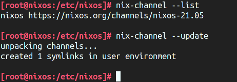

import Toc from '../../../../_templates/nixos-series/toc-en.md'

<Toc />

This is the second post in my NixOS series and mainly focuses on:

- Basic format of NixOS config files and how to edit them
- Flake functionality of Nix package manager
- Deploy-RS deployment tool

This post assumes that you've installed NixOS with
[NixOS's official installation manual](https://nixos.org/manual/nixos/stable/index.html#sec-installation).

## Changelog

- 2023-05-10: Add a recommended post:
  [NixOS & Nix Flakes - A Guide for Beginners](https://thiscute.world/en/posts/nixos-and-flake-basics/)
  by Ryan Yin.
- 2021-12-18: NixOS 21.11 still doesn't come with Flake functionality by
  default. Relevant information is updated.

## Basic config

During NixOS's installation process, the `nixos-generate-config` tool should
have generated an initial config file for you under `/etc/nixos`, with two files
`configuration.nix` and `hardware-configuration.nix`. Ignore
`hardware-configuration.nix` for the moment, as it's automatically generated
based on your hardware and disk partition scheme. Let's open
`configuration.nix`:

```nix
# I removed all comments in the file to shorten stuff
{ config, pkgs, ... }:

{
  imports =
    [
      ./hardware-configuration.nix
    ];

  boot.loader.grub.enable = true;
  boot.loader.grub.version = 2;
  boot.loader.grub.device = "/dev/sda";

  networking.useDHCP = false;
  networking.interfaces.enp0s3.useDHCP = true;
  networking.interfaces.enp0s8.useDHCP = true;

  system.stateVersion = "21.05";
}
```

This file defines your whole NixOS operating system, including all software
packages and their config. This file is in Nix format, a "functional
programming" language created by NixOS's Nix package manager. But since we're
doing basic config, we don't need its programming functionalities yet. Let's
ignore the first line `{ config, pkgs, ... }:` for the moment and **treat the
rest part as a JSON file**.

The Nix language has the same 6 data types as JSON: number, boolean, string,
object, array, and null. Their format is also quite similar. In addition, the
Nix language has a "path" data type:

```nix
{
  # Number
  number = 123456;

  # Boolean
  boolean_value = true;

  # String
  string = "lantian.pub";

  # Object
  object = {
    a = 1;
    b = 2;
  };
  # The object can also be defined as this, they're equivalent:
  object.a = 1;
  object.b = 2;

  # Array
  array = [
    "first element"
    "second element"

    # Array can store objects:
    ({
      a = 1;
      b = 2;
    })
  ];

  # A Path, doesn't have double quotes like a string
  #
  # Note:
  #
  # - A file pointed by a path will be copied to /nix/store when parsing the config,
  #   and that copy will be used instead. A path usually points to a file managed
  #   along with this config, like your handwritten config file for some program.
  #
  # - A file pointed by a string won't be copied, but its contents aren't part of
  #   the config. They aren't managed by Nix and cannot be read by Nix, but the
  #   path itself can be copied to the program's config file and be read by the
  #   program. Usually, for files independent from the config, like the code of
  #   your website.
  file = ./somefile.txt;    # Will be copied to /nix/store/[hash]-somefile.txt
  file2 = "./somefile.txt"; # Won't be read or processed by Nix
}
```

Now suppose we want to install an SSH server for remote login. We can add these
two lines of config:

```nix
{ config, pkgs, ... }:

{
  # ...

  # Add these two lines
  services.openssh.enable = true;
  services.openssh.permitRootLogin = "yes";

  # Or equivalent to this, using the feature of Nix objects
  services.openssh = {
    enable = true;
    permitRootLogin = "yes";
  };

  # Or equivalent to this
  services = {
    openssh = {
      enable = true;
      permitRootLogin = "yes";
    };
  };

  # ...
}
```

> The line `services.openssh.permitRootLogin = "yes";` allows password login to
> the `root` account. Since I'm using a VM isolated from the Internet, I care
> more about convenience rather than security. **Don't add this line if your
> machine is exposed to the Internet!**

After you've done editing the config, run `nixos-rebuild switch` to reconfigure
the system. NixOS will read your config file, automatically download OpenSSH,
generate its config file and start it, so you can login with SSH on port 22.

Here's another example where I want to install the `nyancat` command:

```nix
{ config, pkgs, ... }:

{
  # ...

  # Add these lines
  environment.systemPackages = [
    # This is a package definition, is an object instead of a string
    pkgs.nyancat
  ];

  # Or equivalent to this. The "with" command means definitions in "pkgs"
  # are directly referenced, so your config file can be shorter if you
  # install a lot of packages.
  environment.systemPackages = with pkgs; [
    nyancat
  ];

  # ...
}
```

Run `nixos-rebuild switch` and `nyancat` command will be ready:


[This document](https://nixos.org/manual/nixos/unstable/options.html) from NixOS
official lists all possible options in `configuration.nix`. Since it lists ALL
options, the page is very long, and it's normal for your browser to freeze for a
couple of seconds. Instead, you can use
[the Options page of NixOS's official search tool](https://search.nixos.org/options)
to lookup options:


Or search for packages at
[the Packages page](https://search.nixos.org/packages):


## That Config is a Function

Until now, we've ignored the first line `{ config, pkgs, ... }:`. In fact, the
whole `configuration.nix` is a Nix function, and `config` and `pkgs` are input
parameters.

Here's how NixOS defines functions:

```nix
# This is a function, with one input "a" and returns (a+1)
a: a+1

# This is a function, with one input "a" and returns an object.
# The object has two keys "a" and "b"
# Note that there's no variables in the Nix language!
# Assuming input is a = 1, the return value will be { a = 2; b = 3; }
#                                        instead of { a = 2; b = 4; }
a: {
  a = a + 1;
  b = a + 2;
}

# This is a function.
# The input is an object with keys "a" and "b".
# The return value is an object with keys "a" and "b".
# Assuming input is { a = 1; b = 2; }, the return value will be { a = 2; b = 1; }
{ a, b }: {
  a = b;
  b = a;
}

# This is the same function as the last one,
# just with "..." added to the parameter list,
# so, it accepts (and ignores) unknown parameters.
#
# Assuming input is { a = 1; b = 2; c = 3; },
# the last function will error out since it doesn't recognize "c",
# but this function will ignore "c" proceed normally
{ a, b, ... }: {
  a = b;
  b = a;
}
```

Back to the config to install `nyancat`:

```nix
{ config, pkgs, ... }:

{
  environment.systemPackages = [
    pkgs.nyancat
  ];
}
```

It adds the subobject `nyancat` of parameter `pkgs` (also an object) to the list
of `environment.systemPackages`. `pkgs` is the collection of all packages in the
NixOS package repository, defined at
[https://github.com/NixOS/nixpkgs](https://github.com/NixOS/nixpkgs). Similarly,
`config` is the collection of all config parameters. If you want the list of all
installed packages, you can use `config.environment.systemPackages`.

> Nix language uses lazy evaluation. NixOS won't do anything right after loading
> the config file. A config item (e.g. `environment.systemPackages`) will only
> have its value parsed (the array, as well as the object `pkgs.nyancat`) when
> it's referenced.
>
> By the way, the Nix language doesn't support circular references. Config like
> `{ a = config.b; b = config.a; }` won't work and will error out with
> `infinite recursion encountered`.

## Splitting Config to Many Files

After you've used NixOS for a while, you may have installed a lot of packages
and have a very long, hard-to-read config file. NixOS supports importing a
config file from another, so you can put a subset the configuration (like the
desktop environment, or the Nginx + PHP + MySQL stack, etc.) to a separate file
for easier lookup.

Suppose I want to put the SSH config to another file. First create
`/etc/nixos/ssh.nix`:

```nix
{ config, pkgs, ... }:

{
  services.openssh.enable = true;
  services.openssh.permitRootLogin = "yes";
}
```

The add `ssh.nix` to `imports` in `/etc/nixos/configuration.nix`, and remove
previous SSH config statements:

```nix
{ config, pkgs, ... }:

{
  # ...
  imports =
    [
      ./hardware-configuration.nix
      ./ssh.nix
    ];
  # ...
}
```

Then run `nixos-rebuild switch`. Note that this rebuild neither generated any
new stuff nor started/stopped any service, as all we did was move some SSH
config statements to another file, with no actual config change.


Here I'll give a brief explanation of how `imports` works. The function
`configuration.nix` has parameters `config`, `pkgs`, and some more we ignored
with `...`. NixOS will use the same parameters (including both used ones and
ignored ones) to call every file in `imports`, and combine the result with the
current config file.

Back to `ssh.nix`, notice that it never used `config` nor `pkgs`, so we can
remove even that:

```nix
# We can remove "config" and "pkgs"
{ ... }:

{
  services.openssh.enable = true;
  services.openssh.permitRootLogin = "yes";
}

# Or even remove all parameters, "imports" is smart enough to handle this
{
  services.openssh.enable = true;
  services.openssh.permitRootLogin = "yes";
}
```

## Nix Flake

Since all NixOS configurations are defined by `configuration.nix`, we can copy
the files to another machine, run `nixos-rebuild switch` and get an exactly same
system. I also stated in
[the first post of this series](/en/article/modify-website/nixos-why.lantian/):

> (...) one important feature of NixOS is managing each and every package and
> config with a set of Nix config files. Therefore, we can use any tools we
> like, for example, Ansible, Rsync, or even Git, to manage the config at
> `/etc/nixos`. Since this is the only config file we care about, we no longer
> need a bunch of complicated Ansible playbooks or dozens of Rsync commands. We
> only need to overwrite `/etc/nixos`, run `nixos-rebuild switch`, and call it a
> day.

Now I'm gonna tell you that **what I said just now was all wrong.**

Up until now I introduced the ways to change your system config and install
packages, but I never talked about how to upgrade stuff. This is because NixOS
package repositories are managed with another command, `nix-channel`:



Here the `nix-channel --list` command lists all configured repositories, and
`nix-channel --update` updates them to the latest version. However,
`nix-channel` is not managed with `configuration.nix`, and there's no way for
`configuration.nix` to define the URLs and revisions of the package repos. Since
package repos are constantly updated, this means that two systems installed one
month apart may have software version differences, even with the same config.
This is contrary to NixOS's "one config for everything" promise.

To solve this issue, Nix introduced the Flake functionality, which allows
defining repo URLs and revisions. First, let's edit `configuration.nix` followed
by `nixos-rebuild switch` to upgrade the Nix package manager to a beta version
supporting Flake:

```nix
{ config, pkgs, ... }:

{
  # ...
  nix = {
    package = pkgs.nixUnstable;
    extraOptions = ''
      experimental-features = nix-command flakes
    '';
  };
  # ...
}
```

> At the time of writing, NixOS 21.05 is the latest stable version, and its Nix
> package manager (version 2.3) doesn't enable Flake functionality by default
> yet. ~~NixOS 21.11 and future versions will have Flake enabled by default, and
> by then, these config changes will no longer be needed.~~ Due to concerns
> about significant changes in Nix 2.4, especially about those behaviors
> incompatible with previous versions, NixOS 21.11 still uses Nix 2.3, which
> disables Flake by default. See
> [https://discourse.nixos.org/t/nix-2-4-and-what-s-next/16257](https://discourse.nixos.org/t/nix-2-4-and-what-s-next/16257)
> and
> [https://github.com/NixOS/nixpkgs/pull/147511](https://github.com/NixOS/nixpkgs/pull/147511)
> for the relevant discussion.

Then create a `flake.nix` file in `/etc/nixos`. This `flake.nix` defines a
package repo (`input`), the `unstable` branch (equivalent to `master` branch) of
[https://github.com/NixOS/nixpkgs](https://github.com/NixOS/nixpkgs).

```nix
{
  # Description, write anything or even nothing
  description = "Lan Tian's NixOS Flake";

  # Input config, or package repos
  inputs = {
    # Nixpkgs, NixOS's official repo
    nixpkgs.url = "github:NixOS/nixpkgs/nixos-unstable";
  };

  # Output config, or config for NixOS system
  outputs = { self, nixpkgs, ... }@inputs: {
    # Define a system called "nixos"
    nixosConfigurations."nixos" = nixpkgs.lib.nixosSystem {
      system = "x86_64-linux";
      modules = [
        ./configuration.nix
      ];
    };

    # You can define many systems in one Flake file.
    # NixOS will choose one based on your hostname.
    #
    # nixosConfigurations."nixos2" = nixpkgs.lib.nixosSystem {
    #   system = "x86_64-linux";
    #   modules = [
    #     ./configuration2.nix
    #   ];
    # };
  };
}
```

Then run `nix flake update`:

```bash
[root@nixos:/etc/nixos]# nix flake update
warning: creating lock file '/etc/nixos/flake.lock'
```

A `flake.lock` JSON file is generated:

```json
{
  "nodes": {
    "nixpkgs": {
      "locked": {
        "lastModified": 1636623366,
        "narHash": "sha256-jOQMlv9qFSj0U66HB+ujZoapty0UbewmSNbX8+3ujUQ=",
        "owner": "NixOS",
        "repo": "nixpkgs",
        "rev": "c5ed8beb478a8ca035f033f659b60c89500a3034",
        "type": "github"
      },
      "original": {
        "owner": "NixOS",
        "ref": "nixos-unstable",
        "repo": "nixpkgs",
        "type": "github"
      }
    },
    "root": {
      "inputs": {
        "nixpkgs": "nixpkgs"
      }
    }
  },
  "root": "root",
  "version": 7
}
```

`flake.lock` defines the commit ID and SHA256 checksum for `nixpkgs`, so even if
the config file is copied to another machine, the Nix package manager there will
download this specific revision of `nixpkgs` and install software accordingly,
so you'll have exactly the same versions of software.

Finally, run `nixos-rebuild switch`. NixOS will automatically prefer `flake.nix`
to `configuration.nix`, and upgrade (or downgrade) all packages to this specific
version. But since we added the `configuration.nix` file to the `modules` array
in `flake.nix`, the system configuration will remain unchanged.

> If you enabled Flake and manage your files with Git, note that NixOS will
> ignore files not managed by Git and only read those files previously staged or
> committed. If you created a new file, remember to stage it, or NixOS will
> report that the file cannot be found.

## Batch Deployment with Deploy-RS

Now we have one machine configured, but as I mentioned in
[the first post of this series](/en/article/modify-website/nixos-why.lantian/),
I have 10 machines. Of course, I can write an Ansible script to copy the config
to `/etc/nixos` of all nodes and run `nixos-rebuild switch`, but that approach
will have a few problems:

1. If a package in the repo doesn't have prebuilt binary files, I'll have to run
   the compilation on each and every machine. But since I use cheap VPSes
   without many resources available, I can easily run out of RAM or get
   suspended for excessive CPU usage.

   The package repo of NixOS is somewhat similar to Gentoo. Unlike other Linux
   distributions, a package being in the repo doesn't equate to it having binary
   download available. A NixOS "package" is a set of Nix language definitions
   describing the whole process of download, compilation, and packaging.

   Usually, official NixOS will build software for us and upload them to a
   Binary Cache. But if we ever change the compilation process (usually some
   compilation parameters) or create a new package on our own (the process will
   be explained in a future post), we're on our own.

2. The Nix package manager itself also takes a considerable amount of RAM and
   CPU resources when parsing config files, especially when the config is
   complicated.

In an ideal world, I will be able to parse the config on a high-performance
machine (like my personal computer or a dedicated server), download or compile
all packages and config, and copy them to all machines, so they don't need to
spare resources for that... Oh wait, this is what
[Deploy-RS](https://github.com/serokell/deploy-rs) exactly does.

To use Deploy-RS, we need a machine with a Nix installation. Note that I didn't
ask you to reinstall your machine into NixOS because the Nix package manager can
be installed on another Linux distribution. For example, as I run Arch Linux on
my computer, I set up Nix according to the guide on
[Arch Linux Wiki](https://wiki.archlinux.org/title/Nix). Users of other
distributions can use Nix's official quick installation script:

```bash
# Copied from https://nixos.org/download.html
curl -L https://nixos.org/nix/install | sudo sh
```

Then we need to enable Flake on this machine:

```bash
nix-env -iA nixpkgs.nixFlakes
echo "experimental-features = nix-command flakes" >> /etc/nix/nix.conf
systemctl restart nix-daemon
```

Back to `flake.nix` created in the last part, we need to add the repository of
Deploy-RS, as well as SSH connection definitions in `outputs`:

```nix
{
  description = "Lan Tian's NixOS Flake";

  inputs = {
    nixpkgs.url = "github:NixOS/nixpkgs/nixos-unstable";

    # Add these lines
    deploy-rs = {
      url = "github:serokell/deploy-rs";
      inputs.nixpkgs.follows = "nixpkgs";
    };
  };

  outputs = { self, nixpkgs, ... }@inputs: {
    nixosConfigurations."nixos" = nixpkgs.lib.nixosSystem {
      system = "x86_64-linux";
      modules = [
        ./configuration.nix
      ];
    };

    # Add these lines
    deploy = {
      sshUser = "root";           # SSH login username
      user = "root";              # Remote username
      sshOpts = [ "-p" "2222" ];  # SSH parameters, here I specify port 2222

      # Auto rollback on deployment failure, recommended off.
      #
      # NixOS deployment can be a bit flaky (especially on unstable)
      # and you may need to deploy twice to succeed, but auto rollback
      # works against that and make your deployments constantly fail.
      autoRollback = false;

      # Auto rollback on Internet disconnection, recommended off.
      #
      # Rollback when your new config killed the Internet connection,
      # so you don't have to use VNC or IPMI from your service provider.
      # But if you're adjusting firewall or IP settings, chances are
      # although the Internet is down atm, a simple reboot will make everything work.
      # Magic rollback works against that, so you should keep that off.
      magicRollback = false;

      nodes = {
        "nixos" = {
          # Target node's address, either IP, domain, or .ssh/config alias
          hostname = "192.168.56.105";
          profiles.system = {
            # Use nixosConfigurations."nixos" defined above
            path = deploy-rs.lib.x86_64-linux.activate.nixos self.nixosConfigurations."nixos";
          };
        };
      };
    };
  };
}
```

Finally, run `nix run github:serokell/deploy-rs -- -s .` to execute Deploy-RS
and voila.

## Appendix: NixOS on Oracle ARM Server

NixOS also supports the ARM64v8 architecture, the one used by Oracle's ARM cloud
servers. Since Oracle ARM cloud servers are basically KVM virtual machines with
no special hardware, you can simply use
[NixOS-Infect](https://github.com/elitak/nixos-infect) to replace the operating
system with NixOS.

Compared to x86 servers, you simply need to change `system` to `aarch64-linux`
in `flake.nix`

```nix
{
  # ...
  outputs = { self, nixpkgs, ... }@inputs: {
    nixosConfigurations."oracle-vm-arm" = nixpkgs.lib.nixosSystem {
      system = "aarch64-linux";
      modules = [
        ./configuration-oracle-vm-arm.nix
      ];
    };
  };
  # ...
}
```

All other config stays the same as x86 servers. But if you're trying to generate
a config locally with Deploy-RS, you'll encounter an error saying your current
machine doesn't support the ARM architecture. To fix this, we can install
`qemu-user-static` and relevant `binfmt` config, so the local system can emulate
ARM architecture programs.

For Arch Linux, you need to install
[qemu-user-static](https://aur.archlinux.org/packages/qemu-user-static/) and
[binfmt-qemu-static-all-arch](https://aur.archlinux.org/packages/binfmt-qemu-static-all-arch/)
from AUR.

For Debian, you need to install
[qemu-user-static](https://packages.debian.org/sid/qemu-user-static).

After that, you need to edit `/etc/nix/nix.conf` and add this line of config, to
tell Nix package manager that this machine is capable of running ARM programs:

```bash
extra-platforms = aarch64-linux arm-linux
```

Finally, restart Nix Daemon `systemctl restart nix-daemon`, and Deploy-RS will
work.

## Appendix: Further Reading

In this post, we've configured a basic NixOS installation with almost zero extra
software. For installing and configuring software, I recommend you to read Ryan
Yin's
[NixOS & Nix Flakes - A Guide for Beginners](https://thiscute.world/en/posts/nixos-and-flake-basics/).
His post provides some example configurations for commonly used software.

You can also read these documents to have a better understanding of NixOS's
config syntax, the Flake functionality, and Deploy-RS.

- NixOS Syntax
  - [NixOS.Wiki: Nix Expression Language](https://nixos.wiki/wiki/Nix_Expression_Language)
  - [Nix By Example](https://medium.com/@MrJamesFisher/nix-by-example-a0063a1a4c55)
- Flake Functionality
  - [NixOS.Wiki: Flakes](https://nixos.wiki/wiki/Flakes)
- Deploy-RS
  - [GitHub: Deploy-RS](https://github.com/serokell/deploy-rs)

You can also refer to my config files released on GitHub:

- [Initial commit](https://github.com/xddxdd/nixos-config/tree/9ed2eff8e4e6054151558f3d5909f3ef2af9b288)
  - Finished the basic config and Nix Flake parts.
- [general: add deploy-rs script, change SSH port to 2222](https://github.com/xddxdd/nixos-config/tree/79c6f5b45d7ff574ecefb594ed76715715906cec)
  - Finished configuration of Deploy-RS.
