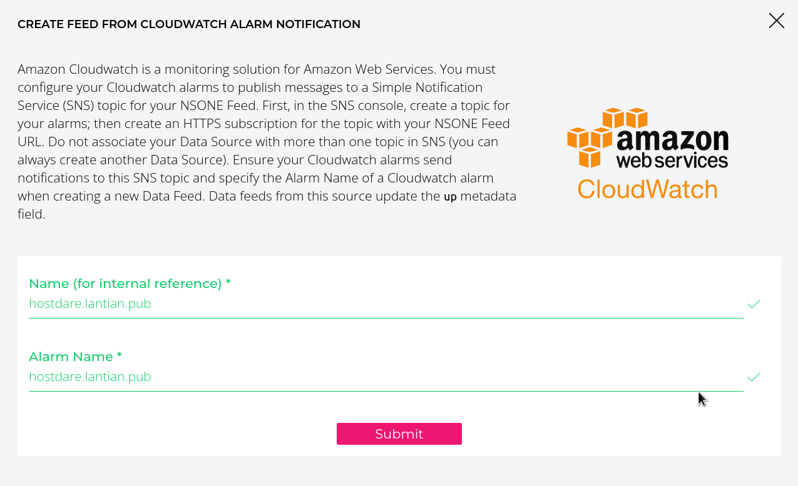
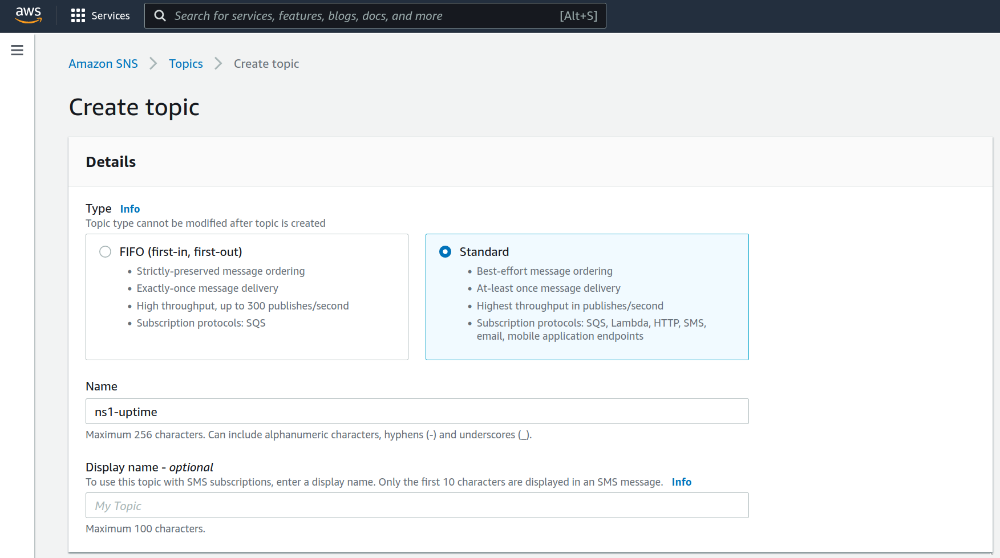
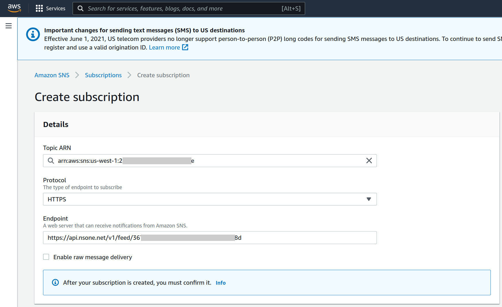
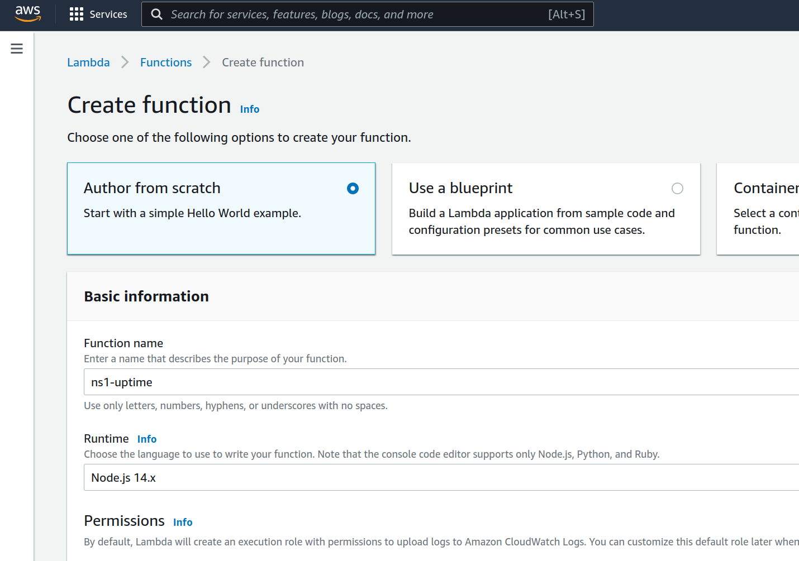
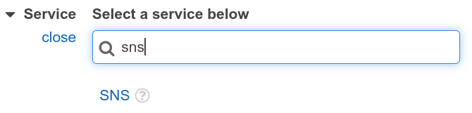
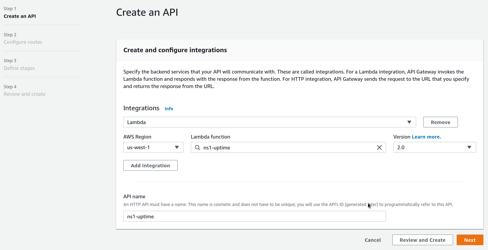
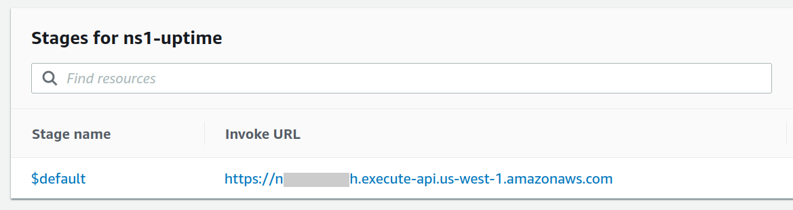
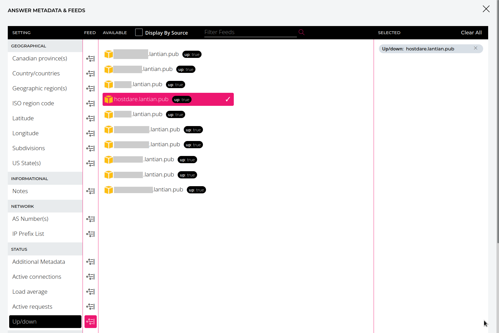

> Some parts of the content come from <https://hostedtalk.net/t/connecting-uptime-robot-with-ns1-dns-api/3883>。

# Goal

I have quite a few VPSes around the world, but my website had been served by a single VPS in Los Angeles for a long time. Because I purchase VPSes from small providers for their specific routing configuration or low price, the network of this VPS can be unstable from time to time. Although it's rare, I had to manually point the DNS to another VPS in case of an outage and switch back after it's back up. Therefore, I want to serve my website with all my VPSes, and automatically reroute traffic to other VPSes if one VPS is down.

Synchronizing website data is of no difficulty since I use Hexo, a static site generator. Simply generate the files on one VPS and copy them to others with Ansible. The bigger problem is DNS. I want to route users to the nearest VPS with GeoDNS. For example, Asian users can be routed to my Hong Kong node, and United States users can access my Los Angeles node.

However, most GeoDNS services on the market are kind of expensive. For a single domain:

- [CloudNS costs \$9.95/m](https://www.cloudns.net/geodns/);
- [Constellix costs \$10/m](https://constellix.com/pricing/products);
- [AWS Route 53 costs \$0.5/m, plus \$0.7/million queries and \$0.75/node for monitoring](https://aws.amazon.com/route53/pricing/);
- [PerfOps provides a GeoDNS-enabled subdomain for CNAMEs, and is free for 100k queries, but monitoring costs \$5/node](https://perfops.net/pricing)。
- Cloudflare Load Balancing costs \$15/m (with 2 backends and Traffic Steering) and \$5 per extra node.

The good news is that [NS1 provides GeoDNS for free](https://ns1.com/plans). Although it can only monitor one node, it supports setting node status over API or over [AWS SNS](https://aws.amazon.com/sns/) for switching nodes automatically.

## Why not Self-host

I tried [GeoDNS on PowerDNS as an authoritative DNS server (Chinese only)](https://lantian.pub/article/modify-website/powerdns-lua-diy-geodns.lantian/) before, but it didn't work well. The main reason is that DNS recursors will not choose the nearest authoritative server automatically. Instead, they randomly select one from the nameserver list of the domain. If one recursor ends up with an authoritative server on the other side of the planet or even a server that's down at the moment, DNS resolution will be slow or even fail and, in turn, harms the website's loading speed.

Most commercial DNS services fix the problem with Anycast, where the same IP is announced from multiple datacenters, and the DNS requests will be routed to the nearest datacenter automatically. But in order to announce an IP, you need an ASN (\$50-100 one time) and an IPv4 range (\$100/m), which costs more than a commercial DNS!

# Preparation

You need to prepare:

1. An AWS account with your credit card on file. You may need to pay a few cents per month. We will use:
   - [Lambda FaaS](https://aws.amazon.com/lambda/pricing/) (Free for first 1 million requests per month);
   - [API Gateway](https://aws.amazon.com/api-gateway/pricing/) (To expose Lambda functions to the Internet, free for first 1 million requests for the first 12 months, then \$1.17 per million requests);
   - [SNS messaging service](https://aws.amazon.com/sns/pricing/) (To send up/down state messages to NS1, free for first 1 million requests per month).
2. A [NS1 account](https://ns1.com/signup). You need to verify your credit card, but it's free otherwise.
3. A domain with less than 50 DNS records to be used with NS1. The free version of NS1 limits you to 50 DNS records.
   - You can register a 6-9 digits xyz domain [that costs \$0.99 per year](https://gen.xyz/1111b) for NS1 and CNAME your primary domain over.
4. Add A/AAAA records for each node on your primary DNS, like `hostdare.lantian.pub -> 185.186.147.110`. Later we will point CNAMEs and monitors here.
5. An UptimeRobot or Freshping account, with monitoring configured for all your nodes.
   - Use the domains from step 4 as the monitored URL. Take `hostdare.lantian.pub -> 185.186.147.110` as example: use `https://hostdare.lantian.pub` rather than `https://185.186.147.110` as the monitored URL.
   - UptimeRobot supports a minimum monitoring interval of 5 minutes. Freshping's interval is 1 minute, but it doesn't support IPv6. Make your own choice.

Usually, the number of up/down notifications is limited, so your cost on AWS will be less than 1 cent per month, almost completely free.

The flow of all messages will be:


## Why AWS Lambda and AWS SNS

Because NS1's Webhook API isn't quite stable, and AWS SNS supports automatic retrying.

I used Cloudflare Workers in my initial testing, but I frequently encountered Bad Requests errors with NS1's API. Retrying immediately didn't fix the problem. Because Cloudflare Workers is only triggered by inbound requests and have limitations on execution time, there's no way for me to retry every few seconds in the background.

Yet AWS SNS can retry automatically whenever the API is unstable, and AWS Lambda can conveniently send messages to SNS. Hence why I ended up with the combination of AWS.

# Connecting NS1 to AWS SNS

1. On the [Integrations page at NS1](https://my.nsone.net/#/integrations), click `Add a Data Source` and select AWS CloudWatch. Name it whatever you want.
   - We're not going to use AWS CloudWatch. Instead, we're going to send up/down events to NS1 in the format of CloudWatch.
2. On the Incoming Feeds tab, click the CloudWatch icon and add a data feed. The `Alarm Name` should be the domain configured on UptimeRobot/Freshping. `Name (for internal reference)` can be whatever you want, but I just set it to the same value as `Alarm Name`.
   - Take `hostdare.lantian.pub -> 185.186.147.110` for example, the `Alarm Name` should be `hostdare.lantian.pub`.

   

3. Repeat step 2 until you've added data feeds for all nodes.
4. Now a CloudWatch `Feeds URL` will appear on the Incoming Feeds tab. Make a note of it, which will be added to AWS SNS later.

   

5. Visit the [management page of AWS SNS](https://us-west-1.console.aws.amazon.com/sns/v3/home?region=us-west-1#/topics) and create a Topic (a message queue). Select `Standard` as the type and leave everything as default.
   - Note that all my AWS links are for region `us-west-1`. Switch regions if you want to create resources in other regions! The AWS SNS must be in the same zone as the Lambda functions created later!

   

6. An ARN (resource ID) will appear on the Topic's page. Make a note of it, which will be used when creating the Lambda function.
7. Click the `Create subscription` button on the bottom to create a data subscription. Set `Protocol` to `HTTPS`, `Endpoint` to the feeds URL in step 4, and leave everything else at default.

   

Now all messages sent to this Topic on AWS SNS will be forwarded to NS1's API, so the states of the nodes can be synchronized to NS1.

# Create AWS Lambda Functions for Webhook

The next step is to create a function on AWS Lambda, which converts Webhook messages from UptimeRobot or Freshping to AWS SNS messages.

1. Visit the [management page of AWS Lambda](https://us-west-1.console.aws.amazon.com/lambda/home?region=us-west-1#/functions), and create a function.
   - Note that all my AWS links are for region `us-west-1`. Switch regions if you want to create resources in other regions! The AWS SNS must be in the same zone as the Lambda functions!
   - Choose `Auto from scratch`, and then `Node.js 14.x` as Runtime. Leave everything else at default.

   

2. You'll be automatically taken to the edit page of that function. If you want to use UptimeRobot, copy & paste this piece of code:

   ```javascript
   var AWS = require('aws-sdk');

   const SECRET_KEY="**Change to a random string as password**";
   const SNS_ARN="**Change to ARN for the AWS SNS earlier";

   exports.handler = async (event) => {
       if (event.queryStringParameters.key != SECRET_KEY) {
           return { statusCode: 403, body: "Forbidden" };
       }

       let json = JSON.parse(event.body);
       let ns1Object = {
           "AlarmName": (new URL(json.url)).hostname,
           "NewStateValue": json.state == 2 ? "OK" : "ALARM",
       };

       try {
           let sns = new AWS.SNS({apiVersion: '2010-03-31'});

           let result = await sns.publish({
               "TopicArn": SNS_ARN,
               "Message": JSON.stringify(ns1Object),
           }).promise();

           return {
               statusCode: 200,
               headers: { "Content-Type": "application/json" },
               body: JSON.stringify(result),
           };
       } catch (e) {
           return {
               statusCode: 500,
               body: e.stack,
           };
       }
   };
   ```

   Use this piece of code if you want to use Freshping:

   ```javascript
   var AWS = require('aws-sdk');

   const SECRET_KEY="**Change to a random string as password**";
   const SNS_ARN="**Change to ARN for the AWS SNS earlier";

   exports.handler = async (event) => {
       if (event.queryStringParameters.key != SECRET_KEY) {
           return { statusCode: 403, body: "Forbidden" };
       }

       let json = JSON.parse(event.body);
       let ns1Object = {
           "AlarmName": (new URL(json.check_url)).hostname,
           "NewStateValue": json.response_status_code === "200" ? "OK" : "ALARM",
       };

       try {
           let sns = new AWS.SNS({apiVersion: '2010-03-31'});

           let result = await sns.publish({
               "TopicArn": SNS_ARN,
               "Message": JSON.stringify(ns1Object),
           }).promise();

           return {
               statusCode: 200,
               headers: { "Content-Type": "application/json" },
               body: JSON.stringify(result),
           };
       } catch (e) {
           return {
               statusCode: 500,
               body: e.stack,
           };
       }
   };
   ```

   Click Deploy.

3. On the Configuration tab of the function, select Permissions on the left, and then click the link in Execution Role. This takes you to the permission management page.

   

4. On the new page, click Add permissions - Create inline policy.
5. On the Create Policy page, set Service to SNS:

   

6. Set Actions to Publish under Write section:

   

7. Click Add ARN under then Resources section, and fill in the ARN for the AWS SNS created earlier:

   

8. Click Review Policy on the bottom right, give it a name, and click Create Policy.

Now we have a Lambda function that parses messages from UptimeRobot or Freshping, and gave it the permissions to send messages to SNS. However, there's no way to send HTTP calls to that function yet. We will create an API Gateway to accept HTTP requests and invoke the function.

# Create AWS API Gateway for Accepting HTTP Requests

1. On the [AWS API Gateway management page](https://us-west-1.console.aws.amazon.com/apigateway/main/apis?region=us-west-1), create an API of type HTTP.
   - Note that all my AWS links are for region `us-west-1`. Switch regions if you want to create resources in other regions!

   

2. Click Add integration, set Type to Lambda, and choose the Lambda function you created earlier. Give the API a name and click Next:

   

3. On the Configure routes page, make a note of the path to your Lambda function. My path is `/ns1-uptime` for example:

   

4. Click Next until the API Gateway is created. Its URL is shown on the Stages section at the center of the page.

   

   Concatenate that to the path from step 3, and you have the URL for the function. Assuming my API Gateway URL is `https://1234567890.execute-api.us-west-1.amazonaws.com/`, my Lambda function URL will be `https://1234567890.execute-api.us-west-1.amazonaws.com/ns1-uptime`. If you visit it directly, you should get `Internal Server Error`.

# Connect UptimeRobot/Freshping to Webhook

1. As we have a password (`SECRET_KEY`) in the function, we need to add it to the function URL. Assuming the password is `123456`, add `?key=123456` to the end of the URL. The whole URL looks like `https://1234567890.execute-api.us-west-1.amazonaws.com/ns1-uptime?key=123456`.
2. If you use UptimeRobot, visit the [My Settings page](https://uptimerobot.com/dashboard#mySettings), and click Add Alert Contact:
   - Set `Type` to `Webhook`;
   - Set `URL to Notify` to the full function URL with passwords;
   - For `POST Value`, enter:

     ```json
     {"url":"*monitorURL*","state":"*alertType*"}
     ```

   - Tick `Send as JSON`;
   - Set `Enable notification for` to `Up & down events`;
   - Save.

   

   - Modify all monitoring jobs, and select the new Webhook in the Alert Contacts section.

3. If you use Freshping, on your management page, click the gear icon on the left, followed by Integrations page. Click Create Integration in the Webhook section:

   - Set `Event Type` to `Up/Down`;
   - Set `Trigger the Webhook` to the full function URL with passwords;
   - Leave everything else at defaults and save.

# Configure GeoDNS and Failover on NS1

As the last step, we're going to add the records for each region in the NS1 control panel, and connect them to their data feeds.

1. Back to the [Zones page on NS1 control panel](https://my.nsone.net/#/zones), enter your zone settings.
2. Create a CNAME record without any Answers. Just fill out the name and save.
3. Click Edit Filter Chain on the left, and drag in these filters from the right in order:
   1. Up
   2. Geotarget Country
   3. Select First Group
   4. Shuffle
   5. Select First N
4. Tick `Enable Client Subnet` and save.

   

5. Add an Answer Group on the right. Here we will have each group corresponding to a region. Click the menu icon on the right of that Answer Group, and select `Edit Group Metadata`. Add its `Country` and `Subdivisions` information. Take Los Angeles for example:
   - Set `Country/countries` to `Americas / Northern America / United States`;
   - Set `Subdivisions` to `North America / United States of America / California`;
   - Set `US States` to `Western US / California`;
   - Save.

   

6. Click `Add Answer to Group` in that Answer Group, and enter the domain for the node, created in step 4 in preparation. Click the menu icon on the right and select `Edit Answer Metadata`:
   - Click the icon on the right of `Up/down`, select the data feed for that node, and save.

   

7. Repeat step 5 and 6 to add all regions and nodes. Now GeoDNS and failover are enabled for this record on its domain.
8. CNAME your primary domain to this (sub-)domain on NS1.

> Note that current DNS standards don't allow CNAMEing the root domain (the `@` record of your primary domain) to another domain. If you want to CNAME your root domain, you can opt for the CNAME Flattening functionality of your primary DNS provider. Some provide this as `ALIAS` or `ANAME` records, and some (including Cloudflare) enable it automatically whenever a CNAME record is created for the root domain.
>
> But there's a catch. Now the client IP obtained by NS1 will be the IP for your primary authoritative DNS. This isn't a problem for providers with a large number of DNS servers globally, like Cloudflare, as your users will generally be close to the DNS servers. But this will be a problem if your provider has a limited number of nodes, as the GeoDNS results may be far from your users.

Now with everything set up, you can manually shut down a server to see the system in action. By the time you received an alert from UptimeRobot or Freshping, the state for that node in NS1 control panel will change to `Down`, and that node won't be included in DNS responses; when the node is up again, its state will change back to `Up` and start serving users again.
