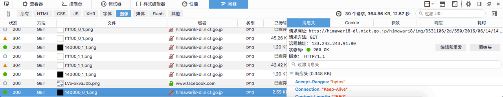

> The Himawari 8 weather satellite is one of the Himawari satellites made by
> JAXA, weighs around 3500kg and has an expected lifespan of over 15 years. The
> satellite was successfully launched on October 7, 2014 with the H2A rocket and
> is mainly used to monitor storm clouds, tsunamis, and active volcanos.

After launch, in addition to preventing natural disasters, Japan also released
photos taken by the satellite on the Internet, which can be downloaded by
enthusiasts. The photo is released on the official website at
[http://himawari8.nict.go.jp/](http://himawari8.nict.go.jp/)m and is updated
every 10th minute (like 9:30, 9:40...), with a 30-minute delay (the photo you
see at 10:00 is taken at 9:30).

Next, we're going to investigate how to obtain these pictures. With the network
monitor functionality of the browser, we can see the request URL:



In this case, the URL is
`http://himawari8-dl.nict.go.jp/himawari8/img/D531106/2d/550/2016/06/14/140000_0_1.png`.
There are a few important parameters:

- 2d
  - For image resolution. 2d means that the full image is split to 2x2 grids of
    550px x 550px each, or a total of 1100px x 1100px. By the way the website
    provides resolutions up to 20d, or 11000px x 11000px. Of course, don't try
    this unless you have an extremely fat Internet pipe.
- 2016/06/14
  - The date.
- 140000
  - UTC time for the picture. The image accessible at the URL is taken at 14:00
    UTC and released at 14:30 UTC.
- 0_1
  - Image coordinate in the grid. The two parameters are column and row indexes,
    starting from 0. In this case, the image from the first column, second row
    is requested.

With knowledge of the uses of the parameters, we can start coding. The following
PHP code outputs 4 images in a 2d grid in a table.

```php
<?php
function getHimawariUrl($d = 1,$x = 0, $y = 0){
    date_default_timezone_set('UTC');
    $pictime = time() - time() % 600 - 1800;
    $date = date('Y/m/d/Hi',$pictime);
    return "http://himawari8-dl.nict.go.jp/himawari8/img/D531106/".$d."d/550/".$date."00_".$x."_".$y.".png";
}
function writeHimawariTable($d=1){
    echo '<table style="margin:0;padding:0;cell-spacing:0">';
    for($i=0;$i<$d;$i++){
        echo '<tr>';
            for ($j=0;$j<$d;$j++){
                echo '<td></td>';
            }
        echo '</tr>';
    }
    echo '</table>';
}

writeHimawariTable(2);
?>
```

The following Javascript (needs jQuery) outputs an 1d image, result can be seen
[here](/en/page/himawari/):

```html
<script>
  $(document).ready(function () {
    var today = new Date()
    // get date for himawari picture
    t = today.getTime()
    t = t - (t % 600000) - 1800000
    today.setTime(t)
    year = today.getUTCFullYear()
    month = today.getUTCMonth() + 1
    day = today.getUTCDate()
    hour = today.getUTCHours()
    minute = today.getUTCMinutes()
    if (month < 10) month = '0' + month
    if (day < 10) day = '0' + day
    if (hour < 10) hour = '0' + hour
    if (minute < 10) minute = '0' + minute
    $('#himawari-time').text(today.toLocaleString())
    $('#himawari-pic').attr(
      'src',
      '//himawari.xuyh0120.win/1d/550/' +
        year +
        '/' +
        month +
        '/' +
        day +
        '/' +
        hour +
        minute +
        '00_0_0.webp'
    )
  })
</script>
<p id="himawari-time">Loading...</p>

```

While using the images, please note that since the satellite photo project is
non-profit, there is no guarantee for availability. It is possible that an API
change or excess bandwidth consumption will kill the website. Other projects
that use the images here, including
[EarthLiveSharp](https://github.com/bitdust/EarthLiveSharp) and
[Mantou Earth (Chinese Page)](http://www.coolapk.com/apk/ooo.oxo.apps.earth),
have their own CDNs to reduce the load on original servers.

Therefore I built my own CDN that caches images and converts them to WebP. To
support WebP on IE and Firefox, you may read
[this post](/en/article/modify-website/ie-firefox-webp-support.lantian).

The source website, `himawari8-dl.nict.go.jp`, can be simply CNAMEd to your own
domain, where you can add a CDN to it. Therefore, please pay attention to the
request frequency, and set up your own CDN if possible.
