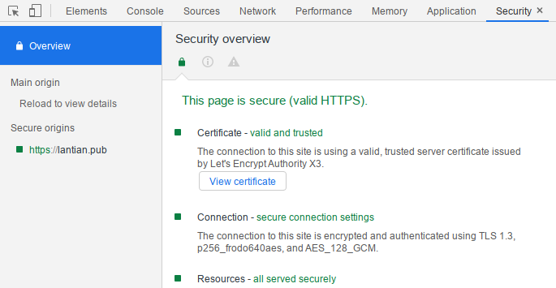

On the modern Internet, most websites already support HTTPS. The SSL/TLS
encryption protocol will encrypt users' requests and the website's responses so
that malicious users along the way cannot steal or tamper with the information.
One important component of SSL/TLS protocol is asymmetric cryptographic
algorithms. For these algorithms, the key separates into a **public key** and a
**private key**, with the public key being public and the private key protected
carefully.

Accessing an HTTPS website usually follows these procedures:

1. The website sends its **public key** (as a certificate) to the browser.
2. The browser will verify the public key in case that a man-in-the-middle
   modified the key in order to block or tap into the communication.
    - The browser (or the operating system) has a list of credible Certificate
      Authorities (CA) built-in, and they can verify cryptographically that the
      public key is generated by one of them.
        - The CA will use various measures (multiple levels of certificate
          chain, physically isolated key storage device) to protect their own
          private key so that no one can steal their private key and generate
          trusted certificates at will.
    - The browser will contact a server from the CA to lookup the Certificate
      Revocation List. The List stores all certificates that are indeed
      generated by the CA but cannot be trusted anymore due to a system
      error/private key leak.
3. After verifying the public key, the browser generates a **random key**
   locally for this connection.
4. The browser encrypts the random key with the website's public key and sends
   it to the website server.
    - The encrypted data can only be decrypted with the website's private key,
      not with the public key, so a man-in-the-middle cannot obtain the random
      key.
5. The website server decrypts the content with the locally stored **private
   key** to obtain the browser-generated random key.
6. The browser and website server start to talk using the random key with
   **symmetric encryption**, where both parties use the same key to encrypt or
   decrypt, such as AES.
    - Asymmetric encryption is no longer used since it's computationally more
      expensive, while symmetric encryption provides better performance.

Asymmetric encryption guarantees the security of exchanging symmetric keys
between the browser and website server and ensures that the data is not stolen
or tampered with.

But with the birth of quantum computers, there comes a slight change. With a
quantum computer that is "powerful enough" or having enough number of "qubits"
(quantum bits), the
[Shor's Algorithm](https://en.wikipedia.org/wiki/Shor%27s_algorithm) can
efficiently crack traditional asymmetric encryption algorithms including RSA and
ECDSA, as they rely on the difficulty on decomposing prime factors.

Yet, with all the heat around quantum computing, quantum computers evolve
rapidly. The most powerful quantum computer made public to this day is IBM's 53
qubit computer (See
[Quantum Supremacy on Wikipedia](https://en.wikipedia.org/wiki/Quantum_supremacy))
is still not enough for cracking RSA or ECDSA with Shor's Algorithm, but
technology developing at high speed may make this possible any time.

Therefore, cryptographers started to develop asymmetric encryption algorithms
that cannot be efficiently cracked with quantum computers, and promote their
usage, to prepare for the day when RSA is cracked.

Since late 2016, the [Open Quantum Safe Project](https://openquantumsafe.org/)
began integrating existing quantum-resistant algorithms into their `liboqs`
library, and integrating it to popular cryptographic libraries such as OpenSSL
and BoringSSL, to simplify the deployment of new cryptographic algorithms.

At the same time, the project also provides documentation on compilation and
integration of software, including Nginx, Chromium, etc. Therefore, by making
simple modifications according to the documentation, we can be prepared for the
birth of a practical quantum computer.

> WARNING: All post-quantum cryptographic algorithms here are relatively new and
> are
> [under the process of NIST standardization](https://csrc.nist.gov/Projects/post-quantum-cryptography/round-3-submissions),
> so they may still have undiscovered weaknesses. Although Open Quantum Safe
> does provide workarounds to reduce the risk, it's not recommended to use them
> in production before their standardization process is complete.

## Nginx / OpenSSL

Since Nginx uses OpenSSL or BoringSSL as the cryptographic library, there's no
need to make any change on Nginx, simply replacing OpenSSL with the Open Quantum
Safe version is enough.

Open Quantum Safe
[provides a modified Dockerfile that serves as a reference](https://github.com/open-quantum-safe/oqs-demos/tree/master/chromium).

Referring to the material above, I also modified my Dockerfile that I use to
compile Nginx, to use Open Quantum Safe's OpenSSL.
[It is available here](https://github.com/xddxdd/dockerfiles/blob/1195fb20a1dfcbcad0fa3c494fe7440841c35963/dockerfiles/nginx/template.Dockerfile).

Compared to compiling a normal Nginx, there are 2 main changes:

1. You need to use Open Quantum Safe's OpenSSL. You need to download and compile
   `liboqs`, install it to the source code directory of Open Quantum Safe's
   OpenSSL in order to use it. The related lines in my Dockerfile are 44-52:

    ```bash
    # Redacted
    && git clone -b OQS-OpenSSL_1_1_1-stable https://github.com/open-quantum-safe/openssl.git \
       # Some personal modifications omitted here, they're not necessary for post-quantum cryptography
    && git clone -b master https://github.com/open-quantum-safe/liboqs.git \
       && mkdir /tmp/liboqs/build && cd /tmp/liboqs/build \
       && cmake -DOQS_BUILD_ONLY_LIB=1 -DBUILD_SHARED_LIBS=OFF -DCMAKE_INSTALL_PREFIX=/tmp/openssl/oqs .. \
       && make -j4 && make install && cd /tmp \
    # Redacted
    ```

    All files are downloaded to `/tmp`. The key is to compile `liboqs` with
    `cmake`, and install it to the `oqs` subfolder in the OpenSSL source code
    directory.

2. Additional compilation parameters are needed to include `liboqs` in nginx. At
   lines 102-104 in my Dockerfile:

    ```bash
    # Redacted
    && ./configure \
       # Redacted some nginx parameters
       --with-openssl=/tmp/openssl \
       --with-cc-opt="-I/tmp/openssl/oqs/include" \
       --with-ld-opt="-L/tmp/openssl/oqs/lib" \
    && sed -i 's/libcrypto.a/libcrypto.a -loqs/g' objs/Makefile \
    # Redacted
    ```

And proceed to compile Nginx normally.

After the compilation and installation process is complete, you also need to
change the parameters to use the post-quantum asymmetric cryptographic
algorithms, including **key exchange algorithms** and **identity verification
algorithms**:

-   **Key exchange algorithms:** used for browsers and websites to exchange
    symmetric encryption keys.

    Simply change the `ssl_ecdh_curve` parameter in `nginx.conf` to use the
    elliptic curves of the algorithms, and we're done:

    ```bash
    ssl_ecdh_curve 'p256_frodo640aes:p256_bike1l1cpa:p256_kyber90s512:p256_ntru_hps2048509:p256_lightsaber:p256_sidhp434:p256_sikep434:prime256v1:secp384r1:secp521r1';
    ```

    `nginx -s reload` after making the modifications.

    Here only a fraction of the supported algorithms are enabled, mainly for 2
    reasons:

    1. Nginx has a limit on the length of the parameter and will emit an error
       otherwise;
    2. The parameters chosen are also supported in the BoringSSL variant of Open
       Quantum Safe, which is critically important in enabling Chromium support
       later.

    By the way, the key exchange algorithms all start with `p256_`, which means
    a traditional key exchange algorithm is also used along with post-quantum
    ones. This is to prevent the situation where the new algorithm has
    mathematical loopholes that allow even traditional (Von-Neumann) computers
    to crack this quickly. By using two key exchange algorithms at the same
    time, a quantum computer cannot crack them (assuming that the new algorithm
    works), while if the new algorithm is cracked, the key exchange data is
    still protected at the level equivalent to traditional key exchange, and
    won't be cracked immediately by traditional computers.

-   **Identity verification algorithms:** used by Certificate Authorities to
    generate public/private certificates to websites. In order to use these
    algorithms, you need to either find a CA that supports post-quantum
    cryptography (doesn't exist yet) to issue you a new certificate or generate
    one by yourself (not trusted by browsers). Neither of them works, so I
    choose not to use it now.

After finishing configuration, you can use the **curl** Docker image provided by
Open Quantum Safe to test your website:

```bash
# Replace the last parameter with the desired algorithm, same format as ssl_ecdh_curve
docker run -it openquantumsafe/curl:0.4.0 curl https://lantian.pub --curves p256_frodo640aes
```

## Chromium / BoringSSL

Although we have a command-line **curl** to verify it works, a full-fledged
browser's support makes post-quantum cryptography practical, providing users
with better protection. Open Quantum Safe also provides a modified BoringSSL
that allows you to experience post-quantum cryptography on the
[most popular browser in the world](https://gs.statcounter.com/browser-market-share),
once you compile it into Chromium.

Open Quantum Safe also
[provides a guide to compile Chromium that is available here](https://github.com/open-quantum-safe/oqs-demos/tree/master/chromium).
Compared to vanilla Chromium, the 4 main differences are:

1. `git clone https://github.com/open-quantum-safe/boringssl`, replacing
   BoringSSL in `third_party/boringssl/src` in Chromium source code with a
   modified one.
2. Download `liboqs`, compile and install to `oqs` directory in BoringSSL source
   code:

    ```bash
    git clone --branch master https://github.com/open-quantum-safe/liboqs.git
    cd liboqs && mkdir build && cd build
    cmake .. -G"Ninja" -DCMAKE_INSTALL_PREFIX=<CHROMIUM_ROOT>/third_party/boringssl/src/oqs -DOQS_USE_OPENSSL=OFF
    ninja && ninja install
    ```

3. Patch Chromium with
   [this modification that uses liboqs](https://github.com/open-quantum-safe/oqs-demos/raw/master/chromium/oqs-mods.patch).
4. Run `python2 src/util/generate_build_files.py gn` under folder
   `third_party/boringssl` to update dependencies, in order to include `liboqs`
   related content.

Then proceed to compile Chromium as normal.

I also modified a Chromium `PKGBUILD` file that Arch Linux users can use
directly. The latest PKGBUILD
[is available here](https://github.com/xddxdd/pkgbuild/tree/master/chromium-vaapi-oqs),
while the version when I wrote this post
[is available here (241cfaa)](https://github.com/xddxdd/pkgbuild/tree/241cfaad1d4e0c245efdfb345d9245ef57a07c82/chromium-vaapi-oqs).

> Note that compiling Chromium takes a really long time. It took 8 hours on my
> i7-7700HQ. If you have a weaker CPU, be prepared for waiting all day long.

After the compilation and installation process is complete, launch Chromium to
access a website with post-quantum cryptography, then open the `Security` tab in
Developer Tools:



Here `p256_frodo640aes` is being used, which means you're browsing with
post-quantum protection.

My website now supports post-quantum cryptography that you can use as a test. Or
you may access the
[official test site of Open Quantum Safe](https://test.openquantumsafe.org/),
which provides all combinations of key exchange and identity verification
algorithms, and allows for a more comprehensive test.

> An additional note, BoringSSL from Open Quantum Safe only supports a fraction
> of key exchange algorithms:
>
> P256_BIKE1L1CPA, P256_FRODO640AES, P256_KYBER90S512, P256_NTRU_HPS2048509,
> P256_LIGHTSABER, P256_SIDHP434, P256_SIKEP434
>
> This list is only available at the
> [official test site](https://test.openquantumsafe.org/). This is why I only
> selected them in the Nginx configuration.
