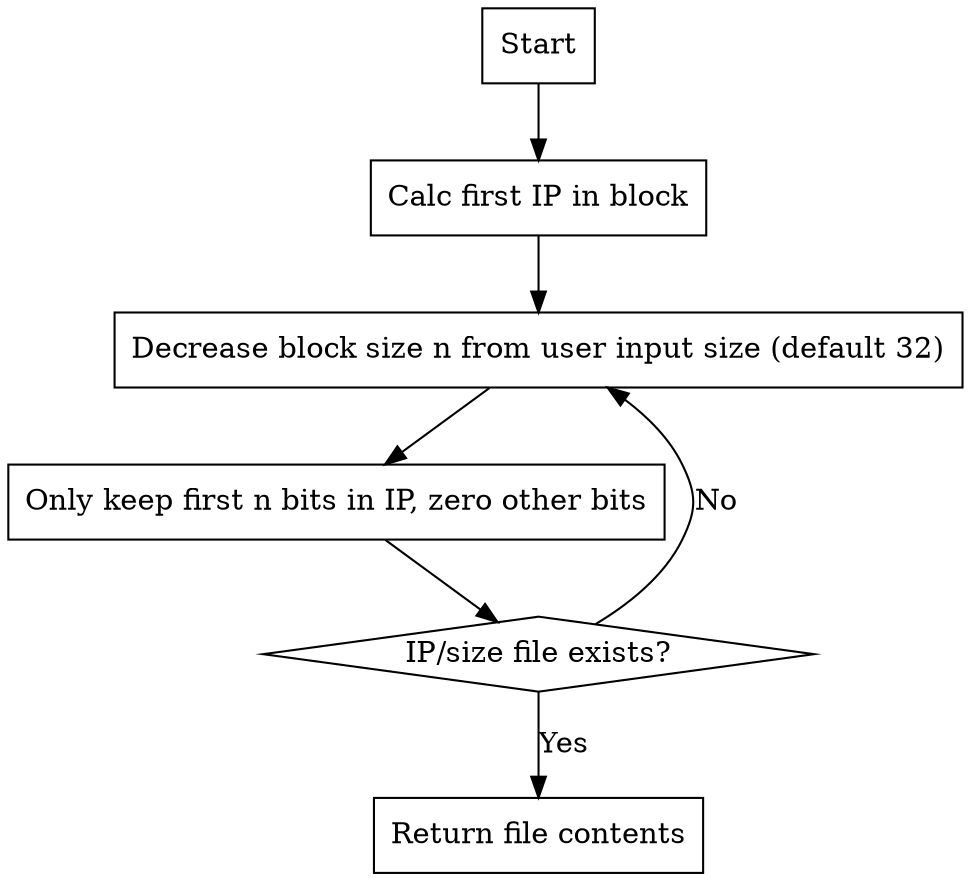

In my previous post,
"[Setting up Gopher Site with Nginx](/en/article/modify-website/serve-gopher-with-nginx.lantian/)",
I mentioned that the Gopher service is a byproduct of my original plan:
modifying Nginx into a WHOIS server for DN42. This post will explore into
details of that process.

## The WHOIS Protocol

First, we can find a WHOIS server to observe its response. Choose the WHOIS
server for `.pub` domain as an example, and run `telnet whois.nic.pub 43`:

```bash
# Type following line and hit enter
lantian.pub
# WHOIS server responded with:
Domain Name: lantian.pub
Registry Domain ID: c69e5ccf9d834900be26f88fddc5c9e4-DONUTS
Registrar WHOIS Server: whois.dnspod.cn
Registrar URL: https://www.dnspod.cn
Updated Date: 2021-01-07T14:09:11Z
Creation Date: 2016-10-23T08:36:41Z
Registry Expiry Date: 2029-10-23T08:36:41Z
Registrar: DNSPod, Inc.
# Snip
# Then WHOIS server closes connection
```

This is exactly the same as Gopher, another protocol that creates one response
to each request. Therefore, I can simply reuse my Gopher codebase for my WHOIS
server instead of adding extra modifications.

## Categorizing Queries

Since our nginx already had support for WHOIS, all we have to do is to add data.
However, "adding data" to a WHOIS server is not an easy task. Take the
[DN42 Registry](https://git.dn42.dev/dn42/registry) for example. Its data is
categorized into:

- `as-block`: Range of ASN, defining allocation policies.
- `as-set`: Group of ASNs, managed by each AS individually. It's used to label
  peered AS and downstream customers for automated routing policy generation on
  the Internet, but is not that useful in DN42.
- `aut-num`: Information for the AS itself.
- `dns`: Domains.
- `inet6num`: **Allocation** of IPv6 address blocks. This is not the same as
  routing information.
- `inetnum`: Allocation of IPv4 addresses blocks.
- `key-cert`: User's GPG keys. Users can store their GPG public keys here, if
  the use of a keyserver is unfeasible or impossible.
- `mntner`: Information of network maintainers.
- `organisation`: Information of organizations. For example, there's a professor
  participating in DN42, who asks his students to peer in DN42 as networking
  practices. He can form an organization with his students in this case.
- `person`: Information of users. What's different from `mntner` it that
  `person` is more focused on contact information.
- `registry`: Information of registries. A "registry", including RIPE or APNIC,
  manages IP and ASN. Information of interconnected networks is also here, for
  example ChaosVPN and NeoNetwork.
- `role`: User role information for permission granting purposes. Rarely used in
  DN42.
- `route`: **Routing** information for IPv4 blocks. An IP block can be split to
  smaller blocks for announcements.
- `route6`: Routing information for IPv6 blocks.
- `route-set`: Defines the IP space of DN42.
- `schema`: Defines file format in the registry.
- `tinc-key`: Public keys of Tinc VPN.

When users perform a query, they will only provide the query target itself, not
category/type information. Example queries are `lantian.dn42`, `172.22.76.185`
or `LANTIAN-MNT`. Luckily, files in the DN42 registry are named after
conventions different for each type, so a query type can be inferred, and we
will know which folder to check.

> Of course, no one's stopping you from putting everything into a single folder.
> It will definitely create a mess, though.

So I wrote a tiny bit of regular expressions:

```bash
rewrite "^/([0-9]{1})$" /aut-num/AS424242000$1 last;
rewrite "^/([0-9]{2})$" /aut-num/AS42424200$1 last;
rewrite "^/([0-9]{3})$" /aut-num/AS4242420$1 last;
rewrite "^/([0-9]{4})$" /aut-num/AS424242$1 last;
rewrite "^/([Aa][Ss]|)([0-9]+)$" /aut-num/AS$2 last;

rewrite "^/([0-9]+)\.([0-9]+)\.([0-9]+)\.([0-9]+)/([0-9]+)$" /inetnum/$1.$2.$3.$4_$5 last;
rewrite "^/([0-9]+)\.([0-9]+)\.([0-9]+)\.([0-9]+)$" /inetnum/$1.$2.$3.$4_32 last;
rewrite "^/([0-9a-fA-F:]+)/([0-9]+)$" /inet6num/$1_$2 last;
rewrite "^/([0-9a-fA-F:]+)$" /inet6num/$1_128 last;

rewrite "^/([^/]+)-([Dd][Nn]42)$" /person/$1-DN42 last;
rewrite "^/([^/]+)-([Mm][Nn][Tt])$" /mntner/$1-MNT last;
rewrite "^/([^/]+)-([Ss][Cc][Hh][Ee][Mm][Aa])$" /schema/$1-SCHEMA last;
rewrite "^/([Oo][Rr][Gg])-(.+)$" /organisation/ORG-$2 last;
rewrite "^/([Ss][Ee][Tt])-(.+)-([Tt][Ii][Nn][Cc])$" /tinc-keyset/SET-$2-TINC last;
rewrite "^/([^/]+)-([Tt][Ii][Nn][Cc])$" /tinc-key/$1-TINC last;

rewrite "^/([Rr][Ss])-(.+)$" /route-set/RS-$2 last;
rewrite "^/([Aa][Ss])([0-9]+)-([Aa][Ss])([0-9]+)$" /as-block/$1$2-$3$4 last;
rewrite "^/[Aa][Ss](.+)$" /as-set/AS$1 last;

rewrite "^/([^/]+)$" /dns/$1 last;
```

We aren't done yet, since the ext4 filesystem of Linux is case sensitive. If a
file is named `LANTIAN-MNT` in the registry, you will get 404 when you look for
`lantian-mnt`. The WHOIS client in Linux, for example, converts all queries to
lower case. Therefore, we have to convert upper/lower case for each folder, for
example:

> I'm using Lua here since Nginx itself isn't capable of transforming
> upper/lower cases.
>
> You will need to replace Nginx with [OpenResty](https://openresty.org) to use
> Lua.

```bash
location ~* "^/(dns)/(.*)$" {
    set_by_lua $uri_norm "return '/' .. ngx.arg[1]:lower() .. '/' .. ngx.arg[2]:lower()" $1 $2;
    try_files $uri_norm $uri =404;
}

location ~* "^/(aut-num|person|mntner|schema|organisation|tinc-keyset|tinc-key|as-set|route-set|as-block)/(.*)$" {
    set_by_lua $uri_norm "return '/' .. ngx.arg[1]:lower() .. '/' .. ngx.arg[2]:upper()" $1 $2;
    try_files $uri_norm $uri =404;
}
```

## Matching Smallest IP Block

The regular expressions and case conversion can handle many of the contents in
the registry, but the most important piece is missing: IP addresses. The user
may be looking up single IP addresses or IP blocks, and the WHOIS server needs
to return the information for a larger (or equal) IP block containing the target
IP. Suppose we have three IP blocks in our registry:

- `192.168.0.0/16`
- `192.168.16.0/20`
- `192.168.18.0/24`

Users should get different responses when looking up different IPs and blocks:

- `192.168.18.18` -> `192.168.18.0/24`
- `192.168.18.18/24` -> `192.168.18.0/24`
- `192.168.18.18/20` -> `192.168.16.0/20`
- `192.168.17.1` -> `192.168.16.0/20`
- `192.168.17.1/16` -> `192.168.0.0/16`

Such logic cannot be implemented in simple regular expressions and case
conversions. We need more complicated logic in Lua, with the following steps:



In other words, we're bruteforcing from /32, /31, and so on, until we got the
target. This is not an efficient approach, but what's good is that it doesn't
need any preprocessing or caching on the registry data.

The code is available at
[this GitHub Gist](https://gist.github.com/xddxdd/53efacf5b750c0f38759beff8e7b070d).

## Final Effects

My WHOIS server is deployed to [all my DN42 nodes](/en/page/dn42/), which can be
queried over either the Internet or DN42:

```bash
# User command input
whois -h 185.186.147.110 "172.22.76.185"

# Returned WHOIS results
% Lan Tian Nginx-based WHOIS Server Lua Logic
% GET /172.22.76.185
inetnum:            172.22.76.184 - 172.22.76.191
netname:            LANTIAN-IPV4
descr:              Lan Tian's IP space
remarks:            My network is open to peering; see https://lantian.pub/page/dn42
remarks:            or directly contact me at dn42@lantian.pub
country:            CN
# Snip
```

You may have a try yourself, to lookup DN42 IPs, domains, and users with the
WHOIS server.
