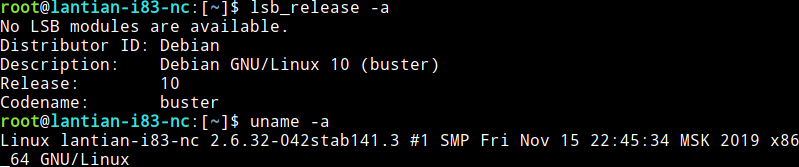

-   It's the year 2020. Why are you still using OpenVZ 6 VPSes?
-   Because they only cost one dollar per year.

Since the kernel of OpenVZ 6 is extremely old (Linux 2.6.32), newer systems
cannot function normally on an old kernel, so I had to stick to Debian 8 with my
previous OpenVZ VPSes.

But I found a
[modified Glibc (C language runtime library)](https://github.com/sdwru/glibc-debian-10/releases)
that allows running Debian 10 normally on OpenVZ 6.

## WARNING

I don't guarantee that the steps below are suitable for all OpenVZ VPSes, nor do
I ensure the safety/integrity of this Glibc (I didn't look into its
modifications, but speaking of security, the end-of-life OpenVZ 6 is probably
the farthest thing from security).

**Backup your data**, since in worst scenarios, you need to reinstall the OS.

## Steps

The author only provided DEB packages, but among them are debug symbols, etc.,
that normal users don't need, so I don't recommend running `dpkg -i *.deb`.

The author suggests to build a simple package repository locally before using
it, with the following steps:

```bash
# Download the latest version of modified glibc, due by the date this post is posted
wget https://github.com/sdwru/glibc-debian-10/releases/download/2.28-9910.0/glibc_2.28-9910.0+custom1.1_amd64.deb.zip
unzip glibc_2.28-9910.0+custom1.1_amd64.deb.zip
# Create a package repo at /opt/packages
apt -y install dpkg-dev software-properties-common
mkdir -p /opt/packages/binary
cp *.deb /opt/packages/binary
cd /opt/packages
dpkg-scanpackages . | gzip -9c > Packages.gz
# Add this package repo
add-apt-repository 'deb [trusted=yes] file:/opt/packages/ ./'
apt update
```

While following the steps above, I also uploaded the packages to my server. You
may use them directly, but it's a bit dangerous since the packages aren't
digitally signed:

```bash
echo "deb [trusted=yes] http://lab.lantian.pub/glibc-for-debian-10-on-openvz ./" > /etc/apt/sources.list.d/glibc-for-debian-10-on-openvz.list
apt update
```

After adding the repo, follow the normal Debian upgrade sequence, but don't
reboot yet (actually, you can't):

```bash
# Depends on your previous Debian version, corresponds to Debian 7, 8 and 9
sed -i "s/wheezy/buster/g" /etc/apt/sources.list /etc/apt/sources.list.d/*
sed -i "s/jessie/buster/g" /etc/apt/sources.list /etc/apt/sources.list.d/*
sed -i "s/stretch/buster/g" /etc/apt/sources.list /etc/apt/sources.list.d/*
# Start the upgrade
apt update
apt dist-upgrade
```

Now `hold` the Glibc package, or disallow apt from upgrading it automatically:

```bash
apt-mark hold libc6
```

After the upgrade process finishes, nothing should happen when you type `reboot`
and enter. Now you just need to reboot the server in your provider's control
panel.


