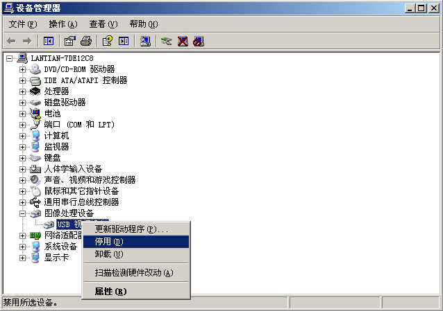

This post will explain the way to disable your webcam on Windows and Linux, so:

1. On the OS level, prevent you from turning on the webcam by mistake, and live-stream your footage of ~~having a meal~~ ~~lying on the bed~~ ~~playing games~~ ~~(NSFW)~~
2. Prevent certain online lecturing software from secretly turning on the webcam.

Windows Procedures
------------------

Press the `Win+R` combination key to open the Run window, type `devmgmt.msc` and enter to open the Device Manager. Your camera will be in `Image Acquisition Devices` category, right-click on it to disable it.

(The following picture is taken from a Simplified Chinese Windows XP, but the procedure and icons should be similar for Windows 7 and 10.)



When you need to use the camera, come back to re-enable it, and then close and reopen your browser or online lecturing software.

Linux Procedures
----------------

```bash
# First, close any software that uses your webcam,
# like your browser, online lecturing software, etc
sudo modprobe -rv uvcvideo
sudo nano /etc/modprobe.d/disablecamera.conf
# Type in this line and save
blacklist uvcvideo
```

When you need your webcam, run `sudo modprobe -v uvcvideo` to load the drivers. After you're done, run `sudo modprobe -rv uvcvideo` to unload it. After the load/unload, you simply need to close and reopen your browser or online lecturing software.
