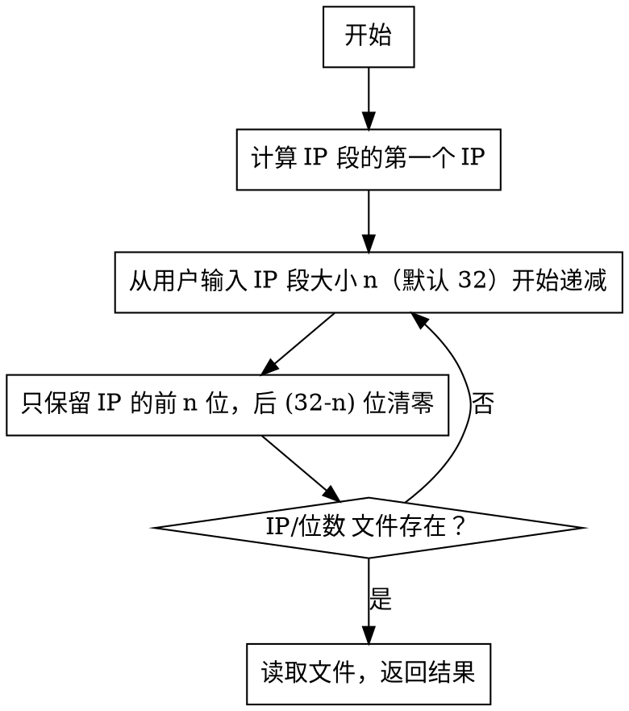

在前一篇文章《[用 nginx 建立 Gopher 网站](/article/modify-website/serve-gopher-with-nginx.lantian/)》中我提到，用 nginx 提供 Gopher 服务只是魔改的副产物，我原本的计划是将 nginx 魔改成一个 WHOIS 服务器，用于 DN42。这篇文章将介绍详细过程。

WHOIS 协议
---------

首先，我们可以找一个 WHOIS 服务器，来观察它都返回了哪些数据。以向 `.pub` 域名的 WHOIS 服务器查询我的域名信息为例，执行 `telnet whois.nic.pub 43`：

```bash
# 输入下面一行并按回车
lantian.pub
# WHOIS 服务器返回以下信息
Domain Name: lantian.pub
Registry Domain ID: c69e5ccf9d834900be26f88fddc5c9e4-DONUTS
Registrar WHOIS Server: whois.dnspod.cn
Registrar URL: https://www.dnspod.cn
Updated Date: 2021-01-07T14:09:11Z
Creation Date: 2016-10-23T08:36:41Z
Registry Expiry Date: 2029-10-23T08:36:41Z
Registrar: DNSPod, Inc.
# 略过部分内容
# 随后 WHOIS 服务器关闭连接
```

和 Gopher 一模一样，一问一答的协议。所以建立 WHOIS 服务器可以直接沿用之前 Gopher 的代码，不需要再额外修改代码。

将查询进行分类
-----------

既然 nginx 已经支持了 WHOIS，下一步只需要加入数据。但是对于一个 WHOIS 服务器来说，“加入数据”并不简单。以 [DN42 Registry](https://git.dn42.dev/dn42/registry) 为例，其中的数据被分为以下类别：

- `as-block`：一段 ASN 的范围，代表每段编号的分配规则。
- `as-set`：ASN 的集合，由各个 AS 自行管理。在互联网上被用来标记每个 AS 的对等连接（Peer）和下游客户，以便自动化配置路由策略，但在 DN42 中没什么用。
- `aut-num`：ASN 本身的信息。
- `dns`：域名信息。
- `inet6num`：IPv6 地址块**分配**的信息，注意和路由信息不同。
- `inetnum`：IPv4 地址块分配的信息。
- `key-cert`：用户的 GPG 密钥，如果用户不想/不能把自己的 GPG 公钥传到 Keyserver 上，可以选择放在这里。
- `mntner`：网络所有者（Maintainer）的信息。
- `organisation`：组织的信息。例如，DN42 中有个大学教授，让他的学生来 DN42 接 Peer 作为网络实践，他和他的学生就可以组成一个 Organization。
- `person`：用户的信息。与 `mntner` 不同的是，这里更侧重于用户本人的联系方式。
- `registry`：各个“注册局”的信息，注册局就是像 RIPE、APNIC 这样的管理 IP、ASN 资源的机构。同时还有与 DN42 互联的网络的内容，例如 ChaosVPN 和 NeoNetwork。
- `role`：用户角色信息，用于分配权限，在 DN42 中不常用。
- `route`：IPv4 地址块的**路由**信息，一段地址可以被分拆成更小的块来发布路由。
- `route6`：IPv6 地址块的路由信息。
- `route-set`：定义了 DN42 占用的地址空间。
- `schema`：定义了 Registry 里各种文件的格式。
- `tinc-key`：Tinc VPN 的公钥。

而用户查询时不会先输入类别信息，只会输入查询内容本身，例如 `lantian.dn42`，`172.22.76.185` 或 `LANTIAN-MNT`。幸运的是，DN42 中各种类别的文件格式都有对应的规律，可以据此判断查询类别，从而查找相应的文件夹。

> 当然也没人拦着你把所有内容复制到同一个文件夹下，只是这样会把文件夹搞得一团乱就是了。

于是我就写了一点点正则表达式：

```bash
rewrite "^/([0-9]{1})$" /aut-num/AS424242000$1 last;
rewrite "^/([0-9]{2})$" /aut-num/AS42424200$1 last;
rewrite "^/([0-9]{3})$" /aut-num/AS4242420$1 last;
rewrite "^/([0-9]{4})$" /aut-num/AS424242$1 last;
rewrite "^/([Aa][Ss]|)([0-9]+)$" /aut-num/AS$2 last;

rewrite "^/([0-9]+)\.([0-9]+)\.([0-9]+)\.([0-9]+)/([0-9]+)$" /inetnum/$1.$2.$3.$4_$5 last;
rewrite "^/([0-9]+)\.([0-9]+)\.([0-9]+)\.([0-9]+)$" /inetnum/$1.$2.$3.$4_32 last;
rewrite "^/([0-9a-fA-F:]+)/([0-9]+)$" /inet6num/$1_$2 last;
rewrite "^/([0-9a-fA-F:]+)$" /inet6num/$1_128 last;

rewrite "^/([^/]+)-([Dd][Nn]42)$" /person/$1-DN42 last;
rewrite "^/([^/]+)-([Mm][Nn][Tt])$" /mntner/$1-MNT last;
rewrite "^/([^/]+)-([Ss][Cc][Hh][Ee][Mm][Aa])$" /schema/$1-SCHEMA last;
rewrite "^/([Oo][Rr][Gg])-(.+)$" /organisation/ORG-$2 last;
rewrite "^/([Ss][Ee][Tt])-(.+)-([Tt][Ii][Nn][Cc])$" /tinc-keyset/SET-$2-TINC last;
rewrite "^/([^/]+)-([Tt][Ii][Nn][Cc])$" /tinc-key/$1-TINC last;

rewrite "^/([Rr][Ss])-(.+)$" /route-set/RS-$2 last;
rewrite "^/([Aa][Ss])([0-9]+)-([Aa][Ss])([0-9]+)$" /as-block/$1$2-$3$4 last;
rewrite "^/[Aa][Ss](.+)$" /as-set/AS$1 last;

rewrite "^/([^/]+)$" /dns/$1 last;
```

还没完，因为 Linux ext4 文件系统是区分大小写的，如果 Registry 里的文件名是 `LANTIAN-MNT`，你查 `lantian-mnt` 就会 404。而 Linux 的 WHOIS 客户端会将所有查询转成小写，因此我们还要对每个文件夹转换 URL 的大小写，例如这样：

> 这里我用了 Lua，因为 nginx 本身无法将 URL 转换大小写。
>
> 要使用 Lua，你需要用 [OpenResty](https://openresty.org) 替换 nginx。

```bash
location ~* "^/(dns)/(.*)$" {
    set_by_lua $uri_norm "return '/' .. ngx.arg[1]:lower() .. '/' .. ngx.arg[2]:lower()" $1 $2;
    try_files $uri_norm $uri =404;
}

location ~* "^/(aut-num|person|mntner|schema|organisation|tinc-keyset|tinc-key|as-set|route-set|as-block)/(.*)$" {
    set_by_lua $uri_norm "return '/' .. ngx.arg[1]:lower() .. '/' .. ngx.arg[2]:upper()" $1 $2;
    try_files $uri_norm $uri =404;
}
```

匹配最小 IP 段
------------

上面的正则表达式和大小写转换可以处理 Registry 中的大部分内容，却缺失了最重要的一部分：IP 地址。用户查询的可能是单个 IP 地址，也可能是一个 IP 段，此时 WHOIS 服务器需要返回大于等于这个 IP 段大小的、同时包含查询 IP 的信息。假设我们的 Registry 里有这样三个 IP 段：

- `192.168.0.0/16`
- `192.168.16.0/20`
- `192.168.18.0/24`

用户查询以下内容时就要被分到不同的 IP 段：

- `192.168.18.18` -> `192.168.18.0/24`
- `192.168.18.18/24` -> `192.168.18.0/24`
- `192.168.18.18/20` -> `192.168.16.0/20`
- `192.168.17.1` -> `192.168.16.0/20`
- `192.168.17.1/16` -> `192.168.0.0/16`

这样的逻辑用正则表达式和大小写转换是无法完成的，我们需要用 Lua 写一些更复杂的逻辑，大概流程如下：



简单来说，就是从 /32，/31 暴力查下去，直到查找到目标为止。这样查询的效率并不高，但优点是不需要对 Registry 的数据做任何预处理或者缓存。

详细代码可以在[这个 GitHub Gist](https://gist.github.com/xddxdd/53efacf5b750c0f38759beff8e7b070d)看到。

效果
----

我的 WHOIS 服务器已经部署在我的[所有 DN42 节点上](/page/dn42/)，可以从公网或 DN42 进行查询：

```bash
# 用户输入命令
whois -h 185.186.147.110 "172.22.76.185"

# WHOIS 结果返回
% Lan Tian Nginx-based WHOIS Server Lua Logic
% GET /172.22.76.185
inetnum:            172.22.76.184 - 172.22.76.191
netname:            LANTIAN-IPV4
descr:              Lan Tian's IP space
remarks:            My network is open to peering; see https://lantian.pub/page/dn42
remarks:            or directly contact me at b980120@hotmail.com
country:            CN
# 下略
```

你可以自行尝试用上述 WHOIS 服务器查询 DN42 内的 IP、域名、用户等信息。
