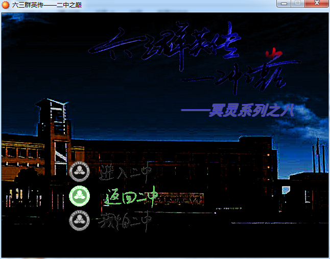
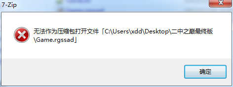
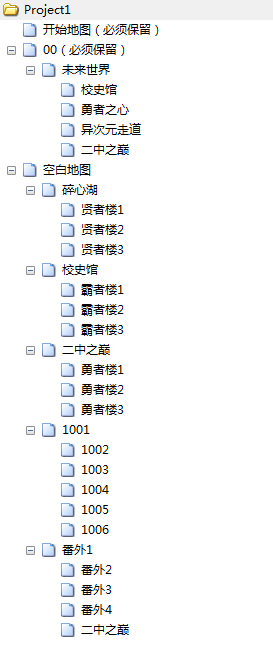
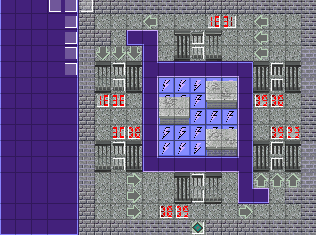
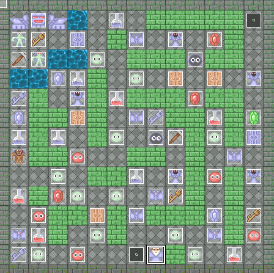
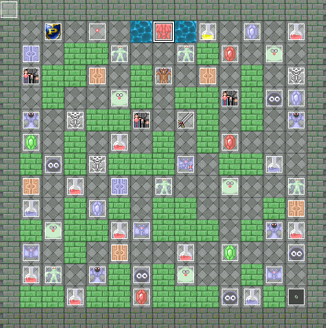
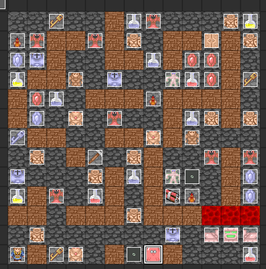
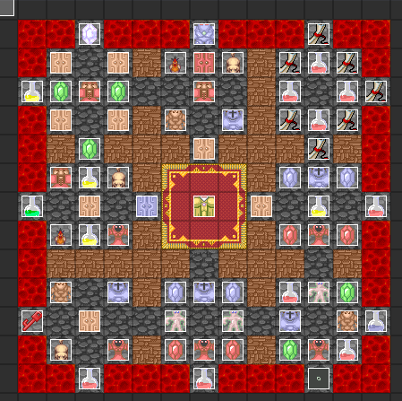
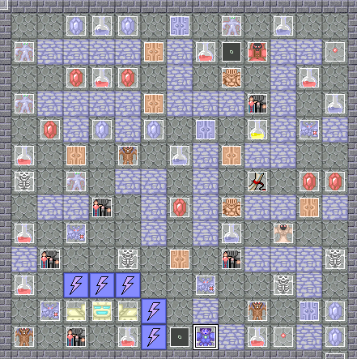
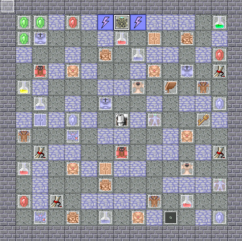

这几天晚上在上化学竞赛课。昨天的那节课，化学老师请来几个学长给我们传（jiang）授
（jiang）经（gu）验（shi）。学长们扯着扯着，扯到了他们空闲时自己做的一款魔塔游
戏——六三群英传——二中之巅。

这么高大上的游戏，而且是杭二中背景的，我当然要拿来看一下彩蛋。比起开游戏玩，更方
便的方法当然是反编译。

据学长自己说，游戏制作使用的是RPG Maker XP软件。这好办，下载来装
上。[http://xiazai.zol.com.cn/detail/43/426737.shtml](http://xiazai.zol.com.cn/detail/43/426737.shtml)

看着文件夹里一个9M大的Game.rgssad文件，我想着这就是游戏数据吧，右键尝试用万能解
压软件7-Zip打开。很明显，这招不行。

我刷新了一下文件夹，文件类型那里突然出现了一句话：

等等。加密？我喜欢。这种不需要输密码就能玩的“加密”游戏，肯定有解密方法。

Google一下，找到了RGSSAD专用解包
器：[http://www.pc6.com/softview/SoftView_62304.html](http://www.pc6.com/softview/SoftView_62304.html)

很快，解压好，进入RPG Maker XP新建一个项目，把解压出来数据文件覆盖进去，再打开项
目文件，解压完成。

接下来，我开始研究里面的彩蛋。先看地图列表。

首先看喜闻乐见的校史馆。

右键查看入口处1899年的事件，也就是查看走到这里会显示的历史。

> 1895年，魔族访问魔塔，得到了传说中勇霸贤三者的力量。
>
> 于是魔族人开始培养精英，炼成勇霸贤三大魔头。三魔头滥用法力，横行四方，屠杀无
> 辜。
>
> 终于，在1899年，一位神族后裔，美国人甘惠德，用他的知识和法术创造出两样神器——破
> 魔光明剑和破魔光明盾。
>
> 他用二神器以一敌三，惊险地将三魔头击败并封印在杭州二中的现校址。
>
> 他担心魔头会复苏，因此为了保护神器，他创办了私立蕙兰中学。
>
> 为了方便携带，甘惠德将二神器变成两个很小的装置，分别称为万能钥匙和万能门卡。

1923年：

> 1923年，蕙兰中学增设了高中部，在这一历史事件中，封印三魔头的地方被废弃了。
>
> 二神器改称为校长剑和校长盾，在主神的见证下，校长剑和校长盾为历届校长所拥有，为
> 后一任校长所继承。
>
> 校长的权利极大，校长剑作为钥匙可以打开学校的任何一间钥匙门，校长盾作为门卡可以
> 打开学校的任何一间电子门。

1940年：

> 1940年，魔族族长摄天王入侵杭州，由于时任校长在退敌时滥用校长剑盾，二神器的能量
> 耗尽。勇霸贤三魔头被释放！
>
> 情急之下，著名科学家、教育家竺可桢创办国立浙大附中，联合青年精英抗击勇霸贤三魔
> 头。
>
> 但由于魔头的实力太强，国立浙大附中被迫转移。
>
> 1944年，魔族溃败，摄天王逃离杭州，三魔头也被封印在原来的地方。
>
> 校长剑盾的能量被主神回复，国立浙大附中受到神族奖励。

1951年：

> 1951年，蕙兰中学和国立浙大附中合并，改称浙江省杭州第二中学。
>
> 从此杭州二中开启了辉煌的篇章。
>
> 1953年，列为杭州市重点中学；1963年，成为浙江省教育厅直属实验中学；1978年，被定
> 为浙江省重点中学……

1995年：

> 1994年，魔族复出，摄天王之子摄撒率领魔族四处征战。
>
> 1995年杭州二中被认定为浙江省一级重点中学，肩负抗击魔族的使命，杭州二中还在继续
> 向前走！

2000年：

> 2000年，废弃的封印地上，杭州二中建成，原校址改为分校。
>
> 新校址的建成让魔族无法再召出勇霸贤三魔头，自此全校上下团结一心，共同守卫这片美
> 丽家园。

研究完校史馆，研究下别的地方，比如贤者楼。

一楼刚进来有个来爷爷。

> 老人：厉害啊，曾经贤者之章的持有者，不愧是神啊！据说这里刚刚发现一种代表贤者力
> 量的不明物质，我想您这么厉害的人一定可以搞定吧。
>
> 你：太恶搞了，不过玩玩也不错。你是……
>
> 老人：哦，我原来是这个学校的老师，对世界的变化略知一二。
>
> 你：哦……原来是这样！等等，看你这霸气的样子，应该不是老师！
>
> 老人：这又从何说起？
>
> 你：看你这么老，应该是高一大名鼎鼎的来爷爷吧！
>
> 老人：厉害，答对了！要不要我的服务？
>
> 你：果然……
>
> 老人：在这里有很多种怪物，你的目标便是排除怪物的阻碍去见顶楼的头目，击败头目
> 后，和这幢楼对应的人就会出现！
>
> 你：谢谢了，然后？
>
> 老人：烧瓶里的液体是增加生命的药，而钥匙则可以开对应的门。
>
> 老人：左上角的家伙是天上派来的神，他可以提升你的战斗力，但他很贪财，所以你需要
> 给他越来越多的钱。
>
> 老人：初次见面，就送您一把黄钥匙吧！
>
> 你：谢来爷爷！

贤者楼顶楼的Boss叫八哥。

> 你：终于找到你了！
>
> 八哥：哦，你好帅啊！
>
> 你：不要给我废话，你身上是不是藏了什么东西？
>
> 八哥：来来来，我要看看你有多少厉害！
>
> （两人战斗）
>
> 八哥：哦厉害啊，果然是神！
>
> 你：快把东西交出来！
>
> 八哥：其实我的身上……带着一个瓶子，里面有不明物质，但它一到你手上，你就会把那个
> 无辜的贤者召唤过来。我是为了守住这楼才私藏物品的。
>
> 你：我正要让贤者来，这幢楼已经充满了魔族的气息，我不能让他们再这样消耗这里！快
> 放我走！
>
> 八哥：好的，入口已经打开了，我也应该闪了。

然后，勇者楼。

一楼如下。

> 胖二哥：数学太难学！
>
> 你：难吗？
>
> 胖二哥：真不难？
>
> 你：还……好吧！
>
> 胖二哥：你果真厉害啊……好，这是勇者楼，我相信，勇者无惧！
>
> 你：……无惧……确实很难……

一楼左下角有个人叫菊花，可以给你100经验升一级。

三楼如下。

> （先到中间顶上那个人那里）
>
> 小辉辉：啊，是不是有人在背后弄你！
>
> 你：好象是的。
>
> 小辉辉：好！CCZL果然在这儿，我把他抓出来！
>
> 你：那太好了！
>
> （然后到最中间）
>
> 你：原来是你！
>
> CCZL：被你发现了！
>
> 你：你好不好意思的！
>
> CCZL：就认准你了！
>
> （战斗）
>
> CCZL：哦，好痛……
>
> 你：为什么弄我？还有，怎么不见勇者来？
>
> CCZL：哦我也不知道啊，你问我有什么用，也许班长有思路。还有刚才黑魔来找过我了，
> 说他和班长谈过话了。
>
> 你：此话怎讲？
>
> CCZL：班长说现在是非常时期，尽快寻找失散的同学，所以你看到同学一定要和他们说个
> 话。
>
> 你：哦，理解了，谢谢。
>
> （如果你进入了番外篇）
>
> CCZL：哦，好痛……
>
> 你：为什么弄我？还有，怎么不见勇者来？
>
> （画面狂震）
>
> 你：什么情况！！！啊……勇者！！！
>
> （你切换到了另一个角色）
>
> 旁白：
>
> 二中之巅崩塌了……
>
> 躲在行政楼的普雷尔走了出来，满脸阴郁。
>
> 他为了他的自我已经苦苦思索的一个多月。
>
> 说好的挑战并没有如期而至，挑战者逃走了，而此事也就不了了之。
>
> 众人解散了，朗达应菊花的邀请回到了贤者楼。
>
> 普雷尔为了找朗达，也去了贤者楼。但他发现，贤者楼正发生着一系列变化……

霸者楼：

一楼：

起点旁边那个人的对话：

> 神牛边：你也来这里啊，每次期末考都考这么好，虚不虚的！
>
> 你：你才虚咧。
>
> 神牛边：考满分就不要狡辩了！
>
> 你：你干什么……
>
> 神牛边：没事，厉害的神。我就小小地出一份力吧！
>
> 你：说！
>
> 神牛边：根据我的观察，魔族人习惯于复制魔塔怪物和我们同学的身体为自己服务。
>
> 神牛边：那些“同学”，比如琛哥、财神、合成题，都是真同学的复制品，长相相似，能力
> 相似，但却没有记忆，因此你得杀掉他们维护人权。
>
> 神牛边：除此之外，这里还有一些怪物，来自魔塔，分为史莱姆、蝙蝠、法师、丧尸、战
> 魂。
>
> 神牛边：每一族的怪物都有各自的特点。你需要针对各自的特点采取应对的措施。
>
> 神牛边：每幢楼的最深处，都可能会有没被抓起来的同学，先把他们打败后救出，再回去
> 救被抓起来复制的同学。
>
> 你：哦，懂了。
>
> 神牛边：再见，厉害的神。
>
> 神牛边：等下，旁边就是校史馆我帮你开下门。

顶楼：

> 你：又见到一个人！
>
> 黑魔：学数学的智商应该都很高，不是吗？
>
> 你：少侮辱我智商，快说，这究竟是怎么回事？
>
> 黑魔：只怕你永远也不会知道了……
>
> 你：那就不客气了！
>
> （战斗）
>
> 黑魔：果然是搞数学竞赛的。
>
> 你：快说，到底是谁干的！
>
> 黑魔：要知道，勇霸贤三楼，都和学校的地形有关。
>
> 黑魔：刚才的贤者楼，代表水属性，就在二中碎心湖边，所以是音乐厅。
>
> 你：那么，这里呢？
>
> 黑魔：霸者楼，代表雷属性，需要强大的电力，所以除了实验楼，没有一处能提供这么多
> 的电力。
>
> 你：然后？
>
> 黑魔：勇者楼，火属性，烧火做饭，自然是食堂了。
>
> 你：可恶，连食堂也被占领了。
>
> 黑魔：所以，要干这样的事情，不是一般的人能做得到的。此人必定对二中非常熟悉，即
> 使是现在的魔族，也没有这个能力。
>
> 黑魔：贤者似乎很痛苦，因为他是分校的，所以并不了解。我不能再这样看着他受伤害。
>
> 嗯，看那边，霸者来了。这件事情我也不知道是怎么回事，那天总觉得有人跟着我，然后
> 我就被打晕了……
>
> 你：这不怪你，我们都是受害者。
>
> 黑魔：再见了，我要向班长报告这件事。
