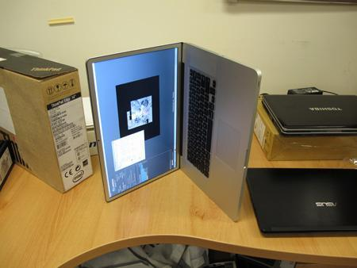

苹果笔记本的过热传感好像不是很敏感，我摸着出风口都烫手了，风扇还是坚持以2000rpm
的速度慢悠悠地转。当时的温度是90度。

笔记本电脑测出的CPU温度，达到70度有一点问题但是不大，达到80度有必要注意，达到90
度……马上检查机器有没有问题吧。过高的CPU温度会影响你的CPU寿命，也会影响你用电脑的
心情，甚至有可能在你把电脑放在腿上的时候烫你一下，你一激灵跳起来，你的一万块钱的
Macbook可就掉地上了。

在国外举行的一场“魔鬼级测试”中，测试人员在Macbook中安装专业测试软件，使Macbook满
负荷运行，CPU轻松烧到100度。之后，测试人员不得不将Macbook晾了一个晚上以恢复常
温，在测试过程中，这台可怜的Macbook Pro也只能以这个姿态立着：



所以，CPU温度问题一定要注意。

1）监测CPU温度

在Windows下，监测CPU温度的软件多如牛毛。不介意360的，可以用360硬件大师（鲁大
师）；或者你可以用驱动精灵；再或者你要强大，你就用Everest……

在Linux下，用lm_sensors就行。

```bash
sudo apt-get install lm-sensors
lm_sensors
```

忘了最后一句要不要sudo。我记得不用。

在Mac
下，[smcFanControl](/article/modify-computer/macbook-manual-config-cpu-fan-speed.lantian)为
你搞定一切。

2）控制CPU温度

1.设置风扇转速

在Mac
下，[smcFanControl](/article/modify-computer/macbook-manual-config-cpu-fan-speed.lantian)为
你搞定一切。

在Windows下，自行搜索LubbosFanControl。

在Linux下，我不知道。

2.选择合适的系统

Mac OS X是专门为苹果电脑优化的系统，但是Windows不是。根据实测，在不打开任何软件
仅保留桌面和测温度工具时，Windows下Macbook CPU温度比Linux高5摄氏度。

但是，如果你看Flash，Windows可能更适合你。Mac系统下Flash支持不佳，会导致较高的
CPU占用率，从而给你的CPU增加热量。

3.减少后台程序

后台运行的程序，比如Dropbox，没在下载东西的迅雷等等，都会消耗你的CPU。消耗CPU意
味着发热，所以这些东西平时关掉，要用了再开。

4.降低环境温度

为什么要这个方法我就不解释了吧。在大型的服务器机房里，每年夏天机房里的空调都会打
到20度左右全速运行，因为那些服务器用的E3E5E7以及其它各种至强都是性能超强发热也超
强的CPU，如果散热不做好，轻则影响寿命，中则异常关机，重则……煎鸡蛋……

夏天在家里，你在空调房里使用Macbook，比在非空调房里使用，温度一般低5到10度。

当然，你别和我说冬天在空调房里使用Macbook，热空调不在考虑范围。

一句话总结：哪凉快哪呆着去。

5.选用轻量级软件，以及过滤广告

Chrome这种吃内存不眨眼的，可以用Safari代替，会好一点。Opera或许也可以。

Chrome插件不用的先关掉，可以减少一个后台进程。

安装Adblock Plus以及FlashControl，过滤广告和Flash，减少CPU占用。

用了这些方法，你就不必担心你的电脑会煎鸡蛋了。
