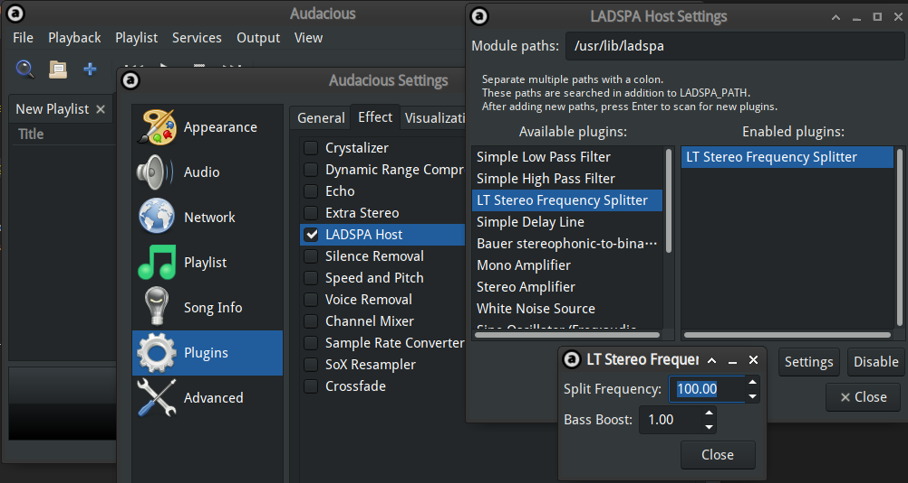

今年过年期间，我爸给了我一只漫步者 M120 蓝牙音响。这只蓝牙音响并不是高端型号，只
有两个扬声器，没有低音单元，并且也不支持 aptX、LDAC 这些高端的蓝牙音频编码技术。

> 虽然我觉得便携音响用这些也听不出区别。

我在用手机连上音响放歌时，发现这个音响竟然有一定的低频输出能力，或者说“能蹦”。说
到能蹦，我就想到去年我的一个同学买的 JBL Charge 4 音响。Charge 4 作为一个 1000块
钱的蓝牙音响，有着独立低音单元，低音非常震撼。于是我就想，虽然我的蓝牙音响也就
100 块，能不能通过一些软件手段提升它的低音表现，做到和 Charge 4 ”有点像“的程度
呢？于是我就打开 Android 上的音效神器 - ViPER4Audio FX 音效软件，把”动态系统“里
的低音拉高。此时，低音的确被增强了，但是扬声器开始出现了失真，具体表现为：当扬声
器播放了一个低音鼓点后，播放的音量会降低一瞬间，这是受扬声器的机械结构所限。

我本来打算对这个音响做一点改造，结果打开淘宝一搜，找到的低音单元要么是给立式音响
用的，要么非常的厚，要么非常的贵。再加上新型冠状病毒的影响，就算我买了低音单元，
也不知道快递要猴年马月才能到。

此时我突发奇想：一个扬声器受机械结构限制，在播放强劲的低音时中高音会失真，那么既
然我的蓝牙音响有两个扬声器，如果我用一个播放低音，一个播放高音呢？

于是就有了这个音效插件。

## 说明

这个音效插件针对的是同时符合以下条件的音频设备：

- 是“音响”，而不是“耳机”或者“耳塞”
  - 由于“用一个声道播放低音，一个播放高音”，本插件对耳机毫无意义
- 音响两个声道对应的扬声器靠得特别近
  - 如果两个声道分得很开，那么你会明显感觉到高低音分离的效果，降低音乐体验
- 音响没有独立的低音单元
  - 如果有的话，音响厂商一般已经把我搞的这些东西全部集成在音响里了，以为低音单元
    输出低频信号
- （一般而言）价格较低
  - 如果你的音响价格较高（例如 JBL Charge 4），那么你的音响一般已经有了震撼的低
    音效果，使用本插件继续提升低音可能会造成听力损害

## 安装及使用

音效插件可以在我的 Github
[https://github.com/xddxdd/ladspa](https://github.com/xddxdd/ladspa) 下载到。目
前（2020 年 2 月 18 日）里面只有这个分频及低音增强插件，但之后万一我有需要我可能
会添加更多的插件进去。

安装方法和标准的 CMake 项目一样：

```bash
git clone https://github.com/xddxdd/ladspa.git && cd ladspa
mkdir build && cd build
cmake .. && make && sudo make install
```

因为这是一个标准的 LADSPA 插件，可以用任何支持 LADSPA 的播放器加载，例如
Audacious：



其中 `Split Frequency` 表示低音高音分离的频率。例如按照图中设置，低于 100 Hz 的
声音会被输入一个声道并增强，高于 100 Hz 的声音会被输入另一个声道。而
`Bass Boost` 代表低音增强的倍数，例如 1 就是不增强，5 就是将低音幅度乘以 5 倍。

或者也可以用 PulseAudio，对所有软件生效。向 `/etc/pulse/default.pa` 的结尾加入如
下指令：

```bash
load-module module-ladspa-sink sink_name=splitfreq plugin=lt_splitfreq label=splitfreq control=80,5
```

其中 80 和 5 分别对应 `Split Frequency` 和 `Bass Boost` 的值。随后重启
PulseAudio：

```bash
pulseaudio -k # 结束当前的 PulseAudio 进程
# 然后随便找个播放器放首歌就行，PulseAudio 会自动重启
```

然后在你的桌面环境带的声音设置里，将 Splitfreq 选择为默认输出设备即可。

## 原理

这个音效插件在启动（指插件加载，一般也就是你的播放器或者 PulseAudio 的加载）时会
随机选择一个声道（扬声器）作为低音输出，另一个作为高音输出，以避免长期低音输出造
成两个扬声器输出不均衡的现象发生。

> 虽然我觉得这种几率不大，但是防患于未然。

插件先将输入的两个声道的声音进行平均，1：1 混合成单声道，反正在便携式蓝牙音响
上，单声道和双声道大部分时候也听不出什么区别。然后将输入音频通过一个低通滤波器，
阈值设置为 `Split Frequency` 的值，得到低音数据；用输入音频减去低音数据就是高音
数据。低通滤波器抄的是
[LADSPA 官方样例插件](https://www.ladspa.org/ladspa_sdk/download.html) 的滤波器
实现。

随后，低音数据被乘以 `Bass Boost` 以增强，然后输出到低音声道；高音数据不增强，直
接输出到高音声道。

## 效果

使用这个插件后，音乐的低音效果有了显著的增强，也就是“蹦”的更厉害了；同时，由于低
音高音分离输出，强劲的低音不会导致高音音量忽大忽小，大幅提升了体验。

有关参数选择：在我的漫步者 M120 蓝牙音响上，最佳的设置是 `Split Frequency` 为
80，`Bass Boost` 为 5。因为你的音响几乎肯定和我不是同一款，因此你需要自行找出最
适合你的参数。
