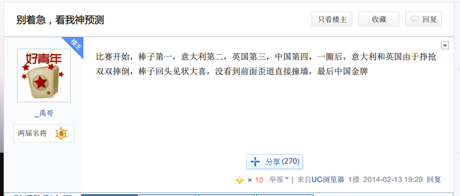
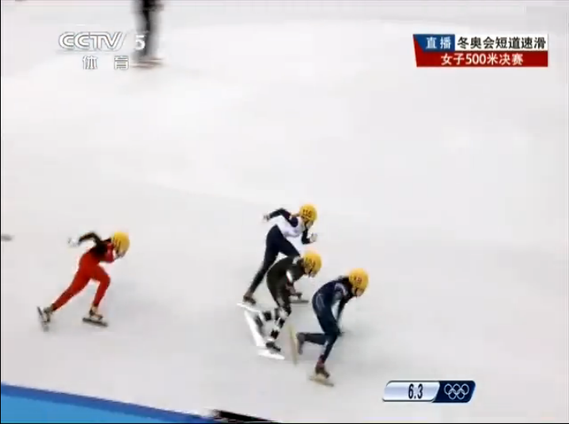
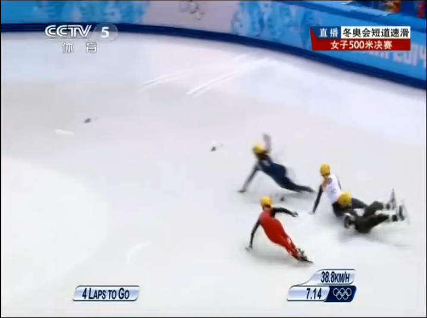
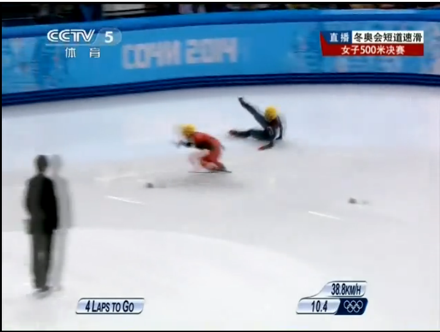

李坚柔最近火了啊……

<embed height="452" width="544" quality="high" allowfullscreen="true" type="application/x-shockwave-flash" src="http://static.hdslb.com/miniloader.swf" flashvars="aid=964603&page=1" pluginspage="http://www.adobe.com/shockwave/download/download.cgi?P1_Prod_Version=ShockwaveFlash"></embed>

但是她那神奇的夺冠方式，有贴吧网友已经预测到了有木有！

《[别着急，看我神预测](http://tieba.baidu.com/p/2865895607)》发帖时
间：2014-02-13 19:29

<blockquote>
比赛开始，棒子第一，意大利第二，英国第三，中国第四，一圈后，意大利和英国由于挣抢双双摔倒，棒子回头见状大喜，没看到前面歪道直接撞墙，最后中国金牌
</blockquote>

实际上呢？

根据谷歌+视频仔细观察的结果，中国李坚柔111号（红衣服），意大利安里安娜丰塔纳124
号（黑色衣服略带一点白），韩国朴升智138号（深蓝色衣服），英国伊莉斯克里斯蒂116号
（半黑半白）。

比赛开始6.3秒，视频里的顺序依次是138，124，116，111，也就是韩国、意大利、英国、
中国。

神啊！

7.14秒，英国妹子一个飞踢把意大利妹子和自己送了出去，棒子暂时没事。

虽然不是一圈以后……不过她们俩真的是在争抢。

神啊！

10.4秒，棒子脚下一滑，撞墙。

虽然没回头……

神啊！

最后中国金牌……

神啊！

该帖目前回复9758，1924人挤前排。
