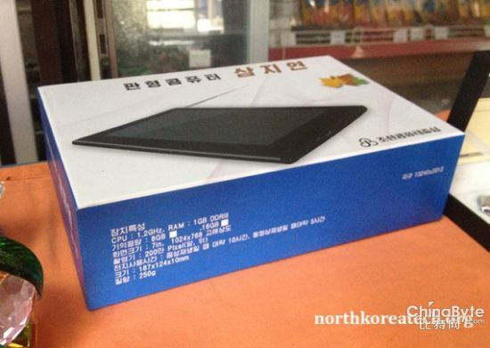
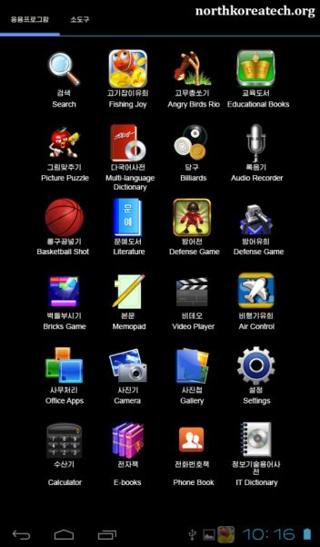

朝鲜是一个神秘的国度。

当朝鲜人开发出Red Star Linux时，人们惊呼：朝鲜还有这能力？

当朝鲜人在自己国家建立3G网络时，人们惊呼：朝鲜竟然还有3G技术？

虽然朝鲜的非智能手机都是中国进口，虽然目前为止朝鲜的安卓机也都是中国制造，但是朝
鲜突然宣布自主研发了安卓手机……我和我的小伙伴都惊呆
了。[这款手机名为阿里郎，来自当地一首民歌的名字。](/article/chat/north-korean-arirang-android-phone-shock-everyone.lantian)

但是，朝鲜人民的创造能力是无限的。既然他们连智能手机都造出来了，那么……下一个目标
是……

这个……那个……

1.首先我们来了解一下它叫什么。

它的英文名（也可以说是朝鲜拼音）是Samijyon，读出来试试……三明治！？

它的中文名叫三池渊，不知道这里面有什么深刻的含义。

2.对于一台平板电脑，我们最需要了解的是它的配置。

根据可靠消息：

CPU：1.2G，核心数不明。为什么我又一次想到了MT6589？

内存：1G。居然比我的G520大，这不科学。

摄像头：200万像素。这个比雷人的阿里郎要好一点，但是这可是我以前用的古董诺基亚N81
的水平。

屏幕：7英寸。是台小型平板啊……不过这分辨率1024x768，你在逗我？

内置存储8G，貌似还可以插最大16G的SD卡。

其实我可以告诉你可靠消息来自哪里。盯着盒子看一会，如果你还是看不出可靠消息，你需
要补习英语。注意，不是朝鲜语。

这台平板电脑主要面向外国游客出售。一名名叫迈克尔的网友称，其配置“堪比三星与苹果
产品”。朝鲜的科技已经发展到这种地步了？不过先别急着买，因为……

这台配置“堪比三星与苹果产品”的平板电脑，居然不支持WiFi……不支持WiFi……不支持WiFi……

当然，它能通过手机卡上网，不过朝鲜局域网有什么好玩的呢？不过，就算你不上网，三明
治平板里也有一些好玩的东西，比如——

我赌五毛这是盗版游戏。

3.软件配置

三明治平板面向外国客户，所以总要弄点外国人感兴趣的东西吧。

朝鲜人认为外国人最喜欢玩愤怒的小鸟，所以内置了这个。不过朝鲜是认真的吗？朝鲜不知
道现在大家都在玩Temple Run吗？

而且从图片上看，里面还有打砖块和两个塔防游戏。

不过，美帝的Gmail和Google Play就别想了，装了你也连不上。

当然，在朝鲜这个神奇的国度，领导人语录这种东西要是没有就不正常了。你还别说，里面
还真有。所以迈克尔推测朝鲜用它来做政治宣传。不过有谁看得懂朝鲜语吗？我需要翻译。

朝鲜说：我知道你看不懂，给你送一个多语言词典。

我……

4.价格

这台电脑卖给外国人，价格是每台200美刀，你去朝鲜玩一趟，参观一些指定的景点，拍一
些指定的照片，你就可以买一台三明治回家了。如果你RP够好，你或许还可以买一只阿里
郎。

祝你好运。
