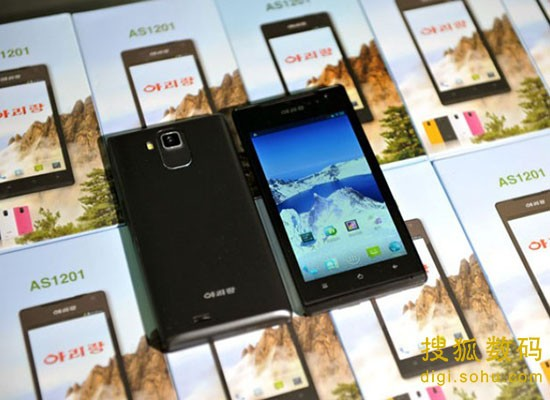

朝鲜是一个神秘的国度。

当朝鲜人开发出Red Star Linux时，人们惊呼：朝鲜还有这能力？

当朝鲜人在自己国家建立3G网络时，人们惊呼：朝鲜竟然还有3G技术？

虽然朝鲜的非智能手机都是中国进口，虽然目前为止朝鲜的安卓机也都是中国制造，但是朝
鲜突然宣布自主研发了安卓手机……我和我的小伙伴都惊呆了。

这款手机名为阿里郎，来自当地一首民歌的名字。

鉴于朝鲜手机不可能太好，所以我就拿几款廉价安卓手机来做一下横评。

参与横评手机：华为G520移动版，联想A288t移动版，红米移动版，HTC新渴望联通版。

关于制式问题，国产手机中不同制式之间价格差别一般不大。

1.价格与外观

<table>
<tr><td>型号</td><td>G520</td><td>A288t</td><td>红米</td><td>新渴望</td><td>阿里郎</td></tr>
<tr><td>尺寸/寸</td><td>4.5</td><td>3.5</td><td>4.7</td><td>4.0</td><td>4.2</td></tr>
<tr><td>价格/RMB</td><td>800</td><td>290</td><td>799</td><td>800</td><td>未知</td></tr>
</table>

看起来阿里郎的大小还算可以。

2.网络

<table>
<tr><td>型号</td><td>G520</td><td>A288t</td><td>红米</td><td>新渴望</td><td>阿里郎</td></tr>
<tr><td>网络（2G）</td><td>GSM</td><td>GSM</td><td>GSM</td><td>GSM</td><td>CDMA</td></tr>
<tr><td>网络（3G）</td><td>TD-SCDMA</td><td>TD-SCDMA</td><td>TD-SCDMA</td><td>WCDMA</td><td>WCDMA</td></tr>
</table>

据可靠消息，朝鲜2G网络使用CDMA，3G WCDMA网络也已经投入使用。阿里郎符合朝鲜国情，
但是CDMA+WCDMA的组合我从来没见过。

3.功能

首先说明一句，金三胖称赞阿里郎摄像头像素很高。

<table>
<tr><td>型号</td><td>G520</td><td>A288t</td><td>红米</td><td>新渴望</td><td>阿里郎</td></tr>
<tr><td>WiFi</td><td>有</td><td>有</td><td>有</td><td>有</td><td>有</td></tr>
<tr><td>系统（安卓版本号）</td><td>4.1</td><td>2.3</td><td>4.2（MIUI v5）</td><td>4.0</td><td>4.1</td></tr>
<tr><td>摄像头像素/万</td><td>500</td><td>320</td><td>800</td><td>500</td><td style="color:red">105</td></tr>
</table>

是的，你没有看错，我也没有写错，阿里郎摄像头像素是105万！因此，各大山寨手机厂商
纷纷放弃了山寨阿里郎的想法，因为他们根本不可能做出摄像头像素只有105万的手机！由
此看来，朝鲜的知识产权保护意识走在了世界的前列……

据说金三胖使用的手机是HTC Butterfly，那东西摄像头像素800万！由此看来，阿里郎的像
素真“高”啊！真“高”啊！

另外，诺基亚的宣传部门应该去检讨，他们最新的Lumia 1020手机摄像头像素是4100万，是
阿里郎的19倍，而它们居然没有让金三胖知道！

4.性能

虽然朝鲜落后，但是阿里郎不落后，它的CPU居然是四核的！四核的！四核的！四核的！

<table>
<tr><td>型号</td><td>G520</td><td>A288t</td><td>红米</td><td>新渴望</td><td>阿里郎</td></tr>
<tr><td>CPU（核心x频率）</td><td>4x1.2G</td><td>1x1.0G</td><td>4x1.5G</td><td>1x1.0G</td><td>4x?</td></tr>
<tr><td>CPU（具体型号）</td><td>联发科MT6589</td><td>展讯8810</td><td>联发科MT6589T</td><td>高通骁龙MSM7227A</td><td>?</td></tr>
</table>

由于高通是美国厂商，不能和朝鲜贸易，因此阿里郎的CPU只能是台湾的联发科生产的。根
据其四核数据，目测应该是MT6589。

因此，我们还是不能小瞧朝鲜啊！人家电脑才步入双核时代，手机就抢先一步到达四核了！
这让我们情何以堪啊！

如果阿里郎拿到中国卖，我估计售价在600元左右。
