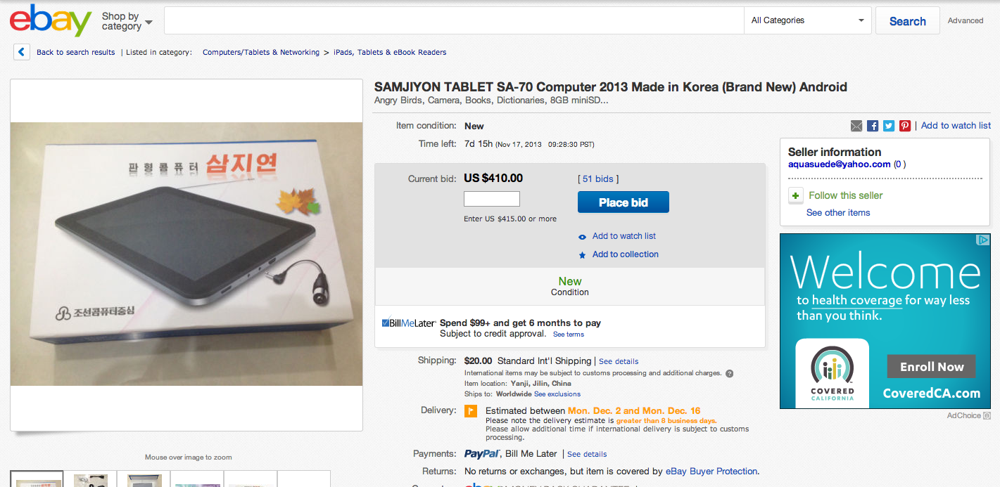

朝鲜搞出了“自主研发”
的[安卓手机](/article/chat/north-korean-arirang-android-phone-shock-everyone.lantian)，
还搞出
了[面向外国游客的三明治平板电脑](/article/chat/north-korean-android-pad-shock-everybody.lantian)。

既然有得卖，那么就会有好奇的人来买。既然有人买，那么玩过之后，就会有人卖。2013年
11月7日，国外著名拍卖网站eBay上出现了一台朝鲜三明治平板，起拍价4.15美刀。

据说拍卖这台平板的账号是加拿大的，发货地址是延吉，就在朝鲜边界。不知道是哪个加拿
大人玩完朝鲜在中国暂住，还是哪个天朝居民用了一些奇葩的方法。

先不管是谁拍卖的了，这台平板虽然配置比之前的差一些，CPU 1Ghz（原来1.2Ghz），屏幕
分辨率只有800x480（原来1024x768，但是大小还是7寸不变），内置存储4G（原先有8G款和
16G款），但是开拍3天后，价格疯长到410美刀，是原价200美刀的2倍，看来美帝人民兴趣
颇高啊。
