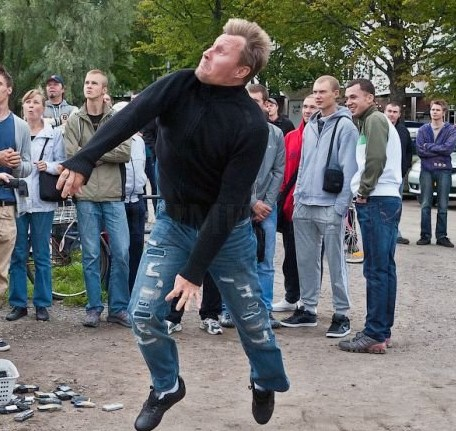
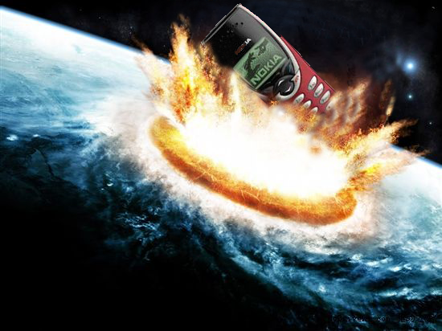

对于芬兰人来说，8月24日是一个不平常的日子。从2000年开始，每年的这天，芬兰会在萨
沃林纳举行世界扔手机竞标赛。

今年该比赛男子组前三名的成绩是97.73m、87.88m、86.09m。女子组第一氏40.41m。

该比赛的目的是让人们以壮观的方式告别自己的旧手机，并有可能免费获得一只新手机。参
加比赛的要求只有一个：手机重量220g-400g之间。

不过蓝天脑补了一下，为什么在芬兰举行，这里好像有个什么特产……哦，原来是这个！

这是要毁灭地球的节奏啊！

<blockquote>
娱乐、通讯、防身、拯救世界等功能应有尽有。价格便宜，方便携带，你，值得拥有！

世界上密度最大的四种物质之一，另外三种是切糕、中子星和黑洞，

也是世界上物理破坏力最大的三种物品之一，另外两种是NVIDIA的战略用军事用显卡武器
GTX690和反物质，

是由位于芬兰的诺基亚军事和航天科技研究公司（Nokia Corporation）所量产化的大杀
器。

目前已经超过6亿部的诺基亚被生产出来，作为保障地球免受外星文明入侵的究极武器。

当然，由于它们的抗打击性能及破坏力优越，能轻松防御住lv.5御坂美琴的超电磁炮，甚至
可以轻松击倒铃科百合子。

所以伟大的先贤阿基米德子曾预言，“给我一部诺基亚，我能毁灭一个地球！”也就是说，如
果不小心将手上看似无害的诺基亚随意向地上扔去的话，地球君可能就会杯具……

</blockquote>

引自萌娘百
科：[http://zh.moegirl.org/%E8%AF%BA%E5%9F%BA%E4%BA%9A](http://zh.moegirl.org/%E8%AF%BA%E5%9F%BA%E4%BA%9A)

在此蓝天对这种严重危害到地球安全的行为表示强烈的谴责！
