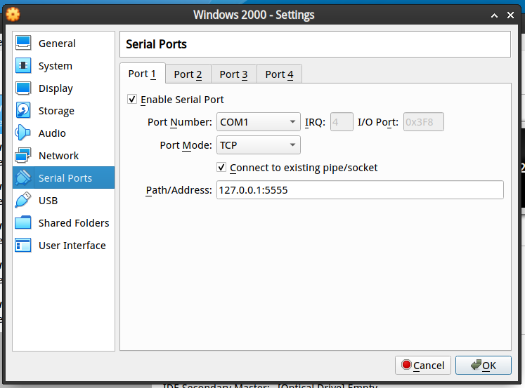
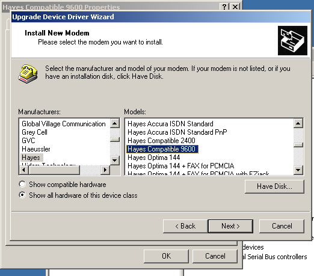
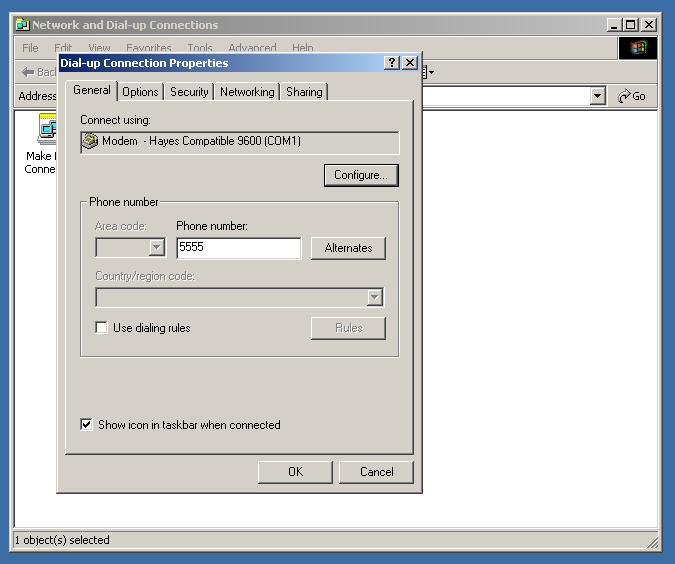
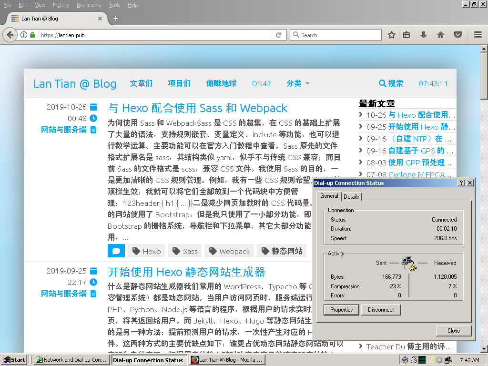

- 今年真的是 9102 年了吗？
- 是的。

出于怀旧的目的，我想尝试一下在 Windows 2000 等旧操作系统中拨号上网。当然，在 2019 年绝大部分人都已经不会有使用电话线的调制解调器，甚至不会知道曾经有它存在。现在的电脑也早已没有了电话线接口，ISP 也不再提供拨号上网服务。

[Doge Microsystems 的这篇文章](https://dogemicrosystems.ca/wiki/Dial_up_server)提供了自建拨号上网 ISP 的一种方法。文章作者购买了硬件电话 Modem，使用 Asterisk 建立了基于 SIP 的网络电话交换网，然后使用 Analog Telephone Adapter（ATA，模拟电话转 SIP 网络电话的设备）将 Modem 连接上交换网。同时作者使用 Linux 下的 mgetty 操作 Modem，结合 pppd 提供了一个 PPP 拨号服务。

这样操作的主要问题是：一整套设备太贵，而且也占地方。这个作者用来拨号的是一台物理的 Windows 98 主机，而不是像我一样使用虚拟机。如果我采用类似的方案，我还需要各种转换线以及 Hub 才能将所有设备连上主机，并且还要在虚拟机软件中设置直通。

我更倾向于用软件模拟 Modem 的串口指令操作。现在的虚拟机软件（例如 VirtualBox、QEMU 等）都可以将串口转发到 TCP 端口或者 Linux 下的命名管道，而模拟软件仅需要提供二者之一即可。我选择的是 [Nandhp 的 ATduck](https://github.com/nandhp/atduck)。

与[《树莓派 3B 折腾笔记：串口拨号上网》](/article/modify-computer/raspberry-pi-3b-ppp-dial-ethernet.lantian/)这篇文章不同的是，这篇文章中的通信基于“裸 PPP 协议”，完全没有 Modem 的部分；而本文中模拟的是一个完整的、兼容 Hayes 协议的调制解调器。

安装 ATduck
----------

ATduck 本身安装简单，但是它依赖 Perl 的 IO-Pty 模块，以及 Slirp 软件。Slirp 可以在一个 TTY 上模拟一个 SLIP 或者 PPP 协议的服务端，ATduck 本身只实现了 Modem 的部分，联网部分都交由 Slirp。

但是由于显而易见的原因，Slirp 已经很少用到了。Arch Linux 的软件源里根本没有，甚至连 AUR 里都没有。根据 [Wikipedia 的 Slirp 页面](https://en.wikipedia.org/wiki/Slirp)显示，Slirp 的部分维护交由 Debian 维护者进行。

因此，我基于 Debian Buster 做了一个 ATduck 的 Docker 镜像。镜像开了 TCP 5555 端口，将 VirtualBox 等的虚拟串口指向这里即可。镜像的 Dockerfile 可以[在这里看到](https://github.com/xddxdd/dockerfiles/blob/master/dockerfiles/atduck/template.Dockerfile)。

直接用 docker-compose 启动：

```yaml
version: "2.1"
services:
  atduck:
    image: xddxdd/atduck
    container_name: atduck
    restart: always
    ports:
      - "127.0.0.1:5555:5555"
```

然后在 VirtualBox 中如图配置：



配置 Windows 2000
-----------------

Windows 2000 启动后，会自动找到一个 Unknown Modem（未知调制解调器）。我们要进入设备管理器，装上兼容 Hayes 调制解调器协议的驱动。

在安装驱动界面，选择手动选择驱动（不要自动识别），然后选择 Hayes 厂家的 Hayes Compatible 9600 驱动，如图：



驱动安装完成后，添加拨号网络连接，拨号号码设置成 5555，协议选择 PPP，用户名密码任意填写。ATduck 在识别到这个号码后，会自动启动 Slirp 来模拟 PPP 握手过程。



双击拨号上网，整个流程就结束了：



一点小问题
---------

ATduck 还是有一点小 Bug 的。如果你断开了拨号连接，第二次拨号时可能会失败。似乎是 ATduck 没有正确识别到挂断的命令。
