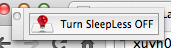
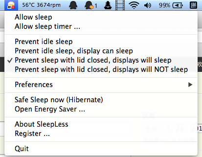
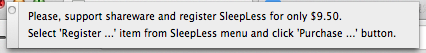

以前我不用电脑时，就把盖子合上，屏幕灭了，迅雷还在下载文件，QQ还在挂着，真好。
:-)

不过苹果电脑一旦合盖，那是真正的待机，网断了，QQ和迅雷不用想了。QQ还可以用手机来
挂，但是迅雷……

即使是手机挂，也要费电。手机也要充电，但是Macbook待机一段时间会自动休眠，休眠了
USB接口会自动断电，手机就不能继续充电了。早上醒来，我就没见过我手机电量满。所
以，这个Bug一定要解决。

于是我上网找，找到了一款软件：Sleepless。顾名思义，这款软件可以让你的电脑不待机
不休眠。

下
载：[http://bbs.weiphone.com/read-htm-tid-2578204.html](http://bbs.weiphone.com/read-htm-tid-2578204.html)

下载下来解压后是一个APP，拖到应用程序文件夹，然后在Launchpad里打开。

由于这款软件是收费的，免费的有广告，所以打开后屏幕上两个窗口，一个是广告，一个是
快捷关闭Sleepless，两个窗口都可以关闭。

软件开启后，在任务栏上生成一个电灯泡图标，点击它打开菜单。

菜单中从上至下四个选项，分别是：

1.阻止空闲待机，显示器长亮（这个在设置里就可以关掉）

2.阻止空闲待机，但是显示器会关掉（设置也可以实现）

3.合上电脑时不待机，但是显示器会关掉

4.合上电脑时不待机，显示器也亮着（谁会选这项？？？）

只要选择第三项就可以了。把你的Macbook合上再打开试试，你的QQ会不会掉线了？

另外，为了方便起见，最好给它设置开机启动，方法：把APP从Launchpad里拖到Dock上，右
键点图标-设置-登录时启动，勾上。之后Dock里的图标可以删除。

再另外，软件未注册有广告，貌似没有可用破解。觉得烦的朋友可以买注册码，不过要9.5
美刀，有点贵。我觉得还不如自己去关闭广告窗口好了。

