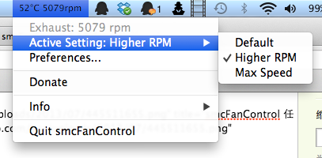
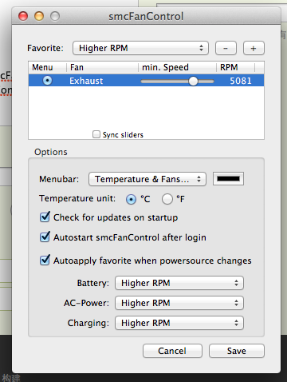

苹果在设计产品的时候，总是想尽一切办法把产品做薄。对于手机来说，问题不大，但是对
于笔记本电脑来说，电脑越薄，机器就会越烫！

但是如果CPU长期处在温度很高的情况下运行，那么CPU就会加速老化，寿命变短，你就得更
早去换CPU或者换电脑。所以，一定要经常注意CPU温度。

起因是我在B站看视频的时候，发现我的Macbook出风口的地方很烫。我马上觉得，我应该找
一个CPU温度监测软件来看看是什么情况。

于是我找到了[smcFanControl](http://www.eidac.de/?p=243)，这是一款CPU温度检测＋风
扇速度控制的软件，可以在任务栏上添加一个图标，并且实时显示你的CPU温度和转速。

下载之后，是一个app文件，在dock上随便一个图标（ finder、窗口图标、下载、垃圾桶除
外），右键-选项-在Finder中显示，把这个app拖到出现的文件夹里就行。然后在Launchpad
里把app打开。

打开时，由于我的系统是10.9，软件支持到10.8，所以有警告告诉我可能会出错。不过经过
我的测试，10.9运行一切正常。同时也要注意，你不能安装其它的风扇控制软件，否则出
bug别怪我。

打开一看，CPU温度，90摄氏度。风扇转速，2000转。这什么情况！！！

我之前用的华硕笔记本虽然不带风扇速度的设置功能，但是CPU一旦烧到80摄氏度，风扇就
会自动全速运行，30秒内让温度回到70摄氏度。这样才能保证CPU的安全。苹果你作何感
想！！！

直接单击菜单，打开设置（Preferences）。

主界面就是这个样子的，我直接在上面点＋号创建了一个Max Speed，风速条直接拖到最右
边6200转，确定。

10秒钟后，电脑风扇开始呼呼呼地转起来。1分钟后，CPU温度降到了65摄氏度。

但是CPU风扇长期在最高速下面运行也会导致风扇老化故障。所以我把Higher RPM一项（速
度较高）的风速设置成5000RPM。经过测试，在我的Macbook下可以保持CPU温度在65摄氏度
不变。这个温度对于CPU是相对安全的。

今后，一旦CPU烧到70度以上，就可以开Max Speed，降回65左右就开Higher RPM，虽然噪音
大了点，但是机器安全更重要啊。
