OS/2 是起初由 IBM 与微软公司联合开发，后续由 IBM 维护的操作系统。在上世纪 90 年
代，OS/2 是 Windows 的有力竞争者，但 OS/2 后续在市场上被 Windows 系列击败，IBM
也在 2006 年 12 月 31 日最终停止了 OS/2 Warp 4 的技术支持。

但是，这并不意味着 OS/2 的死亡。在官方技术支持终止后，Serenity System 公司接手了
OS/2 的开发，并以 eComStation 的名字继续开发；2015 年，另一家公司 Arca Noae LLC
也推出了一款基于 OS/2 的发行版 ArcaOS，并且作为商业产品出售。

同时，开源社区也在为 OS/2 提供一些技术支持。开源社区在 OS/2 上交叉编译了常用的
Unix 工具（例如 ls，rm 等），RPM/YUM 包管理器，以及一系列的库。这使得 1996 年就
发布的 OS/2 Warp 4 系统可以运行一些（相对）现代的应用程序，例如 Firefox 45.9 浏
览器。

本文中，我将介绍在 VirtualBox 虚拟机中安装 OS/2 Warp 4 操作系统，并且安装
Firefox 浏览器。

## 安装操作系统本体

我选择安装原版的 OS/2 Warp 4 操作系统，因为 eComStation 和 ArcaOS 两款商业发行版
都要价 200 美元左右，对于我这次的目的（体验一下）完全不值得。这两款商业发行版应
该是针对受应用程序限制，只能继续使用 OS/2 的客户的。

我们可以在 WinWorld 网站上下载 OS/2 Warp 4 的安装 ISO 镜
像，[点击这里可以进入下载](https://winworldpc.com/product/os-2-warp-4/os-2-warp-452)。
我下载的镜像是 `IBM OS2 Warp 4.52 (4.52.14.086_W4)`，这是 OS/2 Warp 4 的最后一版
发行的镜像，包含了之前的系统更新，类似于“Windows XP with SP3”。

> 下载完成的压缩包里包含有 Boot 和 Client 两个 ISO 镜像。Boot 镜像是启动盘，用来
> 启动 OS/2 的安装程序；之后，安装程序会提醒你取出 Boot 启动盘，插入包含操作系统
> 文件的 Client 盘。

现在我们先在 VirtualBox 中创建一个虚拟机。我使用的配置是内存 512 MB，硬盘 4 GB，
对于 OS/2 已经绰绰有余。然后向虚拟机加载 Boot 镜像，启动并进入如下界面：

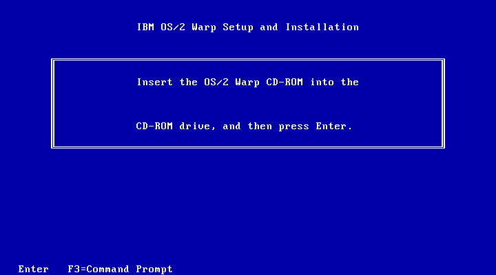

这里就是上面说的提示，你需要切换到 Client 镜像，然后回车继续安装。

一路 Next 后，你会进入分区界面。注意 OS/2 的分区逻辑和我们常用的 Windows 和
Linux 都有点区别（其实我也搞不太清楚），但是因为我们只需要一个分区用来启动系统，
按照下面的步骤操作即可：

首先选择 `Install boot manager` 安装启动管理程序（类似 bootmgr 和 Grub）。

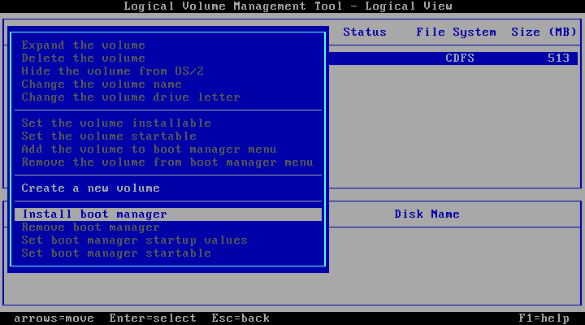

然后创建一个 Volume（类似于 Windows 的盘符，或者 Linux 的挂载点）。注意要选择
`can be made bootable`（可以启动操作系统），并且给它随便命一个名字（不能为空）。

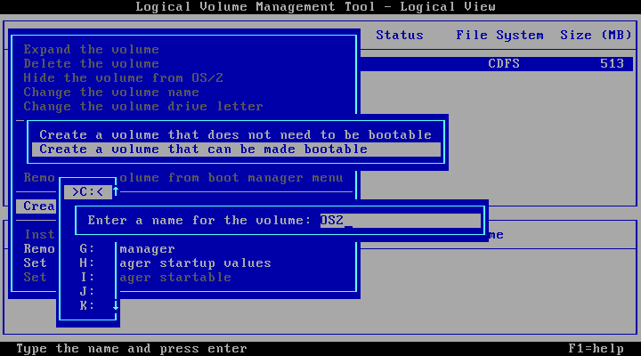

下一步是选择这个 Volume 对应的硬盘分区。我们选择 `Allocate from free space`（从
空闲空间分配），给分区命名，然后输入分区大小即可（默认是全部占满），

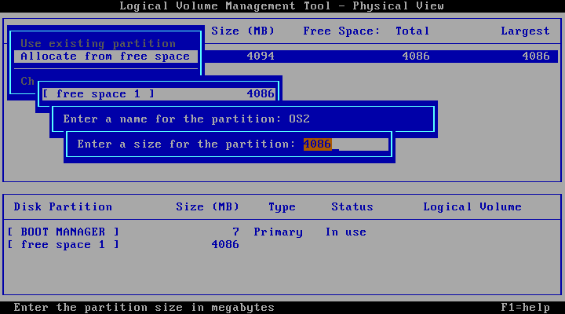

按 F3 退出分区程序，并保存修改。

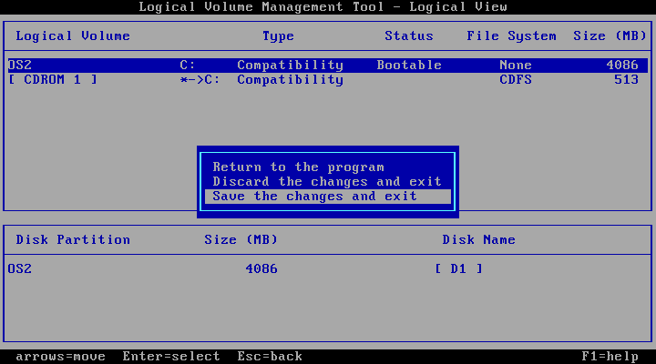

分区程序会提醒你必须重启才能继续安装 OS/2。这里把光盘换回 Boot，然后直接重启虚拟
机。

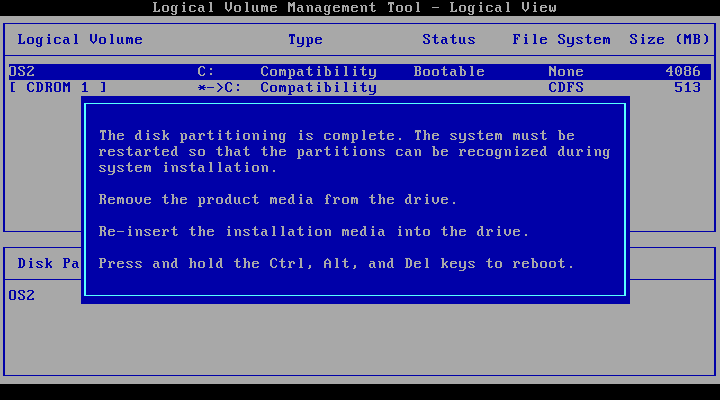

之后重新插入 Client 光盘，继续安装程序，基本上一路 Next 即可。只有一处需要注
意，OS/2 的声卡支持默认是没有打开的。在安装程序复制完文件、第一次重启后，会有一
个界面提示你需要安装什么功能，这里点击 `Multimedia Device Support`（多媒体设备支
持）：

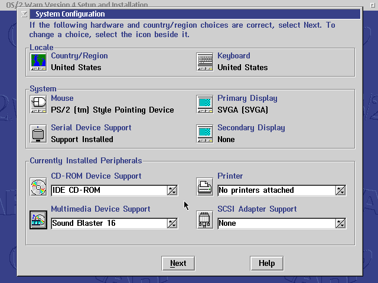

然后找到 Sound Blaster 16（VirtualBox 模拟的声卡型号），然后把它添加到右侧安装：

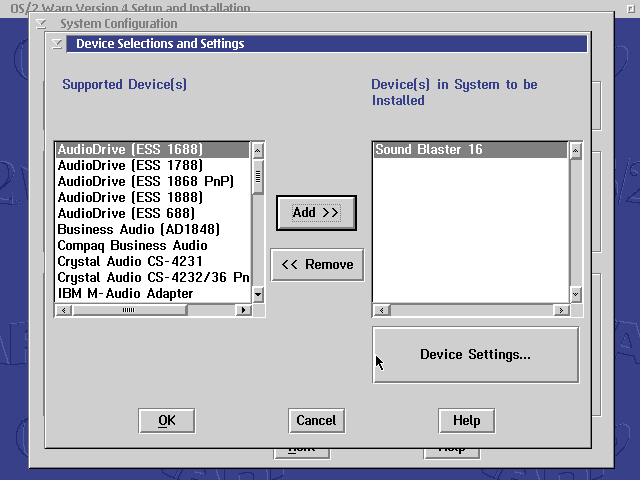

然后继续下一步。中间有一步会让你输入用户名和密码，设置完后继续下一步，直到进入桌
面。

进入桌面后会弹出一个界面，让你选择要不要安装一些安装镜像自带的软件。这里我全部安
装了，但是不安装也不会影响后续操作。

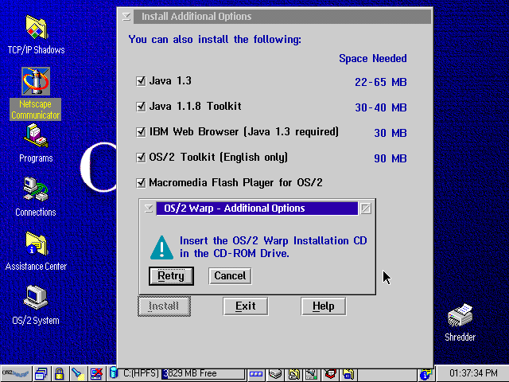

至此，OS/2 Warp 系统本身的安装已经成功。我们需要做一些显示、网络的基本配置。

## 启用网络和高分辨率显示

双击桌面上的 `OS/2 System` 图标，再双击 `System Setup` 进入“控制面板”。

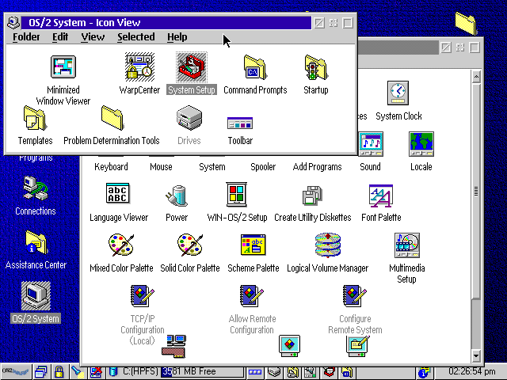

在这里双击 `TCP/IP Configuration (Local)` 打开网络配置。选中 `Enable Interface`
启用网卡，然后选择 DHCP，保存，但先不要重启。

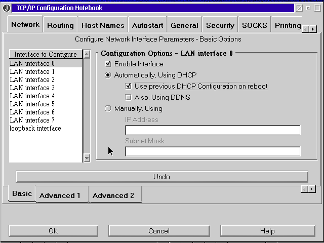

在“控制面板”中双击 `System`，默认弹出的就是分辨率选择。一路向下滚动，选择最下面
一个选项，对应 1024x768 分辨率，24 位彩色。

点击右上角 `Page 1 of 2` 旁边的加号，还可以选择最高到 1600x1200 的分辨率，按个人
需要选择。

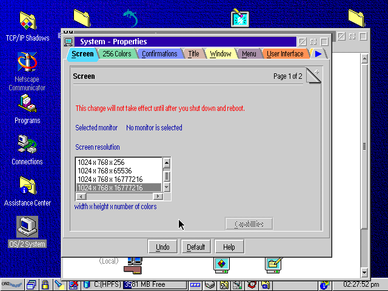

选择完成后，点击任务栏上的“电脑+叉号”图标关机，重启系统，使网络和显示配置生效。

## 安装 RPM 和 YUM

RPM 和 YUM 原本是 RHEL、CentOS 等系统使用的包管理器。经过开源社区的努力，现在在
OS/2 中也可以使用它们来管理软件了。

在 OS/2 中安装 RPM 和 YUM 的第一步是安装 WarpIN。WarpIN 本身也是一个 OS/2 的软件
包管理器，后续我们要使用它安装一个 YUM 的基础环境。在
[eCSoft/2 WarpIN 页面](https://ecsoft2.org/warpin)的 Manual Installation 手动安
装小节的链接下载 WarpIN，并复制进虚拟机安装。

> 复制进虚拟机我用的是 VirtualBox 自带的 Ad-hoc VISO 功能，可以直接自选文件添加
> 进一个虚拟的光盘中。如果你用的是 VMware 等其它虚拟机，可能就需要自己用
> UltraISO 等创建光盘手动挂载了。

下一个需要安装的依赖是 kLIBC，这是 RPM 及 YUM 需要的运行库。

> kLIBC 是 OS/2 中的 GCC 运行库，提供 OS/2 风格与 Unix 风格的文件路径转换等功
> 能。

kLIBC 可以从 Arca Noae（也就是维护 ArcaOS 的公司）的软件源下载，它是免费的，以一
个 exe 的方式直接提供。在
[Arca Noae 软件源的这个页面](https://repos.arcanoae.com/anpm/)下载
`klibccfg_1_0_2_2.exe`，复制进虚拟机安装。

安装完成后，点击任务栏上的“电脑+叉号”图标关机，重启系统，以保证配置生效。。

下一个是 ANPM，ArcaOS 的软件包管理器，基于 RPM 和 YUM，本身是免费的。同样可以在
[Arca Noae 软件源的这个页面](https://repos.arcanoae.com/anpm/)下载到，下载 `105`
文件夹里的 `anpm_1_0_5.exe`，同样复制进虚拟机安装。

安装完成后，双击桌面 `Arca Noae Package Manager` 文件夹，在其中打开 ANPM 包管理
器。第一次启动时，它会提示需要联网下载 RPM 与 YUM 的环境，并且让你选择架构：

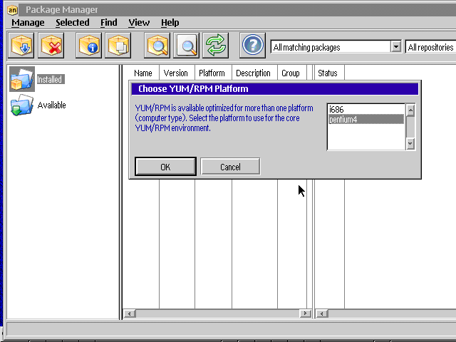

鉴于今年是 2020 年，除非你翻出了一台尘封的旧款电脑用来原汁原味地体验 OS/2，大多
数人都应该选择更新一点的 pentium4 架构。

选择完架构、下载完成后，ANPM 会询问你安装在哪个盘符，选择 C 盘即可。安装完成后，
不要马上重启。由于 ANPM 的安装过程有 Bug，会少修改系统配置导致 RPM 与 YUM 无法正
常工作，我们需要手动修改配置文件。

点击任务栏最靠中间的按钮，选择 `OS/2 Window` 打开“命令提示符”：

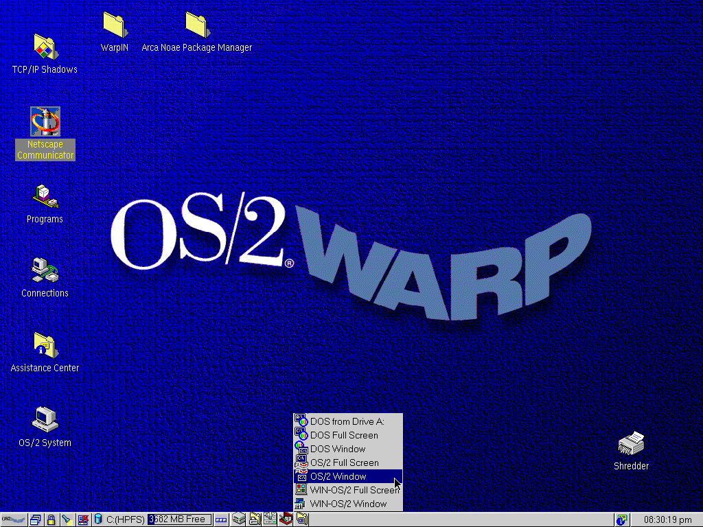

输入 `e config.sys`，编辑 `config.sys` 这个配置文件。我们需要修改的地方如下：

- 找到 `LIBPATH=`，在等号后面加上 `C:\USR\LOCAL\LIB;C:\USR\LIB;`
  - 修改完后类似于：
  - `LIBPATH=C:\USR\LOCAL\LIB;C:\USR\LIB;C:\NETSCAPE\PROGRAM;...`
- 找到 `SET PATH=`，在等号后面加上 `C:\USR\BIN;`
  - 修改完后类似于：
  - `SET PATH=C:\USR\BIN;C:\NETSCAPE\PROGRAM;...`
- 在文件末尾添加一行 `SET UNIXROOT=C:`

关闭窗口保存文件。之后，再次点击任务栏上的“电脑+叉号”图标关机，重启 OS/2。

重启后再次打开 ANPM，ANPM 会询问你要不要修改 `LIBPATH`。由于我们已经自己修改过
了，所以这里选 No。

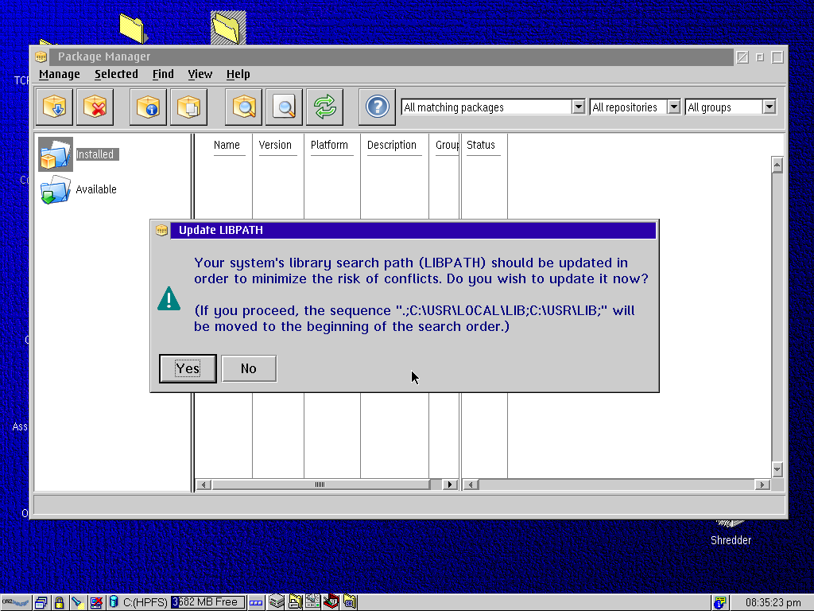

之后如果 ANPM 显示出了软件包列表，那就正常了。

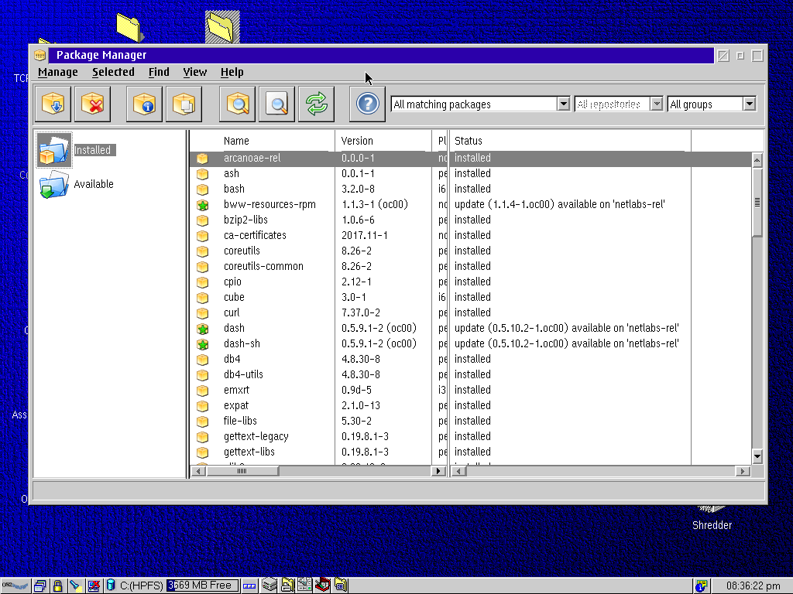

然后我们可以按上述方法再次打开“命令提示符”，自由执行搜索、升级、安装软件等过程：

```bash
yum upgrade
```

## 安装 Firefox

终于到了重头戏，安装 Firefox 浏览器。这里我使用 YUM 安装 Firefox 浏览器的所有依
赖，再下载预编译的 Firefox 浏览器压缩包，解压到系统里。

为什么直接安装 Firefox？因为 RPM 打包的 Firefox 浏览器只有 Arca Noae 的收费软件
源提供，我们目前使用的免费软件源是没有 Firefox 的 RPM 包的。但是这并不影响我们装
好依赖后自己下载 Firefox。

> 这里使用的安装命令及下载地址都来自
> [eCSoft/2 的 Firefox 页面](https://ecsoft2.org/firefox)。

由于我不喜欢 ANPM 的图形界面，以下操作我全部在 OS/2 的命令行下完成。再次打开“命
令提示符”后，就像使用 CentOS 一样，输入如下的（一长串）YUM 命令：

```bash
yum install unzip
yum install bww-resources-rpm cairo dash-sh fontconfig freetype hunspell libc libc-devel libcx libgcc1 libicu libjpeg-turbo libkai libpng libstdc++6 libvpx nspr nss nss-util os2-base os2-mpts pango pixman pthread zlib
```

由于 Arca Noae 的软件源在国外，因此从国内下载会比较慢，需要耐心等待，或者发挥各
种姿势。中间 YUM 可能会报出 `Rpmdb checksum is invalid` 之类的错误，都可以无视。

然后下载编译好的 Firefox 的 ZIP 包。进入
[eCSoft/2 的 Firefox 页面](https://ecsoft2.org/firefox)，页面中部有不同版本、不
同编译日期、不同目标 CPU 的 Firefox 的下载链接。

我选择的是第二个下载链接，`Firefox v. 45.9.0 (15/4/2019, Dave Yeo)`。这个版本对
应 Firefox 45.9.0 版本的 i386 通用版本。理论上下载第一个链接的
`Firefox v. 45.9.0 (Optimized version for Pentium M, 26/5/2019, Dave Yeo)` 奔腾
M 优化版也可以，但我没有尝试过。

将 Firefox 的压缩包加入虚拟光驱后，就可以直接解压并运行 Firefox 了（记得安装
`unzip`）：

```bash
unzip D:\firefox*
cd C:\firefox
firefox
```

大功告成：

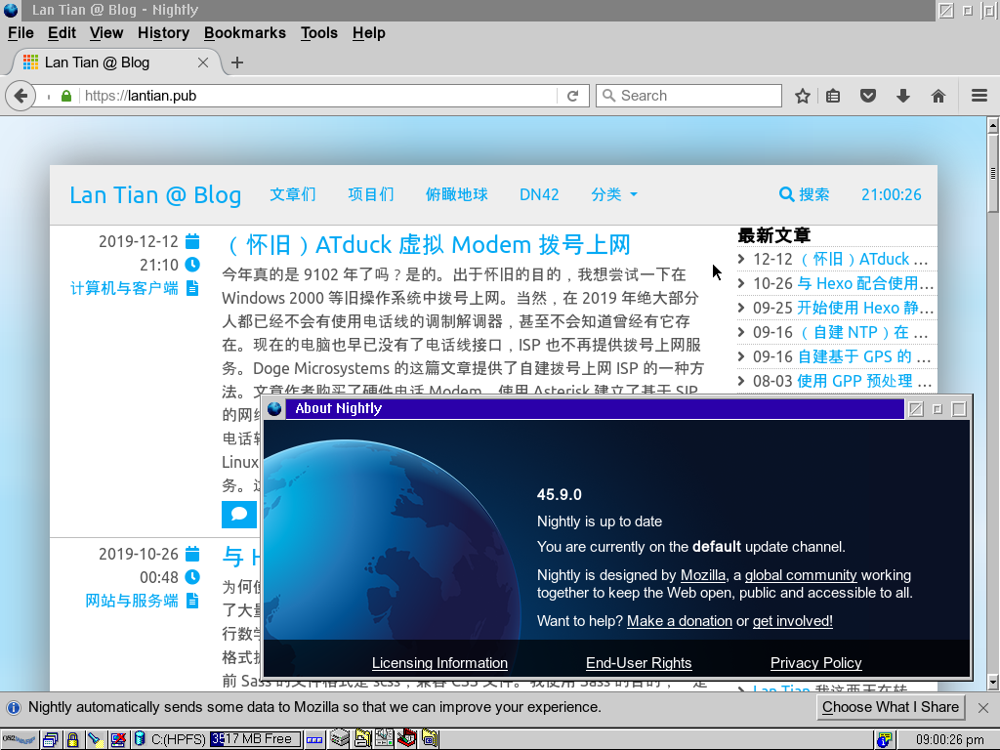

## 过程中踩的坑

在我自己研究时，整个研究过程中最坑的就是安装 RPM 及 YUM 的环境。最开始我找到的一
篇文章提供了一个旧版的 RPM/YUM 安装环境，在其中执行一些命令就可以将 RPM/YUM 安装
到主系统。但是由于版本过老，升级后会找不到大量的 DLL，连 RPM/YUM 都会一起挂掉。

ANPM 本身也有 Bug，就是不会自动修改 `C:\config.sys` 这个配置文件，导致缺失一些重
要的环境变量。这些缺失的环境变量会导致 ANPM 安装的 YUM 和 RPM 找不到一系列 DLL，
无法使用；同时 ANPM 也不会给出关于此的任何错误提示，只会提示你找不到 YUM 环境，
还得再安装；安装后再重启也是一样。

踩完上面的坑，其实整个过程还算简单。
