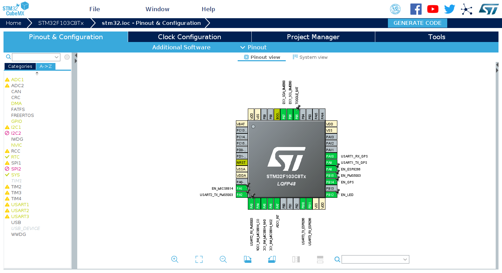
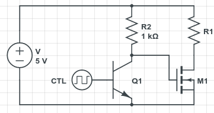
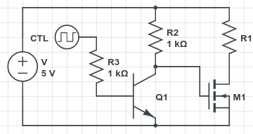

欢迎来到踩坑系列的第三篇。之前两篇中我分别介绍了我
[RoboMaster 机器人竞赛](/article/modify-computer/robomaster-bugs-in-development.lantian)和
[FPGA 课程大作业](/article/modify-computer/cyclone-iv-fpga-development-bugs-resolve.lantian)中
踩的坑。

这次踩坑的是我的毕业设计，三人小组合作的空气质量传感器网络。整个项目的设计如下：

- 从安装的传感器模块中读取数据并上传到服务器上的 InfluxDB 数据库
  - 我们使用的传感器如下：
    1. MiCS6814，测量 NO2，CO，NH3
       - 模拟输出
    2. BME680，测量温湿度气压及 TVOC
       - I2C 接口输出
    3. PMS5003，测量可吸入颗粒物（PM）
       - UART 串口输出
  - 额外加上了这些模块：
    1. ATGM336H，GPS+北斗双模定位模块
       - UART 串口输出
    2. ESP8266，使用非常广泛的 Wi-Fi 模块
       - UART 串口输出
    3. MH-CD42，电源管理模块
       - 输出？不存在的，供电就行了
- 需要足够节能，能用电池坚持一周左右
  - 也需要能够监测电池电量以计划电池更换
- 一定程度的防雨能力
- 网页显示，短时间预测
  - 教授已经有一个可以测量风力的气象站了

这篇文章记录了我们在实现这些功能时踩的坑。

# 选择合适的单片机

## 为什么不用 Arduino

最开始我随手翻了一个 Arduino Nano 出来用，但是很快就发现了问题：

1. Arduino Nano 只有一个硬件串口，而上面这些东西至少需要 3 个串口。
   - 自然就想到了 SoftwareSerial（软件模拟串口），但测试下来很不稳定，尤其在和
     ESP8266 的 115200 波特率的（相对）高速通信中，频繁出现乱码。
2. Arduino Nano 的频率固定在 16 MHz，并且调整起来非常麻烦。
   - 我们其实不需要这么高的性能，宁愿降频省电。
3. ~~Arduino 的 IDE 真的难用。~~

于是我就上淘宝买了一块 STM32 开发板，具体配置如下：

- STM32F103C8T6 芯片
  - 64 KB ROM，20 KB RAM
    - ROM 其实有点小了
  - 3 个硬件串口，刚好够用
  - 2 个 I2C
    - 但一个 I2C 可以接多个不同 ID 的外设，因此其实一个就够了
  - 最高 72 MHz 频率，且可以自由调整
    - 因为我们的单片机上不运行复杂计算，我们直接降频到了 4 MHz
  - 1 个可以定时休眠和唤醒的 RTC（时钟）
  - 一大堆 ADC（模拟-数字转换器）
    - 也可以测输入电压和芯片温度
  - 1 个 CAN，2 个 SPI 等等我们用不到的东西
- 外置 8 MHz 晶振和 32.768 KHz 晶振
  - 虽然 STM32 有内置晶振，但网络资料显示内置晶振易受到温度影响导致频率不准，所
    以有外置晶振当然更好
- 只要 10 块钱
  - ~~减钱获取更佳性能~~
  - 实际上 Arduino 本身的性价比不高，但它的生态实在是太香了

说到 STM32 开发，很多人第一反应就是需要直接操作寄存器来实现功能，需要大量时间查
询 Datasheet 等资料。但是 STM 官方早已推出了 STM32CubeMX 软件，可以可视化地配置
芯片上的各个组件，并一键生成代码模板，提供大量函数隐藏底层操作，因此现在 STM32
的开发并没有比 Arduino 困难多少。



## ROM 不够了怎么办

但是开发到后面，我们发现 STM32F103C8T6 的 64 KB ROM 不够我们使用了。我们的程序主
要包含了这些占空间的部分：

- BME680 的 BSEC 闭源算法库
  - BME680 的 TVOC 读数只能由 BSEC 计算出。传感器本身对此只提供一个电阻阻值，且
    官方没有提供阻值转换到读数的计算方式。
- `printf` 和 `scanf` 的浮点数处理逻辑
  - 我们使用的 InfluxDB 数据库接受的上传是纯文本格式，因此需要把从传感器获得的
    IEEE 754 浮点数格式数值转换成 ASCII 文字。
  - 同理，需要从 GPS 模块的 NMEA0183 语句中提取 ASCII 文本格式的经纬度信息，并转
    换成 IEEE 754 浮点数。
- STM32 的函数库
  - 就是负责底层操作的函数。

于是我们就尝试对这些地方进行精简：

- 关于 BME680，虽然我们没法修改闭源算法库，但我们大幅精简了调用闭源库的外围逻
  辑。
- 关于 GPS，我们选择直接把 NMEA0183 语句的经纬度文本复制出来给 InfluxDB，而不是
  转换成浮点数。
  - NMEA0183 经纬度的语句格式如下：
    - `$GNGGA,hhmmss.ss,llll.ll,a,yyyyy.yy,a,x,xx,x.x,x.x,M,x.x,M,x.x,xxxx*hh`
    - `$GNGGA,074023.000,1234.56789,N,12345.67891,E,1,13,0.9,32.3,M,0.0,M,,*46`
  - 逗号分隔后从左到右分别是：
    - `$GNGGA` 代表这行语句记录了当前的经纬度信息
    - 第二列是当前时间
      - 例如上面一行的时间是 UTC 时间上午 7 时 40 分 23 秒
    - 第三列是纬度，以 `度 * 100 + 分` 格式保存
      - 例如上面的纬度是 12 度 34.56789 分
    - 第四列是北纬/南纬
      - 无论北纬南纬，第三列的值都是正数
    - 第五列是经度，依然以 `度 * 100 + 分` 格式保存
      - 例如上面的经度是 123 度 45.67891 分
    - 第六列是东经/西经
      - 无论东经西经，第五列的值都是正数
    - 后面的我们不关心
  - 我们的逻辑如下：
    - 提取第三列的内容复制至纬度字符数组的**第二个字符开始**
    - 如果第四列是 N（北纬），将纬度数组的第一个字符改成 `0`
      - 格式如 01234.56789，能被 InfluxDB 正常识别
    - 如果第四列是 S（南纬），将纬度数组的第一个字符改成 `-`（负号）
      - 格式如 -1234.56789，也能被 InfluxDB 正常识别
    - 对第五列和第六列的经度数据同样操作
    - 度分格式转换成常用的度格式这一步，我们选择在资源更充足的服务器上完成
- 关于 STM32 函数库，对于有些我们不需要直接操作的东西（例如由 STM32CubeMX 自动完
  成的频率设定），可以换成 LL 函数库
  - STM32 对每个组件都提供了两种函数库：HAL 和 LL
    - HAL 抽象程度更高，更加简单易用，但是大
    - LL 更接近寄存器操作，难用，但是小
  - 在 `Project Manager - Advanced Settings` 里，把 RCC（频率设定）改成 LL 即
    可，可以省下好几 KB
- 关于标准库的函数，如果多种函数实现类似的功能，尽量合并成一种
  - 例如如果你同时使用 `printf` 和 `sprintf`，可以考虑将 `printf` 替换成
    `sprintf` 和 `HAL_UART_Transmit` 的组合，可以节省不少空间
- 记得开启编译器优化，并关掉调试信息
  - 在 Makefile 里设置 `DEBUG = 0` 和 `OPT = -Os`
  - 顺便提一句，要让 STM32 的 `printf` 支持浮点数，需要在 Makefile 的 `LDFLAGS`
    里加上 `-u _printf_float` 来开启支持

# 登录学校网络

## 传感器要连接学校网络

我校提供两个 Wi-Fi 网络：

1. 一个是开放式网络（无密码），连接后会弹出一个 HTTPS 加密的网页登录界面，输入用
   户名密码登录。
2. 一个是 eduroam，使用 WPA2 企业模式认证

研究一番 ESP8266 Wi-Fi 模块后，我得出了以下结论：

1. ESP8266 默认自带一个 AT 固件，通过串口发送指令连接网络。
   - 此时它只支持开放式网络和 WPA2 个人网络，不支持 WPA2 企业模式的 eduroam。
   - 但 STM32 里已经没有空间放 HTTPS 加密的库了，也就没法模拟提交请求登录。
2. ESP8266 可以被重新编程，写入自定义的程序。
   - 但 ESP8266 官方的 SDK 资料有点难找。
   - 虽然 ESP8266 有 Arduino 平台支持，但依然不包括 SSL 加密库。
   - 另外，ESP8266 只支持 PAP 加密的 WPA2 企业模式网络，而我校使用的是
     MSCHAPv2。

解决方法有点耍赖：我翻了一下我的树莓派，找到了之前模拟登录学校网络的脚本，而当时
登录界面还没有用 HTTPS，脚本发送的就是个 HTTP 请求。我测试了一下发现这个 HTTP 接
口还能正常使用。

最终方案是：STM32 发 AT 指令让 ESP8266 连接到开放网络，然后同样通过 AT 指令发送
HTTP 请求来模拟登录，这样可以少写一个程序。

> 你不能自己用路由器搭个无线网络吗？
>
> 你总不能在每个传感器边上都放个路由器吧？

## 气象站也要连接学校网络

教授的气象站也要连接上学校的 Wi-Fi，向气象站的云服务上传数据。与我们的 ESP8266
不同，我们没法修改它的程序，也没法让它额外发一个 HTTP 请求登录网络。

解决方法：用一台电脑伪装成气象站的 MAC 地址连接校网并登录，然后断开连接。短时间
断开连接时，校网不会踢出设备的登录，此时开启气象站的电源，气象站就能免登录连接网
络了。

又有一个问题：学校校网限制每个账户同时连接 4 台设备，当超过这个数量时旧设备会被
踢掉。我们的传感器网络由 10 台设备组成，虽然它们可以在掉线时重新登录，但是气象站
不行。

解决方法也很简单：我们小组有 3 个人，3 个账户，用另一个人的账户给气象站登录就
行。

# 采集传感器数据

## BME680

在我们的程序中，BME680 被它的闭源函数库 BSEC 接管了，但 BSEC 只支持每 30 秒或者
每 300 秒的测量，如果调用频率不对，BSEC 就不会执行测量操作，也不会返回数据。

但是由于 BSEC 依赖我们提供的函数来通信和计时，我们做了一个危险的操作，就是将
BSEC 的计时和系统实际时间脱钩。具体而言，每 15 分钟调用 BSEC 时，我们不告诉 BSEC
过了 15 分钟，而是告诉 BSEC 过了 300 秒，或者说到了下一次测量的时间了，来强制
BSEC 进行测量。

## PMS5003

PMS5003 是一个用起来非常简单的传感器，只需要拉高开启信号让风扇起转-等 30 秒-从串
口读数据即可。

PMS5003 每次发送的数据是 32 字节，有固定的包头，以及整包的校验和。为了防止读到半
个数据包，基于 PMS5003 每秒发送数据的特点，我们做了如下处理：

1. 首先尝试限时 100 毫秒读取 32 字节串口数据，如果读到了，说明 PMS5003 刚好在传
   数据。
2. 如果第一次没读到完整 32 字节，就尝试限时 2 秒再读一遍，相当于等待到 PMS5003
   再次发送数据。
3. 然后将数据送去校验和处理。

## MiCS6814

MiCS6814 是我们选择的传感器中最麻烦的一个，它基于微纳工艺制造，以电阻方式表示污
染气体含量，但每个传感器模块对气体的响应都不一样，包括相同浓度下的阻值和随浓度变
化的斜率都不一样。

受到我们的设备限制，我们只能假设空气中气体浓度不会变化太多，并以此忽略斜率的不
同。对于基础阻值不同，我们将分压测阻值用的电阻从固定阻值换成了电位器（变阻器）。
此时程序计算的就不是绝对的电阻数值，而是相对于基准值（即电位器设置的电阻）的比
例。再将所有设备放在同一环境下，与其它专业设备和天气预报对比，调整电位器，使得所
有 MiCS6814 的读数相同。

## 电源状态和电池电压

18650 锂电池的电压通常在 3.0-4.5V 之间（不绝对），超过了 STM32 的 3.3V 限制，因
此需要用两个电阻进行分压再接进 STM32 的 ADC。

STM32 也可以监测芯片输入的电压，原理是 STM32 内置了一路稳定为 1.2V 的电源连接到
ADC。由于 ADC 的读数是相对于芯片输入电压的，因此可以从这一路的读数反推芯片输入电
压。

STM32 也内置了一个温度传感器，同样以 ADC 数值来表示，但是 STM32F103C8T6 上的温度
传感器都没校准过，读数和实际差别很大，既然有了 BME680 它也没什么用了。

## 有关 STM32 ADC 的一点事

另外有关 STM32F103C8T6 的 ADC，如果要让它同时读取多路电压输入，不能用普通的
`HAL_ADC_Start` 解决，必须用 DMA。

DMA 即直接内存访问，告知外设不通过 CPU，直接将读到的数据写入到内存指定位置。DMA
可以降低 CPU 占用，也可以用来实现连续采样。要使用 DMA，需要在 STM32CubeMX 的 ADC
页面中，在 DMA Settings 中添加好对应的 DMA 通道。

但由于我们不需要连续采样，我们可以在 DMA 的中断处理程序（一般在
`stm32f1xx_it.c`）中，在收到中断后设置一个采样完成的 Flag。这样在程序运行时，先
执行 `HAL_ADC_Start_DMA` 开始采样，然后不断检查 Flag 直到任务完成，然后执行
`HAL_ADC_Stop_DMA` 停止传输。艺高人胆大的可以连 Flag 都不用，直接延时多少毫秒完
成。

# 为电池续上一周

## STM32 低功耗模式

我们的设备需要在使用电池供电的情况下每 15 分钟采集一次数据，在此情况下运行一周。
这就对休眠情况下的功耗提出了很高的要求。

为了达到这个运行时长，我们需要让 STM32 及传感器在休眠状态时切断电源或进入低功耗
状态。

- 根据
  [Datasheet](https://www.st.com/resource/en/datasheet/stm32f103c8.pdf)，STM32F103C8T6
  有 3 种低功耗状态：
  - SLEEP 模式，仅关闭 CPU，外围 ADC、I2C、UART 等模块依然保持运行。
    - 8 MHz 下耗电约 5.5 mA，明显太高了
  - STOP 模式，关闭 CPU 和大部分外围模块，但保留内存和寄存器内容，可以由 RTC 时
    钟或者外部中断唤醒。
    - 耗电约 13.5 uA，适中且问题不大（相比其它模块耗电已经很小）
    - 程序编写简单，几乎无需特殊处理
  - STANDBY 模式，关闭 CPU、外围模块，并且清空内存和寄存器。
    - 程序每次都会从头开始运行，需要在 ROM 里记录之前的状态。
    - 耗电约 2.4 uA，最低，但程序难写
- 我们最终选择了 STOP 模式，有几个需要注意的点：
  - 开启 RTC 的 Clock Source（即启用其功能）。
  - 将 RTC OUT 设置成 `No RTC Output`，即开启 RTC 输出，但不将它映射到针脚上。
    - 此时 RTC 的输出连接到中断上，也就是到时间后会触发中断重新启动 CPU。
    - 如果不开（设置成 `Disable`），STM32 进入休眠模式后就会一睡不醒。
  - 开启下面 `NVIC Settings` 里的 `RTC alarm interrupt through EXTI line`。
    - 也就是让 CPU 接受 RTC 发来的中断，不开的话也会一睡不醒。
  - 在程序中调用时，先重置 RTC 的时间（保险起见），再设置定时，最后进入休眠模
    式。
  - RTC 的精度只有 1 秒。

STOP 模式的休眠和定时唤醒代码如下：

```c
void deep_sleep(uint32_t seconds) {
    RTC_TimeTypeDef rtc_time = {0, 0, 0};
    RTC_AlarmTypeDef rtc_alarm = {
        {
            seconds / 3600,
            (seconds % 3600) / 60,
            seconds % 60
        },
        RTC_ALARM_A
    };

    HAL_RTC_SetTime(&hrtc, &rtc_time, RTC_FORMAT_BIN);
    HAL_RTC_SetAlarm_IT(&hrtc, &rtc_alarm, RTC_FORMAT_BIN);

    __HAL_PWR_CLEAR_FLAG(PWR_FLAG_WU);
    HAL_PWR_EnterSTOPMode(PWR_LOWPOWERREGULATOR_ON, PWR_STOPENTRY_WFI);
}
```

## 关闭外围模块

关闭 PMS5003 和 ESP8266 是很简单的事，它们都有一个针脚控制开关，将针脚的电压拉低
后会自动进入耗电几 uA 的休眠模式。

关闭 BME680 也还简单，由 BSEC 代劳。

但是 ATGM336H GPS 模块和 MiCS6814 模块都没有自带电源控制功能，会一直运行产生大量
耗电，因此需要外部开关来切断它们的电源。

我们先是打算用 N 沟道 MOS 管来切断电源：


图中的 CTL 代表 STM32 的数字输出，R1 是对应的模块。当 CTL 输出 0，MOS 管 M1 切断
电路以关闭 R1，反之亦然。

但是我们一测试，发现当 STM32 输出 1 时，它的输出电压 3.3V 不足以使 MOS 管完全导
通，仍然有 30Ω 左右的电阻。这样高的电阻分走了过多的电压，使模块无法获得足够的电
压来正常工作。

于是我们添加了一个 BJT 三极管来将数字电压拉高到 5V：



当 STM32 输出 1 时，三极管 Q1 导通拉低 MOS 管控制极电压，断开模块电源；当 STM32
输出 0，Q1 关断，MOS 管控制电压被 R2 拉高至 5V，正常开启模块电源。注意此时 STM32
的输出和模块电源状态是相反的。

某些淘宝店出售的电平转换模块会使用两级电阻+三极管来将电平反相两次，以解决状态相
反的问题；但我们不担心这个，我们直接改一下程序就好。

但经过测试，发现这样的电路耗电严重，关断电源时达到了 50 mA 以上。我们检查后发
现，BJT 三极管会将 STM32 的输出拉低到约 0.8V，因此 STM32 的这路输出实际上处在类
似短路的状态，输出大量电流。

解决方案就是加一个电阻限流，如下图的 R3：



> STM32 居然能在输出 50 mA 的情况下正常工作……

## 不要停下来啊（指电源模块）

我们使用的 MH-CD42 电源模块是一个设计用于充电宝的电池管理模块，其中一项功能就是
在用户没有连接充电设备时自动关闭电源。MH-CD42 会检测输出电流，当输出电流持续约
30 秒小于 45 mA，就会自动关闭输出。

对于充电宝用户来说，这是个很实用的功能；但对于待机电流在几 mA 级别的我们来说，这
项功能就严重影响了正常工作。更麻烦的是，MH-CD42 是个高度集成的模块，我们没法直接
上拉某个电源开关脚来强制开启输出。

我们先是查询 MH-CD42 的 Datasheet，但几乎没找到有用信息。但我们找到
了[一篇研究 MH-CD42 的文章](https://techobsessed.net/tag/mh-cd42/)，作者确认了
MH-CD42 模块与另一块基于 IP5306 芯片的电源模块外围电路几乎相同，因此确定 MH-CD42
芯片与 IP5306 芯片功能等同。

[这篇文章](https://www.jianshu.com/p/25fa6ec89953)介绍了一种保持开启 IP5306 芯片
输出的方法，就是将单片机的输出脚连接到电源模块的按键处，然后每隔十几秒拉低一次按
键电平，模拟每十几秒按一次电源键，就可以保持输出开启。

于是我们从 STM32 上焊了一根线到电源模块预留的焊盘上，写出了这样的代码：

```c
for(size_t i = 0; i < 85; i++) {
    deep_sleep(10);
    HAL_GPIO_WritePin(GPIOB, GPIO_PIN_5, GPIO_PIN_RESET);
    HAL_Delay(500);
    HAL_GPIO_WritePin(GPIOB, GPIO_PIN_5, GPIO_PIN_SET);
}
```

每个循环运行 10.5 秒，共 85 个循环，大约是 15 分钟即 900 秒。循环中有 10 秒
STM32 处在低功耗 STOP 模式，另外 500 毫秒正常运行。

# 上传到 InfluxDB

## 生成 HTTP 请求

InfluxDB 的所有 SQL 查询都通过 HTTP 请求完成，因此我们的 STM32 也只需要发送一个
HTTP 请求就可以了，甚至不用管服务器回复什么。

> 主要原因是我们的 STM32 的 ROM 满了，再添加解析 HTTP 回复的代码真的要爆炸。

请求的示例如下：

```bash
POST /write?u=INFLUXUSER&p=INFLUXPASS&db=INFLUXDB HTTP/1.1\r\n
Host: influxdb.lantian.pub:8086\r\n
User-Agent: lantian/2.3.3\r\n
Content-Type: application/x-www-form-urlencoded\r\n
Connection: close\r\n
Content-Length: 26\r\n
\r\n
stm32_vref,id=1 value=3.5\n
```

上述请求在名为 `INFLUXDB` 的数据库中创建了一个名为 `stm32_vref` 的数据点，额外标
签 `id=1` 标记设备编号，值为 3.5。实际上可以在一个请求中包含多个数据点，以 Linux
换行符 `\n` 分隔即可，但注意不能用 Windows 的 `\r\n`，会报错。

因此我们生成 HTTP 请求的代码（简化过）是这样的：

```c

void loop_print() {
    char tcp_content_buf[TCP_BUF_SIZE];
    uint32_t tcp_content_len;
    tcp_content_len = snprintf(
        tcp_content_buf,
        TCP_BUF_SIZE,

        "stm32_tmp,id=%lu value=%f\n"
        "stm32_vref,id=%lu value=%f\n"
        "stm32_vbat,id=%lu value=%f\n"
        "gps_lat,id=%lu value=%s\n"
        "gps_lon,id=%lu value=%s\n"
        // 这里添加更多传感器的数据点

        ,

        id, measure_value.stm32.temp,
        id, measure_value.stm32.vrefint,
        id, measure_value.stm32.vbat,
        id, measure_value.gps.latitude,
        id, measure_value.gps.longitude
        // 这里添加更多传感器的数据点
    );

    extern char tcp_send_buf[TCP_BUF_SIZE];
    extern uint32_t tcp_send_len;
    const char template[] =
        "POST /write?u=" HTTP_INFLUXDB_USER "&p=" HTTP_INFLUXDB_PASS "&db=" HTTP_INFLUXDB_DB " HTTP/1.1\r\n"
        "Host: " HTTP_INFLUXDB_IP ":" HTTP_INFLUXDB_PORT "\r\n"
        "User-Agent: lantian/2.3.3\r\n"
        "Content-Type: application/x-www-form-urlencoded\r\n"
        "Connection: close\r\n"
        "Content-Length: %lu\r\n"
        "\r\n"
        "%s"
    ;
    tcp_send_len = snprintf(
        tcp_send_buf,
        TCP_BUF_SIZE,
        template,
        tcp_content_len,
        tcp_content_buf
    );
}
```

其中 `tcp_send_buf` 和 `tcp_send_len` 会被和 ESP8266 通信的代码使用，发出这段
HTTP 请求。

## 与 ESP8266 通信

ESP8266 的 AT 指令手册有点难找，
但[总算还是找到了](https://www.itead.cc/wiki/images/5/53/Esp8266_at_instruction_set_en_v1.5.4_0.pdf)。
我们需要这几条：

- `ATE0` 关闭命令回显，方便解析，并且减少传输数据量（从而降低延迟）
- `AT+CWMODE=1` 设置成 Wi-Fi 客户端模式
- `AT+CWJAP_CUR="SchoolWiFi",""` 连接 Wi-Fi 网络（空密码）
- `AT+CIPSTART="TCP","influxdb.lantian.pub",8086` 建立 TCP 连接到指定服务器端口
- `AT+CIPSEND=123` 发送 123 字节数据
- `AT+CIPCLOSE` 关闭连接
- `AT+GSLP=2147483647` 进入长时间睡眠（直到下次发送开启信号）

注意以下几点：

- ESP8266 的指令以 Windows 换行符 `\r\n` 分隔，Linux 下有些串口通信软件在按回车
  时发送的是 `\n`，此时命令不会被正常执行。
- 以上指令大都要等待 ESP8266 回复 OK 才能生效，因此不能连续发送两条命令，否则第
  二条命令可能会被忽略。
- 有时一次指令不会成功（例如连 Wi-Fi），可以重试几次。
