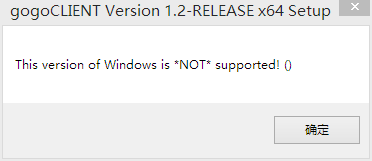
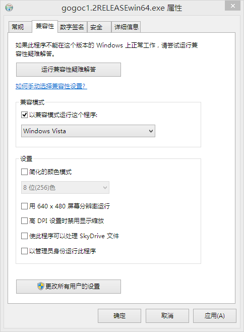
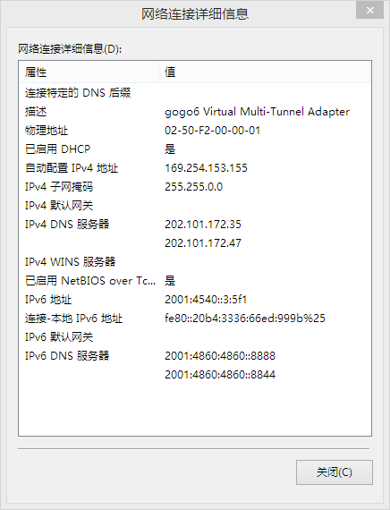

半年前，当我还在用Ubuntu的时候，
我[用XP虚拟机+gogoCLIENT搞定了IPv4与IPv6的互通](/article/modify-computer/ipv4-ipv6-porting.lantian)。
今天，我尝试在Windows 8.1下安装gogoCLIENT（以下简称GC）时，却出现了神一样的Bug。

下载地
址：[http://www.gogo6.com/profile/gogoCLIENT](http://www.gogo6.com/profile/gogoCLIENT)，
需要注册账号。

在我打开安装程序的时候，GC就给了我一个下马威。



这个的解决方法倒也简单，右键选择安装程序，兼容性模式修改成Vista即可解决，主程序
不会有任何异常。



安装完成后，我启动了主程序，输入了上次我就使用的hg.tfn.net.tw，连接。10秒后，右
下角弹出提示，连接成功。但是我到网络连接里一看，IPv6，没有网络访问权限！我打开详
细信息一看：



我只想说，默认网关到哪里去了。（其实DNS也是我手动设置的）

用百度搜了一通，无果。然后用谷歌改成英文搜“windows gogo6 default gateway”，结果
真的出来了，是个Bug！

修改方法：

1.开始菜单（或者开始屏幕）找到记事本，右键管理员权限打开。

2.用记事本打开C:\Program Files\gogo6\gogoCLIENT\template\windows.cmd，做以下替
换：

把所有的这句话：

```bash
netsh int ipv6 add route ::/0 "%TSP_TUNNEL_INTERFACE%" publish=yes %NETSH_PERS% > NUL
```

改成：

```bash
netsh int ipv6 add route ::/0 "%TSP_TUNNEL_INTERFACE%" nexthop=%TSP_SERVER_ADDRESS_IPV6%  publish=yes %NETSH_PERS% > NUL
```

保存。

3.打开GC，重新连接服务器。

这样，默认网关就设置成功了，IPv6也能连上Internet了。
