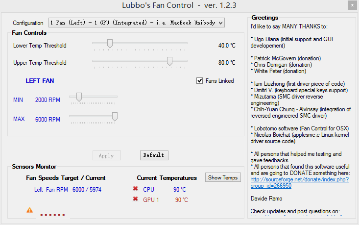
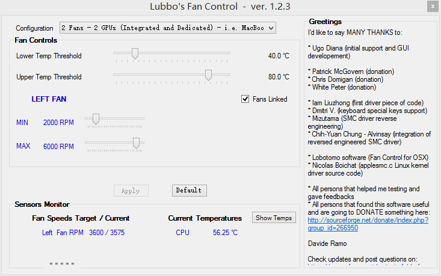

MacBook的散热是用户们心中永远的痛，苹果的散热非常的保守，直到CPU温度高于90度，才
开始加转速降温，对CPU和用户伤害很大。

今天早上我装好Win8.1，在网上看了会视频，然后拿起电脑准备放到旁边时，手不小心碰到
了出风口……你懂的。

因此，既然苹果散热控制策略不行，那我们就自己用软件调整。

一开始我试了一个iFanAutoControl，看到软件识别出我的CPU温度是70度，风扇速度迅速变
快，温度也降到了50度。我把电脑在旁边放了一会儿，风扇坚决以6000转的速度运行着，这
个软件不会只能加速不能减速吧……删。

删完，风扇继续飞快地转着，最后我关机再开机才解决问题（重启都不行）。

然后我找到了一款神软，LubbosFanControl。软件年纪比较老，内置了一些策略，但是都是
早期N卡苹果机的设置，对我这台集成显卡的电脑支持不佳。

我双击打开了软件，这东西居然不需要管理员权限。软件识别出我的CPU温度为90度，好高
啊！风扇速度自然被调到最高值6000转。过了一会儿，我看到温度还是稳稳停留在90度，但
是我摸了一下出风口，一点也不像90度烫手的样子。

我去谷歌上搜索，发现是因为版本太老，传感器参数不对的原因，到设置的ini里就能改。
在ini里我修改了传感器、GPU数量和CPU数量设置，以和我的MacBook对应。修改完成后，再
次启动，LubbosFanControl识别出我的CPU温度是57度，风速控制正常。

我去网上找了个CPU显卡杀手级的视
频[炮姐时代](http://www.bilibili.tv/video/av719948/)，这个是2160P的分辨率+120fps
的帧率，集显电脑绝对不可能流畅播放。一打开视频，CPU占用率迅速飙升，风扇速度也正
常提升；关掉视频，风扇也自动减速，测试成功。

修改版LubbosFanControl下载地址（完美支持12年中版集显
MBP）：[LubbosFanControl.7z](../../../../usr/uploads/2013/10/1691255080.7z)
