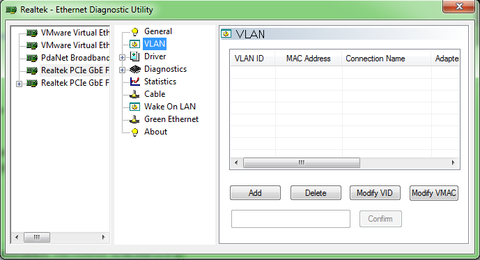
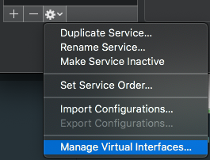
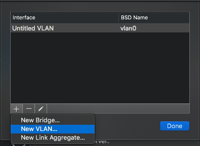
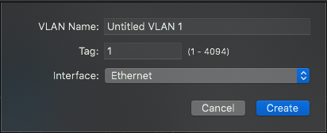
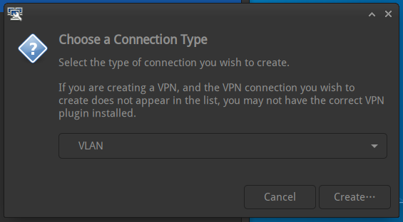
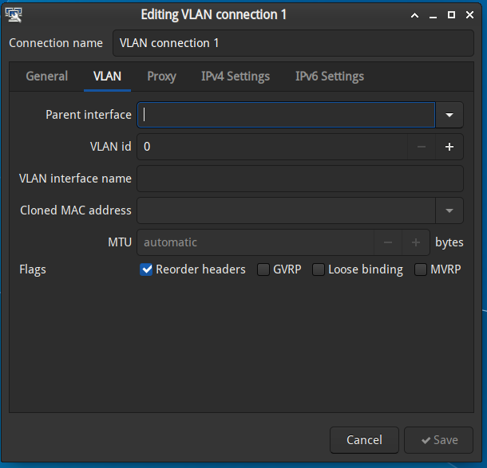

和全国大多数高校一样，我所在的大学以“一人一账号”的方式提供网络。通过有线网络或者 Wi-Fi 联网时，所有请求会被暂时重定向到一个登录界面（即 Captive Portal），输入用户名密码后才可以访问互联网。这个做法也是大多数公共场所（例如机场，咖啡厅）的标配，对于电脑、手机等设备也还算友好。但是一些不带显示屏的设备（例如树莓派，ESP8266 等）就难以访问网络了。

对于树莓派、ESP8266 等可以运行自定义代码的系统，可以模拟提交表单来登录网络，但是一旦模拟提交表单的程序出现问题，你就得手动将设备取下来，连上自己的电脑上传新的登录程序，这一过程非常的麻烦。至于其余只能运行预定程序的智能设备就完全无法联网了。由于我并没有智能台灯等设备，本文暂时只考虑可以运行 Windows、macOS、Linux 三大操作系统之一的智能设备，包括电脑及单板计算机（Single Board Computer）。

另外还有几个小问题：

- 我的寝室里只有一个网络端口供我使用，我需要将它分给我的各台设备。
- 我的大学一个账号可以登录多台设备，且带宽是每台设备独立计算的。
  - 假设我的账号限速是 10 Mbps，那么如果我接三台设备，每台设备都可以获得 10 Mbps 的带宽。

我最终购买了一只千兆交换机，并通过设置各台设备建立 VLAN，组建了一个内网。这个内网不受学校网络要求登录的限制，设备只要配置好 VLAN，插上的瞬间就可以与同 VLAN 下其它设备通信。如果某台设备出现问题无法登录学校网络，我就可以通过这个 VLAN 连上去管理了。

- 为什么不买路由器？
  - 因为**贵**。我购买的是水星（Mercury）的一款迷你五口千兆交换机，只要 39 元；五口千兆的路由器需要上百元。
  - 而且路由器无法实现每台设备**获得独立带宽**。路由器以下的网络拓扑对上层网关来说并不透明，一般都会被认为是同一台设备，共享上述的 10 Mbps 带宽。而交换机只转发数据包，会将每一台设备都暴露给上层网关，每台设备独立登录，获得独享带宽。
  - 但是，如果你需要连接不可编程的智能设备（智能台灯），加钱上路由器是**最方便**的选择。
- 会与学校网络产生干扰吗？
  - 交换机可能会把 VLAN 内的数据包转发给学校的网关。但是在没有特殊设置的情况下，因为来自终端网络端口的数据包不应该带 VLAN 标记，学校网关一般会直接丢弃这些包，不会干扰任何一台设备。
  - 不排除有些变态的网络行为管理系统会检测 VLAN 数据包并封禁你的账号，你只能自己去试，或者咨询你学校的 IT 部门。

准备材料
-------

1. 一台五口千兆交换机。
   - 如上所述，我用的水星五口千兆交换机价格是 39 元，从天猫上购得。
   - 如果还想省钱，淘宝上有 19 元的五口百兆交换机。但因为今年已经是 2020 年了，**完全不推荐**购买百兆网络产品。
2. 足够的网线，连接交换机到学校的网络接口，以及每台设备。
   - 如果要走千兆，淘宝上的六类网线随便买。
   - 如果只要走百兆，淘宝超五类网线随便买。
   - 理论上超五类网线也可以走千兆带宽，但超五类网线的信号干扰更严重。再加上可能的偷工减料，超五类网线很有可能在一段时间使用后无法稳定在千兆速率，甚至降级到百兆。
     - 我就有一条一开始能走千兆的超五类网线。用到最后虽然测线仪显示 8 根线全通，但是使用时双方网卡会协商半分钟之久，随后只能稳定在百兆。
3. 想一个 1-4094 之间的数（包含两端）作为你的 VLAN 编号（Tag）。

如何连线
-------

将交换机的任何一个网口连接到学校的网络接口，随后将剩余的网口连到各台设备即可。

与路由器不同，（傻瓜式）交换机完全不需要配置，且各个端口是完全等价的，可以随意换顺序。

Windows 设备的 VLAN 配置
----------------------

Windows 本身并不支持 VLAN，但是部分网卡提供了自己的设置程序，可以创建虚拟的网络适配器。

我的 Windows 电脑使用的是 Realtek 瑞昱网卡，可以使用 `Realtek Ethernet Diagnostic Utility` 进行配置。这个工具可以在 [Realtek 的下载页面（英文）](https://www.realtek.com/en/component/zoo/category/network-interface-controllers-10-100-1000m-gigabit-ethernet-pci-express-software)找到，下载 `Diagnostic Program for Win7/Win8/Win10` 一项即可。

这个工具内有 VLAN 的选项，直接添加你之前选好的 VLAN 编号就可以：



（图片来自 [Gough's Tech Zone 的这篇文章](https://goughlui.com/2018/10/01/note-multiple-vlan-operation-on-realtek-rtl8111d-nic-others/)）

之后系统的网络选项里会多出一张虚拟的网卡，配置好 IP 地址即可。

macOS 的 VLAN 配置
-----------------

macOS 的网络选项里可以直接添加 VLAN 虚拟网卡。

进入 `Network Preferences`（网络配置），点击左下角齿轮选择 `Manage Virtual Interfaces`（管理虚拟网卡）：



然后点击左下角加号创建新的 VLAN（`New VLAN`）：



然后输入你的 VLAN 编号（Tag），选择对应的网卡，保存即可：



最后依然是对新的虚拟网卡配置 IP 即可使用。

Linux Network Manager 的 VLAN 配置
---------------------------------

Network Manager 是多数带有图形界面的 Linux 系统，例如 Ubuntu、Debian，使用的网络管理软件。它可以管理各种连接方式，包括有线网，Wi-Fi，VPN 等等。

Network Manager 有对 VLAN 的原生支持，配置也极其简单。进入 `Edit Connections`（编辑连接信息），直接新建网络连接，类型选择 VLAN：



然后照例选择物理网卡和 VLAN 编号（Tag）即可：



Linux Systemd-networkd 配置
--------------------------

Systemd-networkd 是 Systemd 自带的一个网络管理程序，一般使用在服务器等网络条件固定的设备上。在这些设备上很少用 Network Manager。

假设你的物理网卡是 `eth0`，先修改物理网卡 `eth0` 对应的配置文件，一般是 `/etc/systemd/network/20-eth0.network`：

```ini
[Network]
...
VLAN=eth0-vlan（添加这条）
...
```

然后在设备上创建 `/etc/systemd/network/30-eth0-vlan.netdev` 网络设备定义，内容如下：

```ini
[NetDev]
Name=eth0-vlan
Kind=vlan

[VLAN]
Id=1234（此处改成你的 VLAN 编号）
[Match]
Name=eth0-vlan
```

然后创建 `/etc/systemd/network/30-eth0-vlan.network`，指定 IP：

```ini
[Network]
DHCP=no

[Address]
Address=192.168.0.1/24
```

最后重启 Systemd-networkd：

```bash
systemctl restart systemd-networkd
```

VLAN 网络就配置完成了。

配置完成之后
----------

各台设备配置完成之后，只要接到这个交换机下，就可以直接用 VLAN 内的 IP 互相访问了。

如果你的学校网络隔离做的不好，有可能你从另一个寝室甚至另一栋楼的网络接口也可以访问你的 VLAN。但这样的情况较少出现，且一旦出现意味着学校网络存在着一定的安全隐患。
