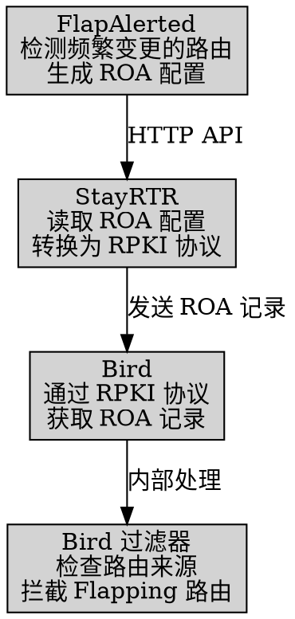

DN42 全称 Decentralized Network 42（42 号去中心网络），是一个大型的 VPN 网络。但是与其它传统 VPN 不同的是，DN42 使用了大量在互联网骨干上应用的技术（例如 BGP），可以很好的模拟一个真实的网络环境。

在真实的互联网中，各个运营商会使用不同厂商的硬件路由器互相交换路由信息，例如思科（Cisco）、瞻博（Juniper）、诺基亚（Nokia）、Arista、华为等。类似的，在 DN42 中，不同参与者也会选择不同的 BGP 软硬件，最常用的是 [Bird](https://bird.network.cz/) 和 [FRRouting](https://frrouting.org/)，但也有使用 Mikrotik、Ubiquiti EdgeRouter 甚至真正的商用路由硬件。

由于大家选择的 BGP 软硬件不同，并且即使使用同一款软件也会用不同的方式配置内网，所以当大家的网络连接在一起，有时候就会出一些奇怪的问题，例如 BGP Flapping。

# 真实互联网和 DN42 中的 BGP Flapping

BGP Flapping 指的是同一条路由的路径在短时间内发生大量变化，一般源于一个网络反复广播、撤销广播这一条路由。每次广播或撤销路由时，这个网络会把这条路由传递给所有与它相连的 Peer，这些 Peer 会根据这条路由计算出新的最佳路径，然后把新路径传递给它们的 Peer，与此类推。

在真实互联网中，BGP Flapping 的问题不算太大，一是因为各个运营商斥巨资购买的硬件路由器有足够的计算资源处理这些路由变更，或者内置了抑制路由频繁变更 （BGP Dampening）的功能，二是因为真实的运营商之间使用物理网络连接，物理链路的高价使得除了最大的几家运营商以外，与每个运营商互相 Peer 的运营商不会太多，也就减少了指数放大的效果。

但在 DN42 中，大家最常用的 Bird BGP 软件不支持 BGP Dampening，这使得正在 Flapping 的路由能够一直传递下去。即使 FRRouting 软件支持 BGP Dampening，也不意味着所有用户都会开。同时，由于 DN42 的参与者之间使用 VPN 互联，建立 Peer 的成本为 0，因此一个网络接入几十、上百个 Peer 完全不是问题，把 Flapping 的路由扩散给几十上百个 Peer 也完全不是问题。

而且由于 DN42 是一个实验性网络，不同参与者会经常调整网络配置。由于 Flapping 一般是在几条有效路径之间切换，不会造成断网，所以调整配置的参与者不一定能第一时间发现问题。

这就导致 DN42 内经常出现大规模、持续数日的 Flapping，例如：


上图是我的几个 DN42 节点收到的每秒路由更新的数量，可以看到在 11 月 7 日左右，收到的路由变更数量有一个提升，在 11 月 12 日左右又上了一个台阶，直到 11 月 13 日才下降。

## 传统解决方案

对于 DN42 参与者来说，Flapping 造成的最大问题是消耗 CPU 资源以及流量。有很多参与者用的是计算资源和流量有限的 VPS，Flapping 可能导致 VPS 被限制 CPU 使用、限制网络速率甚至被停机。

但是，在 DN42 内，即使知道 Flapping 存在，也不一定能找到 Flapping 问题的源头，更不一定能解决根本问题：

1. 你可以选择人工切断有问题的 Peer，这可以立即解决你的 CPU 和流量消耗问题，但这只是治标不治本。在你看来有问题的 Peer 有可能只是在转发其它 Peer 的路由更新。这样做很容易误伤其它 Peer，尤其是接了几十上百个 Peer 的大型网络。而且，随着不同参与者之间的连接发生变化，这个 Flapping 可能会通过其它的 Peer 传递给你，此时你需要再次切断新的 Peer（并最好把之前的 Peer 接回来）。

2. 你可以尝试联系有问题的 Peer，但由于 DN42 参与者分布在全世界，即使对方愿意立即排查问题，也可能需要至多 24 小时，等对方醒了/下班了才能收到回复。而且，对方不一定是问题根源，对方可能也要重复同样的过程联系有问题的 Peer，导致整个流程非常耗时。
   - 在真实互联网中，大型运营商都有一个 24 小时值班的 NOC（Network Operation Center，网络运维中心），可以立即排查问题。但 DN42 这样的爱好者网络中显然不会有这种东西。

3. 也有人提出过给 BGP 的 179 端口限速的方案。这样做可以降低 BGP 软件的 CPU 占用，但无法降低总共消耗的流量（甚至可能增加），并且会延长断开 Peer 重连时交换大量路由的速度。原因在于，BGP 协议是基于 TCP 的。BGP 软件收到一条路由更新时，会立即把更新的路由通过基于 TCP 的 BGP 连接发给其它 Peer。这条更新路由的消息会立即进入操作系统给这条 TCP 连接分配的缓冲区里。只要 TCP 一直保持连接，那么这条消息迟早会发送出去。即使 TCP 连接非常缓慢，导致这条更新的路由再次发生变更，BGP 软件也无法从缓冲区中撤销这条指令，常见的 Linux/BSD/Windows 等操作系统均不提供相应的机制。因此，最终实际发送的路由更新数量还是一样的，只不过速度更慢。
   - 根据限速方式不同，有可能只是把数据包延迟之后交给 BGP 软件（一般称为 Traffic Shaping），也有些是直接丢包（称为 Traffic Policing）。如果是直接丢包，对端则需要重传数据包，反而造成了更大的流量消耗。
   - 我认为，这样做还不如直接限制 BGP 软件的 CPU 占用更有效。

# 在 Bird 上自己实现 BGP Dampening

BGP Dampening 为了抑制路由频繁变更，要做的事有两件：检测频繁发生变更的路由，然后通过调整路由/Peer 权重等方式，不让这些变更传播给更多的 Peer，从而减少整个网络中的路由变更总量。

尽管 Bird 完全不支持 BGP Dampening，也无法单独实现上述任一功能，但“检测频繁发生变更的路由”这一步已经有现有的软件可以做了。另一名 DN42 参与者 Kioubit 开发了 [FlapAlerted](https://github.com/Kioubit/FlapAlerted) 这款软件，可以 Peer 上你自己的 BGP 软件，然后统计各条路由变化的次数，从而找出路由变化量超过阈值的路由。但这款软件只能检测，无法方便地把这些发生 Flapping 的网段发回给 BGP 软件，因此无法实现拦截的效果。

> 实际上 FlapAlerted 有一个 `mod_roaFilter` 插件，可以利用稍后会介绍的 RPKI 功能，过滤一份现有的 ROA 记录，删除 Flapping 网段的记录。但这个功能默认禁用，需要手动编译 FlapAlerted 开启这个插件。而且你需要已经[参照 DN42 Wiki 开启了 RPKI](https://wiki.dn42.dev/services/RPKI)，并且过滤所有没有对应 RPKI 记录的路由，门槛比较高。

不过，Bird 自 2.0 版本开始支持了 RPKI/ROA 功能。RPKI 中的 ROA 功能可以用来验证 BGP 广播的路由是否来自正确的 ASN。例如，我在 DN42 中拥有的 172.22.76.184/29 这段路由应该来自我的 ASN 4242422547。再配合上 Bird 的过滤器功能，就可以用类似下面的方法拦截错误的路由：

```bash
if (roa_check(roa_v4, net, bgp_path.last) = ROA_INVALID) then {
  # 路由来自错误的 ASN
  reject;
} else if (roa_check(roa_v4, net, bgp_path.last) = ROA_UNKNOWN) then {
  # RPKI 没有提供这条路由的信息，因此不知道路由是否来自正确的 ASN
  accept;
} else if (roa_check(roa_v4, net, bgp_path.last) = ROA_VALID) then {
  # 路由来自正确的 ASN
  accept;
}
```

那么，为了拦截频繁发生变更的路由，我们可以基于 FlapAlerted 收集到的信息，生成虚假的 ROA 记录，把这些频繁变更的路由劫持到无效的 ASN 上（例如 AS0）。这样 Bird 等路由软件收到这些路由时，就会认为它们来自错误的 ASN，并拦截它们。

[我向 FlapAlerted 项目提交了一个 PR](https://github.com/Kioubit/FlapAlerted/pull/10)，让它能够生成这样的虚假 ROA 记录。这个功能已经包含在 [FlapAlerted v4.1.5](https://github.com/Kioubit/FlapAlerted/releases/tag/v4.1.5) 版本中。

不过，FlapAlerted 只是提供了一个生成 ROA 记录文件的 API，它并不支持 BGP 软件使用的 RPKI to Router 协议，因此无法直接连接到 Bird 上。为此，我们需要用到 [StayRTR](https://github.com/bgp/stayrtr) 软件，它可以读取并定时更新真实互联网中的，或者 FlapAlerted 生成的相同格式的 ROA 记录文件，然后将它们通过 RPKI to Router 协议发送给 Bird。



## 安装 FlapAlerted

我们首先需要安装 FlapAlerted 并将它与自己的 BGP 软件连接，从而让 FlapAlerted 获取频繁变更的路由。

当然，你也可以选择直接使用别人搭建好的 FlapAlerted，例如我搭建的 <https://flapalerted.lantian.pub>，或者 Burble 搭建的 <https://flaps.collector.dn42>（需要从 DN42 内部访问）。

如果你使用 Docker，可以参考下面的 Docker compose 配置：

```yaml
services:
  flapalerted:
    image: ghcr.io/kioubit/flapalerted
    network_mode: host
    command:
      - "--asn"
      - "4242422547"  # 修改成你自己的 ASN
      - "--bgpListenAddress"
      - "127.0.0.1:1790"  # BGP 会话监听端口，稍后你的 BGP 软件需要连接到这个端口
      - "--httpAPIListenAddress"
      - "127.0.0.1:8080"  # HTTP API 监听端口，稍后 StayRTR 需要连接到这个端口
      - "-routeChangeCounter"
      - "120"  # 路由路径在一分钟内需要变更的次数才会被列入前缀列表。默认值是 600，但我认为太高了，我使用的是 120
      - "-overThresholdTarget"
      - "5"  # 连续多少分钟速率达到或超过 routeChangeCounter 才会触发事件。默认是 10，我改成了更严格的 5
      - "-underThresholdTarget"
      - "30"  # 连续多少分钟速率低于 routeChangeCounter 才会移除事件。默认是 15，我改成了更严格的 30
    restart: unless-stopped
```

如果你使用 NixOS，可以直接参考我的配置：<https://github.com/xddxdd/nixos-config/blob/42801296ce4f7dc6216e3b87d2b695895b8f2fa2/nixos/optional-apps/flapalerted.nix>

在 FlapAlerted 启动成功后，你就可以修改 BGP 软件的配置，将路由信息转发给 FlapAlerted。如果你用的是 Bird，可以参考下面的配置：

```bash
protocol bgp flapalerted {
  local as 4242422547;  # 修改成你自己的 ASN

  # 修改成 FlapAlerted 设置的 ASN 和 BGP IP/端口。
  # 这里我们使用和自己网络相同的 ASN，是为了利用 BGP 协议不会把来自 iBGP 的路由（即自己其它节点的路由）转发给 iBGP Peer 的特点。
  # 除非你开启了 add paths 选项，否则来自自己其它节点的路由只会包含最优的路由，如果 Flapping 发生在次优路由就会被隐藏。
  # 因此建议有多个节点的用户在每个节点上都单独和 FlapAlerted 建立连接。
  neighbor 127.0.0.1 as 4242422547 port 1790;

  ipv4 {
    # 开启 add paths 选项，把非最优路由也发给 FlapAlerted，让次优路由 Flapping 也可见。
    add paths on;
    export all;
    import none; # 不需要从 FlapAlerted 接收任何路由
  };

  ipv6 {
    add paths on;
    export all;
    import none;
  };
}
```

确认 Bird 正常连接到 FlapAlerted，并确认 FlapAlerted 的 ROA API 可以正常访问，例如：`curl http://127.0.0.1:8080/flaps/active/roa`

确认无误后继续下一步。

## 安装 StayRTR

下一步是安装 StayRTR，将 FlapAlerted 生成的 ROA 信息发送给 Bird。

如果你使用 Docker，可以参考下面的 Docker compose 配置：

```yaml
services:
  stayrtr:
    image: rpki/stayrtr
    network_mode: host
    command:
      - "--bind"
      - "127.0.0.1:8083"  # RPKI-to-Router 协议的监听地址
      - "--metrics.addr"
      - "127.0.0.1:8084"  # Prometheus 格式统计信息 API 的监听地址
      - "--cache"
      - "http://127.0.0.1:8080/flaps/active/roa"  # 修改成你的 FlapAlerted 服务器地址
      - "--rtr.expire"
      - "3600"  # 如果 FlapAlerted 服务器离线，保留现有的信息多长时间
      - "--rtr.refresh"
      - "300"  # 多长时间从 FlapAlerted 服务器刷新一次信息
      - "--rtr.retry"
      - "300"  # 如果 FlapAlerted 服务器离线，多长时间后重试
    restart: unless-stopped
    depends_on:
      - flapalerted
```

如果你使用 NixOS，可以直接参考我的配置：<https://github.com/xddxdd/nixos-config/blob/c709166104dc0bf2d8c2798ff338fa84a6c4a85a/nixos/minimal-apps/bird/stayrtr-rpki.nix>

在 StayRTR 启动成功后，你就可以修改 BGP 软件的配置，让它连接到 StayRTR。这里需要注意的是，如果你[原本就参考 DN42 Wiki 启用了 RPKI](https://wiki.dn42.dev/services/RPKI)，则必须把 FlapAlerted 发来的 ROA 信息单独存在一张 ROA 表里面，并单独基于这个 ROA 表检查一次路由。这样做的原因是，如果 ROA 信息中一条路由有多条对应的 ASN，那么这些 ASN 中的任何一个都可以广播这条路由。由于 FlapAlerted 只是生成了将路由劫持到无效 ASN（AS0）的信息，如果和正常的 ROA 信息混在一起，效果就是原本的 ASN 和 AS0 都可以广播这条路由，就起不到过滤效果了。

如果你用的是 Bird，可以参考下面的配置：

```bash
# 新建专用于 FlapAlerted 的 ROA 表
roa4 table roa_flap_v4;
roa6 table roa_flap_v6;

protocol rpki rpki_flapalerted {
  roa4 { table roa_flap_v4; };
  roa6 { table roa_flap_v6; };
  remote 127.0.0.1 port 8083; # 修改成 StayRTR 监听的端口
  max version 1;
  retry keep 10; # 如果连接中断，每 10 秒重连一次
};
```

确认 Bird 正常连接到 StayRTR 后继续下一步。如果你的 FlapAlerted 尚未检测到频繁更新的路由时，ROA 信息是空的，此时 Bird 会显示 `Cache-Error-No-Data-Available` 错误，是正常现象，可以忽略。

在 FlapAlerted 检测到频繁更新的路由时，你可以用 `birdc show route table roa_flap_v4` 命令检查是否实际收到了 ROA 信息。

## 在 Bird 过滤器中拦截路由

有了 ROA 信息，我们就可以在 Bird 对应协议的过滤器中添加检查 ROA 信息的指令了。

如果你希望尽量减少 CPU 消耗，可以选择在 Import Filter 接收路由阶段就过滤掉这些路由，但副作用是你也就无法访问这些路由了，并且你的 FlapAlerted 也会收不到这些路由，并重复在一段时间后解封 - 再次收到 Flapping 路由 - 再次过滤这个流程。

如果你只是希望减少对 DN42 网络的影响，可以选择在 Export Filter 发送路由阶段过滤掉它们，副作用是你的 Peer 将无法通过你访问这些路由。

在你的 Filter 过滤器中添加：

```bash
# roa_flap_v4 修改成对应上面的 ROA table 名称，IPv6 则使用 roa_flap_v6
if (roa_check(roa_flap_v4, net, bgp_path.last) = ROA_INVALID) then {
  # 路由频繁变更，被 FlapAlerted 劫持去了 AS0，Bird 认为路由来自错误的 ASN
  reject;
}
# 其它情况下，roa_check 会返回 ROA_UNKNOWN，因为 FlapAlerted 不会提供其它路由的信息，Bird 不知道路由来源是否正确
```

Reload Bird 之后，你就不会把这些频繁变更的路由进一步扩散给你的 Peer 了，降低了你的和你的 Peer 的流量消耗。

# 总结


这张图展示了我在我的网络配置完 BGP Dampening 之后的效果。在 18 时左右，尽管 DN42 网络内部发生了 Flapping，并且我的节点通过多个 Peer 接收到了这些路由变更，但 FlapAlerted 随后检测到了这些 Flapping 并通过上面的流程屏蔽了这些路由。因此，尽管 Flapping 持续到了 23 时左右，但我的网络发送的路由在短暂的尖峰后就迅速下降，成功地为我的 Peer 抑制了 Flapping。

可以看到，BGP Dampening 无法阻止你收到 Flapping 路由，但可以帮你节省 CPU 资源，或者为你和你的 Peer 节省部分网络流量。因此，除了在你的网络配置 BGP Dampening 之外，如果其它网络向你发送 Flapping 路由，你也可以建议这些网络采取类似的措施，从而在更大的范围抑制 Flapping，为所有 DN42 的参与者节省流量。


