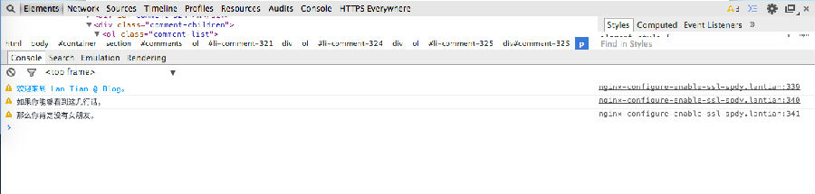
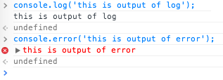

Chrome 开发者工具里有一个叫“控制台”（Console）的地方，我们可以在这里加几句彩蛋，
比如：

```bash
欢迎来到 Lan Tian @ Blog。
```

如果你能够看到这几行话，那么你肯定没有女朋友。

这几句话可以通过Javascript来输出，实现代码如下：

```javascript
if(window.console){
    var cons = console;
    if (cons){
        cons.warn(&#39;%c欢迎来到 Lan Tian @ Blog。&#39;,&#39;color:#09f&#39;);
        cons.warn(&#39;如果你能够看到这几行话，&#39;);
        cons.warn(&#39;那么你肯定没有女朋友。&#39;);
    }
}
```

其中cons.warn如果只接受一个参数，那么就在控制台里输出这一句话，如果有两个参数而
且第一个参数（这句话）以%c开头，那么第二个参数就是CSS代码。

用cons.warn会导致输出在最开头有一个黄三角，如果用cons.log那么开头就什么都没有，
如果用cons.error那么开头有一个红叉，如图。



把这段代码修改后放在你网站的footer.php模版里，刷新页面就有这样的效果。
