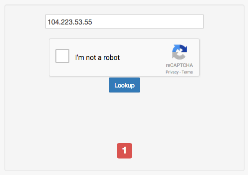
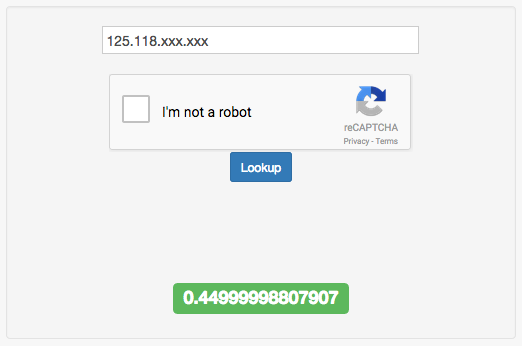

没人知道在网络上和你聊天的是一个人还是一条狗。网络的匿名性给网络欺诈带来了很大方便。前几年，有几位学生站长联盟里的站长邮件地址泄露，有好事者就挂上 Go^_^Agent 用他们的常用网名和邮件地址辱骂联盟里其它博客的博主，闹得鸡飞狗跳。

人人都会开的 Akismet 明显没起到什么作用，事后屏蔽 IP 也起不到什么作用（那个捣乱的人都是打一枪就跑）。而当时流行的一些反欺诈服务，比如 MaxMind，都要高额的使用费，不是普通站长承担得起的。

但现在，时代不同了！[GetIPIntel](http://getipintel.net/) 是一位机器学习和网络安全方向的美国研究生的项目。它使用机器学习技术，综合考虑一个 IP 的各项数据，从而判断来自某个 IP 的访客是不是开启了 VPN，TOR 一类代理。

这个服务不需要你付任何费用（但接受捐赠），甚至不需要手动注册。你只需要在请求他们的 API 时带上你的邮件地址，然后回复可能会发给你的验证邮件即可。

这个服务有 4 种模式：

1.只检查某个 IP 是不是已知的 VPN，TOR 等服务器的 IP。这种模式简单粗暴，响应最快，官方称时间在 60ms 以内（不含网络延迟）。根据我的测试，我手上几台 VPS 的 IP 都被直接屏蔽了，估计是把这些数据中心的 IP 都拉黑了。



（图中 IP 是我的 AlphaRacks 洛杉矶 VPS 的 IP）

2.启用一些动态检查。根据我的理解，就是检查常见的 VPN 以及代理服务器的端口有没有开放。官方称时间在 130ms 以内。

3.启用更多的检查，包括判断某个 IP 是不是一台肉鸡（被黑客控制的计算机）。官方同样称时间在 130ms 以内，但误报率可能更高。官方同时建议等 5 秒后再进行一次判断。

4.全面检查，并强制等待检查结束。这个模式下响应时间就可能高达 5s 了。因此不推荐在前端页面中使用。

由此看来，模式 3 其实就是先返回模式 2 的数据，然后在后台进行一次模式 4 检查。

说了那么多，要怎么用呢？根据模式不同：

模式 1（仅黑名单）：

```bash
http://check.getipintel.net/check.php?ip=要检查的IP&contact=你的邮件地址&flags=m
```

模式 2（一些动态检查）：

```bash
http://check.getipintel.net/check.php?ip=要检查的IP&contact=你的邮件地址&flags=b
```

模式 3（更多动态检查）：

```bash
http://check.getipintel.net/check.php?ip=要检查的IP&contact=你的邮件地址
```

模式 4（全面检查）：

```bash
http://check.getipintel.net/check.php?ip=要检查的IP&contact=你的邮件地址&flags=f
```

请求会返回一个数字，范围 0-1（如果小于 0 就是出错了）。如果数字为 1 就是 IP 被拉黑了，其它 0-1 之间的数字代表这个用户开了代理的可能性。



（图中 IP 是我家的 IP，后几位被我隐去了）

以 PHP 请求，进行模式 1 检查为例：

```php
function getIPIntel($ip) {
    return file_get_contents('http://check.getipintel.net/check.php?ip='. $ip .'&contact=你的邮件地址&flags=m') == 1;
}
$isProxy = getIPIntel($_SERVER['REMOTE_ADDR']);
```

如果你的 PHP 服务器是在代理服务器之后，你有可能要把 REMOTE_ADDR 改成 HTTP_X_FORWARDED_FOR。

GetIPIntel 的服务开启了 CloudFlare，所以海外服务器基本上不用担心速度影响（除非你开模式 4 ）。我目前是开了模式 1，对开了代理的访客隐藏了评论框。稍后我可能会写一个 Typecho 插件，从根源上阻止他们提交评论。

哦对了，如果你的网站被土啬了，那么千万不要开启这个服务，否则大陆的访客都会懵逼的。

官方介绍网页：[http://getipintel.net/](http://getipintel.net/)
