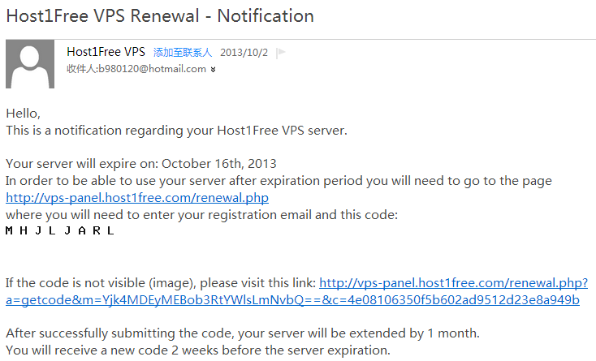
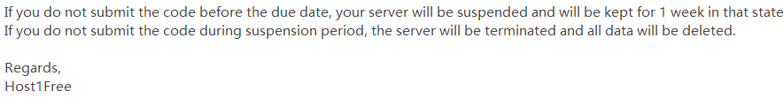

8个月
前，[Host1Free 用关机大法清理了一大批闲置用户](/article/modify-website/host1free-check-users-vps-actively-used.lantian)。
现在，H1F又出狠招，每月输验证码续期一次，否则就删除你的VPS。

每次你续期后2周，会给你发下一月的续期邮件；你收到邮件后在2周内进行续期，否则先关
闭你的VPS；再过1周不续期，就删除你的数据。

另外，这回的邮件居然又是在垃圾邮件箱里找到的……
