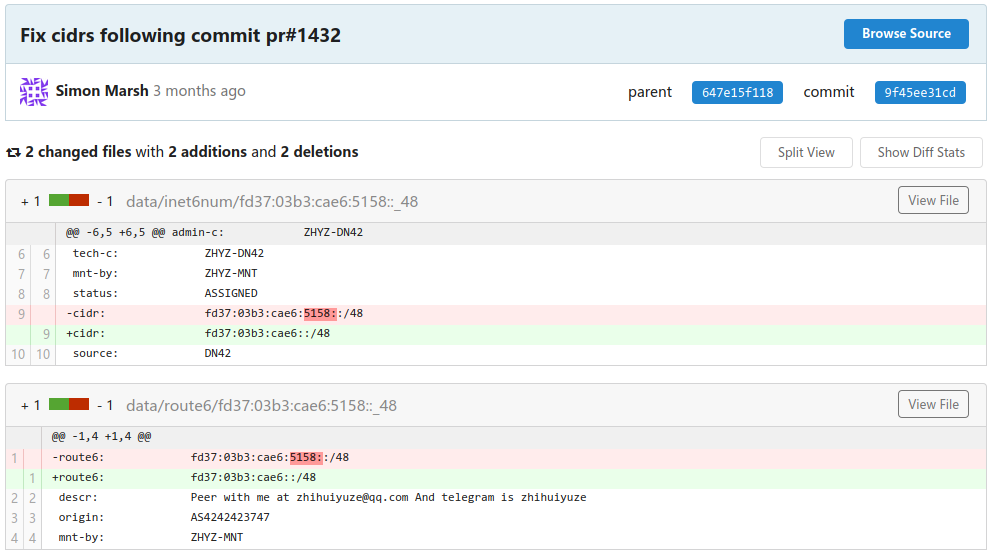
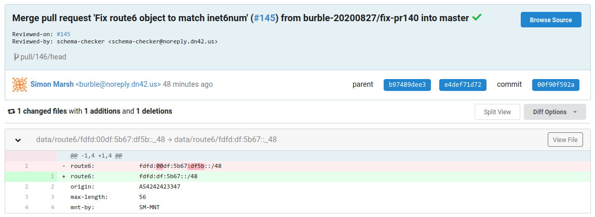
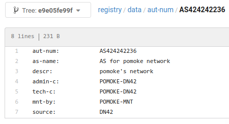
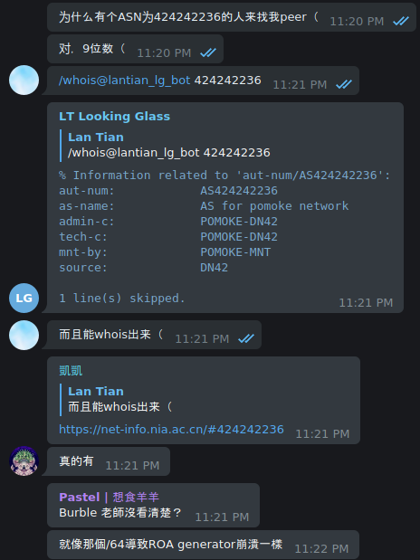
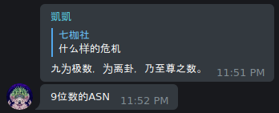
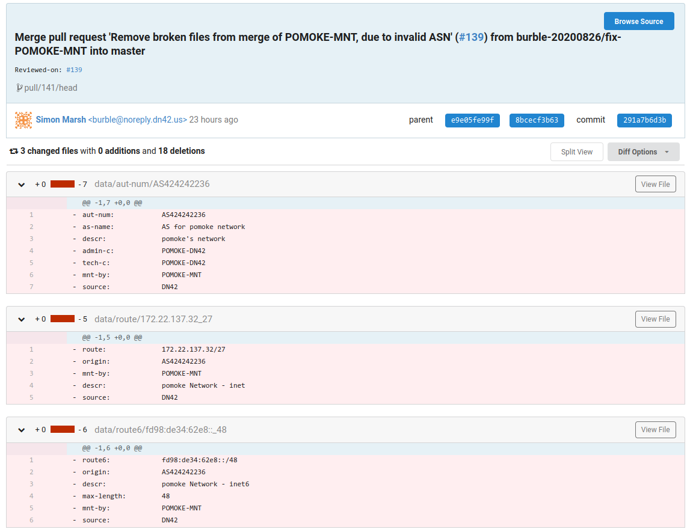
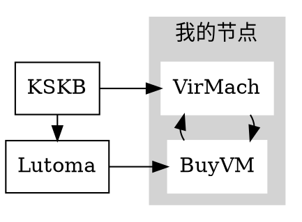
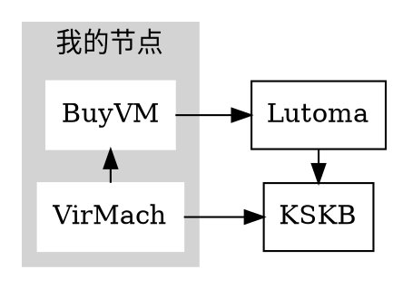
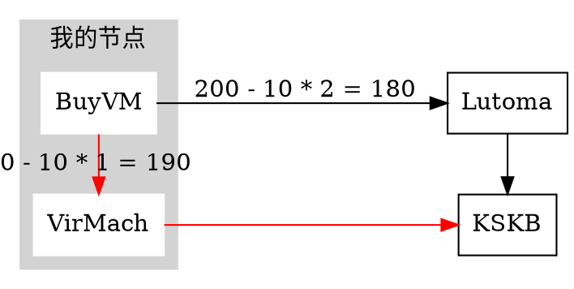
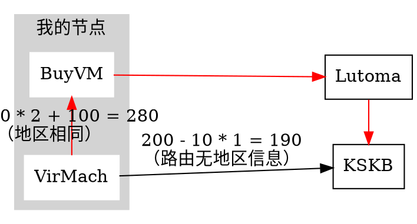

> DN42 是一个**测试网络**，所有人都在帮助所有人。即使你不小心搞砸了，也没有人会指责你。你可以在 DN42 的 [IRC 频道](https://wiki.dn42.us/services/IRC)，[邮件列表](https://wiki.dn42.us/contact#contact_mailing-list)或者[非官方 Telegram 群组](https://t.me/Dn42Chat)寻求帮助。

由于 DN42 是一个实验用网络，其中也有很多新手、小白参与，因此时不时会有新手配置出现错误，而对整个 DN42 网络造成影响，甚至炸掉整个网络。

现在，作为一名长者（x），我将教各位小白如何操作才能炸掉 DN42，以及如果你作为小白的邻居（指 Peer 关系），应该如何防止他炸到你。

> 注意：你不应该在 DN42 网络中实际执行这些操作，你应该更加注重对破坏的防御。
>
> 恶意破坏会导致你被踢出 DN42 网络。

本文信息根据 Telegram 群及 IRC 中的**真实惨案**改编。

更新记录
=======

- 2023-05-12：增加修改 BGP Localpref 导致环路的内容。
- 2020-08-27：格式修改，添加完整 IRC 日志，部分内容的中文翻译，添加另一段地址掩码填错的内容，以及 ASN 少了一位的内容。
- 2020-07-13：添加 Registry IPv6 地址段掩码填错的内容，和 Bird 不同协议左右互博的内容。
- 2020-05-30：第一版，包含 OSPF、Babel、左右横跳。

OSPF 真好玩
==========

你刚刚加入 DN42，并且准备把你手上的几台服务器都连接进去。你通过邮件，IRC 或者 Telegram 找了几个人分别和你的几台服务器 Peer，但是你还没有配置好你的内部路由分发。

于是你准备配置 OSPF，并打开 Bird 的配置文件加了一个 protocol：

```bash
protocol ospf {
  ipv4 {
    import all;
    export all;
  };
  area 0.0.0.0 {
    interface zt0 {
      type broadcast;
      # 略掉一些不重要的参数
    };
  };
};
```

你心满意足地把配置文件复制到每台服务器上，然后 `bird configure`，看到你的各台服务器都通过 OSPF 获取到了其它服务器的路由。

突然，你的 IRC / Telegram 弹出了一个提示框，你点开来一看：

```html
<mc**> shit.... as424242**** is hijacking my prefixes, for example 172.23.*.*/27
       草…… AS424242**** 在劫持我的地址前缀（即地址块），例如 172.23.*.*/27
<he**> yup, I see some roa fails for them as well
       对，我也看到 ROA 验证失败了
```

恭喜你，你成功劫持了 DN42 网络（的一部分）。

发生了什么
--------

当你的服务器通过 BGP 协议和其他人 Peer 时，每一条路由都包含了路径信息，包括它从哪里来，经过了哪些节点到达你这里。例如 `172.22.76.184/29` 这条路由可能就带有 `4242422547 -> 4242422601 -> 424242****` 这条路径，其中 `4242422547` 是路由来源（就是我），而 `4242422601` 是你的邻居（此处以 Burble 举例）。

但是，你的内网在传递路由时使用的是 OSPF 协议，而 OSPF 在传递路由信息时不会保留 BGP 的路径，因为它并不认识这些东西。此时你的另一台服务器通过 OSPF 获取到了 `172.22.76.184/29` 这条路由，但是不包含任何路径信息，它在与邻居的 BGP 宣告中就会将这条路由使用你自己的 ASN 播出去，造成劫持效果。

画成图大概是这样的：

```bash
[2547] -> [2601] -> [你的 A 节点] -> [你的 B 节点] -> [你的 B 节点的邻居]
 2547      2547      2547           没了！           你的 ASN（BOOM）
           2601      2601
                     你的 ASN
```

Babel 也很好玩
============

Telegram 里的老哥说话很好听，一边帮助你修上面那个 Bug，一边向你推荐 Babel：

- Babel 可以自动根据延迟选择最短路线；
- Babel 配置非常简单。

但是，群友不推荐你使用 Bird 自带的 Babel 协议支持，因为 Bird 的 Babel 不能根据延迟选路。

你心动了，删掉了 OSPF 的配置文件，并装了一个 Babeld。很快你的每台机器上都出现了其它节点通过 Babel 发来的路由。你等了几分钟，似乎没有爆炸。

但是你注意到，你的 Bird 没有把这些路由通过 BGP 发出去。老哥们怂恿你开启 Bird Kernel Protocol 的 Learn：

```bash
protocol kernel sys_kernel_v4 {
  scan time 20;
  # 群友怂恿你添加这一行
  learn;
  # 不重要的略过
};
```

你照做了。几分钟后，你被 IRC 和 Telegram 里的人疯狂艾特。是的，你又把其他人的网络劫持了。

发生了什么
--------

这和上面 OSPF 一段其实是相同的问题，Babel 在传递路由时丢弃了 BGP 的路径信息。只不过默认情况下，Bird 会忽略其它路由软件写入内核路由表的路由信息，除非你开了 learn。

正确的操作
--------

- 永远记住一点原则：OSPF，Babel 等 IGP（内部路由协议）不应处理 BGP 路由信息，BGP 路由就应该让 BGP 协议自己处理。
  - 在网络内部配置 BGP 有多种方案，可以参考《[Bird 配置 BGP Confederation](/article/modify-website/bird-confederation.lantian/)》这篇文章。
- 同时，内部路由协议的路由也不应漏到 BGP 中，除非内部路由协议中处理的所有 IP 段都是你自己所有。
- 所以你应该把 BGP 的 `export filter` 写成这样：

```bash
export filter {
  # 只允许向外发送来自 STATIC（手动配置）和 BGP 协议的路由
  if source ~ [RTS_STATIC, RTS_BGP] then accept;
  # 拒绝掉其它路由协议的路由
  reject;
}
```

如何防御
-------

- 最佳的方法是 ROA，即路由来源验证（`Route Origin Authorization`），限制每条路由的来源 ASN。
  - 对于 DN42，ROA 配置文件根据 Registry 的信息自动生成，可以在 [DN42 Wiki 的 Bird 配置页面](https://wiki.dn42.us/howto/Bird#route-origin-authorization)下载，并且可以设置 Cron 定时任务自动更新。
- 如果你不想配置 ROA，你可以尝试与尽量多的人 Peer。
  - 由于 BGP 默认选择经过的 AS 最少的路径，如果你和很多人直连，即使有人在劫持路由，你的网络仍然会优先选择这些直连路径。
  - 但注意这样**不能保证**防住路由劫持，例如以下情况：
    - 真实 AS 到你路径比劫持者的长；
    - 劫持者与真实 AS 到你的 AS 路径等长，此时会选择哪个看脸；
    - 你有配置 DN42 Community Filter，导致劫持者的路由优先级比较高。

左右横跳
=======

左右横跳是多种错误的总称，它们会造成 BGP 路由程序频繁切换获得的最优路径。由于最优路径会通过 Peering 传递给别的节点，这个切换过程会造成连锁反应，相连的多个节点都会因为一个节点的故障而一起切换，最终故障扩散到全网。

这一过程会造成大量的流量消耗，而由于 DN42 内多数人用的是便宜的 VPS 做节点，因此长期下来结果只有以下两种：

1. 你的邻居发现了流量消耗异常，主动切断了和你的 Peering；
2. 你的主机商（可能还有你的邻居的主机商）发现你长期占用带宽（或者用完了流量），停掉了你的 VPS。

而且左右横跳错误可能会造成严重的影响：

- 如果出错的 AS 和其它多个 AS 建立了 Peering，即使你断开了和他的直接连接，路由切换仍然可能从其它 AS 传递到你的 AS。
  - 为了解决一个 AS 的问题，可能需要断开好几个 AS。

例如，某 Telegram 群友从 Fullmesh + Direct 转向 Multihop 时出现事故，造成了非常大量的路由切换。


他在切换过程中没有断开 BGP，而 Babel 的配置错误导致大量路由被传递及撤销。

由于上述路由切换的连锁传递，并且该群友接了较多的 Peering，多个较大的 AS 被迫断开之间的连接，以（在该群友睡醒之前）控制住问题规模。

另外，该群友先前还有多次类似的路由切换事故，但这里地方太小了写不下。（滑稽）

案情回顾
-------

```html
<bur*> is someone awake who is on telegram ?
       有用 Telegram 的人醒着吗？
<bur*> Kio*, sun*, ie**, lantian perhaps ?
       可能是 Kio*，sun*，ie**，Lan Tian？
<Kio*> Kio* is here
       Kio* 在
<fox*> I am in that dn42 telegram chat too but I do not understand moon runes
       我也在 DN42 的 Telegram 群，但我不懂月相
<fox*> also its midnight for china?
       另外现在是中国的半夜？
<bur*> yes, I'm going to be nuking a lot of peerings if they are all asleep
       对，如果他们全在睡觉，我就要炸掉一大堆 Peering 了
<bur*> I think its originating from NIA*, but a lovely multi mb/s flap going on for the past hour
       我觉得问题来自 NIA*，一个小时前开始有一个好几 MB/s 的“可爱”的左右横跳
<bur*> and its like whack-a-mole, if I disable one peering the traffic just pops up on a different one
       而且像打地鼠，如果我关掉一个 Peering，它又会从另一个 Peering 上跳出来
<fox*> petition for bur* network to stop accepting new peers to help save dn42 network health
       建议 Bur* 的网络不要再接受新的 Peer 了，以保证“42 号去中心网络”的健康发展
<Kio*> NIA* is awake now
       NIA* 现在醒了
<bur*> NIA* certainly has ipv4 next hop problems, they are advertising routes with next hops in other networks
       NIA* 的 IPv4 Nexthop 肯定有问题，他们广播的路由的 Nexthop 都在其它网络
<Kio*> He says he is adjusting his "network from full-mesh to rr and multihops"
       他说他在“把网络从 Full-mesh 调整成 Route Reflector 和 Multihop”
<bur*> well its not working ;)
       唔姆，这没有正常工作 ;)
<stv*> bur*: I also took down our peering
       bur*：我也把我们的 Peering 断了
<bur*> stv*, too much traffic from the grc?
       stv*, 来自 GRC（全球路由收集节点）的流量太多了？
<stv*> I added a new peer around 1hr ago. Just to check that this hasnt be the cause..
       我一小时前接了一个新的 Peer，只是为了确认这不是原因……
<stv*> bur*: no the grc is still up and running
       bur*：不，GRC 还在正常工作
<bur*> ah, if you are getting a lot of route updates its cos of NIA*
       啊，如果你收到很多路由更新，它们是来自 NIA* 的
<bur*> grc is currently pumping about 4mb/s to downstram peers
       GRC 现在正在向下游发送 4 MB/s 的更新
<sun*> bur*: what happen?
       bur*：发生了什么？
<bur*> NIA* is having issues
       NIA* 出了问题
<bur*> sun* anyway, you are up late!
       sun* 不管怎么说，你睡得好晚！
<sun*> I just came back from the bar:)
       我刚从酒吧回来 :)
<do**> don't drink and root
       酒后不要 root（指用管理员权限修改系统）
<bur*> nice :)
       不错 :)
<sun*> l like drink ;)
       我喜欢喝酒 ;)
<bur*> ok, I'm bored of this now, if you are currently sending me more than 1mb/s of bgp traffic your peering is about to get disabled.
       行吧，我现在累了，如果你正在向我发送超过 1MB/s 的 BGP 流量，那你的 Peering 会被我禁用。
<bur*> Kio*, sun*, Tch*, jrb*, lantian, ie**, so far
       目前是 Kio*，sun*，Tch*，jrb*，Lan Tian，ie** 几个
<Kio*> barely notice any flapping here, is it v4 or v6 ?
       几乎没观察到左右横跳，是 IPv4 还是 IPv6？
<bur*> 4 mostly, I think. you got killed on us-nyc1
       我觉得大部分是 IPv4，你和我美国纽约 1 号节点的 Peer 被关了
<bur*> Nap*
       Nap*
<Nap*> Shut mine down if you need, I can't look into with much detail until tonight
       有必要的话就把我的 Peer 关了吧，我今晚之前都不能仔细检查
<bau*> half of dn42 is about to loose connectivity due to bur* disableing peerings lol
       哈哈，半个 DN42 会因为 Bur* 禁用 Peering 而断网
<do**> oh yeah, this looks nice
       哦耶，太棒了
<Kio*> thats why everybody should be at least multi homed with two peers
       因此所有人都应该至少接两个 Peer
<jrb*> bur*: and on which peering?
       bur*：在哪个 Peering 上？
<Kio*> you shouldnt loose connectivity if only one peer drops
       如果只有一个 Peer 掉线，你不应该也掉线
<bur*> jrb* us-nyc1 and us-lax1 for you so far
       jrb* 目前是美国纽约 1 号和美国洛杉矶 1 号
<jrb*> mapping table says us-3 and us-5, let me check.
       映射表显示是美国 3 号和 5 号，我检查一下。
<Nap*> Do we know what routes are flapping causing the updates?
       我们知道是谁的路由造成这些更新吗？
<Kio*> filtering problematic ASN on my us node now
       正在我的节点上过滤有问题的 ASN
<bur*> Nap* its NIA*
       Nap*，是 NIA*
<bur*> AS42424213**
       AS42424213**
<jrb*> sun*, rou*: disabling my peerings with you for now, there seems to be serious flapping
       sun*，rou*：我现在禁用和你们的 Peering，看起来有严重的左右横跳
<do**> him again?
       又是他？
<sun*> what?
       啥？
<sun*> is me problem?
       我的问题吗？
<bur*> sun*, I've killed all of our peerings
       sun*，我关掉了我们所有的 Peering
<sun*> why?
       为什么？
<bur*> sun*, you are distributing the problems from NIA*
       sun*，你在传递 NIA* 造成的问题
<Nap*> bur*: K, gonna try to filter on ATL/CHI at least.
       bur*：行，准备尝试至少在亚特兰大和芝加哥节点上做过滤。
<bur*> thanks Nap*
       谢了 Nap*
<Kio*> recommend everybody to temporarily enable "bgp_path ~" filter for the problematic ASN
       推荐所有人暂时打开“bgp_path ~”过滤掉有问题的 ASN
<sun*> i disabled NIA*, would fix problem?
       我禁用了 NIA*，会解决问题吗？
<do**> bur*: I also peer with NIA* and I don't get any bgp updates from him
       bur*：我也和 NIA* Peer 了，但没收到他的任何 BGP 更新
<do**> ah wait
       啊等等
<bur*> sun*, depends if you are also getting the updates from other peers too
       sun*，取决于你会不会也从其他 Peer 收到这些更新
<do**> now I see it
       现在我看到了
<do**> disabling peering
       正在禁用 Peering
<sun*> if bgp_path ~ [= 42424213** =] then reject;
       （Bird Filter 命令）
<bur*> ~ [= * 42424213** * =] to reject all paths
       用“~ [= * 42424213** * =]”过滤掉所有包含他的路径
<sun*> ohh
       噢哦
<jrb*> bur*: seems to be mostly rou* from my perspective
       bur*：从我这看主要是 rou*
<Kio*> Should be filtered on my side, if anyone continues to receive those updates please notify
       我这里应该过滤好了，如果任何人继续收到这些更新，请通知我
<bur*> sun*, I tried re-enabling you on lax1 but you jumped striaght to 1mb/s+ again
       sun*，我尝试在洛杉矶 1 号节点重新启用我们的 Peering，但流量马上到了 1 MB/s 多
<bur*> jrb*, re-enabled
       jrb*，重新启用了
<sun*> i have disabled NIA*
       我也禁用 NIA* 了
<bur*> Kio*, re-enabled
       Kio*，重新启用了
<do**> oh btw, I have notified NIA* about this issue
       哦顺便提一句，我已经告知 NIA* 这个问题了
<jrb*> do**: also tell him to notify everybody to get out of the blacklists.
       do**：另外告诉他（修好网络后）通知所有人解除黑名单。
<do**> jrb*: will do
       jib*：好的
<Nap*> bur*: I should have it filtered on my ATL (your CHI)
       bur*：我应该在我的亚特兰大节点上过滤了（对应你的芝加哥节点）
<Kio*> wrote NIA* also directly on telegram
       在 Telegram 上直接向 NIA* 发了消息
<sun*> bur*: is it better now?
       bur*：现在好点了吗？
<bur*> for the record, this is the first time that I've mass disabled peerings, but this was causing issues across the board
       这是我有史以来第一次大规模禁用 Peering，但这次的确造成了很多问题
<bur*> sun*, no not really
       sun*，不，没有
<An**> I've stop importing route from NIA*
       我已经停止从 NIA* 导入路由了
<stv*> I am also dropping NIA* now
       我现在也丢弃 NIA*（的路由）了
<bur*> sun*, thats like 1k updates every few seconds
       sun*，每过几秒就会有一千条路由更新
<Nap*> bur*: all host should have it filtered now.
       bur*：所有节点都应该过滤了。
<bur*> Nap*, looks to me, thanks
       Nap*，看起来没问题，谢谢
<sun*> bur*: seems to have reduced traffic
       bur*：看起来流量降低了
<bur*> sun*, yes that looks better
       sun*，的确看起来好些了
<bur*> sun*, is that now ok across all your nodes ?
       sun*，现在你的所有节点都正常吗？
<sun*> yep
       对
<bur*> sun*, ok re-enabled
       sun*，好的，重新启用了
<do**> alright, also filtered 42424213**
       好的，也把 42424213** 过滤了
<tm**> hi, also filtered 42424213**
       大家好，我也把 42424213** 过滤了
<bur*> I guess they got the message, seems we're back to normal again and everyone I disabled is back again
       我猜他们（指 NIA*）收到消息了，看起来我们再次回复正常了，所有我禁用的人都被重新启用了
<do**> bur*: I think NIA* is asleep, probably everyone filtered it
       bur*：我觉得 NIA* 还在睡觉，也许所有人都过滤了
<do**> or disabled peering
       或者禁用了 Peering
<bur*> do**, there is that, but I also renabled NIA* and am not getting the same errors now
       do**，有可能，但我也重新启用了 NIA*，现在没有看到先前的错误
<do**> oh, interesting
       哦，有趣
<bur*> I might regret doing that by morning, but hey. I do try and keep everything open as best as possible.
       到了早上我有可能会后悔（指 NIA* 的问题在 bur* 睡觉时再次出现），但我尝试尽量公开/开放所有东西。
<do**> bur*: last time when NIA* did that I waited for their response
       bur*：上次 NIA* 搞出这种事情的时候，我等他们的回复（后才采取行动）
<Kio*> Nope nia* just messaged in Telegram about it
       不，NIA* 刚在 Telegram 上发了消息
<do**> ah
       啊
<bur*> my peering hasn't re-established, so I guess they hit the big red shutdown button
       我（和 NIA*）的 Peering 还没有重新建立，我猜他们按下了那个巨大的、红色的关闭按钮
<Kio*> He tried to migrate his network to a full mesh
       他尝试把网络迁移到 Full mesh
<Kio*> and is now "pulling all the wires"
       现在正在“全部拔线”
<do**> Kio*: did you message him directly or was that on any of the groups?
       Kio*：你给他直接发了消息吗，还是在哪个群里？
<Kio*> on the telegram group
       在 Telegram 群里
<do**> bur*: you didn't get that many bgp updates from me?
       bur*：你没有从我这里收到那么多 BGP 更新？
<sun*> NIA* woke up :)
       NIA* 醒了 :)
<bur*> do**, you went from an average of ~3kbs to ~10kbs+, peaking at 50kbs. In the grand scheme of things that was lost in the noise
       do**，你从平均 3 KB/s 到十几 KB/s，峰值 50 KB/s。在如此巨大的量级中这点小问题被淹没了
<do**> interesting
       有趣
<do**> I also peer directly with NIA*
       我也和 NIA* 直接 Peer 了
<bur*> do**, yes, interesting. Is the link restricted in bandwidth ?
       do**，是的，有趣。（你和他的）链路有带宽限制吗？
<do**> not at all
       完全没有
```

如何防御
-------

- 最理想的方案是 Route Dampening，也就是限制一段时间能收到的路由更新数量。
  - 但是 Bird 不支持这个，没救了，等死吧，告辞.heic
- 次优的方法是使用 Prometheus、Grafana 等工具对各个节点进行监控，在流量异常时收到提醒，上去手动处理。
  - 显而易见的是，如果你当时不在线，当你看到提醒时有可能已经几 G 的流量没了。
- 再次优的方法是对 Peering 的端口进行限速。
  - 由于 DN42 内目前几乎没有大流量应用，这种方法的确能保证安全。
  - 缺点显而易见：性能下降。
- 土豪的方法是买无限流量的服务器。

这段地址到底多长
=============

因为今年是 2020 年，你准备给你的网络加一组 IPv6 地址。按照[我的 DN42 注册教程](/article/modify-website/dn42-experimental-network-2020.lantian)，你很快就给自己注册了一个 IPv6 地址块，并且很快被合并进了 Registry。

在你看来，一切都很正常。但在地球的另一边，一个人的手机/电脑上弹出消息，告诉他他的 DN42 ROA 记录生成器出现了错误。他打开 Registry，扶额叹息，并 commit 了这样一个修改：



[https://git.dn42.dev/dn42/registry/commit/9f45ee31cdea4a997d59a262c4a8ac8eb3cbd1f1](https://git.dn42.dev/dn42/registry/commit/9f45ee31cdea4a997d59a262c4a8ac8eb3cbd1f1)

发生了什么
--------

这位群友添加了 `fd37:03b3:cae6:5158::/48` 这样一个地址块。因为一个 IPv6 地址由 32 个 16 进制数构成（共 128 比特），而这个地址块显式定义了其中的前 16 个数（即 64 位），对应的子网掩码应该是 `/64` 或更高。

但是由于未知原因，这个错误没有被 DN42 Registry 的内容检查程序检查出来，当时也没有被操作合并的管理员发现，就成功进入了 Registry。

随后，ROA 记录生成器在解析 Registry 内容时遇到了这个格式错误的地址块，就直接报错退出了。

再 放 送
=======



[https://git.dn42.dev/dn42/registry/commit/00f90f592a35e325152ce28157f64d3fca7c8d7d](https://git.dn42.dev/dn42/registry/commit/00f90f592a35e325152ce28157f64d3fca7c8d7d)

正确的操作
--------

- 用户在注册地址块时应该检查子网掩码的大小和地址块的有效性。
- DN42 Registry 的检查程序，或者操作合并的管理员，应该发现这个错误。
- ROA 生成器应该跳过这条有问题的记录，正常处理剩下的数据，而非报错退出。

万幸的是这个问题对整个 DN42 网络影响不大，只是 ROA 更新延迟了几小时而已。

如何防御
-------

由于 DN42 从建立之初就在强调去中心特性，因此你可以写一个自己的 ROA 生成器作为备份。

> 虽然这次我的 ROA 生成器也挂掉了……

原因是不同人写的程序即使功能相同，也会在实现上有细微的差别。这样在遇到这样一个输入内容的 Bug 时，就有可能有人的程序仍能保持正常运行。

Bird 左右互搏
============

我有一个朋友……行吧就是我自己。

因为我同时接了 DN42 和 NeoNetwork，还有一段自己的内网，所以为了防止把内网路由发到 DN42 和 NeoNetwork，我采取了以下方法：

- 把所有来自 Kernel 协议（从内核获取路由）和 Direct 协议（获取系统网络界面（网卡）所在的网段）的路由打上一个 Community。
- 在 DN42 和 NeoNetwork 的 Peering 中把它们过滤掉。
- 这样我的内网 IP 就不会被广播出去，但因为 DN42 和 NeoNetwork 的路由被配置在 Static Protocol 中，所以不受影响。

配置完后一切看起来都很正常，直到几天后群友发现我的 Telegram Bot（就是我的 Looking Glass）Ping 不通任何 DN42 内的 IP。

发生了什么
--------

刚开始一切都很正常，我的网段 `172.22.76.184/29` 被正常广播。直到某次 Direct 协议刷新了一次，从系统的某个网络界面获取到了 `172.22.76.184/29` 这个网段，并再次将它传进了路由表。

这条新的路由信息就把原先的路由覆盖了，同时因为这条路由来自 Direct 协议，被打上了 Community，就不再被广播了。并且 Static 如其名是“静态”协议，其内容不会改变，自然也不会产生新的路由再覆盖回去。

此时我相当于停止宣告了我的 IP 段，自然就无法收到回程数据包了。

正确的操作
--------

在 Bird 中，尽量避免多个路由协议产生相同的路由条目，相互覆盖可能会造成不可预料的后果。

我最终选择添加 Filter 将 Direct 协议限制在我的内网网段，避免它再次覆盖我的 DN42 网段。

星际玩家
=======

一名新玩家注册了一个 ASN：



这是 DN42 发生的变化：

- Telegram 群：

  

- 蒂 花 之 秀：

  

- IRC：

  ```html
  <lantian> Someone successfully registered in DN42 with ASN 424242236 (9 digits)
            有人成功在 DN42 上注册了 ASN 424242236（9 位数）
  <lantian> Is this expected?
            这是正常的吗？
     <xu**> doh
            噢
     <xu**> shouldt have happened
            不应该发生
     <xu**> probably forgot the extra 2
            或许忘了个 2
     <xu**> 424242 2236
            424242 2236
     <Kai*> too late tho. it already has one peer with tech9
            太晚了，已经和 Tech9 Peer 上了
     <dne*> filtering fail!
            过滤器挂了！
     <xu**> pomoke?
            （用户名）
  <lantian> yep, doesn't seem to be on irc though
            对，但看起来不在 IRC 上
  <lantian> nor on telegram
            也不在 Telegram 上
     <0x7*> so how a 9-digit ASN passed the schema checker...?
            所以 9 位数 ASN 怎么过的检查程序……？
  <lantian> I don't think schema checker checks ASN, or it will block out clearnet ASNs
            我不觉得检查程序会检查 ASN，否则会阻挡掉公网 ASN
  <lantian> But maybe we need a warning?
            但也许需要加个警告？
     <xu**> probably a bug in the policy checker
            也许是检查程序的一个 Bug
     <xu**> i wish we had gone with a prefix that had a visual space
            我希望我们的 ASN 前缀有个看起来明显的分隔
     <xu**> like AS424200xxxx
            例如 AS424200xxxx
  <lantian> Well pomoke tried to peer with me via email (but ended in spam folder)
            总之 Pomoke 尝试发邮件找我 Peer（但进了垃圾箱）
  <lantian> I'm going to tell him/her to correct the ASN
            我准备告诉他/她改正自己的 ASN
     <Kai*> 9 is a good number tho
            不管怎么说 9 是个好数字
     <Kai*> once in a blue moon that bur* made mistake
            bur* 犯错，蓝月将至（英语成语，即千载难逢）
     <sun*> westerners love digital 9
            西方人喜欢数字 9
     <bur*> crap
            草
     <bur*> lantian, are you in contact with pomoke? if they can submit a fix quickly
            then I'll merge it. Otherwise I'll need to pull the commit
            Lan Tian，你能联系上 Pomoke 吗？如果他们可以迅速提交修正信息我就马上把它合并了。
            否则我就得撤销变更了
  <lantian> bur*: I sent him/her an email, not sure about response time
            bur*，我给他/她发了封邮件，不知什么时候会回
     <bur*> umm, I'm going to have to pull it then
            唔姆，那我就不得不撤销了
  ```

- 裁决之镰：

  

如何防御
-------

- 看戏就完事了，这种事情太少见了：

  ```html
  <Kai*> once in a blue moon that bur* made mistake
         bur* 犯错，蓝月将至
  ```

- 当然看戏归看戏，还是要上 IRC 说一句出问题了。
- 在和别人 Peer 的时候，多检查一遍对方的信息。
- 以及没事可以翻翻 [DN42 New ASN](https://t.me/DN42new) 这个自动推送新 ASN 的 Telegram 频道。

小心 BGP Local Pref
==================

在 DN42 Telegram 群帮别人调试网络时，我突然发现我的两个节点之间出现了环路：

```bash
traceroute to fd28:cb8f:4c92:1::1 (fd28:cb8f:4c92:1::1), 30 hops max, 80 byte packets
 1  us-new-york-city.virmach-ny1g.lantian.dn42 (fdbc:f9dc:67ad:8::1)  88.023 ms
 2  lu-bissen.buyvm.lantian.dn42 (fdbc:f9dc:67ad:2::1)  94.401 ms
 3  us-new-york-city.virmach-ny1g.lantian.dn42 (fdbc:f9dc:67ad:8::1)  167.664 ms
 4  lu-bissen.buyvm.lantian.dn42 (fdbc:f9dc:67ad:2::1)  174.235 ms
 5  us-new-york-city.virmach-ny1g.lantian.dn42 (fdbc:f9dc:67ad:8::1)  247.213 ms
 6  lu-bissen.buyvm.lantian.dn42 (fdbc:f9dc:67ad:2::1)  253.499 ms
 7  us-new-york-city.virmach-ny1g.lantian.dn42 (fdbc:f9dc:67ad:8::1)  326.690 ms
 8  lu-bissen.buyvm.lantian.dn42 (fdbc:f9dc:67ad:2::1)  333.412 ms
 9  us-new-york-city.virmach-ny1g.lantian.dn42 (fdbc:f9dc:67ad:8::1)  406.978 ms
10  lu-bissen.buyvm.lantian.dn42 (fdbc:f9dc:67ad:2::1)  413.537 ms
11  us-new-york-city.virmach-ny1g.lantian.dn42 (fdbc:f9dc:67ad:8::1)  486.762 ms
12  lu-bissen.buyvm.lantian.dn42 (fdbc:f9dc:67ad:2::1)  493.147 ms

18 hops not responding.
```

我登录上这两个节点一看，VirMach 节点的确优先选择了 BuyVM 发来的路由，而 BuyVM 也选择了 VirMach 的路由。

BGP 不应该是防环路的吗？为什么这两个节点会互相选择对方的路由？

发生了什么
--------

这个问题总共涉及到三个 AS 的四个节点：



其中 KSKB 是 `fd28:cb8f:4c92::/48` 这条路由的源头，他将路由广播给了 Lutoma，以及我的 VirMach 节点。Lutoma 随后将这条路由广播给了我的 BuyVM 节点。

**我的所有节点都开启了 `add paths yes;` 选项**，也就是说节点间会互相交换所有收到的路由，而不只是节点选出来、写入内核路由表的最佳路由。因此，对于我的 BuyVM 节点来说，到路由的源头有两条路线：


对于 VirMach 节点也是一样的：



一般来说，VirMach 节点肯定选择直连 KSKB 的路由，而不是经过 BuyVM 和 Lutoma，总共两跳（iBGP 同一 AS 内不计跳数）的路由。此时 BuyVM 节点下一跳无论选择 Lutoma 还是 VirMach 节点，都可以获得一条可达的路由，而不是出现环路。

问题是，**我用 BIRD 的 Filter 手动调整了路由优先级**。[DN42 有一组标准的 BGP Community，用于标记每条路由来源的地区。](https://wiki.dn42.dev/howto/Bird-communities)为了降低网络延迟，我使用下面的算法（简化后）来调整路由优先级：

```bash
优先级 = 200 - 10 * 路由跳数
如果当前节点和路由来源在同一地区：
  优先级 += 100
```

问题发生时，KSKB 的原始路由并没有添加来源地区的 Community。**但是 Lutoma 的网络配置错误，给来自 KSKB 的路由也加上了来源地区 Community**，地区和我的 VirMach 节点相同。（根据 DN42 的标准，各个网络只应该给自己的路由添加来源地区 Community，不能给别人的路由添加。）

此时我的 BuyVM 节点算出了以下的路由优先级，并选择了经过我的 VirMach 节点的路由：



而我的 VirMach 节点反而选择了经过 BuyVM 节点的路由：



这样，环路就形成了。

正确的操作
--------

这个问题出现时，以下三个因素缺一不可：

1. **开启 `add paths yes;` 选项**，导致备选路由被同时发给其它节点。如果不开启此选项，BuyVM 节点在选择 VirMach 作为下一跳时，就不会把经过 Lutoma 的路由也发给 VirMach 节点了，此时 VirMach 节点只有直连 KSKB 的一条路由可走。
2. 路由优先级调整算法导致**其它节点的备选路由反而在当前节点被优先选择**。因此，如果要保持 `add paths yes;` 选项开启，就需要在设计 iBGP 用的优先级算法时，保证在任何情况下，来自同一节点的路由之间**优先级顺序都不变**，从而保证总能选到这一节点的首选路由，而非备选路由。
3. 经过 Lutoma 的路由被异常加上了 BGP Community，导致了优先级顺序的变化。

我解决问题的方法是，不再在 iBGP 内部重新计算路由优先级，而是统一使用由收到路由的节点计算的、由 iBGP 传递来的优先级，来保证首选、备选路由的优先级顺序不变。
