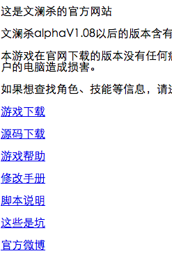
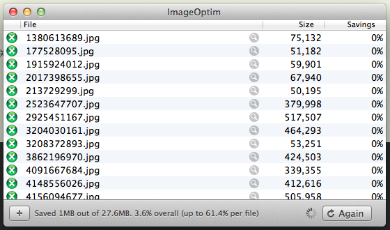

先扯一句，网上搜索了一下，Macbook系列不管是Pro还是Air，不管系统版本，貌似都存在
CPU过热的问题，看Flash时尤其高。根据网上评测，Macbook历史最高温度101度，下次烧开
水就靠它了。煎鸡蛋的话，温度可能还不够，但是还有努力空间。

笔记本电脑又叫膝上型计算机，下次看谁在苹果笔记本满负荷运行的时候，敢把苹果笔记本
放腿上。哦对，别忘了把smcFanControl删掉，别以为我不知道你把风扇速度开到了最高。

----------吐槽结束，正文开始----------

一个网站不能缺少图片，文澜杀官网除外。

文澜杀作者说他的个人网站准备弄命令提示符的风格。对于这个，我只能说两个字：呵呵。

图片太大会严重影响网页的加载速度，如果你的服务器在香港、新加坡或者电信通，是那种
1M、2M之类小水管的机子，那么你的加载速度肯定好不到哪去。所以我们要压缩图片。

压缩图片包括好几种方法：

1.删除照片信息，比如JPEG的EXIF，这些事记录相机信息的，在网页中显示的时候一点用也
没有。

2.减少照片颜色数，主要针对PNG的索引颜色，因为有些颜色是人眼完全无法分辨的，不如
把这些全部合并成一种颜色，以减小照片大小。

3.减少分辨率。分辨率不是指像素数，而是指每英寸72点、300点这种。普通显示器都是每
英寸72点的，高了无用，全部精简掉。注，不考虑Retina，Retina请自行将图片长宽各乘
0.5，问题即解决。

这方面的在线工具有很多，本地工具也有很多。不过在Mac下，最强大的还是ImageOptim，
它是多个工具的集合体，可以层层压缩对图片达到最大化压缩的效果，但是肉眼（基本）看
不出区别。

主界面如下：

用法超级简单，把图片或者装图片的文件夹拖进去，原始图片自动变成精简后的，注意备
份。

下载：[http://imageoptim.com/](http://imageoptim.com/)
