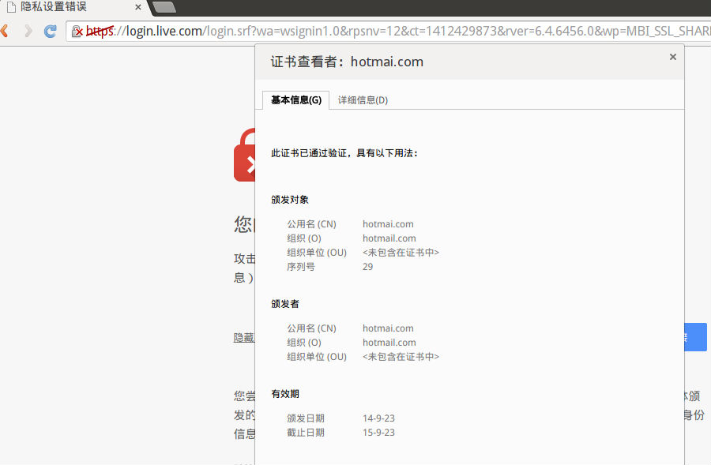
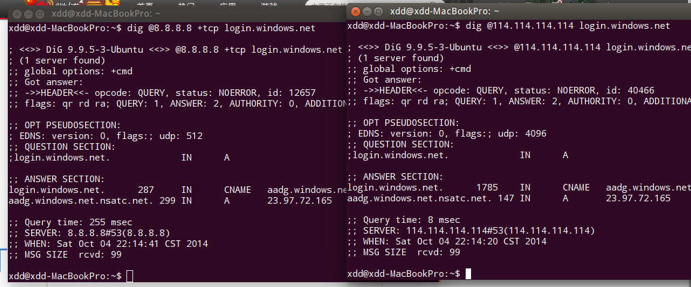
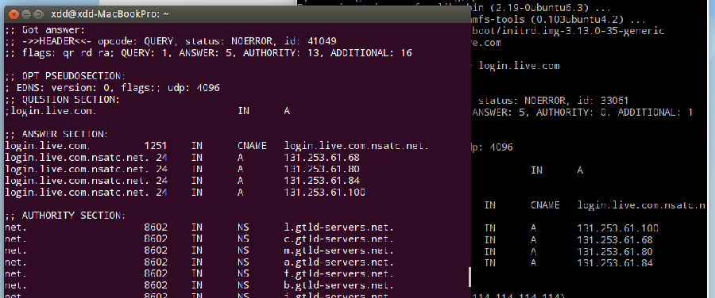
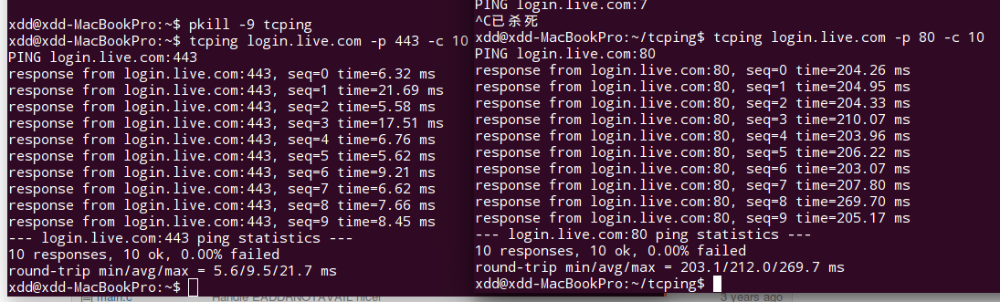

2014年10月4日晚上，从中国访问微软账户登陆页面均会跳出SSL证书无效提示，如图：



```bash
颁发对象
公用名 (CN)    hotmai.com
组织 (O)    hotmail.com
组织单位 (OU)     <未包含在证书中>
序列号    29
颁发者

颁发者
公用名 (CN)    hotmai.com
组织 (O)    hotmail.com
组织单位 (OU)     <未包含在证书中>
有效期

颁发日期    14-9-23
截止日期    15-9-23
指纹

SHA-256 指纹    7B AC CB 75 4D A5 BA 45 1F C5 FA E5 10 6B CE 22
34 E3 14 0C 8A 3B 05 9B 36 B0 8C 47 C7 C1 97 2D
SHA-1 指纹    30 F3 B3 AD C6 E5 70 BD A6 06 B9 F9 6D E2 41 90
CE 26 2C 67
```

以上复制自 Chrome，由“颁发者公用名仅为域名”和“hotmai.com”（没有l）可以看出，这是
一次SSL中间人攻击事件。

假证书内容如下：

```bash
-----BEGIN CERTIFICATE-----
MIICYjCCAcugAwIBAgIBKTANBgkqhkiG9w0BAQQFADA4MQswCQYDVQQGEwJjbjEU
MBIGA1UEChMLaG90bWFpbC5jb20xEzARBgNVBAMTCmhvdG1haS5jb20wHhcNMTQw
OTIzMTEzNDAzWhcNMTUwOTIzMTEzNDAzWjA4MQswCQYDVQQGEwJjbjEUMBIGA1UE
ChMLaG90bWFpbC5jb20xEzARBgNVBAMTCmhvdG1haS5jb20wgZ8wDQYJKoZIhvcN
AQEBBQADgY0AMIGJAoGBAJ0A+/fnNmwleMfxTRBS5iYkwq4jdOzdXMdWxJjYCJSL
izdyB2lfR1UFK0Q6230HkIYqUVzaUC4hsS9nvin3jQB37W5UESXAextNCIgpSQ9N
Baf4t5q5ud3AkbR11rdb559e/wMLzGsyD4CML3HlJwgcf4ZHAtrKIVbbBRcGt86J
AgMBAAGjfDB6MAwGA1UdEwEB/wQCMAAwDgYDVR0PAQH/BAQDAgQwMB0GA1UdDgQW
BBQ0j1vwhAYDwOUlEFdLxqlBjF0t6TARBglghkgBhvhCAQEEBAMCBeAwKAYJYIZI
AYb4QgENBBsWGWV4YW1wbGUgY29tbWVudCBleHRlbnNpb24wDQYJKoZIhvcNAQEE
BQADgYEANQTg2dSEXNPVBJYPSSEe6jLuFbAF7mULievq90yRzPDvXpzdBDxnevbg
A2bkXJJUJ3CimwvSg2WVgu4VK+fJMFiXBZthHjkcjGbPydtO7f+WeQKaEUK7EZe1
rNGBhbyz/1RpgXRwAw+oBp/Ii9ZoNsde1qD4hkP3OOlTTQNP2kg=
-----END CERTIFICATE-----
```

同时，也有反馈称login.windows.net出现同样问题，经过DNS查询，发现DNS没有受到污
染。



上图左：Google DNS，通过TCP查询，右：114DNS，通过UDP查询



经过测试，通过 Windows Azure 中国版建立的SSH隧道进行访问，没有出现问题。上左图为
本地查询结果，右图为Azure中国版查询结果，再次证实DNS没出问题。



经过tcping测试
（[https://github.com/jlyo/tcping](https://github.com/jlyo/tcping)）到443端口的
连接明显遭到劫持，毕竟ping login.live.com的延迟也有200ms左右，10ms内做出响应是绝
对不可能的。

大约晚上10：30左右，问题已经消失，到login.live.com的SSL连接恢复正常。
