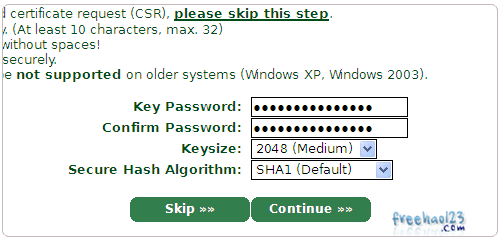

来自 CloudFlare 博客的最新消息
（[http://blog.cloudflare.com/google-now-factoring-https-support-into-ranking-cloudflare-on-track-to-make-it-free-and-easy](http://blog.cloudflare.com/google-now-factoring-https-support-into-ranking-cloudflare-on-track-to-make-it-free-and-easy)
），Google可能会在算权重的时候把网站支持SSL作为加分项目。因此我就给我的博客启用
了SSL。

## 申请证书

SSL在服务器端必须有证书。这个证书最好不要自己生成，否则大多数浏览器都会提示证书
不受信任。

StartSSL是目前唯一一家颁发免费SSL证书并且受到大多数浏览器信任的证书颁发机构，可
以根据
[http://www.freehao123.com/startssl-ssl/](http://www.freehao123.com/startssl-ssl/)
这篇文章进行操作。

不过在实际操作中，由于StartSSL连接速度较慢，如果按照向导生成证书，中途可能卡住，
而一旦卡住就要全部重来，我们可以自己生成证书请求，然后提交。

- 在你的Linux服务器（本例为Debian 7）上输入以下命令产生一个私钥：

  ```bash
  openssl genrsa -out privkey.pem 4096
  ```

- 输入以下命令产生证书请求（CSR文件），其中信息可以乱填，StartSSL不关心其中信
  息，他只关心你的私钥是多少。

  ```bash
  openssl req -new -key privkey.pem -out cert.csr
  cat cert.csr
  ```

- 把上一步的输出复制。
- 按照上面这篇文章操作，执行到这一步时选择Skip，然后粘贴入你的证书请求，然后下一
  步。
- 

## 安装证书

完成上面的步骤后，你应该（至少）有两个文件：一个是你的私钥，一个是证书文件。

如果你手动生成证书请求csr文件，那么privkey.pem就是你的私钥；如果你通过网页向导生
成，私钥已经在向导过程中给出。

- 把你的证书保存为ssl.crt，以下操作将按照本文件名继续。如果你通过网页向导操作，
  把你的私钥保存到ssl.key。
- 如果通过网页向导操作，输入以下命令对你的私钥解密，密码是你在网页向导上填写的那
  个。如果不解密，每次nginx启动时都会要求你输入密码。

  ```bash
  openssl rsa -in ssl.key -out privkey.pem
  ```

- Firefox在证书验证上比较奇葩，它要求证书文件中保存有这个证书的颁发机构的证书。
  因此我们要进行如下操作：

  ```bash
  wget http://www.startssl.com/certs/ca.pem
  wget http://www.startssl.com/certs/sub.class1.server.ca.pem
  cat ssl.crt sub.class1.server.ca.pem ca.pem > ssl-unified.crt
  ```

- 此时你获得一个ssl-unified.crt文件，把它和privkey.pem移动到你喜欢的地方。
- （警告：不要复制到能够通过网页访问来下载的地方，比如把他们放在/var/www里就是作
  死行为！本例以放在/root下为例。）
- 编辑你的nginx配置文件。

  ````bash
  cd /etc/nginx/sites-enabled```</li><li>```bashnano default #如果你的网站配置文件名不同，请替换。
  ````

- 在配置文件里你的网站那一段的listen 80下面输入：

  ```bash
  listen 443 ssl;
  ssl_certificate /root/ssl-unified.crt;
  ssl_certificate_key /root/privkey.pem;
  ```

- 重启nginx，安装结束。

  ```bash
  service nginx restart
  ```

## SPDY的安装和启用

SPDY是Google主导开发的一个网络协议，使用它，可以在一个SSL连接内同时传输好几路数
据。

比如，打开网页时，如果没有SPDY，那么浏览器就要同时打开好几路SSL连接下载数据。问
题是，这些连接不是同时打开的，一般情况下网页加载到一半，浏览器发现“哎呀我需要这
个东西但是还没下载”，才会开新连接下载数据。

而有了SPDY，浏览器可以直接在同一个SSL连接中下载数据，省去了连接和SSL验证的时间。

- 更新nginx版本。Debian软件源里默认的nginx不带有SPDY功能，需要把nginx替换成
  nginx-full。

  ```bash
  apt-get install nginx-full
  ```

- 编辑你的nginx配置文件，把

  ```bash
  listen 443 ssl;
  ```

  改成

  ```bash
  listen 443 ssl spdy;
  ```

  完事。

启用后，如果你的网站的图片、CSS、JS等都从你的服务器上下载，将会较大地改善你的网
站在SSL下的载入速度。
