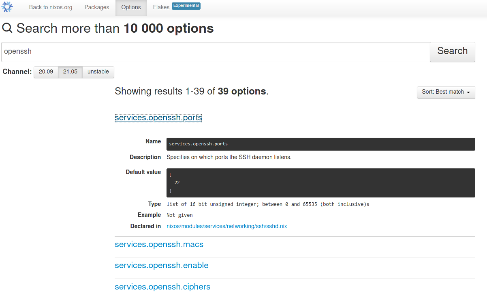
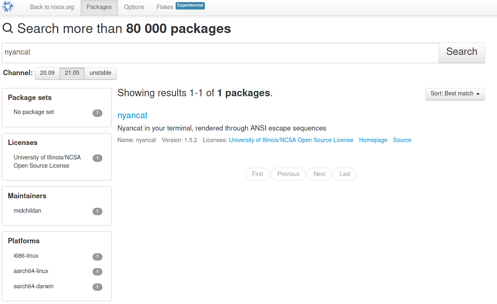
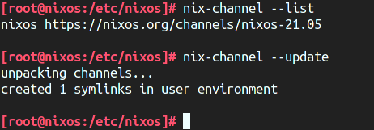

import Toc from '../../../../_templates/nixos-series/toc-zh.md'

<Toc />

这是我的 NixOS 系列文章的第二篇，主要介绍以下内容：

- NixOS 配置文件的基本格式和修改配置的方法
- Nix 包管理器的 Flake 功能
- Deploy-RS 部署工具

本文假设你已经按照
[NixOS 官方安装教程](https://nixos.org/manual/nixos/stable/index.html#sec-installation)装
好了一个系统。

## 更新日志

- 2023-05-10：增加推荐阅
  读：[NixOS 与 Nix Flakes 新手入门](https://thiscute.world/posts/nixos-and-flake-basics/)，
  作者 Ryan Yin。
- 2021-12-18：NixOS 21.11 仍没有默认启用 Flake 功能，更新文章中相关说明。

## 基础配置

在 NixOS 的安装过程中，`nixos-generate-config` 工具在 `/etc/nixos` 目录下生成了
一份初始配置文件，`configuration.nix` 和 `hardware-configuration.nix` 两份文件。
我们先不管 `hardware-configuration.nix` 这份文件，它是根据系统的硬件设备、硬盘分
区等自动生成的配置文件。先打开 `configuration.nix`：

```nix
# 为缩短长度，我去掉了配置文件中所有的注释
{ config, pkgs, ... }:

{
  imports =
    [
      ./hardware-configuration.nix
    ];

  boot.loader.grub.enable = true;
  boot.loader.grub.version = 2;
  boot.loader.grub.device = "/dev/sda";

  networking.useDHCP = false;
  networking.interfaces.enp0s3.useDHCP = true;
  networking.interfaces.enp0s8.useDHCP = true;

  system.stateVersion = "21.05";
}
```

这个文件定义了整个 NixOS 系统，包括安装的软件包和它们的配置。这个文件是 Nix 格式
的，也就是 NixOS 的 Nix 包管理器自创的一种“函数式编程”语言。但因为我们只是简单配
置，我们还用不到它的编程特性。我们可以先忽略开头的 `{ config, pkgs, ... }:` 一
行，**暂时把剩余部分当 JSON 看待。**

Nix 语言同样有着 JSON 的六大数据类型：数字，布尔值，字符串，对象，数组和 null，
写法也大体相同。此外，Nix 语言还多了一种“路径”数据类型：

```nix
{
  # 数字
  number = 123456;

  # 布尔值
  boolean_value = true;

  # 字符串
  string = "lantian.pub";

  # 对象
  object = {
    a = 1;
    b = 2;
  };
  # 上面的对象也可以写成下面这样，是等价的：
  object.a = 1;
  object.b = 2;

  # 数组
  array = [
    "first element"
    "second element"

    # 数组里也可以放对象：
    ({
      a = 1;
      b = 2;
    })
  ];

  # 路径，和字符串的区别是不加引号
  #
  # 注意：
  #
  # - 以路径格式指定的文件会在解析配置阶段被复制到 /nix/store 中，然后从那里调用
  #   路径一般用来指定和配置文件一起管理的文件，例如你手写的某个程序的配置文件
  #
  # - 而以字符串方式指定的文件不会被复制，但其内容也就不是配置文件的一部分
  #   它们不受 Nix 管理，内容也无法被 Nix 读取，但路径可以被原样写进配置文件，并被最终执行的程序读取
  #   一般用来指定独立管理的文件，例如你的网站程序代码
  file = ./somefile.txt;    # 会被复制成 /nix/store/[哈希值]-somefile.txt
  file2 = "./somefile.txt"; # 不会被 Nix 读取或处理
}
```

现在如果我们想安装一个 SSH 服务端以便远程登录，就可以添加这两行配置：

```nix
{ config, pkgs, ... }:

{
  # ...

  # 添加这两行
  services.openssh.enable = true;
  services.openssh.permitRootLogin = "yes";

  # 或者也可以利用 Nix 对象的特性，写成这样
  services.openssh = {
    enable = true;
    permitRootLogin = "yes";
  };

  # 或者这样
  services = {
    openssh = {
      enable = true;
      permitRootLogin = "yes";
    };
  };

  # ...
}
```

> `services.openssh.permitRootLogin = "yes";` 这行允许了用密码登录 `root` 账户。
> 因为我用的是一台不暴露在公网的虚拟机，比起安全我更注重方便。**如果你的机器暴露
> 在公网，不要加这行！**

修改完配置后，运行 `nixos-rebuild switch` 重新配置系统，NixOS 会读取你的配置文
件，自动下载 OpenSSH、生成配置文件并启动，然后你就可以用 SSH 连接 22 端口来登录
了。

再举一个例子，如果我想安装 `nyancat` 命令：

```nix
{ config, pkgs, ... }:

{
  # ...

  # 添加下面这几行
  environment.systemPackages = [
    # 这是个软件包的定义，不是一个字符串，而是一个对象
    pkgs.nyancat
  ];

  # 或者写成这样，with 命令指定直接引用 pkgs 里的内容，如果安装的包很多可以减小配置文件的长度
  environment.systemPackages = with pkgs; [
    nyancat
  ];

  # ...
}
```

运行 `nixos-rebuild switch`，`nyancat` 命令就安装好了：


NixOS 官方的[这份文档](https://nixos.org/manual/nixos/unstable/options.html)列出
了 `configuration.nix` 里可以定义的所有配置项。因为是所有配置项，所以这个网页很
长，打开网页的时候卡个几十秒也是很正常的事。你也可以用
[NixOS 官方搜索工具的 Options 页面](https://search.nixos.org/options)搜索配置
项：



或者在[搜索工具的 Packages 页面](https://search.nixos.org/packages)搜索软件包：



## 配置文件是函数

刚才我们一直忽略了配置文件的第一行 `{ config, pkgs, ... }:`。实际上，整个
`configuration.nix` 是一个 Nix 函数，这里的 `config` 和 `pkgs` 是输入的参数。

NixOS 的函数定义如下所示：

```nix
# 这是一个函数，输入是一个参数 a，返回值是（a+1）
a: a+1

# 这是一个函数，输入是一个参数 a，返回值是一个对象，对象有两个键值 a 和 b
# 注意 Nix 语言没有变量概念！
# 假设输入 a = 1，那么返回对象为 { a = 2; b = 3; }，而非 { a = 2; b = 4; }
a: {
  a = a + 1;
  b = a + 2;
}

# 这是一个函数，输入是一个对象，拥有键值 a 和 b，返回值是一个对象，拥有键值 a 和 b
# 假设输入 { a = 1; b = 2; }，那么返回对象为 { a = 2; b = 1; }
{ a, b }: {
  a = b;
  b = a;
}

# 这个函数和前一个函数的作用相同，只是参数里多了 ... 代表可以接受（并忽略）它不认识的参数
# 假设输入为 { a = 1; b = 2; c = 3; }
# 前一个函数不认识 c 所以会报错，但这个函数可以忽略 c 并正常工作
{ a, b, ... }: {
  a = b;
  b = a;
}
```

回头看安装 `nyancat` 命令的配置：

```nix
{ config, pkgs, ... }:

{
  environment.systemPackages = [
    pkgs.nyancat
  ];
}
```

它将 `pkgs` 参数（一个对象）的子对象 `nyancat` 加入了
`environment.systemPackages` 的列表中。`pkgs` 就是 NixOS 软件源中所有软件包的集
合，对应 [https://github.com/NixOS/nixpkgs](https://github.com/NixOS/nixpkgs) 这
个项目。类似的，`config` 参数是所有系统配置的集合，例如你想要读取安装过的软件包
的列表，就可以用 `config.environment.systemPackages`。

> Nix 语言是惰性求值（Lazy Evaluate）的。最开始加载配置文件后，NixOS 什么都不会
> 做，直到需要用到某个配置项（例如 `environment.systemPackages`），才会去解析它
> 的值（这个数组，以及其中的对象 `pkgs.nyancat`）。
>
> 顺便说一句，Nix 语言不支持循环引用，也就是类似
> `{ a = config.b; b = config.a; }` 这样的用法是不行的，会报错
> `infinite recursion encountered`（遇到无限循环）。

## 把配置分割到多个文件

当你使用了一段时间 NixOS 后，你可能会安装一大堆的软件，导致你的配置文件变得很
长，难以阅读。NixOS 支持在一个配置文件内引用（import）其它的配置文件，这样你就可
以把一部分配置（例如桌面环境，nginx + PHP + MySQL，等等）单独放到一个文件中，方
便后续查找。

假设我想把上面的 SSH 配置单独放到一个文件中。先创建 `/etc/nixos/ssh.nix`：

```nix
{ config, pkgs, ... }:

{
  services.openssh.enable = true;
  services.openssh.permitRootLogin = "yes";
}
```

然后在 `/etc/nixos/configuration.nix` 中将 `ssh.nix` 加到 `imports` 中，并把原有
的 SSH 配置删掉：

```nix
{ config, pkgs, ... }:

{
  # ...
  imports =
    [
      ./hardware-configuration.nix
      ./ssh.nix
    ];
  # ...
}
```

然后运行 `nixos-rebuild switch`，可以看到这次 rebuild 没有生成新的东西，也没有启
动/停止任何服务。这是因为我们只是把 SSH 的配置挪到了新的文件中，实际的配置并没有
发生变化。


接下来我简单解释一下 `imports` 的原理。可以看到 `configuration.nix` 这个函数有参
数 `config`，`pkgs`，和一些被我们忽略掉的参数（`...`）。NixOS 会用相同的参数（包
括忽略掉的和没忽略的）去调用 `imports` 里的每个文件，然后把返回的配置和当前配置
合并。

回头看 `ssh.nix`，我们可以发现它并没有用到 `config` 和 `pkgs` 两个函数，因此把它
们去掉也是可以的：

```nix
# 可以把 config 和 pkgs 去掉
{ ... }:

{
  services.openssh.enable = true;
  services.openssh.permitRootLogin = "yes";
}

# 甚至直接去掉所有参数也是可以的，imports 比较智能
{
  services.openssh.enable = true;
  services.openssh.permitRootLogin = "yes";
}
```

## Nix Flake

由于 NixOS 的所有配置都由 `configuration.nix` 决定，我们可以把这些文件直接复制到
另一台机器上，然后运行 `nixos-rebuild switch`，就可以得到一个一模一样的系统。包
括我在[本系列的第一篇文章](/article/modify-website/nixos-why.lantian/)中写到：

> (...) NixOS 的一大特点是，用一份 Nix 配置文件管理系统上的所有配置文件和软件
> 包。因此，我们可以用 Ansible，Rsync，甚至是 Git 等任何我们喜欢的工具，来专门管
> 理 `/etc/nixos` 这里一处的配置文件。由于只有这一处配置文件，我们不需要写一大堆
> 复杂的 Ansible Playbook，或者输入几十行 Rsync 命令，只需要直接覆盖
> `/etc/nixos`，再运行 `nixos-rebuild switch` 完事。

但现在我要告诉你，**我刚才说的都是错的。**

刚才我介绍了修改系统配置和安装软件包的方法，但唯独没有提到如何升级软件包。这是因
为 NixOS 的软件源是由另外一个命令 `nix-channel` 管理的：



其中 `nix-channel --list` 命令列出了当前配置的软件源列表，`nix-channel --update`
用来将软件源更新到最新。但是，`nix-channel` 的配置不归 `configuration.nix`
管，`configuration.nix` 也无法定义软件源的 URL 和版本。也就是说，由于软件源在不
断更新，你在一个月前和一个月后用同一份配置文件装出来的系统，可能会有软件版本的差
异。这就与 NixOS 一直宣传的“一份配置管天下”冲突了。

为了解决这个问题，Nix 引入了 Flake 功能，它支持了在配置文件中定义软件源 URL 版本
的功能。我们先修改 `configuration.nix` 并 `nixos-rebuild switch`，将 Nix 包管理
器升级到支持 Flake 的测试版：

```nix
{ config, pkgs, ... }:

{
  # ...
  nix = {
    package = pkgs.nixUnstable;
    extraOptions = ''
      experimental-features = nix-command flakes
    '';
  };
  # ...
}
```

> 本文写成时 NixOS 的最新稳定版本是 21.05，其 Nix 包管理器（2.3 版本）还默认禁用
> Flake 功能。 ~~NixOS 21.11 及以后的版本将默认开启 Flake 功能，届时将不需要这里
> 对 `configuration.nix` 的修改。~~ 由于担心 Nix 2.4 功能变化过大，尤其是会与旧
> 版 Nix 的行为不兼容，NixOS 21.11 仍将使用 Nix 2.3，将默认禁用 Flake 功能。相关
> 讨论在
> [https://discourse.nixos.org/t/nix-2-4-and-what-s-next/16257](https://discourse.nixos.org/t/nix-2-4-and-what-s-next/16257)
> 和
> [https://github.com/NixOS/nixpkgs/pull/147511](https://github.com/NixOS/nixpkgs/pull/147511)。

然后在 `/etc/nixos` 里创建一个 `flake.nix` 文件。这份 `flake.nix` 定义了一个软件
源（`input`），是
[https://github.com/NixOS/nixpkgs](https://github.com/NixOS/nixpkgs) 的
`unstable` 分支（也就是 `master` 分支）。

```nix
{
  # 文件描述，随便写，或者不写也可以
  description = "Lan Tian's NixOS Flake";

  # 输入配置，即软件源
  inputs = {
    # Nixpkgs，即 NixOS 官方软件源
    nixpkgs.url = "github:NixOS/nixpkgs/nixos-unstable";
  };

  # 输出配置，即 NixOS 系统配置
  outputs = { self, nixpkgs, ... }@inputs: {
    # 定义一个名为 nixos 的系统
    nixosConfigurations."nixos" = nixpkgs.lib.nixosSystem {
      system = "x86_64-linux";
      modules = [
        ./configuration.nix
      ];
    };

    # 你也可以在同一份 Flake 中定义好几个系统，NixOS 会根据主机名 Hostname 决定用哪个
    # nixosConfigurations."nixos2" = nixpkgs.lib.nixosSystem {
    #   system = "x86_64-linux";
    #   modules = [
    #     ./configuration2.nix
    #   ];
    # };
  };
}
```

然后运行 `nix flake update`：

```bash
[root@nixos:/etc/nixos]# nix flake update
warning: creating lock file '/etc/nixos/flake.lock'
```

生成了一个 `flake.lock` 文件，是一个 JSON：

```json
{
  "nodes": {
    "nixpkgs": {
      "locked": {
        "lastModified": 1636623366,
        "narHash": "sha256-jOQMlv9qFSj0U66HB+ujZoapty0UbewmSNbX8+3ujUQ=",
        "owner": "NixOS",
        "repo": "nixpkgs",
        "rev": "c5ed8beb478a8ca035f033f659b60c89500a3034",
        "type": "github"
      },
      "original": {
        "owner": "NixOS",
        "ref": "nixos-unstable",
        "repo": "nixpkgs",
        "type": "github"
      }
    },
    "root": {
      "inputs": {
        "nixpkgs": "nixpkgs"
      }
    }
  },
  "root": "root",
  "version": 7
}
```

`flake.lock` 指定了 `nixpkgs` 的 commit 编号和 SHA256 哈希值，这样即使这份配置文
件被复制到其它机器上，其它机器的 Nix 包管理器也会下载这个特定版本的 `nixpkgs` 软
件源，并安装对应版本的软件，真正做到了软件版本一模一样。

最后运行 `nixos-rebuild switch` 命令，NixOS 会自动优先读取 `flake.nix` 而非
`configuration.nix`，把系统里的所有软件包升级（或降级）到这个特定的版本。但因为
我们把 `configuration.nix` 加入了 `flake.nix` 的 `modules` 数组，所以系统配置还
是保持不变。

> 如果你开启了 Flake 功能，并使用 Git 管理你的文件，注意 NixOS 会忽略未被 Git 管
> 理的文件，只会读取已经 Stage 或 Commit 过的文件。如果你新建了一个文件，记得把
> 它 Stage 一下，否则 NixOS 会报找不到文件的错误。

## 使用 Deploy-RS 批量部署

现在我们配置好了一台机器。而我
在[本系列的第一篇文章](/article/modify-website/nixos-why.lantian/)中提到，我有
10 台机器。我当然可以自己写一个 Ansible 脚本把配置复制到所有机器的 `/etc/nixos`
文件夹再 `nixos-rebuild switch`，但是这有几个问题：

1. 如果软件源里的某个软件包没有预编译的二进制文件，我就得在所有机器上编译一遍。
   但因为我买的都是资源不是很多的便宜 VPS，很容易遇到内存不足或者 CPU 占用过高被
   主机商关机的问题。

   NixOS 的软件源有点类似于 Gentoo。与其它 Linux 发行版不同，一个软件包在 NixOS
   软件源里不代表它有二进制文件。NixOS 的“软件包”是一组 Nix 语言的定义，描述了下
   载、编译、打包一个软件的完整流程。

   一般情况下，NixOS 官方会帮我们编译好软件，然后上传到二进制缓存（Binary
   Cache）供我们下载。但如果我们自己改了软件包的编译流程（一般是一些编译参数）或
   者干脆是自己打的包（后面文章中会介绍），就得自己编译了。

2. Nix 包管理器解析配置文件的过程本身就会占用不少的内存和 CPU 资源，尤其是配置较
   复杂的时候。

理想情况下，可以用一台高性能机器（例如我的个人电脑，或者独立服务器）解析配置文
件，下载或编译好所有软件包和配置，再把它们上传到所有机器上启用，这样就不用消耗低
性能 VPS 的资源了。而这就是
[Deploy-RS 部署工具](https://github.com/serokell/deploy-rs)的功能。

要使用 Deploy-RS，首先我们要找一台装了 Nix 的机器。注意我没有要求你把这台机器重
装成 NixOS，因为 Nix 包管理器是可以安装在其它 Linux 发行版上的。例如我用的是运行
Arch Linux 的个人电脑，就可以根据
[Arch Linux Wiki](<https://wiki.archlinux.org/title/Nix_(%E7%AE%80%E4%BD%93%E4%B8%AD%E6%96%87)>)
上的教程安装。其它发行版可以用 Nix 官方的一键安装脚本：

```bash
# 复制自 https://nixos.org/download.html
curl -L https://nixos.org/nix/install | sudo sh
```

然后我们要在这台机器上启用 Nix Flake 功能：

```bash
nix-env -iA nixpkgs.nixFlakes
echo "experimental-features = nix-command flakes" >> /etc/nix/nix.conf
systemctl restart nix-daemon
```

回到上一节创建的 `flake.nix` 文件，我们要添加 Deploy-RS 的软件源，并在 `outputs`
中添加 SSH 连接的配置：

```nix
{
  description = "Lan Tian's NixOS Flake";

  inputs = {
    nixpkgs.url = "github:NixOS/nixpkgs/nixos-unstable";

    # 新增下面几行
    deploy-rs = {
      url = "github:serokell/deploy-rs";
      inputs.nixpkgs.follows = "nixpkgs";
    };
  };

  outputs = { self, nixpkgs, ... }@inputs: {
    nixosConfigurations."nixos" = nixpkgs.lib.nixosSystem {
      system = "x86_64-linux";
      modules = [
        ./configuration.nix
      ];
    };

    # 新增下面几行
    deploy = {
      sshUser = "root";           # SSH 登录用户名
      user = "root";              # 远程操作的用户
      sshOpts = [ "-p" "2222" ];  # SSH 参数，这里是指定端口 2222

      # 部署失败自动回滚，建议关闭
      # 因为 NixOS（尤其是 Unstable 分支）部署不太稳定，有时需要部署两次才成功
      # 如果自动回滚了，反而适得其反，导致连续部署失败
      autoRollback = false;

      # 断网自动回滚，建议关闭
      # 在你配置防火墙或 IP 出错把网络干掉时，自动回滚，这样你就不用去主机商控制面板连 VNC 或 IPMI 了
      # 但如果你就是在调整防火墙或者 IP 配置，会有当时断网、但重启机器就可以应用新配置恢复正常的情况
      # 自动回滚反而适得其反，因此建议关闭
      magicRollback = false;

      nodes = {
        "nixos" = {
          # 目标机器的地址，IP 或域名或 .ssh/config 中配置的别名均可
          hostname = "192.168.56.105";
          profiles.system = {
            # 调用上面的 nixosConfigurations."nixos"
            path = deploy-rs.lib.x86_64-linux.activate.nixos self.nixosConfigurations."nixos";
          };
        };
      };
    };
  };
}
```

最后执行 `nix run github:serokell/deploy-rs -- -s .` 运行 Deploy-RS 即可。

## 附录：在甲骨文 ARM 云服务器上使用 NixOS

NixOS 也支持 ARM64v8 架构，也就是甲骨文 ARM 云服务器的架构。因为甲骨文 ARM 云服
务器实际上是一个 KVM 虚拟机，没有其它的特殊硬件，所以可以直接用
[NixOS-Infect](https://github.com/elitak/nixos-infect) 将现有系统替换成 NixOS。

相比 x86 机器，只需要在 `flake.nix` 中将对应的 `system` 改为 `aarch64-linux`：

```nix
{
  # ...
  outputs = { self, nixpkgs, ... }@inputs: {
    nixosConfigurations."oracle-vm-arm" = nixpkgs.lib.nixosSystem {
      system = "aarch64-linux";
      modules = [
        ./configuration-oracle-vm-arm.nix
      ];
    };
  };
  # ...
}
```

其它配置都与 x86 机器无异。但是如果你使用 Deploy-RS 想在本地生成配置，会发现 Nix
包管理器报错，显示当前机器不支持 ARM 架构。此时我们可以在本地机器上安装
`qemu-user-static` 和相应的 `binfmt` 配置，让本地系统可以用模拟的方式运行 ARM 架
构的程序。

对于 Arch Linux，需要从 AUR 安装
[qemu-user-static](https://aur.archlinux.org/packages/qemu-user-static/) 和
[binfmt-qemu-static-all-arch](https://aur.archlinux.org/packages/binfmt-qemu-static-all-arch/)
两个包。

对于 Debian，需要安装
[qemu-user-static](https://packages.debian.org/sid/qemu-user-static) 软件包。

安装完成后还需要修改 `/etc/nix/nix.conf`，添加这一行配置，告诉 Nix 包管理器当前
机器可以运行 ARM 程序：

```bash
extra-platforms = aarch64-linux arm-linux
```

然后重启 Nix Daemon `systemctl restart nix-daemon`，Deploy-RS 就可以使用了。

## 附录：扩展阅读

在这篇文章中，我们配置了一个基础的、几乎没有额外软件的 NixOS 系统。关于实际安
装、配置软件，我推荐阅读 Ryan Yin 的
[NixOS 与 Nix Flakes 新手入门](https://thiscute.world/posts/nixos-and-flake-basics/)。
他的文章给出了一些配置常用软件的配置范例。

你也可以阅读以下文档来更深入地了解 NixOS 的配置语法、Flake 功能，以及
Deploy-RS。注意以下文档都是英文的：

- NixOS 配置语法
  - [NixOS.Wiki: Nix Expression Language](https://nixos.wiki/wiki/Nix_Expression_Language)
  - [Nix By Example](https://medium.com/@MrJamesFisher/nix-by-example-a0063a1a4c55)
- Flake 功能
  - [NixOS.Wiki: Flakes](https://nixos.wiki/wiki/Flakes)
- Deploy-RS
  - [GitHub: Deploy-RS](https://github.com/serokell/deploy-rs)

你也可以参考我在 GitHub 上发布的配置文件：

- [Initial commit](https://github.com/xddxdd/nixos-config/tree/9ed2eff8e4e6054151558f3d5909f3ef2af9b288)
  - 完成了基础配置和 Nix Flake 部分。
- [general: add deploy-rs script, change SSH port to 2222](https://github.com/xddxdd/nixos-config/tree/79c6f5b45d7ff574ecefb594ed76715715906cec)
  - 完成了 Deploy-RS 的配置。
