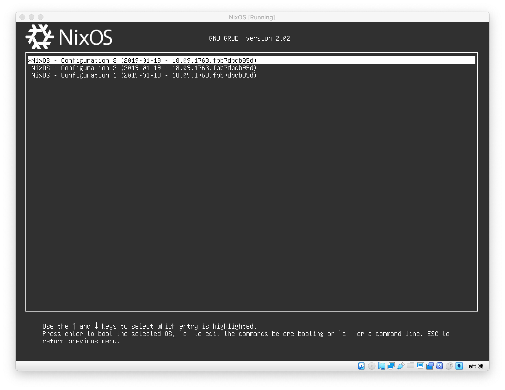

import Toc from '../../../../_templates/nixos-series/toc-zh.md'

<Toc />

我正在将我的各个服务器逐步从 Devuan Linux 迁移到
[NixOS](https://nixos.org/)。NixOS 是一个以 Nix 配置文件为中心的 Linux 发行版，
通过 `/etc/nixos` 的一份配置文件安装配置整个系统。这份配置文件指定了系统上的**所
有**配置文件和软件包配置，因此你用同一份配置文件装出来的一定是一模一样的操作系
统。Nix 语言是图灵完备的，所以理论上无论你用的软件配置多复杂，你都能用 Nix 生成
对应的配置文件。

Nix 包管理器的另一大特性是 Reproducible Build（可重复构建）。NixOS 的软件包也是
用 Nix 配置文件指定的，而 Nix 包管理器可以保证，（在软件本身不故意对抗的情况
下），用同一份配置文件（包括源码版本，编译命令等）编译出的软件包功能完全一致，在
绝大多数情况下连 MD5、SHA256 等哈希值都是一样的。

由于 NixOS 是一个对新手非常不友好的发行版，我会写一系列的文章介绍我的整个迁移流
程。本文是这个系列中的第一篇文章，主要介绍我对 NixOS 心动的原因。

# 在我使用 NixOS 之前

## 多服务器管理

不知道各位都有多少台服务器呢？我有 10 台。除了我在 [DN42 Peering](/page/dn42/)
页面列出的 4 台用来运行网站和 BGP 网络的 VPS，我还有 1 台运行 CI 和备份的独立服
务器，3 台白嫖的甲骨文云服务器，1 台运行 Keycloak 等一堆 Java 程序的大内存
VirMach 纽约 VPS，和 1 台准备用来替换 Virtono 法兰克福节点的 VPS。

当你手上有了很多的服务器，你就会发现统一管理它们成了很大的问题。如果我需要修改每
台服务器上的 BIRD 配置，我都要这么干：

```bash
# 从随便一台机器上把配置文件下载回来
scp hostdare.lantian.pub:/etc/bird/bird.conf .
# 修改配置
nano bird.conf
# 用 Ansible 把配置传到所有机器上，并且让 BIRD 重新加载配置
ansible all -m copy -a "src=bird.conf dest=/etc/bird"
ansible all -m shell -a "birdc configure"
```

这还只是最简单的情况。如果你要修改的这个配置文件每台机器上不一样，那就更麻烦了，
只能一台台登录上去手工修改。等你把 10 台服务器的配置修改完了，半个小时也过去了。

为了尝试解决这个问题，从今年年初开始，我开始用 Ansible 的模板功能生成这些配置文
件，例如这是我的 BIRD 的其中一个配置文件：

```bash
define LTNET_IPv4 = {{ ltnet_prefix_v4 }}.1;
define LTNET_IPv6 = {{ ltnet_prefix_v6 }}::1;
define LTNET_AS = {{ 4225470000 + ltnet_index }};
```

这样我就可以在 Ansible 的 Inventory 里给每台机器定义变量，从而批量生成配置文件：

```yaml
all:
  hosts:
    hostdare.lantian.pub:
      ltnet_index: 3
      ltnet_prefix_v4: 172.18.3
      ltnet_prefix_v6: fdbc:f9dc:67ad:3
```

每次修改完配置文件后，我就直接运行 `ansible-playbook` 命令，调用我预先写好的
Playbook，在所有节点上生成新配置并自动 reload BIRD。这样 BIRD 的问题就解决了，但
是我还有一大堆的其它组件也要做类似的操作，例如 Nginx，CoreDNS，Tinc VPN 等等。同
时，系统本身的配置，大到预先装好的软件包，小到 sysctl.conf，MOTD 等配置文件，也
要有对应的 Playbook 管理，于是我就有了一大堆 Playbook 和一大堆模板。

这还没完。很明显，每次修改配置时我不可能把所有的 Playbook 都运行一遍，否则一次部
署可能要花上好几个小时。于是我每次修改配置文件后，都要先自己判断一下，在这么多
Playbook 中需要执行哪一个。因为 Playbook 的数量太多了，我干过好几次怎么配置都不
生效，结果发现用错部署脚本的事情。

还没完。由于我的大部分节点都是便宜的 VPS，有的时候它们会不稳定，导致部署失败。这
时我一般都会等下次节点恢复后再部署一次——当然，前提是如果我还记得。如果我忘了部署
上一次的修改，结果下一次修改依赖上一次的修改，那么我又要花一堆时间排查问题。

## 二进制程序分发

我有很多自己开发或者魔改的软件，例
如[魔改的 Nginx](/article/modify-website/serve-dn42-whois-with-nginx.lantian/)，[Traceroute 念诗](/article/creations/traceroute-chain.lantian/)，[BIRD Looking Glass](/article/modify-website/go-bird-looking-glass.lantian/)，
和自己裁剪的内核。很明显，我不可能在我的便宜 VPS 上跑这些编译任务，否则一旦 CPU
占用过高被主机商停机就 GG 了。我需要在某一个地方把软件编译好，再部署到各个节点
上。

在切换到 NixOS 前，我用的是 [Devuan 发行版](https://www.devuan.org)（就是去掉
SystemD 的 Debian）。Debian 系的软件包是出了名的难打，你需要写一套复杂的、专门用
于打 DEB 包的 Makefile。再加上一些复杂的软件会有很多自定义的依赖，例如我的 Nginx
就依赖 Brotli，Cloudflare 魔改的 Zlib，BoringSSL，和很多第三方 Nginx 模块，要打
成一个包就更加困难了。因此，我直接放弃了打 DEB 包，转而考虑其它方案。

下一个解决方案就是 Docker 容器。Docker 容器本身很好
用，[我 2016 年就开始用了](/article/modify-website/migrate-website-docker.lantian/)。
但是，随着 Docker 的版本更新和新功能不断的加入，Docker 的内存占用也越来越高。在
我的服务器上，`dockerd` 一般会占用 80-100MB 内存，再加上 `containerd` 的
20-30MB，一下就吃掉了我的 512MB 小内存 VPS 的四分之一。

> 内存占用也是我从 Debian 转向 Devuan 的主要原因，因为 SystemD 的各个进程会占用
> 50MB 的内存，而 Devuan 仍在使用 Debian 7 及以前的 sysvinit 框
> 架，init、udev、rsyslog 的常驻内存占用加起来只有 20MB。而且因为我用 Docker，所
> 以我根本用不上 SystemD 的高级功能。
>
> 如果这些小内存 VPS 内存占用过高，轻则由于磁盘 IO 性能低、SWAP 缓慢导致操作用时
> 长，重则完全被 IO 延迟卡死，或者由于 IOPS 过高被主机商关机。

当然，`dockerd` 是有替代品的，就是 Red Hat 主导开发的 Podman。Podman 最大的特点
是没有类似 `dockerd` 的常驻后台进程，只会在用到容器时给每个容器创建一两个进程，
用于监控容器状态、读取日志信息和完成容器间 DNS 解析。但是，没有常驻进程意味着
Podman 本身没有开机自启功能，需要依赖 SystemD、Supervisord 等管理程序。同时，尽
管 Podman 尽力模仿 Docker 的 API，它的兼容性仍不完善，导致 Docker Compose 等工具
难以与它配合使用。对我来说最严重的问题是无法使用
[IPv6 NAT 功能](https://github.com/robbertkl/docker-ipv6nat)，导致容器没有 IPv6
网络，容器的服务也无法从 IPv6 访问。

这也引出了下一个问题：容器的网络配置很复杂。在默认情况下，每个 Docker 容器都会分
到自己的网络命名空间，有自己的 IP 地址。这意味着容器间不能使用
127.0.0.1（localhost）来互相访问，只能通过 DNS 解析获取名称。例如容器里的
PHP-FPM 不能通过 127.0.0.1 连上 MySQL 数据库，必须先 DNS 解析 `mysql` 这个容器的
IP 地址，才能连上。那么。容器里的程序就不能只监听 127.0.0.1 了，必须监听 0.0.0.0
才能让宿主机和其它容器访问。由于 MySQL 等数据库为了安全大都是默认监听 127.0.0.1
的，这意味着需要在打包 Docker 镜像时，或者在使用 Docker 镜像时，写一份配置文件把
监听 IP 改掉。

DNS 解析也引来了新的问题，就是程序可能不会及时刷新 DNS 缓存，主要例子就是
Nginx。例如，我有两个容器 A（172.17.0.100）和 B（172.17.0.101）。我修改了这两个
容器的配置，并且调用 `docker-compose` 重新创建了它们。结果，由于
`docker-compose` 并行创建容器导致顺序不固定，这次 A 分到了 172.17.0.101，B 分到
了 172.17.0.100。结果由于反向代理 Nginx 没有更新 DNS，我访问 A 看到的却是 B，反
之亦然。为了解决这个问题，我就得把与 A、B 有关联的容器都重启一遍——这又是额外的操
作成本。

这也不是没有解决办法。Docker 可以把容器的网络模式设置成 host（即 `--net host` 参
数），让容器直接使用宿主机的网络命名空间，共享 IP。但是，由于默认状态下容器里的
程序需要监听 0.0.0.0，很多 Docker 镜像在打包时已经帮你修改好了配置文件，监听
0.0.0.0。结果你使用 host 模式，直接把端口暴露到了公网，反而造成了安全隐患。你还
需要修改配置文件，把监听 IP 改回去。太麻烦了！

另一种方案是，可以手动给每个容器指定一个 IP 地址，保证每个容器重建时 IP 不变。很
明显，给十几二十个容器手动编号 IP 并不好玩。

## 系统崩溃

由于我经常修改系统的各种配置，不小心把节点的网络干掉，或者内核在 initrd 阶段启动
失败，也是常有的事。一旦碰到这种情况，我就只能用缓慢的 VNC，甚至是某些只支持
Java 7 的 IPMI，去手动修改系统配置。如果运气更差，系统完全无法启动，还得使用救援
系统尝试修改配置文件。

各个主机商提供的救援系统参差不齐，你经常会遇到一些奇怪的问题。我遇到过内核版本
4.9 的救援系统，无法读取我的 Zstd 压缩的 Btrfs 文件系统；也遇到过救援系统不提供
对应的内核头文件，导致我无法编译 ZFS 内核模块，无法挂载我的 ZFS 分区。

另外，如果你修改完一次配置就能解决问题，那你的运气还不错。由于我很少重启节点，现
在这次启动失败有可能缘于三个月前的一次配置修改。此时，我就得一边查我的 Git 历史
记录，猜测问题原因，一边一次一次的重启进救援系统、挂载分区修改配置、再重启回主系
统祈祷它能正常启动。

当我终于解决了系统问题，大半天已经过去了。

# 安装 NixOS

NixOS 独特的 Nix 包管理/配置管理机制可以解决以上的问题。我们先来安装 NixOS。由于
NixOS 是一个基于配置文件的发行版，安装步骤可以简化成三步：

1. 硬盘分区，挂载到 `/mnt`，装过 Arch Linux 或者 Gentoo 的人应该都会。
2. 生成一个默认的配置文件并简单修改，`nixos-generate-config --root /mnt` 会自动
   检测硬件并生成配置到 `/mnt/etc/nixos/configuration.nix`。
3. 从配置文件安装系统，`nixos-install`。

NixOS 的安装教程
在[这份文档](https://nixos.org/manual/nixos/stable/index.html#sec-installation)，ISO
镜像可以在[这个页面](https://nixos.org/download.html)下载到。

如果你想在 VPS 上安装 NixOS，但是主机商不愿意帮你挂载 ISO 镜像，你的 VPS 内存太
小也无法从网络（[Netboot.xyz](https://netboot.xyz/)）启动 NixOS 安装镜像，你也可
以用 [NixOS-Infect](https://github.com/elitak/nixos-infect) 工具，把已有的系统替
换成 NixOS。

> NixOS-Infect 在小内存机器上会自动挂载 Swap 文件，防止安装过程中内存耗尽。但是
> 如果你用的是 Btrfs、ZFS 等、不支持直接挂载 Swap 的文件系统，你需要手动编辑
> `nixos-infect` 脚本，把 `makeSwap` 和 `removeSwap` 函数禁用掉。

有了 NixOS，上面这些管理节点的问题就迎刃而解了：

## 多服务器管理，但有了 NixOS

在本文最开头我提到：NixOS 的一大特点是，用一份 Nix 配置文件管理系统上的所有配置
文件和软件包。因此，我们可以用 Ansible，Rsync，甚至是 Git 等任何我们喜欢的工具，
来专门管理 `/etc/nixos` 这里一处的配置文件。由于只有这一处配置文件，我们不需要写
一大堆复杂的 Ansible Playbook，或者输入几十行 Rsync 命令，只需要直接覆盖
`/etc/nixos`，再运行 `nixos-rebuild switch` 完事。

由于每次更新配置文件都相当于对系统里的软件和配置都进行一次完全覆盖，你不需要考虑
需要运行哪个专门的部署脚本，重启哪个服务，或者有没有之前漏部署的配置文件。NixOS
会自动和上次的配置文件对比，自动重启需要的服务。

NixOS 作为一个有一段历史的 Linux 发行版，也有一定的软件生态，例如
[Deploy-RS 部署工具](https://github.com/serokell/deploy-rs)。它可以读取你的 Nix
Flakes 配置文件（Nix 配置的一种变种），在本地完成计算，生成所有配置文件和软件
包，再把它们复制到所有节点激活。

## 二进制程序分发，但有了 Nix 包管理器

Nix 包管理器把二进制程序储存在类似
`/nix/store/wadmyilr414n7bimxysbny876i2vlm5r-bash-5.1-p8` 的路径里。中间的哈希值
对应了软件包配置文件里的所有输入，包括源码的版本（如 `tar.gz` 的 URL，或者 Git
仓库的 commit hash），源码的 SHA256 哈希值，编译和安装的命令，以及所有依赖组件的
版本。为了保证同一份配置编译出的软件一模一样，Nix 包管理器在沙盒中进行编译，编译
脚本只能读取到 `/nix/store` 中依赖组件的路径，无法获取系统时间（Unix 时间戳固定
为 0，即 1970 年 1 月 1 日 0 时 0 分 0 秒），也无法联网。

例如，众所周知 Linux 系统上的绝大多数程序都要依赖系统的 Libc。我们看下刚才这份
Bash 依赖的是哪里的 Libc：

```bash
$ ldd /nix/store/wadmyilr414n7bimxysbny876i2vlm5r-bash-5.1-p8/bin/bash
linux-vdso.so.1 (0x00007ffe169d8000)
libdl.so.2 => /nix/store/mij848h2x5wiqkwhg027byvmf9x3gx7y-glibc-2.33-50/lib/libdl.so.2 (0x00007f767f863000)
libc.so.6 => /nix/store/mij848h2x5wiqkwhg027byvmf9x3gx7y-glibc-2.33-50/lib/libc.so.6 (0x00007f767f69e000)
/nix/store/mij848h2x5wiqkwhg027byvmf9x3gx7y-glibc-2.33-50/lib/ld-linux-x86-64.so.2 => /usr/lib64/ld-linux-x86-64.so.2 (0x00007f767f86a000)
```

这份 Bash 只能调用 `/nix/store` 中固定路径的 Glibc，也就是编译时使用的那一份。因
此，Nix 包管理器也能避免共享库更新导致程序出错，因为程序只能使用编译时对应路径的
库文件，而由于路径里有编译配置的哈希值，这个路径对应的库文件也必定是一模一样的。
因此，只要一份程序刚编译出时能正常运行，未来也一定能一模一样地运行。

> 以上保证不包括程序故意对抗的一些情形，例如编译时根据 `/dev/random` 随机数生成
> 结果，运行时根据系统时间执行不同行为（即时间炸弹 Time bomb），等等。但是在正常
> 的软件中以上对抗情形十分罕见，因此可以认为 Nix 包管理系统对于绝大多数程序都能
> 完成以上保证。

同理的，如果我把这份 Bash 和对应的库文件都复制到另一台机器上，只要路径依然保持一
致，这份 Bash 也一定可以一模一样地运行。因此，Nix 包管理器也有安装在
Ubuntu、Arch Linux 等其它发行版上的版本，使用的绝大多数二进制文件都和 NixOS 相
同，软件功能也等同，同时不影响系统自带的包管理。

上面提到的 [Deploy-RS 部署工具](https://github.com/serokell/deploy-rs)其实就是这
个原理：在本地先完成所有软件包的下载或构建，再把 `/nix/store` 里的对应内容复制到
部署目标上，就不用在目标机器上再编译了。

顺便提一句，Nix 包管理器把配置文件也和软件包同样对待，例如
`/nix/store/dpgmxhxkf55dfgwnrhz7hc4ahckkx78b-nginx.conf` 就是我的一份 Nginx 配置
文件。Deploy-RS 也用相同的逻辑在本地生成配置文件，再复制到目标机器上。

## 系统崩溃，但幸好有 NixOS

NixOS 的所有二进制程序和配置文件都在 `/nix/store` 里，没有一个统一的目录。因
此，NixOS 会调整 `PATH` 环境变量，加入软件包的 bin 目录，这样你就可以在 Bash 下
直接使用对应的命令；同时 NixOS 会把一些配置文件链接到 `/etc` 下，这样软件就可以
在正常的位置找到它们了。

如果此时新的配置文件导致系统崩溃，理论上只需要调整 `PATH` 和 `/etc` 里的链接，恢
复到上一次正常的配置，就可以把整个系统恢复到旧版了。因此 NixOS 直接在启动菜单里
提供了选项，可以选择启动到某一次特定部署。



> 网图，来自
> [https://discourse.nixos.org/t/how-to-make-uefis-grub2-menu-the-same-as-bioss-one/10074](https://discourse.nixos.org/t/how-to-make-uefis-grub2-menu-the-same-as-bioss-one/10074)

所以，在大多数情况下，NixOS 不需要救援系统，它可以使用旧配置自己救自己。在系统启
动成功后，就可以重新部署新配置，或者直接正常使用旧版的系统，假装无事发生。

> 注意 NixOS 的这套机制不是真正的文件系统快照，无法回滚程序的数据文件。
>
> 假设我升级了 MariaDB 10.6，随后回退到旧版配置，旧配置使用的是 MariaDB 10.5。由
> 于 MariaDB 10.6 在首次启动时自动升级了数据文件，MariaDB 10.5 不认识新版的数据
> 文件，无法正常启动。NixOS 无法、也不准备解决这种问题。

# 总结及后续

这篇文章的主要目的是介绍 NixOS 及其包管理体系相对于其它 Linux 发行版的优点。在后
续的文章中，我将会介绍如何在 NixOS 中配置各种软件，一步一步替换我已有的节点。
