> 本文部分内容参考自
> <https://hostedtalk.net/t/connecting-uptime-robot-with-ns1-dns-api/3883>。

# 目标

我的 VPS 多且遍布世界各地，但一直以来，我的网站都只用了美国洛杉矶的一台 VPS 提供
服务。因为我为了特殊线路、低价等原因购买的都是小服务商的 VPS，而非
DigitalOcean、Vultr 甚至 AWS、Azure 等大厂，这台美国洛杉矶的 VPS 网络有时会不稳
定，虽然次数很少，但每次我都得手动临时切换 DNS 到其它 VPS 上，等网络恢复后再切换
回来。因此，我希望可以把手头所有的 VPS 都用来提供网站服务，在某台 VPS 宕机时，用
DNS 将流量自动切到其它 VPS 上。

由于我的网站使用 Hexo 静态网页生成系统，同步网站数据并无难度：只需要在一台 VPS
上生成文件，再用 Ansible 批量同步到所有 VPS 上即可。但更大的问题是 DNS 的配置。
我希望用 GeoDNS 把用户导流到最近的 VPS 上，例如亚洲用户可以访问我的中国香港节
点，美国用户可以访问我的美国洛杉矶节点，等等。

但是市面上的 GeoDNS 服务价格都有些昂贵，当只使用一个域名时：

- [CloudNS 每月的价格是 \$9.95](https://www.cloudns.net/geodns/)；
- [Constellix 每月的价格是 \$10](https://constellix.com/pricing/products)；
- [AWS Route 53 每月的价格是 \$0.5，外加每百万次查询 \$0.7，和每个节点的监控 \$0.75](https://aws.amazon.com/route53/pricing/)；
- [PerfOps 提供一个开启了 GeoDNS 的子域名用于 CNAME，10 万次查询以内是免费的，但每个节点的监控要 \$5](https://perfops.net/pricing)。
- Cloudflare Load Balancing 每月的价格是 \$15（两个后端，开启 Traffic
  Steering），之后每多一个节点再加 \$5。

好在 [NS1 提供支持 GeoDNS 的免费服务](https://ns1.com/plans)。虽然 NS1 免费版只
能监控一个节点，但它支持用 API 接口或者 [AWS SNS](https://aws.amazon.com/sns/)
设置节点健康状态，从而达到自动切换节点的效果。

## 为什么不自建

我以前试
过[用 PowerDNS 自建权威 DNS 来实现 GeoDNS](https://lantian.pub/article/modify-website/powerdns-lua-diy-geodns.lantian/)，
但是效果并不好。最主要的原因是，各地的递归 DNS 不会自动选择最近的权威 DNS 进行解
析，而是从域名的 DNS 列表中随机选择一个；如果某个递归 DNS 选到了地球另一边的权威
DNS，甚至选到了一个暂时宕机的节点，DNS 解析就会很慢甚至失败，反而影响网站打开速
度。

商业 DNS 大都使用 Anycast 解决这个问题，也就是在多个数据中心发布同一个 IP 地址，
递归 DNS 的请求会被路径上的路由器自动导向最近的数据中心。但是发布 IP 地址的前提
是，你要有一个 ASN（一次性价格 \$50-100），还要有一段 IPv4 地址（每月价格约
\$100），性价比甚至不如直接购买商业 DNS。

# 准备工作

你需要准备好：

1. 一个绑定信用卡的 AWS 帐号，每月可能需要支付几美分费用。我们需要使用：
   - [Lambda 函数计算功能](https://aws.amazon.com/lambda/pricing/)（每月前 100
     万次请求免费）；
   - [API 网关](https://aws.amazon.com/api-gateway/pricing/)（用于将 Lambda 函数
     暴露到公网，前 12 个月每月 100 万次请求免费，随后每百万次请求 \$1.17）；
   - [SNS 消息服务](https://aws.amazon.com/sns/pricing/)（用于将宕机、恢复消息发
     给 NS1，每月前 100 万次请求免费）。
2. 一个 [NS1 帐号](https://ns1.com/signup)，需要验证信用卡，但不需要收费。
3. 一个 DNS 记录数量低于 50 的域名，绑定到 NS1 上。NS1 免费版限制域名上只能有 50
   条 DNS 记录。
   - 你可以注册一个 6-9 位数的 xyz 域名专门用于
     NS1，[每年价格仅需 $0.99](https://gen.xyz/1111b)，然后把主域名 CNAME 过去。
4. 在你的主 DNS 上，给每个后端节点添加一个单独的 A/AAAA 记录，例如
   `hostdare.lantian.pub -> 185.186.147.110`，后面将会把 CNAME 和监控都指向这
   里。
5. 一个 UptimeRobot 或 Freshping 帐号，配置好所有节点的监控。
   - 后端地址请使用第 4 步配置好的域名。以
     `hostdare.lantian.pub -> 185.186.147.110` 为例，监控地址请使用
     `https://hostdare.lantian.pub`，而非 `185.186.147.110` 等 IP 地址。
   - UptimeRobot 的最小监控间隔是 5 分钟。Freshping 的最小监控间隔是 1 分钟，但
     不支持 IPv6。你可以自行取舍。

一般来说宕机通知的条数都很少，因此你在 AWS 的消费很可能低于每月 1 美分，几乎完全
免费。

所有消息的流向是：

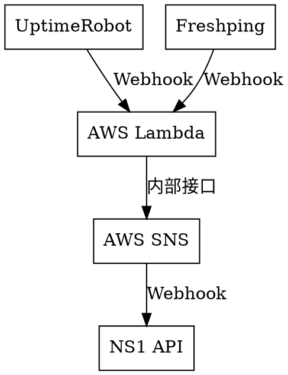

## 为什么要用 AWS Lambda 和 AWS SNS

因为 NS1 的 Webhook 接口不太稳定，而 AWS SNS 支持自动重试。

在最初测试时我用的是 Cloudflare Workers，但是 NS1 的 API 接口频繁返回 Bad
Request 错误，而且短时间内重试无法解决该问题。因为 Cloudflare Workers 只能由请求
触发，而且有执行时间限制，它无法在后台每过几秒重试一次。

但是 AWS SNS 可以做到接口不稳定时自动重试，而 AWS Lambda 可以方便地向 SNS 发送消
息，因此我最后选择了 AWS 的服务组合。

# NS1 对接 AWS SNS

1. 进入 [NS1 后台的 Integrations 页面](https://my.nsone.net/#/integrations)，点
   击 `Add a Data Source` 添加数据源，选择 AWS CloudWatch，名称任意。
   - 我们并不会用到 AWS CloudWatch 服务，只是我们会将宕机信息以 CloudWatch 的格
     式发给 NS1。
2. 切换到 Incoming Feeds 标签，点击 CloudWatch 图标添加一个数据订阅（Feed），其
   中 `Alarm Name` 需要与 UptimeRobot/Freshping 上配置好的域名一
   致。`Name (for internal reference)` 可以随意填写，我配置成和 `Alarm Name` 保
   持一致。

   - 以 `hostdare.lantian.pub -> 185.186.147.110` 为例，`Alarm Name` 需要填写为
     `hostdare.lantian.pub`。

   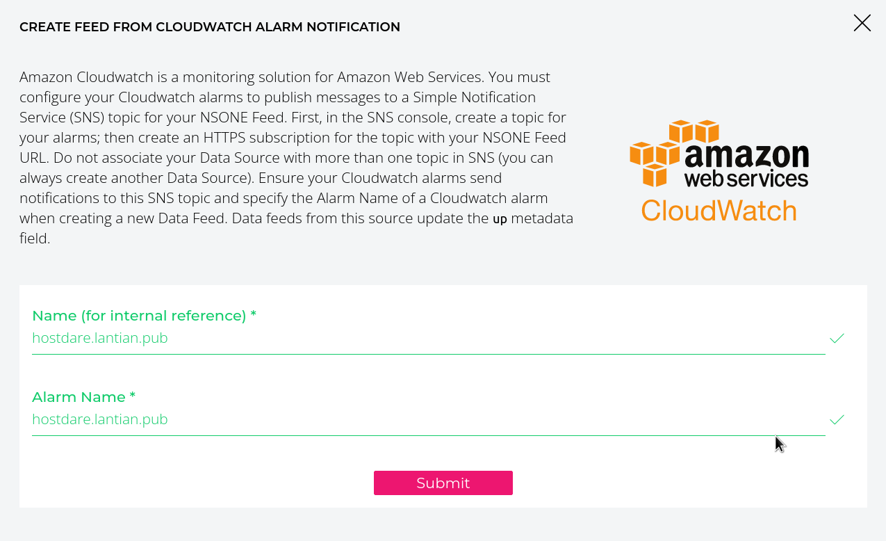

3. 重复第二步，添加所有节点的订阅。
4. 此时 Incoming Feeds 标签会显示 CloudWatch 订阅的链接（`Feeds URL`），记下这个
   链接，稍后将会将它添加到 AWS SNS 中。

   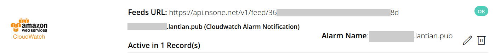

5. 进入
   [AWS SNS 管理页面](https://us-west-1.console.aws.amazon.com/sns/v3/home?region=us-west-1#/topics)，
   新建一个 Topic（消息队列），类型选择 Standard，其余选项均保持默认。

   - 注意我的 AWS 链接都是 us-west-1 区的，如果你想新建在其它区域请自行切换！AWS
     上的 SNS 和稍后创建的 Lambda 函数必须在同一个区！

   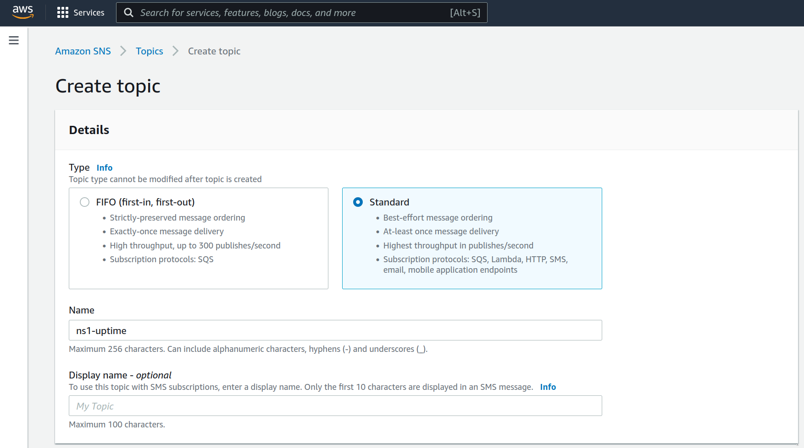

6. Topic 的页面上会显示一个 ARN（资源 ID），将其记录下来，稍后创建函数时会用到。
7. 点击页面下方的 `Create subscription` 按钮创建数据订阅，Protocol（协议）选择
   HTTPS，Endpoint（地址）输入第 4 步的订阅链接，其余选项保持默认。

   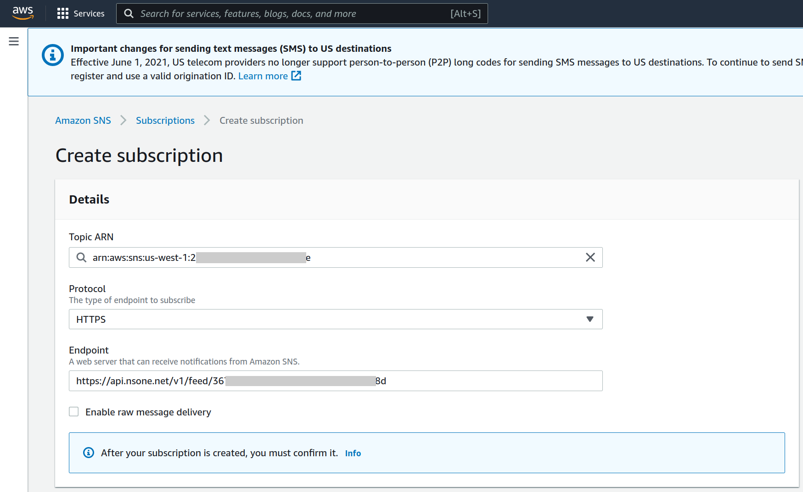

此时发送到 AWS SNS 的这个 Topic 的消息，都会被转发到 NS1 的 API，从而将节点状态
同步到 NS1。

# AWS 创建 Lambda 函数处理 Webhook

下一步是通过 AWS Lambda 创建一个函数，将 UptimeRobot 或者 Freshping 的 Webhook
消息转换成 AWS SNS 的消息。

1. 进入
   [AWS Lambda 管理页面](https://us-west-1.console.aws.amazon.com/lambda/home?region=us-west-1#/functions)，
   创建一个函数。

   - 注意我的 AWS 链接都是 us-west-1 区的，如果你想新建在其它区域请自行切换！AWS
     上的 SNS 和 Lambda 函数必须在同一个区！
   - 选择 `Auto from scratch`，Runtime 选择 `Node.js 14.x`，其余均保持默认。

   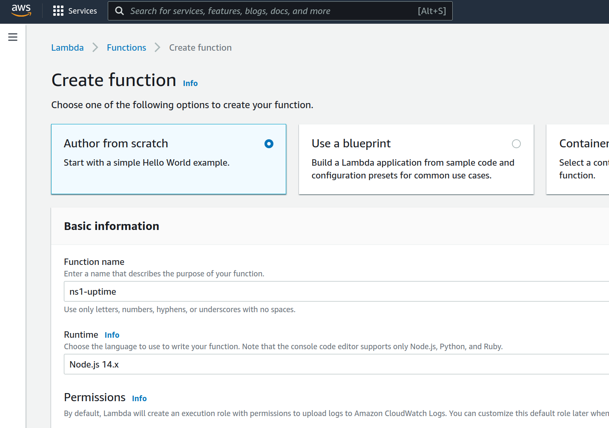

2. 此时你会自动进入函数的编辑页面。如果你准备用 UptimeRobot，将这段代码复制进
   去：

   ```javascript
   var AWS = require('aws-sdk')

   const SECRET_KEY = '**这里改成一串随机字符串，作为函数的密码**'
   const SNS_ARN = '**这里改成上面 AWS SNS 的 ARN**'

   exports.handler = async event => {
     if (event.queryStringParameters.key != SECRET_KEY) {
       return { statusCode: 403, body: 'Forbidden' }
     }

     let json = JSON.parse(event.body)
     let ns1Object = {
       AlarmName: new URL(json.url).hostname,
       NewStateValue: json.state == 2 ? 'OK' : 'ALARM',
     }

     try {
       let sns = new AWS.SNS({ apiVersion: '2010-03-31' })

       let result = await sns
         .publish({
           TopicArn: SNS_ARN,
           Message: JSON.stringify(ns1Object),
         })
         .promise()

       return {
         statusCode: 200,
         headers: { 'Content-Type': 'application/json' },
         body: JSON.stringify(result),
       }
     } catch (e) {
       return {
         statusCode: 500,
         body: e.stack,
       }
     }
   }
   ```

   如果你准备用 Freshping，将这段代码复制进去：

   ```javascript
   var AWS = require('aws-sdk')

   const SECRET_KEY = '**这里改成一串随机字符串，作为函数的密码**'
   const SNS_ARN = '**这里改成上面 AWS SNS 的 ARN**'

   exports.handler = async event => {
     if (event.queryStringParameters.key != SECRET_KEY) {
       return { statusCode: 403, body: 'Forbidden' }
     }

     let json = JSON.parse(event.body)
     let ns1Object = {
       AlarmName: new URL(json.check_url).hostname,
       NewStateValue: json.response_status_code === '200' ? 'OK' : 'ALARM',
     }

     try {
       let sns = new AWS.SNS({ apiVersion: '2010-03-31' })

       let result = await sns
         .publish({
           TopicArn: SNS_ARN,
           Message: JSON.stringify(ns1Object),
         })
         .promise()

       return {
         statusCode: 200,
         headers: { 'Content-Type': 'application/json' },
         body: JSON.stringify(result),
       }
     } catch (e) {
       return {
         statusCode: 500,
         body: e.stack,
       }
     }
   }
   ```

   点击 Deploy 部署。

3. 点击函数的 Configuration 标签，左侧选择 Permissions，再点击 Execution Role 里
   的链接，进入权限管理页面。

   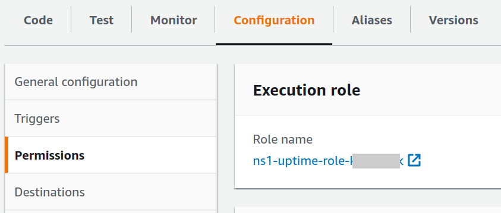

4. 在打开的新页面上，点击 Add permissions - Create inline policy，创建一条权限规
   则。
5. 进入 Create Policy（创建规则）页面后，Service 选择 SNS；

   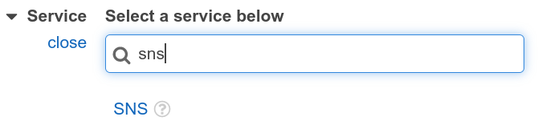

6. Actions 选择 Write 下的 Publish；

   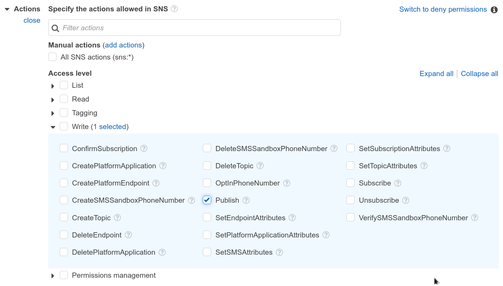

7. 在 Resources 点击 Add ARN，填写之前创建的 AWS SNS 的 ARN：

   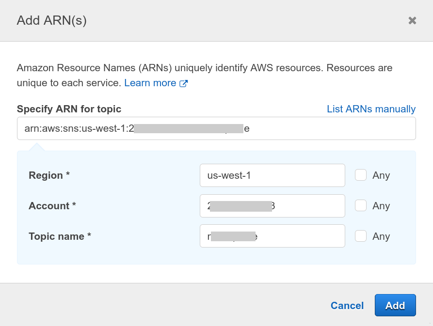

8. 点右下角的 Review Policy，随便起个名字，然后点 Create Policy 创建规则。

至此，我们创建了一个解析 UptimeRobot 或 Freshping 的 Webhook 消息的 Lambda 函
数，并赋予了它向 SNS 发送消息的权限。但是现在还没有办法通过 HTTP 方式向这个函数
发送请求。下一节将创建一个 API Gateway 用于接收 HTTP 请求并调用函数。

# AWS 创建 API Gateway 接受 HTTP 请求

1. 进入
   [AWS API Gateway 管理页面](https://us-west-1.console.aws.amazon.com/apigateway/main/apis?region=us-west-1)，
   创建一个 API，类型选 HTTP；

   - 注意我的 AWS 链接都是 us-west-1 区的，如果你想新建在其它区域请自行切换！

   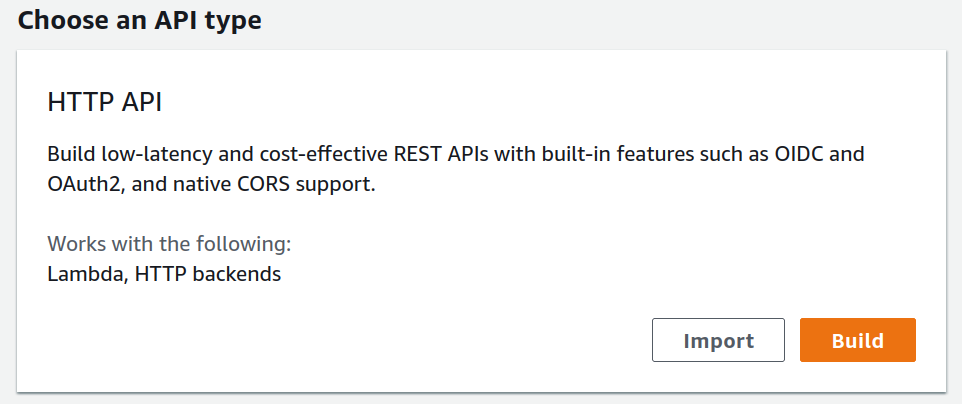

2. 点击 Add integration，类型选择 Lambda，并选择你刚才创建的 Lambda 函数，随便起
   个名，并点击下一步：

   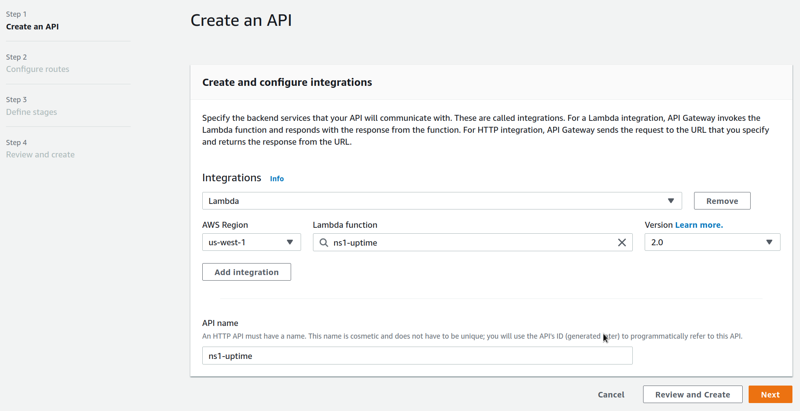

3. 在 Configure routes 页面，记下你的 Lambda 函数对应的路径，例如我的路径就是
   `/ns1-uptime`：

   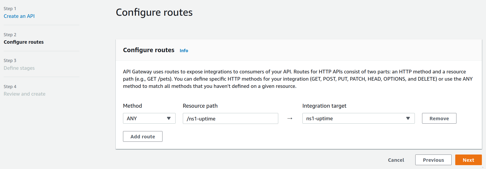

4. 一路下一步创建成功，页面中央的 Stages 中就是 API Gateway 的地址。

   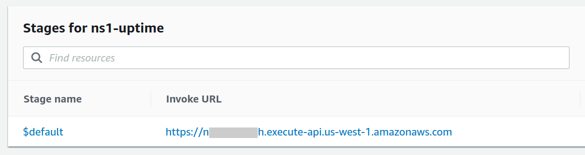

   在地址末尾加上第三步的路径就是函数的地址。假设我的 API Gateway 地址是
   `https://1234567890.execute-api.us-west-1.amazonaws.com/`，那么 Lambda 函数的
   地址就是
   `https://1234567890.execute-api.us-west-1.amazonaws.com/ns1-uptime`，直接访问
   时应显示 Internal Server Error。

# UptimeRobot/Freshping 接入 Webhook

1. 由于我们在函数中设置了一个密码（`SECRET_KEY`），我们需要先把密码加到 Lambda
   函数的地址上。假设密码是 `123456`，那么就在函数地址末尾加上 `?key=123456`，完
   整地址就是
   `https://1234567890.execute-api.us-west-1.amazonaws.com/ns1-uptime?key=123456`。
2. 如果你用的是 UptimeRobot，进
   入[后台的 My Settings 页面](https://uptimerobot.com/dashboard#mySettings)，添
   加联系人（Add Alert Contact）：

   - 类型选择 Webhook；
   - URL to Notify 输入函数带有密码的完整地址；
   - POST Value 输入：

     ```json
     { "url": "*monitorURL*", "state": "*alertType*" }
     ```

   - 勾选 Send as JSON；
   - Enable notification for 选择 Up & down events；
   - 保存。

   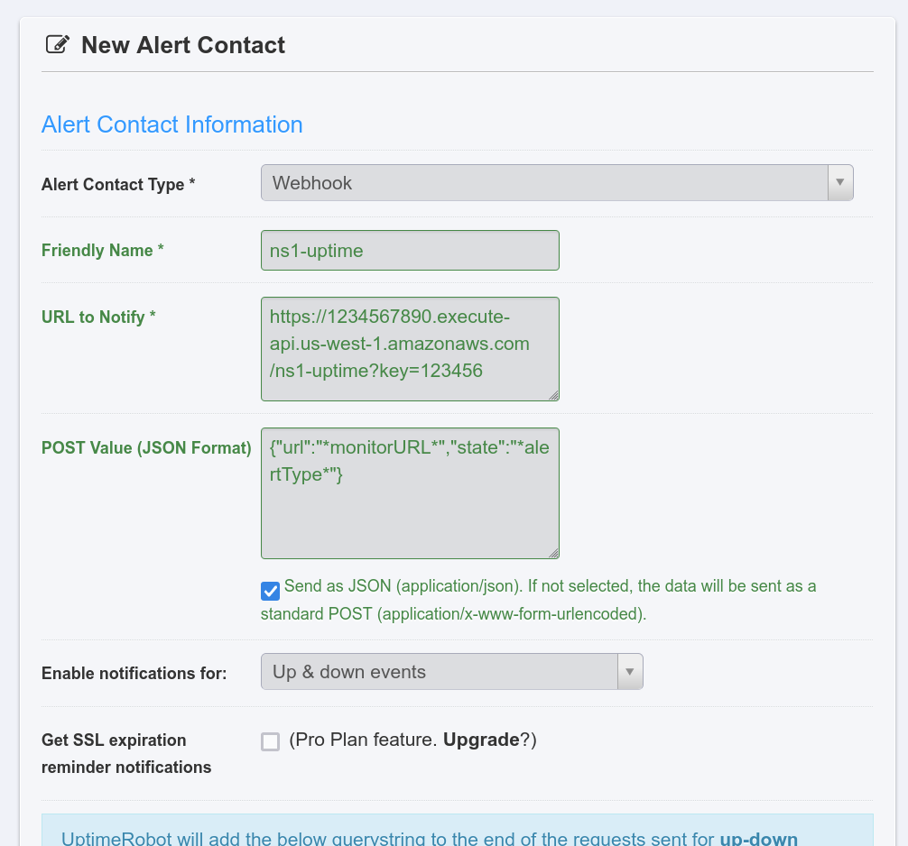

   - 修改所有的监控任务，在联系人一栏选中刚刚添加的 Webhook。

3. 如果你用的是 Freshping，进入后台，点击左侧齿轮按钮 - Integrations 页面，在
   Webhook 一栏创建接入（Create Integration）：

   - Event Type 选择 Up/Down；
   - Trigger the Webhook 输入函数带有密码的完整地址；
   - 其余均保持默认，保存即可。

# NS1 配置 GeoDNS 和自动切换

最后一步，我们要在 NS1 的控制面板里添加每个地区的解析记录，并绑定到对应的订阅
Feed 上。

1. 回到 [NS1 控制面板的 Zones 页面](https://my.nsone.net/#/zones)，进入你的域名
   选项。
2. 创建一个 CNAME 记录，先不添加 Answer，填写名称后直接保存。
3. 点击左侧的 Edit Filter Chain，然后从右侧依次拖入：
   1. Up
   2. Geotarget Country
   3. Select First Group
   4. Shuffle
   5. Select First N
4. 勾选 Enable Client Subnet，然后保存。

   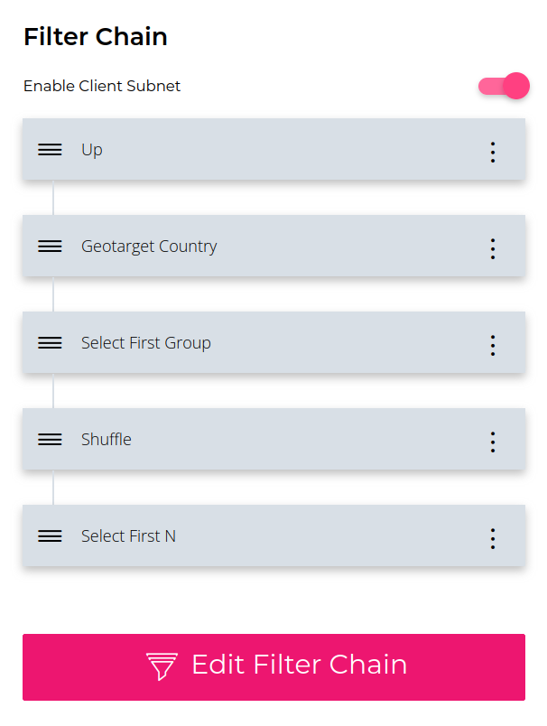

5. 在右侧点击添加 Answer Group，每个 Group 对应一个地区。点击 Answer Group 右侧
   的菜单，选择编辑信息 Edit Group Metadata，添加国家（Country）和地区
   （Subdivisions）信息。以洛杉矶（Los Angeles）为例：

   - Country/countries 选择 Americas / Northern America / United States；
   - Subdivisions 选择 North America / United States of America / California；
   - US States 选择 Western US / California；
   - 保存。

   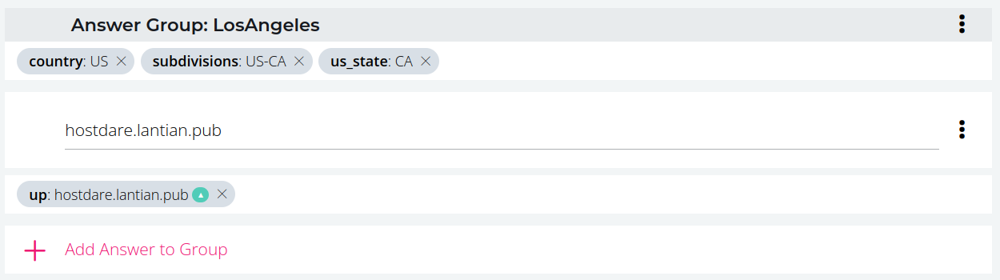

6. 在这个 Answer Group 里选择 Add Answer to Group，填写准备工作第 4 步创建的对应
   节点的域名。点击右侧菜单选择编辑信息 Edit Answer Metadata：

   - 点击 Up/down 右侧的图标，选择对应这个节点的订阅 Feed，保存。

   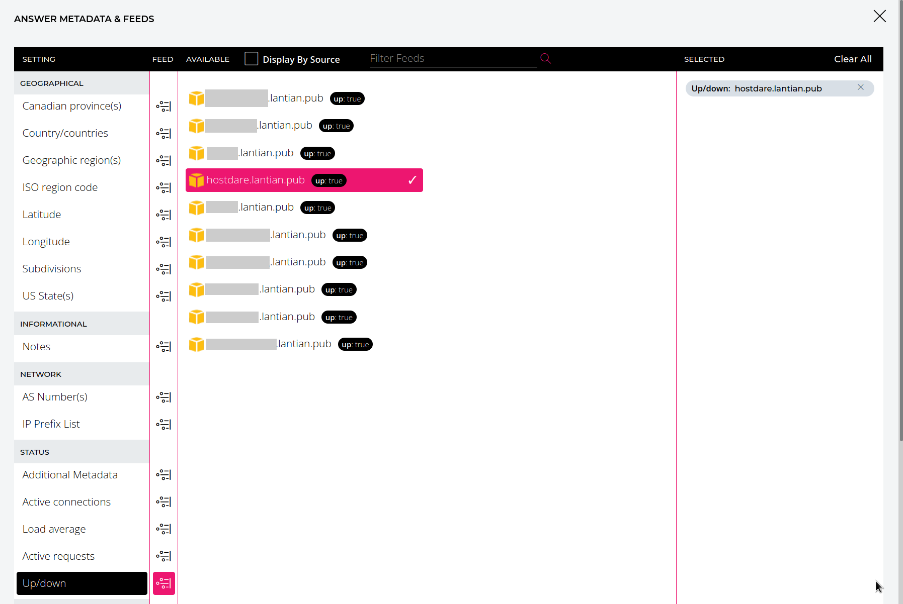

7. 重复 5、6 两步添加所有地区和节点并保存，此时这个 CNAME 记录已经启用了 GeoDNS
   和自动切换。
8. 将你的主域名 CNAME 到 NS1 上的这个（子）域名。

> 需要注意的是，目前的 DNS 规范不支持把根域名（主域名的 `@` 记录）CNAME 到其它域
> 名上。如果你想把你的根域名CNAME 过来，可以选择使用 DNS 服务商的 CNAME
> Flattening 功能。有些服务商会以 ALIAS、ANAME 的方式提供该功能，而有些服务商
> （如 Cloudflare）会自动对根域名的 CNAME 记录启用此功能。
>
> 但是，此时 NS1 获取到的客户端 IP 将是你主域名 DNS 服务商的权威 DNS IP。对于
> Cloudflare 等全球节点众多的服务商，这不是问题，因为你的用户一般离权威 DNS 很
> 近。但如果你的服务商节点较少，GeoDNS 可能会将你的用户导向较远的节点。

此时全部配置均已完成，你可以手动停掉一台服务器检查效果。当你收到 UptimeRobot 或
者 Freshping 的警告时，NS1 控制面板里对应服务器的状态也应该变成了 Down，DNS 查询
也不会返回这台服务器的记录；当服务器恢复时，其状态会变回 Up，重新开始提供服务。
