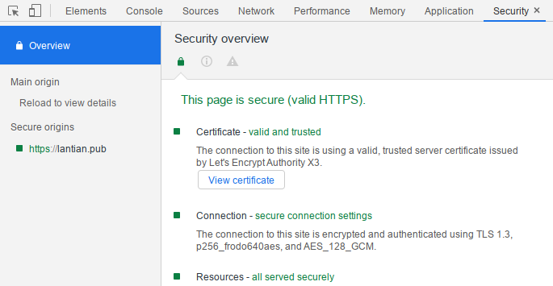

现代互联网上，绝大多数网站都已经支持 HTTPS，其使用的 SSL/TLS 加密协议会将用户的
请求数据与网站的响应进行加密，以防止信息被路径上的恶意用户窃取或篡改。而 SSL/TLS
协议中的一个重要组成部分是 RSA、ECDSA 等**非对称加密**算法，这些算法的密钥分
为**公钥、私钥**两份，公钥可以公开，而私钥则要妥善保管。

在访问 HTTPS 网站时，会经过以下的流程：

1. 网站会将它的**公钥**（以证书形式）发送给浏览器。
2. 浏览器会校验公钥的有效性，防止中间人篡改公钥，从而拦截或监听通信。
   - 浏览器（或操作系统）内置了一组可信任的证书颁发机构（CA）的公钥，通过密码学
     方法可以确认这份公钥是其中某个颁发机构生成的。
     - 证书颁发机构则会通过一系列方法（多级证书链，物理隔绝的密钥保存设备）来保
       护他们自己的私钥安全，防止有人窃取他们的私钥来随意生成被信任的证书信息。
   - 浏览器会与证书颁发机构的服务器联系，查询“证书吊销列表”（Certificate
     Revocation List）。这个列表保存了所有的“虽然的确是证书颁发机构颁发，但是因
     为系统错误/私钥泄漏等原因不能再被信任”的证书。
3. 浏览器在确定公钥可信后，本地随机产生一个**随机密钥**，用来加密这一次的连接。
4. 浏览器将随机密钥用网站的**公钥**加密，然后发送给网站服务器。
   - 加密后的内容只能用网站的私钥解密，不能用公钥解密，因此监听者是无法获取随机
     密钥内容的。
5. 网站服务器用本地保存的**私钥**解密内容，获得浏览器产生的随机密钥。
6. 浏览器和网站服务器开始用解密后的随机密钥进行**对称加密**，也就是双方使用同一
   份密码进行加密/解密的加密算法，例如 AES。
   - 这里不再使用非对称加密是因为非对称加密对算力的消耗较大，而对称加密性能较
     高。

非对称加密算法保证了浏览器和网站交换对称加密密钥的安全，从而保证数据不被窃取或篡
改。

但是随着量子计算机的诞生，事情发生了一点变化。在量子计算机上运行
的[秀尔算法](https://zh.wikipedia.org/wiki/%E7%A7%80%E7%88%BE%E6%BC%94%E7%AE%97%E6%B3%95)可
以非常高效地破解 RSA、ECDSA 等基于质因数分解难度的传统非对称加密算法，只要有一台
足够强大的量子计算机，也就是量子比特数目达标的计算机。

而随着量子计算的逐渐火热，量子计算机正在迅速地发展。目前公开的最强大的量子计算机
是 IBM 的 53 量子比特计算机
（见[量子霸权](https://zh.wikipedia.org/wiki/%E9%87%8F%E5%AD%90%E9%9C%B8%E6%AC%8A)页
面），仍然不够使用秀尔算法破解 RSA、ECDSA 等，但高速的科技发展随时可能将此变成现
实。

因此，密码学家们着手开发无法被量子计算机有效破解的非对称加密算法，并推广它们的使
用，以准备好迎接 RSA 被破解的那一天。

从 2016 年末开始，[Open Quantum Safe 项目](https://openquantumsafe.org/)就开始将
现有的、能抵抗量子计算机的加密算法整合到 liboqs 开发库里，并将它集成到
OpenSSL、BoringSSL 等广泛使用的加密库，以简化新加密算法的部署。

同时，官方还提供了 nginx、Chromium 等软件的编译、集成流程文档。因此，只需要参照
文档进行简单的修改，我们就可以准备好迎接实用量子计算机的到来。

> 注意：这里所有的后量子加密算法都相对较新，并
> 且[正在进行 NIST 的标准化审核流程](https://csrc.nist.gov/Projects/post-quantum-cryptography/round-3-submissions)，
> 可能仍有未被发现的漏洞。虽然 Open Quantum Safe 项目有一些方法降低风险，但在这
> 些算法的标准化流程完成之前，不建议将它们用于生产环境等重要用途。

## nginx / OpenSSL

由于 nginx 使用 OpenSSL 或 BoringSSL 作为自己的加密库，我们不需要对 nginx 做任何
修改，只需要把 OpenSSL 替换成 Open Quantum Safe 项目的版本就可以。

Open Quantum Safe 提供
了[一份修改后的 Dockerfile，可以用作参考](https://github.com/open-quantum-safe/oqs-demos/tree/master/chromium)。

我参考以上内容也修改了自己编译 nginx 用的 Dockerfile，以使用 Open Quantum Safe
的
OpenSSL，[在这里可以看到](https://github.com/xddxdd/dockerfiles/blob/1195fb20a1dfcbcad0fa3c494fe7440841c35963/dockerfiles/nginx/template.Dockerfile)。

相比编译普通的 nginx，主要的改动有两处：

1. 需要使用 Open Quantum Safe 的 OpenSSL，并额外下载、编译 liboqs，将其安装到
   OpenSSL 的源码目录，以便调用。我的 Dockerfile 中与之相关的是 44-52 行：

   ```bash
   # 前略
   && git clone -b OQS-OpenSSL_1_1_1-stable https://github.com/open-quantum-safe/openssl.git \
      # 省略了一些我个人使用的 OpenSSL 修改，对后量子加密不是必要的
   && git clone -b master https://github.com/open-quantum-safe/liboqs.git \
      && mkdir /tmp/liboqs/build && cd /tmp/liboqs/build \
      && cmake -DOQS_BUILD_ONLY_LIB=1 -DBUILD_SHARED_LIBS=OFF -DCMAKE_INSTALL_PREFIX=/tmp/openssl/oqs .. \
      && make -j4 && make install && cd /tmp \
   # 后略
   ```

   其中所有文件都被下载到了 `/tmp` 目录下。关键点是用 cmake 编译 liboqs 项目，并
   将其安装到 OpenSSL 源码目录的 oqs 子目录下。

2. 需要额外添加一些编译参数，以将 liboqs 包含在编译出来的 nginx 中，在
   Dockerfile 的 102-104 行：

   ```bash
   # 前略
   && ./configure \
      # 略过一些 nginx 的编译参数
      --with-openssl=/tmp/openssl \
      --with-cc-opt="-I/tmp/openssl/oqs/include" \
      --with-ld-opt="-L/tmp/openssl/oqs/lib" \
   && sed -i 's/libcrypto.a/libcrypto.a -loqs/g' objs/Makefile \
   # 后略
   ```

然后正常编译 nginx 即可。

编译、安装 nginx 完成后，还需要修改参数使用这些后量子时代的非对称加密算法，包
括**密钥交换算法**和**身份验证算法**两类：

- 密钥交换算法：即浏览器和网站传输对称加密密钥时使用的非对称加密算法。

  只需简单修改 `nginx.conf` 中的 `ssl_ecdh_curve` 参数，使用这些非对称加密算法的
  椭圆曲线，就可以使用这些密钥交换算法：

  ```bash
  ssl_ecdh_curve 'p256_frodo640aes:p256_bike1l1cpa:p256_kyber90s512:p256_ntru_hps2048509:p256_lightsaber:p256_sidhp434:p256_sikep434:prime256v1:secp384r1:secp521r1';
  ```

  修改完成后 `nginx -s reload` 即可。

  这里只开启了支持的密钥交换算法的一部分，原因有二：

  1. nginx 对这一参数的长度有限制，过长会报错；
  2. 选择的这些参数也都被 Open Quantum Safe 的 BoringSSL 支持，这在后续开启
     Chromium 支持时至关重要。

  同时，这些密钥交换算法都以 `p256_` 开头，意味着后量子加密算法和传统加密算法同
  时使用。这是为了防止一种情况：新的加密算法存在数学漏洞，使得它们使用传统计算机
  （冯诺依曼计算机）就可以快速破解。同时使用两种交换算法，既保证了无法被量子计算
  机破解（如果新加密算法正常工作），也保证了一旦新加密算法被破解，密钥交换数据仍
  然拥有与传统算法同等级别的保护，不会被传统计算机立即破解。

- 身份验证算法：即证书颁发机构（CA）给网站颁发证书形式公私钥的算法。使用这些算法
  需要找支持后量子算法的 CA（现在还不存在）重新签发证书，或者自己签发证书（不被
  浏览器信任），都不实用，因此我选择现在不使用。

在这里配置完后，你可以使用 Open Quantum Safe 的一个 curl Docker 镜像来测试一下你
的网站：

```bash
# 将最后一个参数替换成你要用的加密算法，格式和 ssl_ecdh_curve 相同
docker run -it openquantumsafe/curl:0.4.0 curl https://lantian.pub --curves p256_frodo640aes
```

## Chromium / BoringSSL

虽然有了命令行的 curl 验证，但是一个全功能的浏览器的支持能够让后量子加密实用化，
给用户更佳的保护。Open Quantum Safe 同样提供了修改后的 BoringSSL，只需要将它编译
到 Chromium 里，就可以
在[目前世界上最流行的浏览器](https://gs.statcounter.com/browser-market-share)中
体验后量子加密算法了。

Open Quantum Safe 同
样[提供了 Chromium 的编译教程，在这里可以找到](https://github.com/open-quantum-safe/oqs-demos/tree/master/chromium)。
与编译原版 Chromium 相比，主要不同的步骤有四处：

1. `git clone https://github.com/open-quantum-safe/boringssl`，用修改过的
   BoringSSL 替换 Chromium 源代码中 `third_party/boringssl/src` 路径下的原版
   BoringSSL；
2. 下载 liboqs，编译安装到 BoringSSL 的 `oqs` 目录下：

   ```bash
   git clone --branch master https://github.com/open-quantum-safe/liboqs.git
   cd liboqs && mkdir build && cd build
   cmake .. -G"Ninja" -DCMAKE_INSTALL_PREFIX=<CHROMIUM_ROOT>/third_party/boringssl/src/oqs -DOQS_USE_OPENSSL=OFF
   ninja && ninja install
   ```

3. 给 Chromium 打
   上[这个调用 liboqs 的补丁](https://github.com/open-quantum-safe/oqs-demos/raw/master/chromium/oqs-mods.patch)。
4. 在 `third_party/boringssl` 文件夹下运行
   `python2 src/util/generate_build_files.py gn` 以更新依赖，加入 liboqs 相关内
   容。

之后按照正常步骤编译 Chromium 即可。

我也修改了一份 Chromium 的 PKGBUILD 文件，Arch Linux 用户可以直接使用。最新版的
PKGBUILD
[可以在此处找到](https://github.com/xddxdd/pkgbuild/tree/master/chromium-vaapi-oqs)，
我写文章时的版
本[可以在此处找到（241cfaa）](https://github.com/xddxdd/pkgbuild/tree/241cfaad1d4e0c245efdfb345d9245ef57a07c82/chromium-vaapi-oqs)。

> 注意编译 Chromium 是个非常漫长的过程，我的 i7-7700HQ 花了 8 个小时。如果你的
> CPU 更弱，请做好等上一整天的准备。

编译、安装完成后，启动 Chromium 访问开启了后量子加密的网站，然后打开开发者工具的
Security（安全）面板：



上面已经显示使用了 `p256_frodo640aes` 算法，也就意味着你的网页浏览已经有了后量子
时代的保护。

我的网站已经支持了后量子加密，可以作为测试。或者你也可以访问
[Open Quantum Safe 官方测试站](https://test.openquantumsafe.org/)，上面提供了目
前支持的所有密钥交换、身份验证算法组合，可以进行更全面的测试。

> 额外要注意的是，Open Quantum Safe 的 BoringSSL 只支持一小部分的密钥交换算法：
>
> P256_BIKE1L1CPA, P256_FRODO640AES, P256_KYBER90S512, P256_NTRU_HPS2048509,
> P256_LIGHTSABER, P256_SIDHP434, P256_SIKEP434
>
> 这一列表只在[官方测试站](https://test.openquantumsafe.org/)上提到。因此我先前
> 选择了这些算法配置在 nginx 中。
