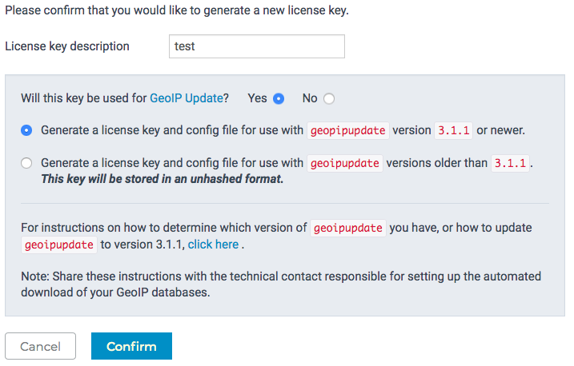
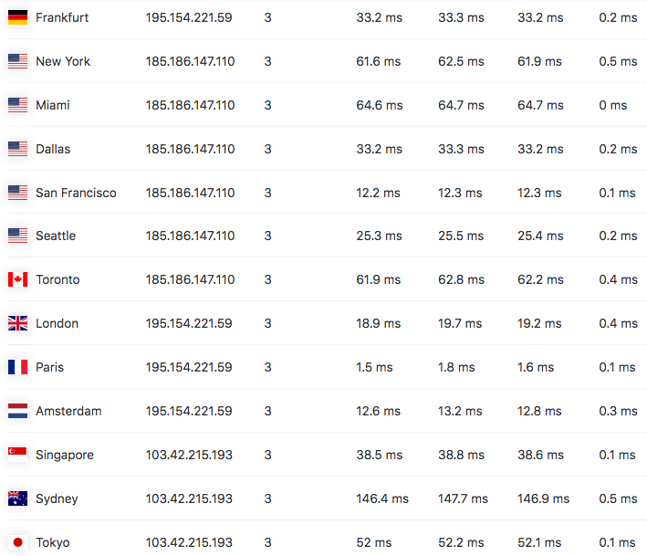

之前，如果要为自己的网站自建权威 DNS 系统，那么（几乎）唯一的选择是 PowerDNS 加
上它的 GeoIP 后端。但是 GeoIP 后端使用的是 YAML 格式的配置文件，不能与 MySQL 等
数据库一同使用。这意味着必须手动配置一套跨服务器同步文件的系统，而不能使用更为成
熟的数据库同步技术。

不过，PowerDNS 在最新的 4.2 版本中加入了 Lua 记录的支持。Lua 是一种专门用于“嵌入
其它程序执行功能”的编程语言，你或许曾经在 nginx 上看到过它（作为一个插件）。Lua
记录支持使得 PowerDNS 可以根据用户查询请求的不同来返回不同的回答，分地区解析
GeoDNS 功能也就可以实现了。

## 更新 PowerDNS

最新的 PowerDNS 4.2 版本没有加入 Debian 10 的软件仓库中，你需要从 Debian
Unstable 的软件仓库下载。但是由于 PowerDNS 依赖了一大堆新版的库文件，其中包括系
统运行必须的库文件，如果用类似 `apt-get install -t unstable pdns-server` 的方法
安装会把一些系统核心文件也升级到 Unstable 版本。

在这种情况下，最好的解决方案就是 Docker。由于我们只需要从 Debian 软件源下载
PowerDNS，不需要自己编译，所以几行就可以搞定这个镜像：

```docker
FROM amd64/debian:sid
RUN apt-get -qq update \
    && DEBIAN_FRONTEND=noninteractive apt-get -qq install -y tini pdns-server pdns-tools pdns-backend-\* \
    && apt-get clean
ENTRYPOINT ["/usr/bin/tini", "-g", "--", "/usr/sbin/pdns_server"]
```

我最终使用的 Dockerfile（的一部分）可以
在[我的 GitHub 上](https://github.com/xddxdd/dockerfiles/blob/53295f2641dce30072f0f2ac5dd631e1f0b35687/dockerfiles/powerdns-bird/template.Dockerfile)找
到，不过这份 Dockerfile 被我多加了 Bird BGP 进去，并且需要经过 GPP 处理才能生成
完整的 Dockerfile（详情可
以[看这篇文章](/article/modify-website/gpp-preprocess-dockerfile-include-if.lantian/)）。

## 配置 GeoIP 库

PowerDNS 使用的 IP 地理信息库是 MaxMind GeoIP。虽然 MaxMind 提供免费的、精度稍低
的 IP 地理信息库（GeoLite）给个人使用，但是自从 2019 年 12 月 30 日开始，MaxMind
开始要求 GeoLite 的用户注册账户，获取授权密钥后才能下载数据库。大致步骤如下：

1. 去 [GeoLite 2 数据库页面](https://dev.maxmind.com/geoip/geoip2/geolite2/)，点
   击页面下方的黄色按钮注册。过程中需要接收验证邮件，并且不能挂着代理注册（毕竟
   人家就是干这个的）。
2. 进入账户详情页面，点左边的 `My License Key` 管理授权密钥。
3. 点击 `Generate License Key` 创建新的密钥，
4. 填写一个密钥描述，并且如图选择密钥版本，点蓝色按钮确认：
   - 
5. 提交后，你会看到两个重要的信息，记录下来，稍后要填写到配置文件中：
   - `Account/User ID` 账户编号
   - `License Key` 授权密钥

接下来，就可以使用 MaxMind 官方的 `geoipupdate` 工具来自动更新数据库了。首先是安
装，在 Debian 系统中可以直接：

```bash
apt-get install geoipupdate
```

之后创建文件夹 `/etc/geoip`，并修改 `/etc/GeoIP.conf`（注意大小写），填写如下内
容：

```bash
AccountID [账户编号]
LicenseKey [授权密钥]
EditionIDs GeoLite2-ASN GeoLite2-City GeoLite2-Country
DatabaseDirectory /etc/geoip
```

之后运行 `geoipupdate` 就可以自动更新数据库了，文件存放在 `/etc/geoip` 文件夹
内。可以用 Cron 设置上自动更新：

```bash
crontab -e
# 加上一行：
0 0 * * 0 /usr/bin/geoipupdate
```

## 配置并启动 PowerDNS

要启用 GeoIP 功能，还需要修改一下 PowerDNS 的配置文件。打开 `pdns.conf`，在你已
经正常工作的 PowerDNS 配置的基础上，做出以下修改：

```ini
# 启用 Lua 记录
enable-lua-records=yes
# 此处在你用的数据库后面加一个 geoip
launch=gmysql,geoip
# 指定数据库文件的路径，此处使用精度最高的城市级数据库
geoip-database-files=/etc/geoip/GeoLite2-City.mmdb
```

然后启动 PowerDNS。如果你的主系统是 Debian Unstable，那么直接：

```bash
systemctl start pdns
```

如果使用 Docker，以下是 `docker-compose.yml`中填写的内容，供参考：

```yaml
powerdns:
  image: [你创建的上述 Docker 镜像]
  container_name: powerdns
  restart: always
  volumes:
    - './conf/powerdns/pdns.conf:/etc/powerdns/pdns.conf:ro'
    - '/etc/geoip:/etc/geoip:ro'
  ports:
    - '53:53'
    - '53:53/udp'
  depends_on:
    - mysql
```

## 添加 Lua 解析记录

在现代 DNS 解析体系里，DNS 服务器通常会将用户的 IP 一级一级告知上游服务器（称为
EDNS），从而让服务器根据用户 IP 分配最近的服务器地址。

在 PowerDNS Lua 中，用户的 IP 地址作为一个变量 `bestwho` 存在。不过如果用户的
DNS 服务器没有告知上游服务器用户的地址，那么 `bestwho` 就会指向 DNS 服务器的地
址。

首先演示如何使用 `bestwho`。创建一条记录，类型为 `LUA`，内容如下：

```bash
A ";if(bestwho:isIPv4()) then return bestwho:toString() else return '0.0.0.0' end"
```

开始的 A 代表返回的记录类型，后面的字符串则是一小段 Lua 程序，如果来源 IP 地址是
IPv4，就返回用户 IP，否则返回 `0.0.0.0` 代表失败。

类似的，我们可以写出 IPv6 的版本。再创建一条同名记录，类型也为 `LUA`：

```bash
AAAA ";if(bestwho:isIPv6()) then return bestwho:toString() else return '::' end"
```

或者使用 TXT 记录返回含端口号的连接信息：

```bash
TXT "bestwho:toStringWithPort()"
```

或者使用 LOC 记录返回 GeoIP 推测的地理位置：

```bash
LOC "latlonloc()"
```

以上的功能都可以在 `whoami.lantian.pub` 看到：

```bash
$ dig +short @1.1.1.1 whoami.lantian.pub
108.162.214.17

$ dig +short @1.1.1.1 AAAA whoami.lantian.pub
2400:cb00:12:1024::6ca2:d619

$ dig +short @1.1.1.1 TXT whoami.lantian.pub
"[2400:cb00:12:1024::6ca2:d626]:16668"

$ dig +short @1.1.1.1 LOC whoami.lantian.pub
34 3 15.840 N 118 14 38.400 W 0.00m 1m 10000m 10m
```

（Cloudflare 的 1.1.1.1 服务器有意禁用了 EDNS，所以此处显示的是 Cloudflare 的服
务器地址）

## 配置 GeoDNS

大致了解了 PowerDNS 的 Lua 是怎么工作的，就可以开始配置分地区解析的记录
了。PowerDNS 提供了一个方便的函数 `pickclosest`，自动从一个 IP 列表中选择离用户
最近的服务器返回。例如现在 `lantian.pub` 的 A 记录是这样的：

```bash
A "pickclosest({'103.42.215.193','185.186.147.110','107.172.134.89','195.154.221.59'})"
```

`pickclosest` 同样适用于 AAAA 记录：

```bash
AAAA "pickclosest({'2001:470:19:10bb::1','2001:470:d:46e::1','2001:470:1f07:54d::1','2001:470:1f13:28::1'})"
```

（以上服务器按顺序分别在：中国香港，美国洛杉矶，美国纽约，法国）

这样不同地区的用户就会获得不同的解析结果：

```bash
# 中国大陆
$ dig +short lantian.pub
103.42.215.193

# 美国洛杉矶
$ dig +short lantian.pub
185.186.147.110

# 法国
$ dig +short lantian.pub
195.154.221.59
```

全球 Ping 的延迟也漂亮了很多。各地延迟都小于 100 ms 用单一服务器是不可能做到的：



## 分国家解析

比起按照地理位置选择最近服务器的方法，有时更好的方法是按照国家解析，例如常见的国
内直连、国外启用 Cloudflare 的搭配。PowerDNS 对此也提供了一个好用的函
数，`country`：

```bash
TXT ";if(country('CN')) then return 'YES' else return 'NO' end"
```

然后从国内国外分别尝试：

```bash
# 中国大陆
$ dig +short @103.42.215.193 TXT is-china.lantian.pub
"YES"

# 美国洛杉矶
$ dig +short @103.42.215.193 TXT is-china.lantian.pub
"NO"
```

上述代码稍作修改也可以用于 A、AAAA、CNAME 等记录上，将中国大陆及海外流量分配到不
同的服务器上：

```bash
CNAME ";if(country('CN')) then return 'cdn-china.lantian.pub' else return 'cdn-overseas.lantian.pub' end"
```

## 参考资料

可以在 PowerDNS 的官方文档查看更多函数的信息：

[Lua Records - PowerDNS Authoritative Server Documentation](https://doc.powerdns.com/authoritative/lua-records/index.html)
