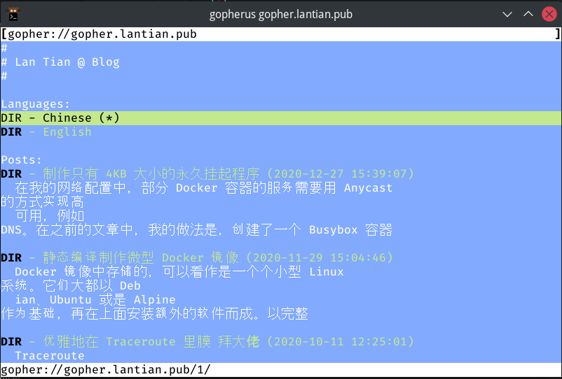
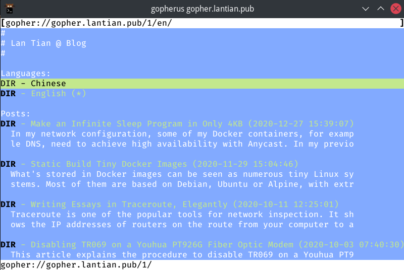
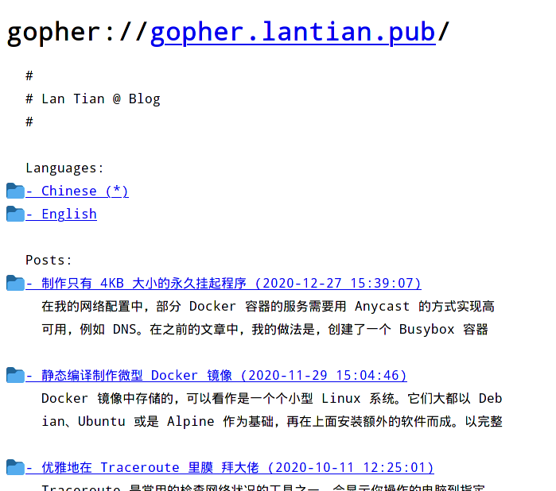
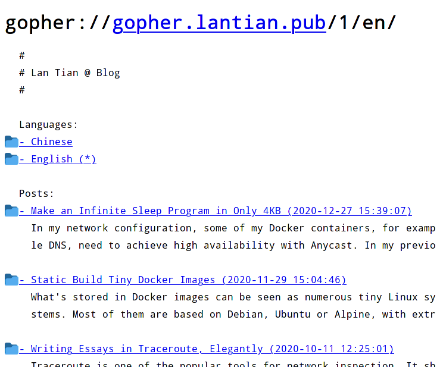
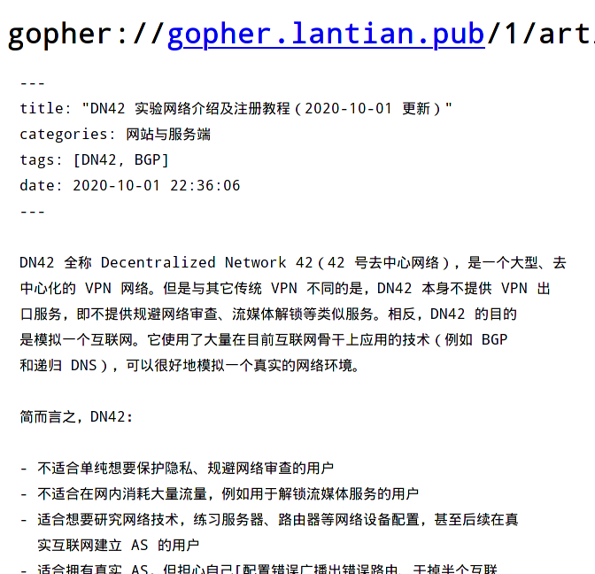
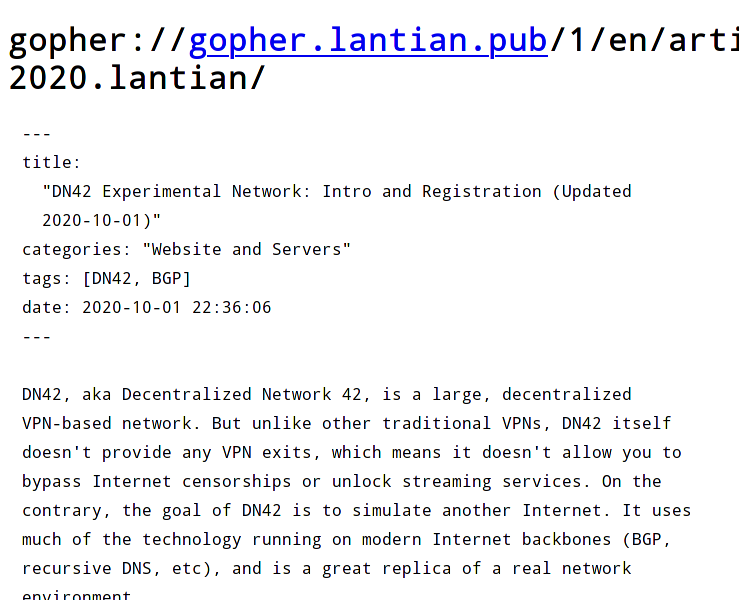

## 更新日志

- 2021-03-24：改进文章处理逻辑，增加识别链接和图片的代码。
- 2021-03-21：最初版本。

## 什么是 Gopher

Gopher 是互联网发展早期的一种网络协议，由美国明尼苏达大学于 1991 年发明，用途类
似于现在的 HTTP。它的基础协议非常简单：

1. 客户端连接服务端的 TCP 70 端口，并发送一串 URL，用 CRLF 结尾，例
   如：`some_dir/hello.txt`
2. 服务端把这个文件的内容全部发过来，然后关闭连接。
3. 没了。

服务端返回的文件可能是一个 TXT、一张图片、一个二进制文件，也可能是一个有着特殊格
式的 Gopher 列表文件，称为 `Gophermap`。这个文件每一行由以下几部分组成：

1. 一个字符，代表这一行的类型，是文字（`i`）、到一个 TXT 的链接（`0`）、到另一个
   Gophermap 的链接（`1`）、图片（`I`），还是二进制文件（`9`）。当然还有一些现在
   已经不再使用的协议，可以参阅
   [RFC1436 Section 3.8](https://tools.ietf.org/html/rfc1436#section-3.8)。
2. 一句话，代表这一行显示的信息，例如 `Hello World`。
3. 一个 TAB。
4. 这个链接指向的路径，例如 `/some_dir/hello.txt`。
5. 一个 TAB。
6. 这个链接指向的服务器域名或 IP，例如 `gopher.lantian.pub`。
7. 一个 TAB。
8. 这个链接指向的服务器端口，一般是 `70`。
9. CR+LF 换行符结尾。

在所有内容结束后，`Gophermap` 的最后一行还会有一个单独的英文句点，表示文件结束。

可以参考以下几个例子：

```bash
# 一行提示信息，提示信息没有要指向的路径，所以没有第四部分，指向 IP 端口也可以乱填
iHello World[TAB][TAB]invalid.host[TAB]70[CR][LF]
# 一个链接
iProject Description[TAB]/project/description.txt[TAB]gopher.lantian.pub[TAB]70[CR][LF]
# 一张图片
iScreenshot[TAB]/project/screenshot.jpg[TAB]gopher.lantian.pub[TAB]70[CR][LF]
# 标记 Gophermap 结束
.[CR][LF]
```

由于 Gopher 协议极其简单，它在上世纪 90 年代计算机运算能力不足的背景下得到了广泛
的运用。但由于客户端唯一能做的事情就是发送一串 URL，在 Gopher 协议上实现客户端向
服务端上传数据功能比较复杂，例如搜索功能、评论区等等。此外，服务端返回数据时也只
能返回文件本身的数据，而不能像 HTTP 协议一样添加上其它的响应头，这就导致客户端必
须根据之前收到的 Gophermap 中的信息来判断数据类型，或者干脆自己猜。因此 Gopher
协议最终被功能更加强大的 HTTP 协议替代了。

但是 Gopher 协议没有消亡。时至今日（2021 年），依然有在活跃更新的 Gopher 服务器
端软件，例如 [Gophernicus](https://github.com/gophernicus/gophernicus)，也有一些
网站仍然在通过 Gopher 协议提供服务。

如果你想试着访问 Gopher 网站，可以尝试
[Firefox 的 Overbite 插件](https://gopher.floodgap.com/overbite/)，或者
[Gopherus](http://gopherus.sourceforge.net/) 等客户端软件。

## 为什么要用 nginx？

相比起 Gophernicus 等专用的 Gopher 服务端软件，nginx 对现代的动态网页技术有着更
好的支持。例如它可以用 FastCGI 对接 PHP 和 ASP.NET（Mono）来动态生成内容，或者把
请求代理到其它基于 HTTP 的服务器，作为一个 Gopher 代理。相比之下，Gophernicus 只
支持传统的 CGI，也没有代理功能。此外，nginx 的高性能有目共睹。

不过我选择 nginx 还有另一个原因：我正
在[把 nginx 魔改成一个 WHOIS 服务器](/article/modify-website/serve-dn42-whois-with-nginx.lantian/)（给
DN42 用的），而 WHOIS 也是和 Gopher 一样，一问一答的协议。我把修改的功能稍微调整
一下就可以直接支持 Gopher 了。

## 让 nginx 支持 Gopher

nginx 本身是一个 HTTP 服务器。我们先不考虑引入了二进制命令的现代 HTTP/2.0，或者
基于 UDP 的 QUIC 和 HTTP/3.0，先回头看曾经被广泛使用的 HTTP/1.1 协议，当时的一个
请求长这样：

```bash
GET /test.php HTTP/1.1
Host: localhost
User-Agent: curl/7.75.0
Accept: */*

HTTP/1.1 200 OK
Server: nginx/1.18.0
Date: Sun, 21 Mar 2021 12:08:07 GMT
Content-Type: text/html; charset=UTF-8
Transfer-Encoding: chunked
Connection: keep-alive
X-Powered-By: PHP/8.0.3
```

上面一部分是客户端发起的请求，其中必要的是 `GET http://localhost/ HTTP/1.1` 部分
和 `Host: localhost`，它们分别告知了服务器访问的路径（`/test.php`）和域名
（`localhost`）。

其余部分，例如常见的 User-Agent 等请求头，对于 HTTP 协议来说并不必要。我们可以用
`telnet localhost 80` 指令连接服务器，并只保留前两行手动发起请求：

```bash
GET /test.php HTTP/1.1
Host: localhost

HTTP/1.1 200 OK
Server: nginx/1.18.0
Date: Sun, 21 Mar 2021 12:13:58 GMT
Content-Type: text/html; charset=UTF-8
Transfer-Encoding: chunked
Connection: keep-alive
X-Powered-By: PHP/8.0.3

c
Hello World

0

^CConnection closed by foreign host.
```

服务端依然返回了页面的内容。但是这比起我们需要的多了不少东西：

- Gopher 客户端不认识 HTTP 的 200 状态码；
- 多余的 Date、Content-Type 等响应头；
- nginx 回复的响应内容经过 `Transfer-Encoding: chunked` 编码，Gopher 客户端也不
  认识。
- 在输完 `Host:` 一行后我们按了两次回车，nginx 才发送响应。Gopher 客户端只会发一
  次回车。
- 最重要的是，注意到那个 `^C` 没？那是我手动按 `Ctrl+C` 中断了连接。nginx 默认启
  用了 `Connection: keep-alive`，发送完请求后不会主动关闭连接，而会等待客户端发
  起第二个请求，如果是 Gopher 客户端就只能一直等下去了。

因此，基于 HTTP/1.1 修改太过复杂。不过，有 1.1 就有 1.0。我们用 HTTP/1.0 试试？

```bash
GET /test.php HTTP/1.0

HTTP/1.1 200 OK
Server: nginx/1.18.0
Date: Sun, 21 Mar 2021 12:20:24 GMT
Content-Type: text/html; charset=UTF-8
Connection: close
X-Powered-By: PHP/8.0.3

Hello World
```

这回服务端主动关闭了连接，并且返回的数据也不是 `chunk` 模式编码了，可喜可贺。但
是 HTTP 的响应头还在，难道我们要把 nginx 发送响应头的逻辑全干掉？这个修改量有点
大。另外，我们还是得按两次回车。

好消息是，在 HTTP/1.0 之前，还有一版极简的协议 HTTP/0.9，就一行：

```
GET /test.php
Hello World
```

客户端只发送了上面的 GET 一行。在发送换行符后，nginx 就直接把响应数据
`Hello World` 发过来了，不用按两次回车，没有带上 200 状态码或者别的响应头，还不
忘关闭连接。这已经很接近我们想要的效果了：这里的 HTTP 客户端发送了
`GET /test.php[回车]`，而 Gopher 客户端会发送 `test.php[回车]`。

此时我们的修改方法已经确定：在 nginx 中添加一版协议来解析 Gopher 请求，把请求类
型锁定为 GET，在 URL 前面插入一个 `/` 斜杠，剩余逻辑全部照抄 HTTP/0.9 的就好。

## nginx 补丁及用法

按照以上方法，我做了一个补丁，可以直接打到 nginx 1.19.7 的源码里。这个补丁可以在
这里下载
到：[https://gist.github.com/xddxdd/293becc41d805d7b8cfb5d11b6e326e1](https://gist.github.com/xddxdd/293becc41d805d7b8cfb5d11b6e326e1)

这个补丁总共做了三件事情：

1. 增加了一个 `listen` 的选项 `plain`，代表用于接收 Gopher 的、不带 GET 的请求。
   - 例如 `listen 70 plain default_server;`
   - 注意开启 `plain` 选项后，这个端口就不能接受普通的 HTTP 请求了！因此不要把
     80 端口的 `listen` 加上这个选项，更不要和 `http2` 之类的选项一起开。
   - 理论上也支持 SSL，但我没试过。
2. 增加了一个 `plain` 模式专用的、解析 URL 用的状态机，相比 HTTP 的状态机，删除
   了解析请求类型（`GET`）、域名（`http://localhost`）和 HTTP 版本（`HTTP/1.1`）
   相关的功能，请求类型锁定为 `GET`，域名设置为 `null`（与 HTTP/1.0 相同），HTTP
   版本锁定为 0.9。
3. 在开始接收客户端的请求前，先往接收缓冲区存一个斜杠 `/`，以达到向 URL 开头插入
   斜杠的效果。nginx 后续处理流程需要频繁用到存放 URL 的指针，相比修改所有用到
   URL 的逻辑，直接插入一个斜杠是最简单粗暴、也是最稳妥的方法。

在编译 nginx 时，需要开启 `--with-http_plain_module` 参数。此外在配置 nginx 时，
记得设置 `index gophermap;` 让 nginx 默认读取文件夹中的 Gophermap。

## 生成 Gophermap 文件

有了服务端，接下来需要的就是网站的文件了。由于我用的是静态网站生成器 Hexo，文章
的文件格式都是 Markdown，我就偷了个懒，把 Markdown 文件用
[Remark](https://github.com/remarkjs/remark) 稍微调整一下格式、再过一下
[Prettier](https://github.com/prettier/prettier) 缩成 70 字符一行。然后我用正则
表达式识别文章中的链接和图片，把他们放到单独的一行并设置为链接（`1`）或图片
（`I`）格式，因为 Gophermap 不支持文字和链接混在同一行。最后把剩余文字全部设置为
`i`：

```javascript
const crlf = '\r\n'
const gopherBefore = 'i'
const gopherBeforeLink = '1'
const gopherBeforeImage = 'I'
const gopherAfter = '\t\t{{server_addr}}\t{{server_port}}' + crlf
const gopherEOF = '.' + crlf

function markdown_formatter(rel_path, md) {
  const markdownRegex = /([^!]?)(!?)\[([^\]]+)\]\(([^)]+)\)(.?)/g

  var rows = md.split('\n')
  for (var i = 0; i < rows.length; i++) {
    // 识别所有的 [链接](url) 和 
    if (rows[i].match(markdownRegex)) {
      var replace_at_beginning = false,
        replace_at_end = false

      var replace_fn = (match, prefix, img_marker, label, href, suffix) => {
        // 不要替换 http://，gopher:// 等外部链接，Gopher 浏览器不支持
        if (href.match('://')) {
          return match
        }

        if (prefix !== null) {
          // 标记链接或图片在这行开头，不要再添加文字 i 前缀了
          replace_at_beginning = true
        }
        if (suffix !== null) {
          // 标记链接或图片在这行开头，不要再添加后缀了
          replace_at_end = true
        }

        href = path.join('/', rel_path, href)

        return (
          (prefix ? prefix + gopherAfter : '') +
          (img_marker === '!' ? gopherBeforeImage : gopherBeforeLink) +
          label +
          '\t' +
          href +
          '\t{{server_addr}}\t{{server_port}}' +
          crlf +
          (suffix ? gopherBefore + suffix : '')
        )
      }

      rows[i] = rows[i].replaceAll(markdownRegex, replace_fn)
      rows[i] =
        (replace_at_beginning ? '' : gopherBefore) +
        rows[i] +
        (replace_at_end ? '' : gopherAfter)
    } else {
      rows[i] = gopherBefore + rows[i] + gopherAfter
    }
  }

  return rows.join('') + gopherEOF
}

// 关键逻辑
unified()
  .use(remark_parse)
  .use(remark_stringify, {
    bullet: '-',
    fences: true,
    listItemIndent: 'one',
    resourceLink: false,
  })
  .process(data.page.raw) // 读取原始 Markdown 数据
  .then(file => {
    var md = String(file)
    if (!md) return

    // 缩到 70 字符一行
    md = prettier.format(md, {
      parser: 'markdown',
      printWidth: 70,
      tabWidth: 2,
      proseWrap: 'always',
      endOfLine: 'lf',
    })
    if (!md) return

    // 全部行改成 Gophermap 文字格式
    md = markdown_formatter(path.dirname(data.path), md)

    // 写文件等，略
  })
```

生成文件的效果类似于：

```bash
iDN42 全称 Decentralized Network 42（42 号去中心网络），是一个大型、去          {{server_addr}} {{server_port}}
i中心化的 VPN 网络。但是与其它传统 VPN 不同的是，DN42 本身不提供 VPN 出         {{server_addr}} {{server_port}}
i口服务，即不提供规避网络审查、流媒体解锁等类似服务。相反，DN42 的目的          {{server_addr}} {{server_port}}
```

（实际文件中都是 Tab，我的编辑器自动把 Tab 都替换成了空格）

注意到后面的 `{{server_addr}}` 和 `{{server_port}}` 了吗？它们是 Gophermap 中指
定链接的目标主机和端口的参数。这两个参数不能遗漏，也不存在“相对于当前路径”的值。
我选择把它们都交给 nginx 替换处理：

```bash
location / {
    sub_filter "{{server_addr}}\t{{server_port}}" "$gopher_addr\t$server_port";
    sub_filter_once off;
    sub_filter_types '*';
}
```

有了文章，我还需要一个目录作为首页。我直接写了一个 `for` 循环给每篇文章生成一个
链接，并附上两行的内容概要，关键逻辑如下：

```javascript
const crlf = '\r\n'
const gopherBefore = 'i'
const gopherBeforeLink = '1'
const gopherAfter = '\t\t{{server_addr}}\t{{server_port}}' + crlf
const gopherEOF = '.' + crlf

var data = ''

// 标题
data += gopherBefore + '# ' + hexo.config.title + gopherAfter
data += gopherBefore + gopherAfter

// 文章列表
locals.posts.sort('date', 'desc').each(post => {
  data +=
    gopherBeforeLink +
    '- ' +
    post.title.slice(0, 56) +
    ' (' +
    new Date(post.date).toISOString().replace('T', ' ').substr(0, 19) +
    ')' +
    '\t/' +
    post.path.replace(/index\.html$/g, '') +
    '\t{{server_addr}}\t{{server_port}}' +
    crlf

  data += gopherBefore + '  ' + post.excerpt.slice(0, 68) + gopherAfter
  data += gopherBefore + '  ' + post.excerpt.slice(68, 68) + gopherAfter
  data += gopherBefore + gopherAfter
})
data += gopherEOF
return data
```

我把 Hexo 生成 Gophermap 的逻辑上传到了
[https://gist.github.com/xddxdd/99170395595e339ed5735cdf9b9b2cd1](https://gist.github.com/xddxdd/99170395595e339ed5735cdf9b9b2cd1)，
把 `gopher.js` 放到主题的 `scripts` 目录（例如
`themes/lantian/scripts/gopher.js`）即可使用。但要注意的是，我手动删除了一些与我
的网站相关的代码（主要是多语言支持相关），并且删除完后没有再测试，代码可能会有点
问题。

## 最终效果

首先是用 Linux 终端下的 Gopherus 浏览器访问的效果：



网站内容可以正常显示了，但是和预期还有些差别：Gopherus 将每行在 80 字节处截断
了，而 UTF-8 编码的中文字每个占 3 字节，导致了有约 $\frac{1}{3}$ 的内容被挤到了
下一行。英文站就没有这个问题：



比起 Gopherus，还有更现代的解决方案，Firefox 浏览器加 Overbite 插件：



中文内容的排版比起 Gopherus 好了不少。当然英文内容也可以正常显示：



我们点进一篇文章看看。虽然只是 Markdown 没做太多额外的处理，但文章本身是可读的：





你也可以用 Gopher 客户端访问
[gopher://gopher.lantian.pub](gopher://gopher.lantian.pub) 自行查看效果。
